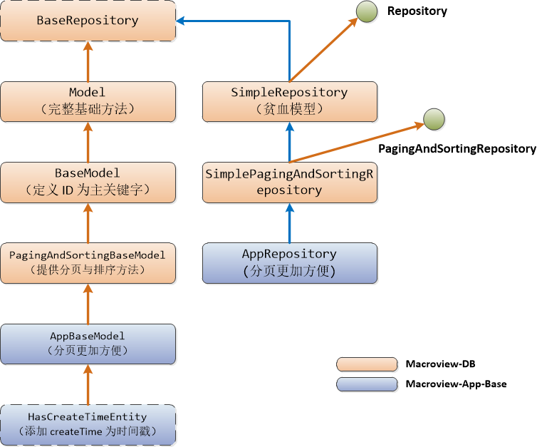

### ※ 文档摘要

　　本文档用来说明 `MD` 类库中，一些实体类所提供的常用方法（数据操作方法）。

### ※ 实体类类图




### ※ 实体类说明

#### ■ 开发模式

　　MD 中支持两种开发模式：

 + 一种是通过继承的方式，获得 ORM 能力。（看作是 充血模型）
 
 + 一种是实体类本身不通过继承，而单独为实体创建一个操作类（DAO)来完成 ORM 功能。
 
　　这种方式，对于无法继承到实体基类的实体类而言，是一个不错的解决方案。

#### ■ 实体类设计要求

　　我们在设计实体类时，必须遵守的要求：

 + id: 定义一个名称为 `id`的自增主关键字。
 
 + ceateTime: 定义一个名称为 `createTime` 的时间戳字段

　　当然，对于一些记录量比较少，只用于配置性等非业务性的记录，可以不定义这个字段

#### ■ 数据库连接释放

　　我们的数据库连接，默认使用 `Driud`连接池类库来管理。

　　通常情况下，实体类本身不需要调用 `releaseConnection`来释放连接，我们的 MWF 会在每次请求完成之后，自动释放连接。

　　**但要注意，在与请求无关的情况下，如线程或任务等，使用实体存取数据时，就必须要明确执行`releaseConnection`方法来释放连接**。

#### ■ Model 类 

　　如果所要操作的数据表为旧系统（已有），并且主关键字不为 `id`的数据表实体时，可以继承自本类。

　　本类提供的方法如下：

 + findAll()  ：查找所有记录
 
 + findAll(Iterable<Long> ids) ： 使用一组 id 值来查找
 
 + load(id) : 使用id 来加载一个对象
 
 + findOne(id)：使用 id 来查找一个对象，load 调用本方法
 
 + findBy(property, value) : 使用属性和值来查找，返回列表
 
 + findUniqueBy(property, value)：使用属性和值查找一个
 
 + findWithWhere(..) : 使用条件来查找
 
 + findWithWhereLimit() : 使用条件来数量来查找
 
 + findByValues(property, String[]): 使用属性和一组值来查找

 + findAll(Sort sort)：带排序的获取所有记录

 + findWithPagination(..) : 分页查询

 + findBySqlMap() ：使用 SqlMap 名称查询

 + save() ：保存当前实体类（对数据表）

 + save(boolean autoGenKeys) ：插入操作时，是否返回 id 值

 + updateProperty(property) : 只更新某个属性值

 + updatePropertys( List ) ：更新一组属性值

 + query(): 执行一条查询语句，这是底层操作（保护方法，子类才能访问）

 + batchDeletes(): 批量删除

 + batchUpdate():  批量更新

 + batchInsert():  批量插入新记录

 + TableName() ：返回映射表的名称

 + EntityName()：返回实体名称

 + count()：统计记录数

 + count(..): 执行sql 语句来统计记录数

 + exists(Long id)：记录是否存在

 + getConnection() ：获取连接（这是保护方法，子类才能访问）

 + releaseConnection()：释放连接

 + releaseConnection(dataSourceName)：释放指定数据源连接，在多数据源环境下使用

 + update(UpdateModel model) ：更新 UpdateModel 给出数据（保护方法，仅子类能使用）

 + insert(ModifyModel model)：插入 ModifyModel 描述的记录（保护方法，仅子类能使用）

 + update(sql, values) ：底层的更新方法（保护方法，仅子类能使用）

 + updateSomeProperty() ：更新一些属性（保护方法，仅子类能使用）

 + queryForMap() ：查询并返回Map 记录集，底层方法（保护方法，仅子类能使用）

 + delete(id): 删除一条记录

 + deleteAll(): 删除所有记录

 + truncate()：擦除数据，比 deleteAll() 更好（并非所有数据库都支持 truncate 操作）

#### ■ BaseModel 类 

　　是`Model`的子类，在其基础上添加了 `id`字段。并增加了下述方法：

 + exists()：当前实体类是否存在（数据表中）

 + delete()：删除自己
 
 + select()：提供一个简单的链式查询方法
 
 + select(selectFields): 提供一个简单的链式查询某些字段的方法
 
```java
// 一些使用情景

select().where(“name=?”, name).all();  // select * from xxx where name=:name

select().where(“ip=? or name=?”, ip, name).first(); // 取结果的第一条记录

select(“ip, name”).where(“ip=?”)
                  .orderBy(“createTime DESC”)
                  .all();
```

#### ■ PagingAndSortingBaseModel 类 

　　本类继承自`BaseModel`，并支持分页与排序的实体基类。

 + queryWithPagination(QueryModel, PageRequest)  分页查询
 
   - 参数中： QueryModel 查询条件接口，PageRequest 分页条件
   
 + queryWithPagination(Page) 分页查询，Page 包括上述两项
 
 + queryWithPaginationBy(bean, PageRequest) 分页查询

   - bean 是 Pojo 对象，并使用了查询注解。在内部，会将查询注解最终解释成 `QueryModel`接口
 
 + queryWithPaginationBy(bean, PageRequest, Clazz)

   - 分页查询，并返回实体类的一个子集（即不返回全部字段数据）
   
   - 对于只需要返回某几个字段，或合并一些字段有用
    
 + queryWithPaginationBy(QueryModel, PageRequest, Clazz)
 
 + findByQueryModel(QueryAndOrderModel) 仅查询不分页

#### ■ AppBaseModel 类 

　　这是 `PagingAndSortingBaseModel`的子类，将进一步简化分页方法的使用。

　　要注意，这个类在`Macroview-App-Base`类库当中，要使用本类就需要添加这个类库的依赖。
 
 + queryWithDefaultPageBean(DefaultPageBean)  分页查询
 
 　　`DefaultPageBean` 是一个设计好的类，做分页时，我们的 Bean 就继承 DefaultPageBean。
 
 + queryWithPagination(DefaultPageBean, subClazz) 分页，并具只返回部分字段或不同字段
 
 + findByPageBean( DefaultPageBean ) 只查询不分页
 
 + updateData( bean ) 更新使用 @UpdateField 注解的 Bean 。注意，表是实体类的表

#### ■ HasCreateTimeEntity 类 

　　是`AppBaseModel`的子类，添加了一个`createTime`字段，**如无意外，都建议所有的实体类继承此类**。


