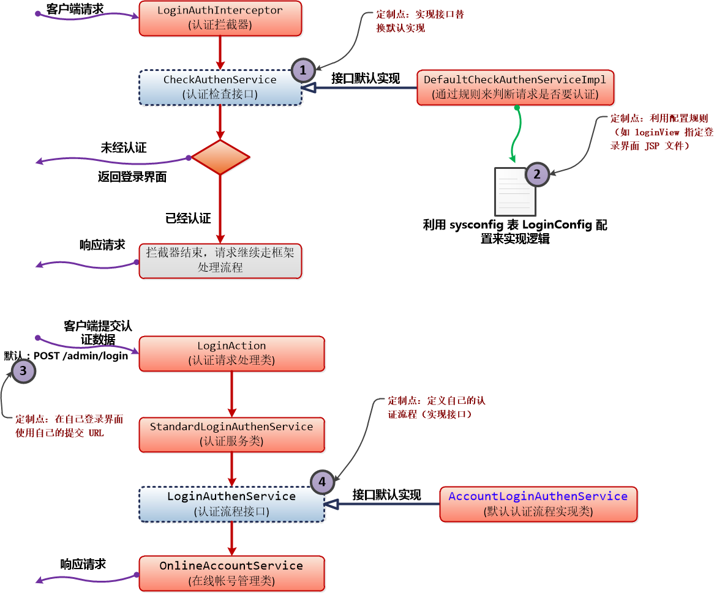
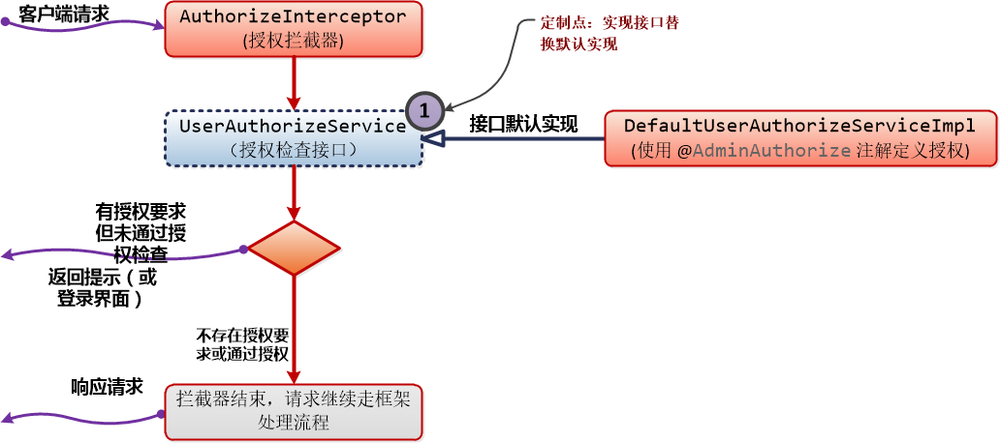

@[toc](目录)

### 1. 说明

　　本文档对 `Macroview App Lib`库中，登录认证部分的一个使用说明。

### 2. 登录认证相关库

  + **Macroview-app-base** 提供登录流程接口（抽象过程）

  + **Macroview-app-security** 登录流程管理与控制的实现

  + **Macroview-app-web-base** 登录页面所在包，文件目录：`views/admin/home/login.jsp

### 3. 登录认证相关配置

　　在配置表`sysconfig`中，使用类别为：`LoginConfig`。下面是这个类别的一些配置项含义：（具体见后面的内容）

 + **loginView** ：登录界面 jsp 文件。（默认：`admin/home/login`）

 + **successUrl** : 认证成功之后跳转请求。（默认：redirect:${BasePath}/index，即 /index）

 + **LoginRequest**: 需要认证才能访问的请求。（默认：/**，表示所有请求都必须认证后才能访问）

     这个配置项可以有多个。

 + **PassRequest**：不需要认证就能访问的请求。（例如，登录页面必须不需要认证就能访问）

    这个配置项也可以有多个，默认的情况下，有下面几个内置的不需要认证访问项：

     - PassRequest = /WEB-INF/views/admin/login.jsp （登录页面）

     - PassRequest = /static/** （静态文件，如果考虑到安全问题，也可以取消，不过 login.jsp 所用的静态方法一定要放行）

     - PassRequest = /service/** （第三方请求接口，通常不能走正常的登录流程）

 + **loginPriority(=true/false)**：表示不在 `LoginRequest`和`PassRequest`的请求的处理方法

    loginPriority = true ：表示除了 `PassRequest` 指定的请求外，一律都需要登录认证。

    loginPriority = false : 表示除了 `LoginRequest` 指定的请求外，一律都不需要登录认证。

### 4. 认证流程与接口

　　登录认证模块使用请求拦截器方式来实现，换言之，只要屏蔽拦截器，其实登录认证模块就失效。

　　**整个登录认证分成两部分：**

 + **拦截**：对请求进行拦截，并对之进行分析判断，以确定是否跳转到登录界面。

    对于请求的`拦截`，模块是使用请求拦截器来完成。

    - **LoginAuthInterceptor**：请求拦截器的工作就是拦截所有请求（包括静态文件），并判断是否需要提请认证需求。

 + **提交认证数据，实现认证流程**：例如，提交用户与密码来进行认证。

    对于这一部分，在标准模块中（`Macroview-app-security`）是由 `StandardLoginAuthenService`类来实现。

　　下面是认证部分的流图示例：




#### 4.1 请求拦截

　　`LoginAuthInterceptor`拦截器只是做了拦截动作，而所有判断事情，都交由 `CheckAuthenService`接口实现类来完成。（`CheckAuthenService`在包 `Macroview-App-base`中）

　　`CheckAuthenService`接口的实现类目前是通过`IoC`来注入，所以实现类并不需要特别添加到某个特定东西中。

　　`CheckAuthenService`的目的是鉴别请求是否需要认证，这个鉴别可能很简单，也可能很复杂，开发人员可以定制这个过程。

　　在包`Macroview-app-security`中提供了一个默认的实现：**`DefaultCheckAuthenServiceImpl`**。这个实现就使用了上述（参见：`3.登录认证相关配置`）配置来灵活配置。

　　如果开发人员觉得，上述的实现已经满足要求，就不需要自己来实现`CheckAuthenService`接口。但是，如果这个实现不是你所需要，就要动手自定义了，下面是一个示例：

```java
/**
 * 本示例实现的逻辑：如果用户未登录，则请求放行；如果用户已经登录，将用户信息读入到请求上下文。
 *
 * 我们可以通过上下文，结合授权来区分或提示某些请求需要登录才能使用。
 **/
@Named
public class CheckAuthenServiceImpl implements CheckAuthenService{

	/**
	 * 日志
	 */
	private final static Logger logger = Logger.getLogger(CheckAuthenServiceImpl.class);
	
	/**
	 * 判断是否已经登录，如果已经登录，则提供登录数据，否则“作已经登录”处理
	 * 
	 * @see com.macroview.app.security.login.service.CheckAuthenService#loginAuthen(com.macroview.web.servlet.ServletData)
	 */
	@Override
	public boolean loginAuthen(ServletData servlet) {
		logger.debug("[SYSTEM]==> 是否已经登录的判断 ");
		
		HttpServletRequest request = servlet.getRequest();
		BaseSession session = new HttpSessionAdapter(request.getSession());
		if(!OnlineAccountService.isNotLogin(session)){		
			//已经登录的话，将取当前帐号信息，并放入到 request 中，于是 JSP 或 Action 都可以从 request 中取这个数据
			OnlineAccount account = OnlineAccountService.getCurrentUser(session);
			logger.info("[SYSTEM]==> 用户[" + account.getAccountName() + "]已经登录。。。");
						
			account.setLastMove(System.currentTimeMillis()); //记录帐号活动时间
			request.setAttribute(AppGlobalConfig.LOGIN_USER_ENTITY, account);
			
		}
		return true;
	}

}
```

#### 4.2 认证流程管理

　　无论是自动跳转到登录界面，还是手动（甚至第三方程序提交登录）显示登录界面，最终都会提交认证数据到系统。

　　认证模块默认的登录界面是： admin/home/login.jsp (loginView 配置)。

　　默认的跳转请求：GET /admin/login

　　默认的提交认证数据请求：POST /admin/login。如果需要修改上述的请求，就要自定义`CheckAuthenService`实现类，并要在自定义的 `login.jsp` 修改提交路径了。（在将来版本或者可以通过配置来进行，具体看版本历史）

　　当我们提交认证数据时(通过 `login.jsp` 或者第三方程序)，模块中的`loginAction`就接收到`POST /admin/login`请求，并对请求数据进行封装之后，将认证流程交由接口**`LoginAuthenService`**的实现类来完成。

 + **LoginAuthenService** 接口实现认证流程

    认证流程可能是从数据库读取帐号来进行对比认证，也可能是使用`LDAP`协议进行认证，或者`RADIUS`协议认证等等，都交由`LoginAuthenService`的实现类来完成。同样，本模块也提供了一个数据库帐号认证流程的实现：
    **com.macroview.app.admin.account.service.AccountLoginAuthenService**(在模块`Macroview-App-User`中实现)

　　下面是一个接口`LoginAuthenService`实现示例，实现一个`LDAP`协议认证过程：

```java
/**
 * 要注意，如果不使用 Macroview-App-User 模块的话，就需要实现自己的 Account 类，如这个示例一样，定义自己的 SdmAccount
 */
@Named
public class LoginAuthenServiceImpl implements LoginAuthenService{

	private final static Logger logger = Logger.getLogger(LoginAuthenServiceImpl.class);
	
	/***
	 * 登录流程：
	 * 
	 *    1) 首先是否为 ad 帐号
	 *    
	 *    2) 如果不是则是否为本地帐号
	 * 
	 * @see com.macroview.app.admin.login.service.LoginAuthenService#signInFlow(com.macroview.app.admin.login.service.LoginSubmit)
	 */
	@Override
	public LoginAuthenResult signInFlow(LoginSubmit submit) {
		logger.info("[SDM Admin 登录认证]==> 帐号[" + submit.getUsername() + "]进入登录认证流程...");
		try{
			SdmAccount account = SdmAccount.dao.findByUserName(submit.getUsername());
			
			if(account != null){
				if(AccountType.Ad != account.getAccountType()){
					String password = SecurityUtils.securityString(submit.getPassword());

					if(password.equals(account.getPassword())){
						return loginIsSuccess(account);
					}else{
						logger.error("[SDM Admin 登录]==> 帐号[" + submit.getUsername() + "]所输登录密码不正确.");
					}
				}else{
					logger.debug("[SDM Admin 登录认证]==> 帐号是 AD 帐号，转到 AD 帐号登录流程.");
					if(adAccountLoginSuccess(submit, account) != null){
						logger.debug("[SDM Admin 登录认证]==> AD 帐号[" + submit.getUsername() + "] 登录成功.");
						return loginIsSuccess(account);
					}else{
						logger.error("[SDM Admin 登录]==> 帐号[" + submit.getUsername() + "]所输登录帐号或密码不正确.");
					}
				}
			}else{
				account = adAccountLoginSuccess(submit, account);
				if(account != null){
					return loginIsSuccess(account);
				}else{
					logger.error("[SDM Admin 登录]==> 没有此登录帐号[" + submit.getUsername() + "]，登录失败。");					
				}
			}
		}catch(Exception e){
			logger.error("[SDM Admin 登录]==> 登录时，读取帐号数据失败，帐号[" + submit.getUsername() + "]，异常信息：", e);
			
			return new LoginAuthenResult(null, "系统错误，请稍后重试", false);
		}

		return new LoginAuthenResult(null, "无效的帐号或密码", false);	
	}

	/**
	 * 处理成功登录事项
	 *
	 * @param account
	 * @return
	 */
	private LoginAuthenResult loginIsSuccess(SdmAccount account) {
		account.setLastLogin(new Date());
		
		if(account.isNewAccount()){
			account.save();
		}else{
			//只更新登录时间到数据库
			account.updateLastLogin();
		}
		return new LoginAuthenResult(account, "", true);
	}

	/**
	 * 使用 Ad 登录
	 *
	 * @param submit
	 * @param account
	 * @return
	 */
	private SdmAccount adAccountLoginSuccess(LoginSubmit submit, SdmAccount account) {
		String username = submit.getUsername();
		if(StringUtils.stringNotEmpty(username)){
			if(username.indexOf("@") < 0){ //没带域名
				username = username + "@" + SdmSysConfigManager.getAdServerDns();
			}
			
			boolean result = LdapFactory.authenticate(SdmSysConfigManager.getAdServer(), username, submit.getPassword());
			
			if(result){ 
				if(account == null){ //创建新帐号
					account = new SdmAccount();
					account.setUsername(submit.getUsername());
					account.setCreateTime(new Date());
					account.setEmail(username);
					account.setAccountType(AccountType.Ad);
					account.setRole(AccountRole.User);
				}
				return account;
			}
		}
		return null;
	}

}
```

### 5. 授权

　　所谓`授权`，就是在认证的基础上，对认证用户进行分类。具体在请求上，就是授权。也就是说，在一些场合应用下，并不是通过认证后，就能使用所有请求（功能），而是会基于角色来进行功能划分。例如，普通用户与管理员就是两种不同的角色划分。管理员具有普通用户所拥有的功能之外，不具有普通用户所不具有的功能，例如系统层面的配置，重启或暂停某些服务的运作等等。

　　`授权`可以很复杂，也可以很简单。目前类库只提供简单的授权功能，也就是使用注解 `@AdminAuthorize`来定义请求是否需要某种使用授权。下面是授权的处理流程：




 + **AuthorizeInterceptor**：请求授权拦截器，这是授权流程的入口。

     授权：当请求需要分等级时，授权就有意义了。不同的认证角色，通过授权来区分。

#### 5.1 授权注解 @AdminAuthorize

　　`@AdminAuthorize`目前可以定义在类或方法上，并对应认证帐号的`AccountRole`（角色）名称。现时，类库只定义以下三种默认角色：

 + **User** 普通用户

 + **Admin** 管理员

 + **AppKey** 第三方应用

　　上述仅是角色名称，如何使用这些角色，由具体的系统需求决定。下面是 `Macroview-WLC` 的一个使用示例：

```java
/**
 * 表示请求只能用于 AppKey 角色请求（即第三方应用调用接口）
 */
@RestController(path="/service/netuser")
@AdminAuthorize(value="AppKey")
public class AccessUserApiRequestAction {

    // 内容略
}
```

#### 5.2 UserAuthorizeService 接口

　　当我们需要实现与标准不同的授权规则时，可以实现 `UserAuthorizeService`接口来进行。

### 6. 事件

　　在整个拦截与认证过程中，为了方便第三方在某个时间点做一些特定的事情，流程也在不同位置发布一些事情，具体如下：

  + **BeforeLoginInterceptEvent** 事件，此事件在拦截到未认证请求时，跳转到登录界面之前发布

    这个事件是跳转到登录界面之前发布，并且可以决定是否跳转到登录界面（Hack 点），侦听这个事件可以：
	
	 - 在跳转到登录界面之前，处理某些特定的事情。（例如记录一些东西）

	 - 对某些请求路径进行动态判断，临时决定是否跳转到登录界面。（例如首次安装配置）

```java
/**
 * 侦听 BeforeLoginInterceptEvent 事件，对 "/first_install" 请求路径放行
 */
public class BeforeLoginInterceptEventListener {
	
	private static final Logger logger = Logger.getLogger(BeforeLoginInterceptEventListener.class);
	
	//安装 所使用的 path
	private static final String INSTALL_BASE_PATH = "/first_install";

	@Observes
	public void handler(BeforeLoginInterceptEvent event){
		logger.info("==> 登录前拦截成功。。。。。");
		
		ServletData sd = event.getRequestData();
		
		String rp = sd.getRequestPath();
		
		if(StringUtils.notNullAndEmpty(rp) && rp.startsWith(INSTALL_BASE_PATH)){
			event.setStopLoginIntercept(true);
		}else{
			event.setStopLoginIntercept(false);
		}
		
		logger.info("==> 当前的请求路径：。。。。。" + rp);		
	}
}
```

 + **AccountLoginEvent** 事件，表示成功登录，并记录到在线管理时发布

    侦听这个事件，可以知道当前登录帐号信息，如对帐号做一些统计、记录和跟踪工作。

 + **AccountLogoutEvent** 事件，当在线帐号退出（注销）登录时发布

    侦听这个事件，可以知道退出系统的帐号。不过要注意，帐号退出系统并非准确的事件，有可以出现重复退出等情况。

### 7. 登录帐号那些事

　　参见：[account](./login_account.md)

