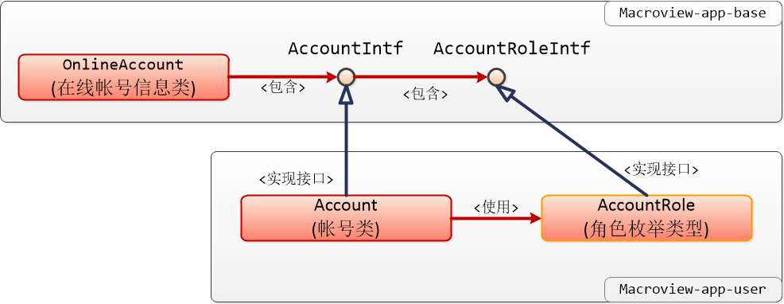

### 1. 说明

　　本文档描述标准的登录与帐号管理模块，所使用的帐号类等内容。

### 2. 涉及的类库

 + **macroview-app-base** 包含帐号的相关接口和在线帐号管理

 + **macroview-app-user** 具体的帐号管理模块

    定义了默认的帐号类实现与增、查、删、改工作

 + **macroview-app-web-user** 帐号管理模块的 web 内容

　　下面是简单的类图：

### 3. 类与接口

#### 3.1 AccountIntf 接口

　　这是核心的帐号接口，接口只提供必要的方法属性。无论是登录认证的抽象层，还是在线登录帐号管理，都围绕此接口进行。因此，如果不使用标准的帐号管理模块的话，就需要实现这个接口。

#### 3.2 AccountRoleIntf 接口

　　这是帐号角色（规则）接口，一般而言，每个系统的帐号都会包含特定的角色。角色涉及到权限（授权）控制，对于系统而言，不同的角色具有不同的（功能）使用权限。

