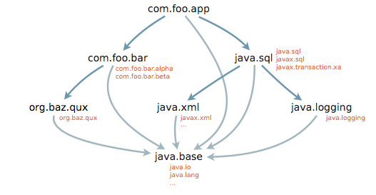
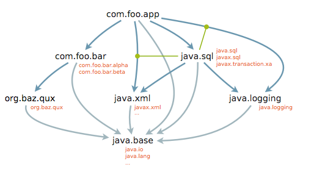

## 1. 说明 ##

### 1.1 文档主旨 ###

　　本文档描述了 `JDK8` 下开发的项目，迁移到`JDK11`时，所需要注意或要作的修改。（指南）

### 1.2 JDK11 的版本 ###

　　因为从 `JDK8` 开始，`Oracle JDK`不能再免费用于商业应用，因此，从 `JDK8`的后续版本开始，我们将要转向到 `OpenJDK`这个能免费用于商业的平台。

　　目前，由于 `OpenJDK`的开放性，业界有比较多的品牌可以选用（单就免费用于商业这一块），下面是一些可用的品牌：

 + IBM JDK：老牌产品，并且也开源了其 JVM 产品
 + Redhat OpenJDK：同样也是老牌的产品，并内置于其 Redhat/CentOS 等操作系统当中
 + Oracle OpenJDK：虽然 `Oralce JDK`不能免费商用，但也提供了`OpenJDK`，可免费商用
 + Azul Zulu OpenJDK：也是专注于 JVM 的老牌产品，由商业公司维护与提供
 + AdoptOpenJDK/Eclipse OpenJ9：也是一个比较悠久的 JVM，由社区维护与提供，其中 OpenJ9 版本来自 IBM 开源的 JVM
 + Amazon Corretto：AWS 发布的 OpenJDK 产品
 + Alibaba Dragonwell：阿里的 OpenJDK 产品，不过目前只有 OpenJDK8 的版本

　　目前，我们在`OpenJDK` 上的选择如下：

 + 在 `Linux`操作系统上，通常是使用内置的 `OpenJDK`（如 CentOS 内置的 Redhat OpenJDK）
 + 在 `Windows`操作系统上，暂定为 `Azul Zulu OpenJDK`

## 2. JDK 9~11 新特性 ##

　　从 `JDK8`到`JDK11`，跨越了两个版本 `JDK9`与`JDK10`，这两个版本不是 `LTS`（即长期支持）版本，相当于 `JDK8`的`补丁版本`（即本来在 `JDK8`中实现，但由于时间较长，所以改为逐步推出，而不是一次过推送）

### 2.1 JDK9 新特性 ###

　　在 `Java` 语言的发展史上，有过几次大的变化：

 + JDK5 引入泛型与注解
 + JDK8 引入Lambda函数式编程
 + JDK9 引入模块化概念

#### 2.1.1 模块化开发 ####

　　随着 `JDK`的发展，功能越来越强大的同时，JVM 本身也在膨胀。由于 `JVM` 为了适应各种环境，所以尽量提供各种的功能。但对于项目而言，往往并不需要所有的功能，例如服务器项目，很少会用到桌面（界面）开发。而 `JVM`的功能是揉合在一起的，项目不用的技术功能，也必须要安装。这种`臃肿`，显得 `JVM`越来越重，无法适应一些轻量级环境。

　　模块化是解决这种问题的很好方案，所以 `JDK`的发展将模块化引入进来。最初的构想是在 `JDK8`实现模块化，但是由于模块化的技术构架过于复杂，同时 `JDK`的发展与推动者的弱势与变化，最终将模块化的内容推迟到了 `JDK9`来实现。

　　JDK9 实现的模块化，包含两层意思：

 + JDK 层面上，将类库模块化处理（独立），在运行环境上可增减模块
 
 + 在项目层面上，可以将项目划分模块，实现项目级的相互独立与隔离

　　- 即由原来的层次结构： 项目 ---> 包 ---> 类，变成了：项目 ---> 模块 ---> 包 ---> 类

　　模块化工作对项目的影响，主要是：

 + JDK 层面上，一些类库（模块）被移除，从而使用需要这些模块的系统无法运行。解决的方法：主动引入被移除的模块，重新编译系统。
 + 在项目层面上，语法上的检查会更加严格，从而需要我们修改代码，重新编译系统。
 + 在使用上，还要留意：

    - `unnamed modules`（即没有定义成模块，例如 jdk9 之前的所有项目），默认依赖所有（包括模块和非模块），同时也开放自己所有包给其他非模块用。
    - `named modules`（即明确定义的模块），会明确依赖和优先使用模块内容
    - `automatic modules`，为了能让`named modules`使用`unnamed modules`，提供一个`折中方案`。即编译系统自动为一个`unnamed modules`（jar包）定义一个模块名（例如用`MANIFEST.MF`配置 `Automatic-Module-Name`命名，或文件名称提取等），让这个类库自动变成一个`named modules`，从则让 `named modules`能够使用。

　　下面简单说明一下模块化的定义与使用：（步骤）

 + 规划与构思模块系统（划分多少个模块，或者需要使用那些模块）
 + 创建模块描述文件：**`module-info.java`**，这个文件将放在源代码根目录下，并且每个项目只有一个模块描述文件
 + 在描述文件中定义模块名称等内容
  
   - 定义模块名称：`module <名称> { }`，名称的命名与包名类似

        ```java
           module com.macroview.mymodule {

           }
        ```  

        ```java
           //表示开放这个模块的反射操作（外部能通过反射操作模块的所有内容）
           open module com.macroview.mymodule{
           }
        ```

    - 在模块中添加模块引用（即导入外部模块）
        ```java
           module com.macroview.mymodule {
               //表示需要这个模块（但不会传递出去）
               requires com.macroview.tools;

               //表示需要这个模块，同时可以传递这个需要给本模块的使用者
               requires transitive java.net.http;

               requires static java.sql;  //表示编译需要，但运行时可选
               requires transitive static java.logging; 

               //需要这个 Service Provider (java.util.ServiceLoader 自动加载机制)
               uses com.macroview.mymodule.service.MyServiceProvider
           }
        ```   

    - 在模块中输出包（即向外部公开，提供给外部或其他模块使用的包）     
        ```java
          module com.macroview.mymodule{
              requires java.net.http;
              requires com.macroview.tools;
            
              //exports 表示允许引用者在编译时和运行时能访问 public 成员
              exports com.macroview.mymodule.commons;
              exports com.macroview.mymodule.service;

              //将包指定给其他模块使用，不在列表的就不能使用
              exports com.macroview.mymodule.support to com.macroview.demo,com.macroview.appdemo;
 
              //使用 opens 是指运行时能使用反射进行访问
              opens com.macroview.mymodule.commons;  

              //向外部开放服务接口，并指定一个实现类（必须要有）  
              provides com.macroview.mymodule.service.MyServiceProvider with com.macroview.mymodule.impl.MyProvider
          }
        ```  

 + 编译打包

　　我们可以通过下面的示例图来感受一个模块依赖：

 + 没有传递的依赖
  
  

 + 有传递的依赖

  

<br/>

#### 2.1.2 多版本兼容 Jar 包 ####

　　由于 `JDK9`带来的变化，在兼容性上比以往版本，有更多的挑战。所以在这版本引入多版本格式 `Jar`包，也是顺势而为。

　　`多版本兼容`简单来说，在同一个 `jar`文件中，根据不同`JDK`版本将同一套内容放在不同位置，在运行时根据环境来让`JVM`决定使用那套的描述方法。

　　下面简单说明一下使用，例如：我们开发了一个 `com.macroview.commons.Tools`的类，并且分别用 `JDK8`、`JDK9`、`JDK11`三个版本的语法特性开发，希望同时能在这些环境下使用。

 + `Jar`包的目录结构：（使用目录结构来区分不同版本）

```
  mytools.jar
    ┣━ com.macroview.commons  (包目录，为 JDK8 等之前旧版本使用)
    ┃                 ┗━ Tools.class
    ┃ 
    ┗━ META-INF (目录)          
          ┗━ versions   (目录)
                ┣━ 9    (为 jdk9 使用)
                ┃  ┗━ com.macroview.commons （包目录） 
                ┃                    ┗━ Tools.class  (JDK9 版本 Tools 类)
                ┃ 
                ┗━ 11   (为 jdk11使用)
                   ┗━ com.macroview.commons （包目录） 
                                     ┗━ Tools.class  (JDK11 版本 Tools 类)
```

#### 2.1.3 语法与API 上的改进 ####

　　下面略提一下 `API` 界面的变动：

 + 提供更加方便的 `List`、`Set`、`Map` 创建方法

```java
  List<String> list = List.of("Java", "C", "Python");
  Set<String> set = Set.of("Java", "C++", "Golang");
  Map<String, String> map = Map.of("Key1", "Value1", "K2", "V2");
```  

 + 接口允许定义私有方法（静态或动态）

    接口与抽象类的不同仅剩两点：
    
    - 接口支持多继承，抽象类不能
    - 接口不能定义构建方法，抽象类可以定义

 + 进程API，提供对外部进程（例如执行外部命令）更好的感知与控制支持。

     添加了一个 `ProcessHandle`接口，可以得到更多的操作（如进程ID等）

 + CompletableFuture API 加强对多任务（如并发）支持


### 2.2 JDK10 新特性 ###

　　`JDK10`新特性（变化）比较少，主要：

#### 2.2.1 局部变量类型推断 ####

　　使用关键字 `var` 可以省略变量的类型声明，编译器会根据变量的值的类型，推断变量的类型。

　　下面是示例：（注意：只能用于局部变量，不能用于如类属性/字段的定义）

```java
    var name = "David";
    var userList = new ArrayList<User>();
    var age = 12;
    var requestMap = new HashMap<String, Object>();

    //jdk10 之前
    Map<User, List<String>> userChannels = new HashMap<>();
    //...
    userChannels = lookupUserChannels("Tom");
    //jdk10 有了类型推断，可以一步到位
    var userChannels = lookupUserChannels("Tom");

    //jdk10 之前
    Map<String, List<String>> countryToCity = new HashMap<>();
    // ...
    for (Map.Entry<String, List<String>> citiesInCountry : countryToCity.entrySet()) {
        List<String> cities = citiesInCountry.getValue();
    // ...
    }

    //使用类型推断
    var countryToCity = new HashMap<String, List<String>>();
    // ...
    for (var citiesInCountry : countryToCity.entrySet()) {
        var cities = citiesInCountry.getValue();
    // ...
    }
```

　　注意：编写代码的原则是“简单易读”，而不是“少输入几个字符”，所以“善用”而不要“滥用”这些新语法特性。


#### 2.2.2 G1 垃圾收集器 ####

　　`JDK10`对 `G1`进行优化，提供更好的垃圾收集器。

#### 2.2.3  API 的改进 ####

 + `List`、`Set`、`Map`添加新方法：**`copyOf(Collection)`**，按原有顺序返回一个不可改对象

 + `ByteArrayOutputStream`添加方法 **`toString(Charset)`**，将字节流转成字符串

 + `Properties`提供一个创建指定数目属性的空属性表的构造方法

 + `Collectors`收集器（Stream API）添加创建不可修改集方法

### 2.3 JDK11 新特性 ###

　　由于 `JDK11` 是 `LTS`（长期支持版本），所以带来较多的新功能，主要包括：

#### 2.3.1 嵌套类的可见性控制 ####

　　在 `JDK11`中，内部类的 `private`（私有）方法或字段，也受保护，不可以从外部访问。

```java
  public class Parent{

      class Child1{
          private String name;
      }

      class Child2{
          private void show(){
              //...
          }
      }

      public void using(){
          Child1 c1 = new Child1();
          Child2 c2 = new Child2();

          //jdk11 之前正确，jdk11开始禁止
          System.out.println("name:" + c1.name);
          c2.show();
      }
  }
```

#### 2.3.2 类型推断可以在 Lambda 中使用 ####

　　在 `JDK10`中，引入了使用关键字 `var` 来进行`类型推断`。不过，要注意的是，在 `JDK8`引入`Lambda表达式`时，其实也引入了`类型推断`。例如：

```java
  List<String> names = getUserNames();

  //我们并没有也不需要定义变量 s 的类型，因为其类型是可以推断出来
  names.stream()
       .map(s-> s.toLowerCase())   //JDK8 就能进行类型推断
       .collect(Collectors.toList());    //将用户名全变成小写
```

　　而在 `JDK10`时，作为类型推断的标志`var`，我们是不能用于 `Lambda 表达式`的，也就是不能这样：

```java
  List<String> names = getUserNames();
  names.stream()
       .map((var s)-> s.toLowerCase())   //JDK10 不允许这样用 var
       .collect(Collectors.toList());    //将用户名全变成小写
```

　　但在 `JDK11`时，补上了这个`漏洞`。好吧，似乎 `多此一举`。不过，在某些场合，还是有用武之地的：加注解场合。

```java
  List<String> names = getUserNames();
  names.stream()
       .map((@NotNull var s)-> s.toLowerCase())   //要添加注解时，就不能少了 var 这项
       .collect(Collectors.toList());    //将用户名全变成小写
```

#### 2.3.3 HTTP Client 正式升级为标准 API ####

　　虽然在 `JDK9`就引入，不过仅作为试用，并不支持在 `生产环境`中使用，而在`JDK11`中成为正式版，可以在生产环境中使用。

#### 2.3.4 可直接执行单一源代码文件 ####

　　无论执行一个复杂的应用，还是一个简单的应用，我们都需要在执行前举行某种“统一仪式”：先编译，再运行。这给初学者，或者某些场合带来“不痛快”（人工体验不好）。

　　在`JDK11`中，`大咖`们尝试给大家一个解脱的方法：

 + 直接运行源代码（其实内部自动编译）

```shell
  # 执行单个文件 
  java HelloWorld.java

  # 可以添加参数
  java HelloWorld.java "Mr. David"

  # 可以添加类路径
  java -classpath /opt/java/app HelloWorld.java "Mr. David"
```

 + 提供 `Shebang`支持，如 `python`等语言那样 

     作法是在源代码的第一行包含内容：`#!/path/to/java --source version`，下面是示例：

      ```java
        #!/usr/bin/java --source 11
        public class HelloWorld {

            public static void main(String[] args){
                //...
            }
        }  
      ```

      - `#!/path/to/java --source version` 必须在源代码的第一行，其中 `/path/to/java`指示 `java`执行文件位置与名称
      - `windows`不支持此功能，这是 `Linux`世界的事情
      - 如果用到外部 jar 包，也可以使用 `--class-path` 参数：`#!/path/to/java --class-path ./lib/* --source 11`    


#### 2.3.5 移除 J2EE 与 CORBA 模块 ####

　　`JDK11`不再包含 `Java EE`与`CORBA`的类库内容，要使用的话，需要在通过`Maven`来明确引用。主要包括：

 + JAX-WS (Java API for XML-Based Web Services),
 + JAXB (Java Architecture for XML Binding)
 + JAF (the JavaBeans Activation Framework)
 + Common Annotations.

　　在 `JDK9`与`JDK10`，上述的类库要使用，需要明确在 `Module`中添加与引用，而在 `JDK11`中干脆删除。

#### 2.3.6 添加与更改了安全与加密方面的内容 ####

#### 2.3.7 添加 ZGC 垃圾收集器 ####

　　更好的并发性能与低时延，既能处理几百兆堆也能处理几个T的堆（很好的伸缩性），不过目前还不建议在生产环境中使用。

#### 2.3.8 完全支持 DOCKER 环境 ####

　　经过改进，目前`JDK11`能够识别 `DOCKER`运行环境，支持 `CPU`与`内存`的限制使用。

#### 2.3.9 API 的一些改动 ####

 + 移除 Pack200 Tools And API：这是一个对 `jar`或`java`类进行压缩的工具
 + 移除 `Thread.destroy()`以及 `Thread.stop(Throwable)`方法
 + 字符串类添加 N 多方法：

   - isBlank()：字符串为空判断
   - strip()：删除首尾空白
   - stripTrailing()：删除尾部空白
   - stripLeading()：删除首部空白
   - lines()：返回以行结束符分拆的 `Stream`（集）
   - repeat(n)：返回此串重复N次的新串

 + ...

#### 2.3.10 Java Flight Recorder ####

　　将以前商业版 JDK 内置的 `Flight Recorder`（黑盒子）加进了 `JDK11`，让我们有机会使用这个功能来获取 `应用`的运行情况，从而分析出问题所在。

## 3. 迁移指南 ##

　　所谓的迁移，就是将原本运行在 `JDK8`上的项目（代码），通过适当（少量）的修改，能在 `JDK11` 上运行（同时，还要保证能在 `JDK8`上运行）。目前的迁移改造原则如下：

  + 不引入 `JDK11`的新特性（新语法），这是项目后续版本的工作，不是当前版本的内容。
  + 尽管量少改动代码
  

### 3.1 Maven 依赖变更 ###

　　由于 `JDK11`移除了原本存在于`JDK`的一些类库，因此，当项目要在 `JDK11` 下运行时，需要添加下述的依赖：

```xml
<dependency>
    <groupId>com.sun.xml.ws</groupId>
    <artifactId>rt</artifactId>
    <version>2.3.2</version>
</dependency>
<dependency>
    <groupId>javax.transaction</groupId>
    <artifactId>javax.transaction-api</artifactId>
    <version>1.2</version>
</dependency>

<!-- Java 7 = JAXB version 2.2.3 -->
<!-- Java 8 = JAXB version 2.2.8 -->
<!-- Java 9 = JAXB version 2.3.0 -->
<dependency>
    <groupId>javax.xml.bind</groupId>
    <artifactId>jaxb-api</artifactId>
    <version>2.2.11</version>
</dependency>
<dependency>
    <groupId>com.sun.xml.bind</groupId>
    <artifactId>jaxb-core</artifactId>
    <version>2.2.11</version>
</dependency>
<dependency>
    <groupId>com.sun.xml.bind</groupId>
    <artifactId>jaxb-impl</artifactId>
    <version>2.2.11</version>
</dependency>
```
### 3.2 Macroview Maven 依赖库 ###

　　为了方便让项目在 JDK11 下运行（因为 JDK11 删除了大量的 j2ee API ），我也创建了一个依赖项，引入缺失的 jar 包来支持项目的正常运行，最简单的使用就是：

```xml
    <dependency>
      <groupId>com.macroview</groupId>
      <artifactId>jdk11-j2ee-dependencies</artifactId>
      <version>2.10.5</version>
      <type>pom</type>
    </dependency>
```

　　如果既想让系统在 `JDK11`运行，又想在兼容 `JDK8`，通常会使用 profiles 的方式，例如在 pom.xml 中添加：

```xml
	<profiles>
		<profile>
			<id>withJDK11</id>
			<dependencies>
				<dependency>
					<groupId>com.macroview</groupId>
					<artifactId>jdk11-j2ee-dependencies</artifactId>
                                        <version>2.10.5</version>
					<type>pom</type>				
				</dependency>
			</dependencies>
		</profile>	
	</profiles>  
```

　　然后当需要打包到 `JDK11` 时，使用 `mvn package -PwithJDK11`  命令来打包。

