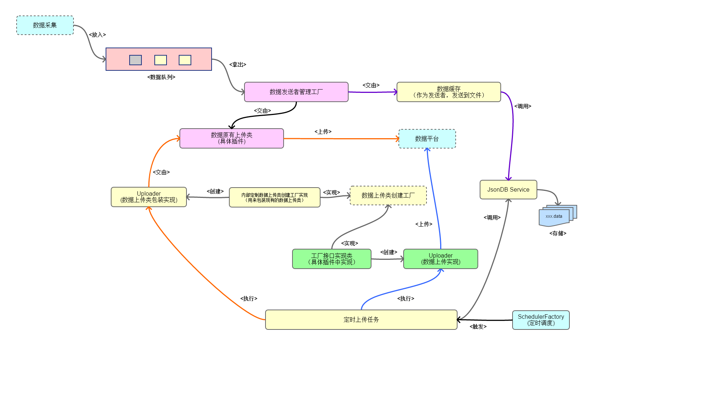

@[toc](目录)

## 1.说明 ##

 + 本文档用来描述，`Agent` 如何配置与使用缓存。

 + `Agent` 缓存是表示，当 `Agent` 在采集到数据后，无法即时上传的情况下，将数据预先保存到本地，然后等待合适的时机进行上传的功能，上传时机包括：

    - 每天定时上传
    - 按固定时间间隔上传
    - 由管理平台触发上传（未完成...）

 + 实现的需求

    - 开启数据缓存
    - 配置数据缓存
    - 配置数据上传

 + 对于 `MWF Agent`，暂不支持数据缓存功能

    - 由于 `MWF Agent` 本身就是一个全功能，包含了 `DB` 的应用，因此要实现数据缓存，只需要将自己将数据写入数据库即可

## 2.指南 ##

　　当前版本的数据缓存，主要的实现原则：

 + 尽量通过配置进行处理，减少编程量
 + 尽量利用现有的代码

　　实现上述的原则，体现在以下两大方面：

 + 数据缓存
 + 缓存数据上传方法

　　下面是大概的工作原理图：

  


 + 淡紫色为原有的内容（如原有数据上传类）

 + 淡黄色为新添加的内容

 + 淡绿色为需要编写的数据上传代码（可选）

<br>

### 2.1 数据缓存 ###

 + 2020.02a

    在此版本中，添加了两种缓存方式：

    - 缓存到本地数据库：**`Sqlite3`**，对应的缓存类型为：**`SqliteDB`**
    - 缓存到本地数据库：**`H2`**，对应的缓存类型为：**`H2`**

    通常的情况下，`H2` 比 `Sqlite3` 更加小巧，但功能相差不大，任选其一无问题，只是在某些场景下，`Sqlite3` 会有更好性能与存储能力，同时也能用于非 `Java` 项目（如 `IOS` 上）等

 + 2020.01b

　　目前已经实现了，将数据通过 `JSON` 的格式存储到文件中，在需要上传时从文件中读取数据来进行上传。

#### 2.1.1 数据缓存的配置项 ####

 + **`JsonDB`** 缓存类型

    当我们需要使用缓存时，需要配置的配置项包括：

    - **数据文件目录**：用来存储数据文件。由于同一 `Agent` 可以有不同的插件，因此需要为每个插件提供一个数据缓存。

    - **数据文件前缀**：数据文件的前缀，不同的插件有不同的目录与文件前缀。

    - **单个文件最大尺寸**：避免单个文件太多或存放数据太多

    - **保留文件个数**：可以保留的最大文件个数

    - **缓存数据类型**：放入数据队列的数据可以有不同的类型，需要指定缓存的类型

 + **`Sqlite/H2`** 基于数据库的缓存类型（2020.02a）

    - 由于使用了 `JDBC` 连接，并基于 `druid` 数据库连接池，因此需要提供数据库的连接配置文件：
      + `SqliteDB` 的连接配置文件名称固定为：`agent_sqlite.properties`，并已经内置到模块当中，通常情况下不需要改变
      + `H2` 的连接配置文件名称固定为：`agent_h2.properties`，并已经内置到模块当中，通常情况下不需要改变

    - **`记录保留最长时间`**：指定保存在数据库中的记录的最长保留时间，由于数据是不断增长，因此需要指定一个数据保留时间。

### 2.2 数据上传 ###

　　对于数据上传，框架有两种开发方式供选择： 

 + **使用原有的发送者来发送**：优点就是不用编写发送代码，缺点是无法进行批量上传

 + **开发新的发送者来发送**：优点是针对实现进行批量上传，缺点是要写代码

#### 2.2.1 数据上传的配置项 ####

 + **上传时机**：目前提供以下两种上传时机

    - **每天定时上传**：可以定义一个时间，让应用在此时间触发上传
    - **固定时间间隔上传**：每隔多少分钟或多少小时，触发上传
    - **管理中心触发上传**：管理中心发送上传指令，Agent 开始上传

 + **每次上传的记录数**：每批最大记录数

 + **上传类创建工厂**：新的发送者的创建工厂类

### 2.3 配置 ###

　　对于使用文件作为配置存储媒介的 `Agent`，数据缓存配置将配置在 **`agent.cnf`** 中。

　　每个插件都有自己的缓存配置，并且为了将来提供不同的缓存手段，将每个插件的缓存分成两个配置层面：一为声明层面；二为具体缓存方式层面。下面将详细说明配置格式与规则。

#### 2.3.1 声明层面配置段 (section) ####

　　此配置段的段名结构如下：**`[dataStore:<插件名称>:<数据类型>]`**

 + **`dataStore`**：此为固定名称，表示此段为数据缓存配置段。

 + **`插件名称`**：必须项，此为某个插件的名称，指示此配置段是针对那个插件

 + **`数据类型`**：可选项，插件可以再次细分成类型，一个插件可以以类型为单位，定义多批次上传

　　此配置段下的配置项包括：

 + **`storeLocation`**：存储位置，目前仅支持 `Local` 一个值，即存储在本地。

 + **`storeType`**：存储方法，目前仅支持 `JsonDB` 一个值，将来可能提供例如存储在 `Sqlite` 等本地数据库上。

 + **`enable`**：开关，当为 `true` 表示使用缓存，`false` 不使用缓存，目前此配置项还不支持动态更新，将来支持通过此项来远程动态开关缓存。
 
 + **`uploadMode`**：上传方法，目前支持以下两种
 
    - **`Timely`**：固定时间间隔上传，如 `每隔三小时上传一次`
    - **`Daily`**：每天固定时间上传，如 `凌晨一点开始上传`

 + **`schedule`**：时间表达式，目前支持以下两种

    - **`xh`** 或 **`xm`**：对应 `uploadMode=Timely` 配置，其中 `x` 表示一个大于0的正整数，而 `h` 表示小时，`m` 表示分钟，如 `3h` 表示 `三小时`，`20m` 表示 `20分钟`
    - **`hh:mm:ss`**：对应 `uploadMode=Daily` 的配置，表示每天的某个时间点 （`时：分：秒`），例如 `01:30:00` 表示 `凌晨 1 点 30 分`，而 `13:30:00` 表示 `下午 1 点 30 分`

 + **`onceUploadCount`**：每批上传的最大记录数，例如 50，表示每次最大读取 50 条记录并提供上传

 + **`dataType`**：表示插件要上传的数据类型。（即 DocBaseData.type）

 + **`uploadFactoryClass`**：表示上传类的内容，有以下两种类型

    - 原有发送者名称。即我们将发送者注册到 `AgentDataSenderFactory` 时所使用的名称，例如：

        ```java
        //插件的 start() 方法中注册发送者
        AgentDataSenderFactory.addSender("OS_TASKS_INFO_SENDER", new OSTaskInfoDataSender()); //OS_TASKS_INFO_SENDER 就是发送者名称
        ```

    - 新上传类的创建工厂类。如何编写工厂类在后面说明，下面是示例

        ```ini
        uploadFactoryClass=com.macroview.agent.plugin.windows.caches.WinCollectDataUploadWorkerFactory
        ```

 + **`uploadWorkerClass`**：`2020.02a` 引入，可以创建定制的任务上传类。通过任务上传类，我们可以自己控制所获取的数据，例如使用 `CollectDataCacheSevice.CollectDataRecords getDataRecords(String dataType)` 取指定数据类型的数据，可以实现优先获取某种类型数据等

    - `uploadWorkerClass`：配置需要带包名的类，并且此类需要实现接口：`CollectDataUploadWorker`，具体可参见后面的章节

        ```ini
        uploadWorkerClass=com.macroview.agent.plugin.windows.caches.MyUploadWork
        ```


　　下面给出一个完整的配置示例：(`agent.cnf` 中配置)

```ini
# agent.cnf
[plugins]
plugins = com.macroview.agent.plugin.windows.WinAppPlugin

[dataStore:WinAppMonitoring]  # WinAppMonitoring 就是插件名称
storeLocation = Local
storeType = JsonDB
enable = true
uploadMode = Timely    # 固定时间间隔上传
schedule = 20m         # 每 20 分钟上传一次
onceUploadCount = 50   # 每次上传 50 条记录
dataType=OS_TASK_DATA
uploadFactoryClass=com.macroview.agent.plugin.windows.caches.WinCollectDataUploadWorkerFactory  # 上传类的工厂类
```

```ini
[dataStore:DEMO_PLUGIN:DEMO_DATA]   # 定义到类型 DEMO_DATA
storeLocation = Local
storeType = JsonDB
enable = true
uploadMode = Daily           # 每天定时上传
schedule = 01:30:00          # 凌晨 1 点 30 分
onceUploadCount = 100        # 每次读取 100 条记录
dataType=DEMO_DATA
uploadFactoryClass=DEMO_SENDER  # 使用原有发送者，这是发送者的注册名
```

#### 2.3.2 存储层面配置段 (section) ####

　　不同具体的缓存技术有不同的配置内容，`2020.01a` 版本仅提供 `JsonDB` 的存储方法，即将数据以 `json` 格式存储到文件。而从 `2020.02a` 版本开始，增加提供了 `Sqlite3` 与 `H2` 基于本地数据库的存储引擎。

 + 配置段的段名结构：**`[存储引擎名称:<插件名称>:<数据类型>]`**

    - **`存储引擎名称`**：不同的存储引擎可能有不同的配置，要与上面所 `声明层配置段`对应，目前提供的存储引擎（名称）：

      + **`jsonDB`**：此为固定名称，表示此段为 `json` 格式数据缓存配置段。
      + **`sqliteDB`**：`2020.02a` 版本引入的，用 `SqliteDB`来存储数据
      + **`h2`**：`2020.02a` 版本引入的，用 `H2` 来存储数据 

    - **`插件名称`**：必须项，此为某个插件的名称，指示此配置段是针对那个插件

    - **`数据类型`**：可选项，插件可以再次细分成类型，一个插件可以以类型为单位，定义多批次上传，需要对应

 + `JsonDB` 存储引擎的具体配置项

    - **`dbLocation`**：数据文件目录，可以

        + 提供一个绝对目录路径，如 `/usr/datas/myplugin-data` 或 `d:\\datas` 等等
        + 相对当前安装目录的目录名称，如 `win-db` 或 `wlc-datas` 等

    - **`dbName`**：数据文件的名称前缀，如 `windows` 或 `wlc` 等

        + 系统会在这个文件名称的基础上添加扩展名 `.data`
        + 以此名称为前缀，添加一个时间点作为历史文件，如 `wlc-2020110201.data`

    - **`maxFileSize`**：单个文件最大尺寸，目前支持的单位是 `GB`、`MB`、`KB` （通常为大写），而数值为一个正整数，例如 `10MB`，`500KB` 等，要注意，这个大小是一个粗略数，具体可能会大于此数。
    - **`maxFileCount`**：保留最大文件数，超出这个数时，会将旧的文件删除，即使此旧文件的数据还没有上传。因此如果缓存数据量比较大时，通常建议合理设置 `maxFileSize` 与 `maxFileCount`。

    - **`security`**：内容是否加密，目前暂不支持。true 表示加密，false 表示不加密

    - **`secret`**：内容加密时的密钥，由于暂不支持加密，此项目前保留而不起作用

    - 下面是示例：

      ```ini
      [jsonDB:WinAppMonitoring]    # WinAppMonitoring 是插件名称
      dbName = windows        # 数据文件名称前缀
      dbLocation = db         # 文件存储目录，即当前安装目录下的 db 目录 
      maxFileSize = 1MB       # 文件最大为 1M
      maxFileCount = 10       # 最多保留 10 个文件
      security = false
      secret = xxx
      ```

      ```ini
      [jsonDB:WinAppMonitoring:DEMO_DATA]    # WinAppMonitoring 是插件名称，DEMO_DATA 为数据类型
      dbName = windows        # 数据文件名称前缀
      dbLocation = db         # 文件存储目录，即当前安装目录下的 db 目录 
      maxFileSize = 1MB       # 文件最大为 1M
      maxFileCount = 10       # 最多保留 10 个文件
      security = false
      secret = xxx
      ```

 + `SqliteDB` 存储引擎的具体配置项 （`2020.02a` 版本）

    - **`maxTime`**：表示数据保留的最大时间，目前支持 `m`（分钟）、`h`（小时） 与 `d`（天） 三个单位，系统会自动定时清除超过时间的记录（无论是否已经上传）

     ```ini
     [sqliteDB:DEMO_PLUGIN]
     maxTime=2d
     ```

 + `H2DB` 存储引擎的具体配置项 （`2020.02a` 版本）

    - **`maxTime`**：表示数据保留的最大时间，目前支持 `m`（分钟）、`h`（小时） 与 `d`（天） 三个单位，系统会自动定时清除超过时间的记录（无论是否已经上传）

     ```ini
     [h2DB:DEMO_PLUGIN]
     maxTime=2d
     ```

#### 2.3.3 H2/SqliteDB 的连接配置

　　`H2/SqliteDB` 使用 `Apache Druid` 作为连接池。并且连接配置文件内置于类库中，一般情况下不需要外部配置。

 + SqliteDB 的连接配置（默认）

    - 连接配置文件：**`agent_sqlite.properties`**

    - 数据库位置与名称：当前目录下的 **`db/sqlitedb/agent_sqlite.db`**

    - SqliteDB 不会自动创建目录，需要手工创建目录 (`db/sqlitedb`)。（数据库文件不需要创建，仅创建目录）

 + H2 的连接配置（默认）

    - 连接配置文件：**`agent_h2.properties`**

    - 数据库位置与名称：当前目录下的 **`db/h2/h2db.db`**

    - H2 会自动识别与创建目录名称，不需要人手干预

#### 2.3.4 完整的配置示例 ####

　　下面是一个完整的 `agent.cnf` 配置示例，这个示例中，集合了两个插件，不同插件有自己的配置内容：

```ini
[agent]
agentId = XgGO41TM6KWvw9mh
agentName = Demo-agent
agentIp = 127.0.0.1
version = 1.0
license = license.txt

install = E:\program\doc_agent

description = 这是一个用来收集 windows 信息的 Agent

heartbeat = 5
retry = 5
managerUrl = http://ip/macroview-agent-admin-main/v1/service/agent

register = true
[DataCenter]
docUrl = http://ip/v1/developer/test/echo
secret = xx

[HttpServer]
serverIp = 0.0.0.0
port = 8086
secret = Macr0v1ew,A@genT

[plugins]
plugins = com.macroview.agent.plugin.windows.WinAppPlugin,com.macroview.agent.plugin.demo.AppPluginDemo

[dataStore:WinAppMonitoring]
storeLocation = Local
storeType = JsonDB
enable = true
uploadMode = Timely
onceUploadCount = 50
schedule = 20m
dataType=OS_TASK_DATA
uploadFactoryClass=com.macroview.agent.plugin.windows.caches.WinCollectDataUploadWorkerFactory

[jsonDB:WinAppMonitoring]
dbName = windows
dbLocation = db
maxFileSize = 1MB
maxFileCount = 10
security = false
secret = xxx

[dataStore:DEMO_PLUGIN]
storeLocation = Local
storeType = JsonDB
enable = true
uploadMode = Daily
onceUploadCount = 50
schedule = 02:30:00
dataType=DEMO_DATA
uploadFactoryClass=DEMO_SENDER

[jsonDB:DEMO_PLUGIN]
dbName = demo
dbLocation = demo_db
maxFileSize = 1MB
maxFileCount = 20
security = false
secret = xxx
```

### 2.4 上传类的开发 ###

　　由上面的说明当中，我们知道上传类有两种：

 + 原有的上传类复用

 + 新的上传类（实现批量上传）

　　本节说明新的上传类的编写。

　　新的上传类包含两大部分：

 + 批量上传的实现类
 + 创建此实现类的工厂类

#### 2.4.1 批量上传的接口实现类 ####

 + 接口：**`Command<List<CollectDataRecord>, Boolean>`**

    - `List<CollectDataRecord>`：数据记录列表（数组）

        + `CollectDataRecord`：是数据包装类，包含了如数据所对应的数据类名等，通过其方法 `getDatas()` 可以得到原始数据类（即要上传的数据）

    - `Boolean`：为返回值，如果返回 true，表示读取下一批数据，如果返回 false 表示中止上传

 + 下面是示例：

    ```java
    /**
     * 批量上传数据
     *
     * @author jai_lin
     * @since: v1.0
     */
    public class SendDataTestWorker implements Command<List<CollectDataRecord>, Boolean>{
        
        @Override
        public Boolean doWith(List<CollectDataRecord> list) {
            List<DocBaseData> uploadDatas = list.stream()
                                                .map(r->(DocBaseData)r.getDatas())
                                                .collect(Collectors.toList());
            
            batchUploads(uploadDatas);

            return true; //默认读完所有数据为止
        }
        
        //其他代码
    }
    ```

 + `2020.02a` 引入新接口：**`CollectDataUploader`**

    - 新接口主要是增强返回结果的功能，引入了返回类：`CollectDataUploadResult`，通过返回来让引擎执行一些动作

    - `CollectDataUploadResult` 的返回指示：

        + `SUCCESS`:表示上传成功，继续下一批数据上传
        + `COMPLETE`：表示当前所有数据已经成功上传
        + `STOP`：表示主动停止上传操作（上传结束）
        + `ERROR`：表示上传有错误，但仍然继续下一批数据上传
        + `FAIL`：表示上传失败，停止后续上传操作（上传结束）
        + `ROLLBACK`：表示上传失败，除了停止后续工作之外，还需要存储引擎回滚（上一次的数据读取位置）

#### 2.4.2 上传类的创建工厂类 ####

　　为了支持复杂的上传类的创建，需要为上传类实现一个工厂创建类。

 + 工厂接口：**`com.macroview.agent.datacache.CollectDataUploadWorkerFactory`**

    - 此接口只有一个方法：`public Command<List<CollectDataRecord>, Boolean> creator()`

 + 示例：

    ```java
    /**
     * 上传类工厂实现
     *
     * @author jai_lin
     * @since: v1.0
     */
    public class WinCollectDataUploadWorkerFactory implements CollectDataUploadWorkerFactory{

        @Override
        public Command<List<CollectDataRecord>, Boolean> creator() {
            
            //就是上面所定义的实现类
            return new SendDataTestWorker();
        }

    }
    ```

    当然，如果上传类的创建比较简单（也可以直接定义工厂）

    ```java
    /**
     * 上传类工厂实现
     *
     * @author jai_lin
     * @since: v1.0
     */
    public class WinCollectDataUploadWorkerFactory implements CollectDataUploadWorkerFactory{

        /**
         * 工厂类的上传类创建方法
         * 
         */ 
        @Override
        public Command<List<CollectDataRecord>, Boolean> creator() {
            
            MyPluginDataSender sender = new MyPluginDataSender();

            //使用 Lambda 表达式来创建实现类
            return (list)->{
                list.forEach((c)->{
                    DocBaseData d = (DocBaseData)c.getDatas();

                    sender.send(d);
                });
                return true; //默认读完所有数据为止
            };
        }
    }
    ```

　　如果上传类比较复杂的话，还是建议独立成一个类，因为 `Lambda 表达式` 尽量表示简单的内容为好。


#### 2.4.3 将工厂类配置到配置项 ####

　　有了上面的工厂类后，就可以配置到配置项 `uploadFactoryClass` 中：

```ini
# agent.cnf
[dataStore:WinAppMonitoring]
storeLocation = Local
storeType = JsonDB
enable = true
uploadMode = Timely
onceUploadCount = 50
schedule = 20m
dataType=OS_TASK_DATA
uploadFactoryClass=com.macroview.agent.plugin.windows.caches.WinCollectDataUploadWorkerFactory  # 工厂类
```

#### 2.4.4 定制自己的上传任务类 (2020.02a 版本引入) ####

　　默认我们使用 `UploadDataWorkerAdapter` 作为上传任务的类（主要是一些定制触发的任务），这个类很老实一批一批数据进行读取，然后提交给上传类进行上传，但有时需要制定一些特殊流程的上传任务时，就无法使用此任务类来进行，此时我们可以定制自己的上传操作流程。

　　注意：**`本功能仅 SqliteDB 与 H2DB 两种存储引擎有效，JsonDB 不支持`**

　　一般来说，上传操作分成两大部分：

 + 从存储引擎中读取数据
 + 将读取的数据上传

　　当我们定制自己的上传操作时，也需要实现这两部分的内容。要定义自己的上传，就要实现下面的接口：

 + **`CollectDataUploadWorker`** 上传任务接口

    - 本接口只有一个方法：`CollectDataUploadResult readDatasAndUpload(CollectDataCacheSeviceGet, CollectDataUploader)`

        + 顾名思义，就是读数据和上传的意思
        + 第一个参数：`CollectDataCacheSeviceGet` 是存储引擎的读取数据服务，通过这个服务可以读取数据
        + 第二个参数：`CollectDataUploader` 就是数据上传类，通过此类来进行上传
        + 返回值：`CollectDataUploadResult`，就是告诉背后的处理逻辑，表示停止，还是继续

    - 下面是一个实现示例：

      ```java
       public class MyUploadWork implements CollectDataUploadWorker {

           //读取数据并上传
           @Override
           public CollectDataUploadResult readDatasAndUpload(
               CollectDataCacheSeviceGet service, CollectDataUploader uploader){

                   //以数据类型的方式来读取数据（仅读取某种类型）
                   CollectDataRecords records = service.getDataRecords("MyDataType");

                   if(records.isNotDatas()){ //没数据了
                        return CollectDataUploadResult.COMPLETE; //返回完成标识
                   }else if(records.notSuccess()){
                        //读取数据有错或失败，显示日志
                        AgentMainLogger.SENDER_TRACK.error("[DataCache][ReadDatas]==> 读取数据类型[MyDataType] 发生异常，异常为：", records); 
                        return CollectDataUploadResult.FAIL; //出错，无法再进行下去
                   }

                   //将数据上传，如果已经在 doWith 内进行了 try_catch，这里的 try_catch 可以不要
                   try{
                       result = uploader.doWith(records.records());

                        //如果需要回滚，要自己进行处理
                       if(result == CollectDataUploadResult.ROLLBACK){
                           service.rollbackDatas("MyDataType"); //要跟上面读取数据的类型呼应
                       }
                       return result;
                   }catch(Exception e){
                       AgentMainLogger.SENDER_TRACK.error("xxxxxx"); //要输出日志
                       return CollectDataUploadResult.FAIL;
                   }
            }
       }
      ``` 

 + 实现了接口之后，我们还要适应将实现类与操作关联起来，即添加配置： `uploadWorkerClass`

    - 下面是示例：

     ```ini
    [dataStore:WinAppMonitoring]
    storeLocation = Local
    storeType = H2
    enable = true
    uploadMode = Timely
    onceUploadCount = 50
    schedule = 20m
    dataType=OS_TASK_DATA
    uploadFactoryClass=com.macroview.agent.plugin.windows.caches.WinCollectDataUploadWorkerFactory
    uploadWorkerClass=com.macroview.agent.plugin.myplugin.MyUploadWork
    ```    

 + 完成所有工作，剩下的系统会自动完成

