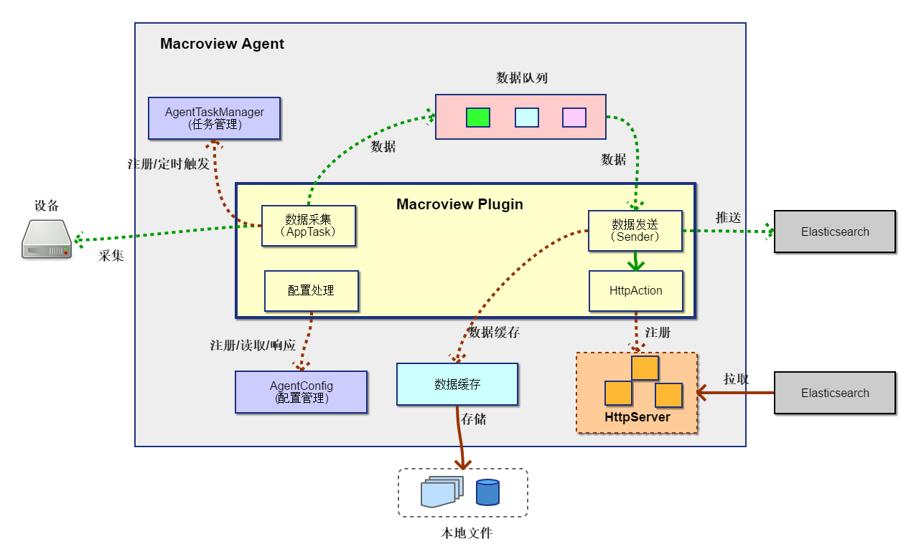
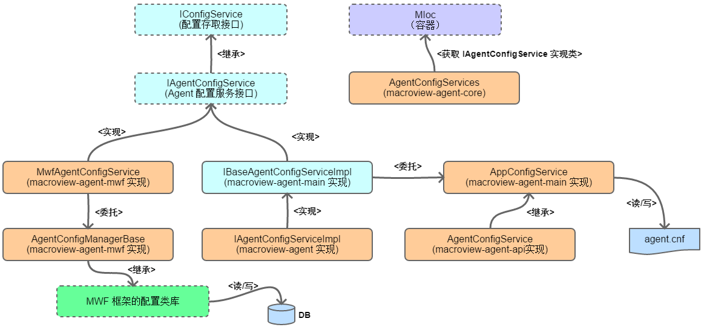
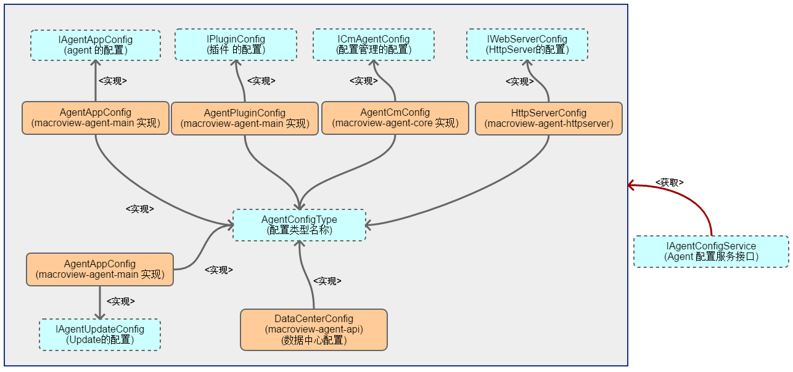
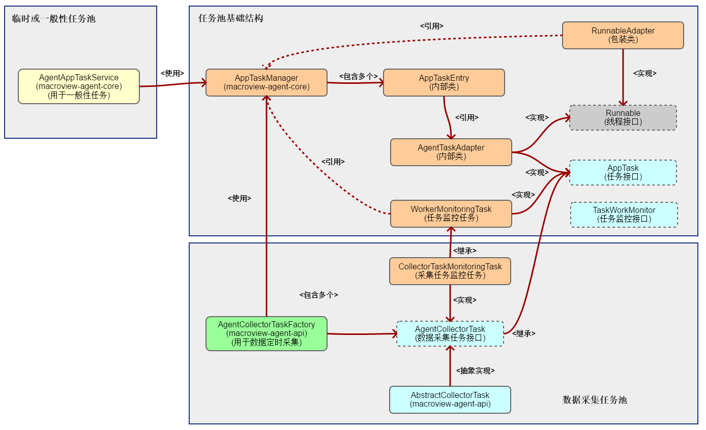
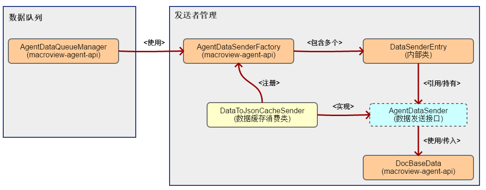
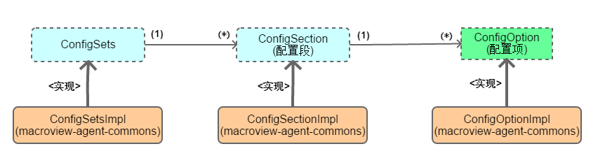
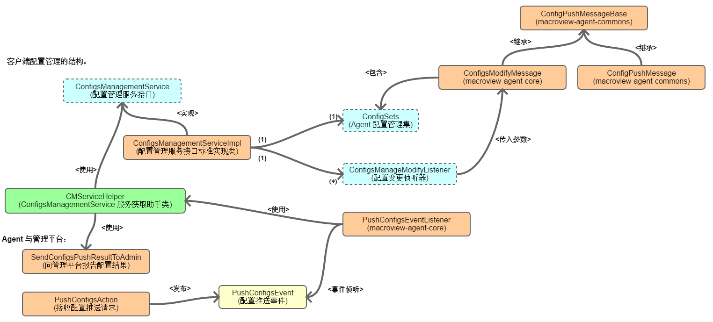
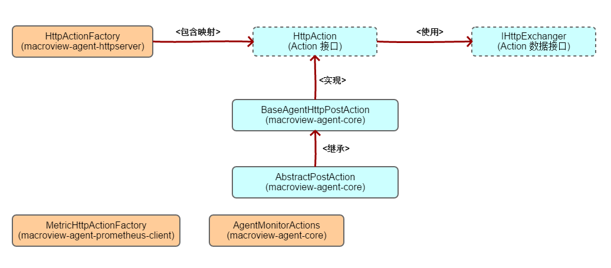

## x1. 说明 ##

 + 本文档描述如何开发一个受 `管理中心` 管理的 `Agent`。

 + 本文档以 `Java` 开发语言为开发环境来说明 `Agent` 的开发，其他开发语言也可以参考来建立受管理 `Agent`。

 + 完整的开发示例，建议看项目源代码，特别是子项目 `macroview-agent-plugins`，包含了很多标准的插件内容

## x2. Agent 结构概要 ##

### x2.1 Agent 的结构 ###

 + **Agent 的模块结构**

    

    - 在图中，除了 `Plugins` 之外，其他的内容基本上是 `Agent` 的基础框架，并且已经作为子项目已经分别实现。

    - 另外，从图中也可以看出，其实整个 `Agent`，实质性的工作是由其 `插件` 来完成，不同的 `插件`实现不同的数据采集功能。因此，所谓的 `Agent`开发，更多的是`插件`的开发。然后通过不同插件的组合实现不同的功能。
    - 作为背景的 `Agent` 为 `插件` 提供了大多数的功能支持：

        + **AgentTaskManager** 任务管理器，提供定时触发工作。通常无论是定时任务，还是一次性的线程工作或无限循环，都建议使用任务管理器来管理与运行。可管理的任务与线程是企业应用所必须的。
        + **AgentConfig** 配置管理，提供配置的存取。还提供了与 `管理中心` 相联的配置管理，远程动态修改与管理配置。
        + **数据队列** 目的是作为 `数据生产` 与 `数据消费` 中间桥梁，解耦两者能更灵活地生产与消费数据（如不同的消费目的） 
        + **数据发送** 提供从 `数据队列` 获取数据机制，由插件自己来控制数据的处理
        + **数据缓存** 提供数据的本地缓存服务，并提供简单的配置即服务功能，通过配置即能对数据进行缓存，也可以通过编程来实现更复杂的缓存处理。
        + **Agent 受控管理集** 就是 `Agent` 与 `管理中心` 的通讯模块，通过此模块来让 `Agent` 受控。

 + **Agent 插件结构**

    

    - 每个插件都需要大致的工作模块
    - **数据采集**：负责利用设备提供的 `API`、`SNMP`、`SYSLOG`等协议内容，从设备获取数据（通常是定时获取），然后将数据放到底层提供的`数据队列` 中。
    - **数据发送**：负责从 `数据队列` 中拿到数据（不用理会数据来自何处），然后根据配置将数据发送到 `数据接收端` （如 `Elasticsearch` ）。
    - **HttpAction**：对于主动 `拉取` 的 `数据接收端` 而言，需要定义一个 `Action` 并注册到底层提供的 `HttpServer` 中，为 `数据接收端` 提供拉取操作
    - **数据缓存**：在一些需要临时缓存数据的环境中，提供数据缓存服务（可选）
    - **配置处理**：通常插件都有自己的 `配置`，以便根据配置灵活控制插件的运作，因此，每个插件都需要将自己的 `配置`（处理）注册到底层的 `配置管理`模块。`配置管理`模块提供了 `配置的获取`，`配置变更通知`等功能。

## x3. Agent API ##

　　通过上面的结构可以看出，Agent 框架本身就提供了很多底层所需要的 API 或功能模块，那么在 `插件` 当中如何使用，就是本章节的内容。

### x3.1 配置模块 ###

　　配置管理中，配置本身包含两重内容：

 + 配置格式：使用何种格式来组织描述配置。
 
    - INI 格式：这是当前版本所使用的格式规范。
    - 使用 **`UTF-8`** 编码

 + 配置存储介质：配置内容以什么方式存储（存储的位置等）

    - 文件形式存储：以明文文本方式存储在本地
    - 数据库存储：配置存储到数据库当中

　　就目前大多数的 `Agent` 而言，将使用 `windows ini` 的格式，并以文本文件方式存储在本地：

 + **`agent.cnf`** 这是 `Agent` 的核心配置存储文件，该文件存放了 `Agent` 赖以正常运行的所有基础配置。

 　　所有配置文件，都要保证其编码为纯正的 **`UTF-8`**，什么 `UTF-8 with BOM` 之类的都不行，所以在使用文本编辑器编辑保存配置文件时，一定要留意（windows 的记事本，默认使用 ASCII 或 GBK 等保存，所以。。。!-_-!）。如果配置文件的编码不正确，则应用启动时就无法正确读取配置。

#### x3.1.1 Agent.cnf 的内容 ####

　　`agent.cnf` 是核心的配置文件，下面是一个基本的配置示例：

    ```ini
    [agent]
    agentId = XgGO41TM6KWvw9mh
    agentName = Demo-agent
    agentIp = 172.22.251.123
    version = 1.0
    license = license.txt

    install = E:\program\doc_agent\doc_agent

    description = 这是一个用来收集 windows 信息的 Agent

    heartbeat = 5
    retry = 5
    managerUrl = http://172.22.251.130:8080/macroview-agent-admin-main/v1/service/agent

    register = true

    [DataCenter]
    docUrl = http://172.22.251.123:8090/v1/developer/test/echo
    secret = xx

    [HttpServer]
    serverIp = 0.0.0.0
    port = 8086
    secret = Macr0v1ew,A@genT

    [plugins]
    plugins = com.macroview.agent.plugin.demo.AppPluginDemo,com.macroview.agent.plugin.wlc.WlcAppPlugin

    [dataStore:DEMO_PLUGIN]
    storeLocation = Local
    storeType = H2
    enable = true
    uploadMode = Timely
    onceUploadCount = 50
    schedule = 5m
    dataType=DEMO_DATA
    uploadFactoryClass=DEMO_SENDER
    order=1

    [h2DB:DEMO_PLUGIN]
    maxTime=2d

    [jsonDB:DEMO_PLUGIN]
    dbName = demo
    dbLocation = demo_db
    maxFileSize = 1MB
    maxFileCount = 20
    security = false
    secret = xxx
    ```

　　主要包括了以下几大部分内容：

 + **[agent]** Agent 的基础信息内容，主要包括：

    - agentId：这是 Agent 的唯一标识 ID，通常由管理中心自动生成，当然也可以手动输入（不建议）
    - agentName：Agent 的名称，通常是一个有意义的名字标识
    - agentIp：Agent 的ip 地址
    - version：Agent 的版本号
    - license：lincense 内容，目前暂时忽略
    - install：安装路径
    - description：Agent 的工作内容的一个简单描述
    - heartbeat：与管理中心的心跳间隔
    - retry：当无法与管理中心联系时，重试次数（暂时忽略）
    - managerUrl：管理中心 URL
    - register：是否已经注册到管理中心

 + **[DataCenter]** 数据中心的配置，即数据 `接收终端` 的配置，默认包括： 

    - docUrl：数据中心 URL
    - secret：安全设置
    - 要留意的是，配置是可扩展的，如果上述配置不足，可以添加，具体可以看后续关于配置类的内容

 + **[HttpServer]** 服务器的配置
 
    - serverIp：本机地址，通常默认为 `0.0.0.0`，如果有多个时，可以指定一个
    - port：访问端口
    - secret：请求密钥，目前版本忽略

 + **[plugins]** 插件的配置

    - plugins：指定插件中的插件接口实现类，如果有多个插件时，类之间使用逗号分隔

 + **[dataStore:DEMO_PLUGIN]** 后续的 `jsonDB` 都属于数据缓存的配置，具体内容参见 `数据缓存使用指南` 文档

#### x3.1.2 Agent 配置结构体系 ####

 + **配置的读写体系**

    - 在 `Agent framework 1.0` 的构架当中，配置作为一个模块，其组成体系如下：

        

    - 此为 `Agent` 的配置读/写的体系，其中我们在使用时，是通过 **`AgentConfigServices`** 来进行，这个类是一个静态类，通过 `IOC`（容器）来获取接口 `IAgentConfigService` 的实现类，为 `Agent` 提供配置服务，不管是基于文件的配置，还是基于数据库的配置，不需要我们理会。（隔离了具体的读写存储）
    - 当需要保存配置时，通过 `IConfigService` 或其子接口来完成，下面提供一些示例：
        ```java
        //要注意：AgentConfigService 是通过 IOC 来得到具体的接口实现类 
        IAgentConfigService service = AgentConfigServices.getAgentConfigService();
        //得到插件的配置
        IPluginConfig pc = service.getPluginConfig();

        //保存配置
        service.saveConfig(pc);
        ```

 + **配置实体体系**

    配置实体就是具体的配置项（使用），下面是相关的类体系：

    

    - 每个配置类（带接口是因为顶层需要用到配置），通常对应一组相关（或属于某个主题）配置，而这些配置都可以通过配置存取接口 `IAgentConfigService` 来得到。下面是一些示例：
        ```java
        //要注意：AgentConfigService 是通过 IOC 来得到具体的接口实现类 
        IAgentConfigService service = AgentConfigServices.getAgentConfigService();

        //得到 Agent 的配置
        IAgentAppConfig ac = service.getAgentAppConfig();
        String agentID = ac.getAgentId(); //得到 Agent 的 ID
        ```

    - 接口 `AgentConfigType` 表示组名（如在 `ini` 格式中，表示 `section name`

 + **配置的扩展与自定义配置**

    - 包含两层的意思

        + 扩展原有的配置，例如希望在 `dataCenter` 配置中添加新配置项
        + 添加全新的配置类（即新增一组配置，如 `wlc` `midas` 等）：一般来说，对于某个特定插件的配置，通常会建议使用独立的配置存储（独立配置文件或存储），避免将配置放到 `agent.cnf` 这个全局配置文件中。

    - 下面针对 `扩展原有配置` 提供一些扩展方法建议。

        + 通常建议是继承现在的（接口或实现类）来进行，下面提供示例：
            ```java
            //扩展 datacenter 的配置，提供 username 与 password 两个新的配置项
            //作为子类来编写
            public class MyDataCenterConfig extends DataCenterConfig {

                private String username;
                private String password;

                //---- 忽略 set/get -----
            }

            //下面是读取或存储
            IAgentConfigService service = AgentConfigServices.getAgentConfigService();
            //获取配置
            MyDataCenterConfig dc = service.getConfig(new MyDataCenterConfig());
            dc.setUsername("David");
            service.insertOrUpdate(dc); //有就更新，没有就添加
            ```

    - 如果是单独的配置文件，可以参考 `AppConfigService`(macroview-agent-main) 这个类来编写读写类

### x3.2 任务管理模块 ###

　　`任务管理` 为下面的任务线程提供帮助：

 + `定时任务（包括周期性任务）`
 + `一次性任务`
 + `无限循环（如队列）任务`

　　`任务管理模块`除了任务调度之外，还会有一些 `监控` 内容，通过监控内容可以了解任务的运行状况。
　　在 `Agent` 当中，通常会使用到的任务，主要包括：

 + **定时数据采集**
 + **数据队列** （相当于一个无限循环的任务）
 + **定时发送** （某些情况下的定时发送）
 + **心跳** （定时向管理中心发送心跳数据）
 + **延时执行任务** 某些一次性的延时工作
    - 某个时间点更新应用
    - 某个时间点触发数据上传

　　无论是 `Agent framework` 本身，还是插件，但凡存在线程任务时，通常会建议使用本模块功能来实现。

 + **类体系**

    

    - **AppTaskManager**：这是一个基础任务池的实现，提供基础设施，一般情况下不需要我们去创建，除非你想定义自己的任务池
    - **AgentCollectorTaskFactory**：这是数据采集任务池，是一个静态类，所有的数据采集任务都建议添加到此任务池。任务池会在 `Agent` 启动时创建和初始化。
        + **`AgentCollectorTask`**：所有采集任务都建议实现本接口，然后通过 `AgentCollectorTaskFactory.submitTask(task)` 来提交任务到任务池调度执行

    - **AgentAppTaskService**：这也是一个静态类，为 `Agent` 提供额外的，非 `数据采集任务` 使用的任务池，例如 `心跳任务` 等

 + **数据采集任务示例** 下面是一个数据采集任务的示例

    ```java
    /**
    * 这是一个生成测试数据的 Demo 任务，任务继承自 AbstractCollectorTask
    *
    * @author jai_lin
    * @since: v1.0
    */
    public class DemoCollectorTask extends AbstractCollectorTask{

        private final static AppMainLogger LOGGER = new AppMainLogger("DEBUG_PLUGIN");
        
        /* (non-Javadoc)
        * @see com.macroview.vdi.agent.data.task.AbstractCollectorTask#doCollect()
        */
        @Override
        protected DocBaseData doCollect() {		
            try {
                LOGGER.info("[Demo 插件]==> 采集一次数据...");
                return DemoData.createData();
            }
            catch (Exception e) {
                //示例从简
                return null;
            }
        }

        /* (non-Javadoc)
        * @see com.macroview.vdi.agent.data.task.AbstractCollectorTask#doException(java.lang.Exception)
        */
        @Override
        protected void doException(Exception e) {
            //示例里，对异常什么也不做
        }

        /* (non-Javadoc)
        * @see com.macroview.vdi.agent.data.task.AgentCollectorTask#getDelay()
        */
        @Override
        public long getDelay() {
            return 10L; //10秒后执行
        }

        //60 秒，也就是一分钟采集一次数据（执行一次任务）
        @Override
        public long getPeriod() {
            return 60L;
        }
    }
    ```
    ```java
    //将上面的任务示例，在插件的启动方法中注册到 AgentCollectorTaskFactory 也就是数据采集专用任务池
    public class AppPluginDemo implements AgentPlugin{
        //其他代码

        //插件的启动方法
        @Override    
        public BooleanResult start() {

            //其他代码...

	        //将数据采集任务 注册到任务池
		    AgentCollectorTaskFactory.submitTask(new DemoCollectorTask());

        }
    }
    ```

### x3.3 数据发送模块 ###

　　数据发送模块，其实就是从数据队列中得到数据，然后根据需要（如配置），将数据发送到 `数据接收端` 的功能实现。

#### x3.3.1 数据队列与数据发送体系 ####

 + 下面是数据队列与数据发送体系类

    

    - **AgentDataQueueManager** 作为数据队列管理类，自成体系并不需要外部干涉。当 Agent 启动时，会自动初始化队列并让队列处于工作状态。当队列有数据时，会自动取出并交由 `AgentDataSenderFactory` 来消费处理。
    - **AgentDataSenderFactory** 为发送者管理类，得取队列数据时，会将遍历所有发送者，并将数据交由匹配的发送者处理。

#### x3.3.2 发送者(Sender) ####

　　所谓发送者，其实就是数据消费者，消费来自队列的数据，不同类型的消费者，都有各自的处理（消费）方式。目前而言，数据发送者有以下三种：

 + 队列数据消费者。又分成两大类：

    - 将数据发送到远程接收端（如 Elasticsearch）的发送者
    - 将数据保存到本地缓存的发送者

 + 其他数据消费者，如来自数据缓存的发送者

　　无论是那种发送者（消费者），都是 `AgentDataSender` 接口的实现类。`AgentDataSender` 接口是一个函数接口，所以如果消费数据的代码比较简单的话，可以以 `Lambda` 形式编写。

 + AgentDataSender 接口方法

    - void send(DocBaseData)：传入 `DocBaseData` ，本方法实现消费逻辑（如发送到 Elasticsearch）
    - boolean accept(DocBaseData)：是否要消费此数据，如果不是自己所需要的数据，不会执行 send(..) 方法。此方法默认返回 true，即来者不拒，处理发送所有数据。一般情况下，建议覆盖本方法，不是自己处理的数据跳过不处理。否则在多个插件时，存在不同类型的数据情况下，容易造成重复发送等混乱。

    - 下面是一个示例：
        ```java
        /**
        * DEMO 数据的发送示例，仅发送 Demo 数据到测试的 vdi-datacenter-example
        *
        * @author jai_lin
        * @since: v1.0
        */
        public class DemoDataSender implements AgentDataSender{
            
            private final static AppMainLogger LOGGER = new AppMainLogger("DEBUG_PLUGIN");
            
            /**
            * 仅处理 DEMO 数据的发送
            * 
            * @see com.macroview.vdi.agent.data.sender.AgentDataSender#accept(com.macroview.vdi.agent.data.DocBaseData)
            */
            @Override
            public boolean accept(DocBaseData data) {
                LOGGER.info("[Demo 插件]==> 队列数据:" + data);
                return data != null && DemoData.DATA_TYPE.equals(data.getType());
            }

            /**
            * 如果传入的数据
            * 
            * @see com.macroview.vdi.agent.data.sender.AgentDataSender#send(com.macroview.vdi.agent.data.DocBaseData)
            */
            @Override
            public void send(DocBaseData data) {
                try{
                    //得到数据中心的 url
                    String url = AgentConfigService.getDataCenterConfig().getDocUrl();
                    
                    LOGGER.info("[Demo 插件]==> 数据中心 URL:" + url);
                    //将数据推送到数据中心
                    HttpClientUtils.post(url, data.toJson())
                                .done(r->{
                                    LOGGER.info("[Demo 插件]==> 向中心发送数据成功。。返回：" + r);
                                })
                                .fail(response->{
                                    LOGGER.error("[Demo 插件]==> 向中心发送数据失败：", response);
                                });
                }catch(Exception e){
                    //产生异常，示例一律作简
                    LOGGER.error("[Demo 插件]==> Demo 插件发送数据失败，异常：", e);
                }
            }

        }
        ```
        ```java
        //有了上面的发送者之后，需要注册到管理中心，例如在插件启动时注册
        /**
        * Hello world!
        */
        public class AppPluginDemo implements AgentPlugin{
            
            //其他代码...

            /* (non-Javadoc)
            * @see com.macroview.vdi.agent.plugins.AgentPlugin#start(com.macroview.vdi.agent.plugins.AgentPluginConfiguration)
            */
            @Override
            public BooleanResult start() {
                //其他代码

                LOGGER.info("[Demo 插件]==> 注册数据发送者...");
                AgentDataSenderFactory.addSender("DEMO_SENDER", new DemoDataSender());

                //其他代码
                return BooleanResult.SUCCESS;
            }
        }
        ```

### x3.4 配置管理模块 ###

　　`配置管理模块`（或者说 **配置变更管理**），是指在 `管理中心` 的管理下，Agent 配置的动态推送管理的内容。在不需要进入 Agent 或 Agent 运行环境的情况下，通过 `管理中心` 来操控 Agent 的配置的功能。

#### x3.4.1 配置管理模块体系 ####

 + 配置使用 `window ini` 的结构格式，因此作为配置集，其类结构如下：

    

    - 一个 `ConfigSets` 就是一个完整的配置集，配置集下有多组配置，每组配置有多个配置项

 + **Agent 接收配置变更与处理的体系**

    

    - 从使用的角度来看，只需要关注以下三个类或接口即可

        + CMServiceHelper：静态助手类，是处理核心，功能包括
            - 注册配置变更侦听器：即 `ConfigsManageModifyListener` 实现类
            - 发布配置变更。（即遍历执行所有侦听器）

        + ConfigsManageModifyListener：配置变更侦听接口，实现此接口来处理自己所需要的变更配置内容
        + ConfigSets：配置集，所有变化（新增，修改等）都集中在这个配置集中，侦听器通过这个接口得到具体的配置项

#### x3.4.2 Agent 基础配置变更处理 ####

　　对于 Agent 而言，其配置由二大部分内容组成：
 
 + **Agent 本身的运行配置** （agent.cnf 的内容）
 + **插件自己的运行配置** （这个由插件自己处理） 

　　本节是介绍 `Agent` 自身的配置变更处理情况。

 + `AgentAppConfigModifyListener` (macroview-agent-main)，主要的实现类，只要实现下述三个部分的配置变更

    - 心跳时间间隔：管理中心可以动态修改 Agent 的心跳时间间隔
    - HttpServer 的 ip 与 端口修改：主要是动态改变端口（涉及重启 httpserver 要小心使用）
    - 管理平台（即管理中心）URL 的修改

#### x3.4.3 配置变更开发 ####

　　下面说明如何实现配置的动态更新。

 + 注册要实现变更的配置。所注册的配置，管理中心是可以通过 `Get Configs` 得到

    - 要求 `配置` 的结构必须为 `ConfigSets`
    - 使用 CMServiceHelper 来注册

        ```java
         //通常是在 Agent 启动，或插件启动时注册
         CMServiceHelper.register(demoConfigSets);
        ```

 + 实现侦听器接口 `ConfigsManageModifyListener`，接收变更与处理变更

    - 实现接口示例：

        ```java
        /**
        * 配置推送侦听器实现
        *
        * @author jai_lin
        * @since: v1.0
        */
        public class ConfigModifyListener implements ConfigsManageModifyListener{

            /**
            * 看看有没有自己的配置发生了变化
            * 
            */
            @Override
            public boolean accept(ConfigSets sets) {
                return true; //返回 true 表示有，返回 false 表示没有
            }

            /* 
            * 这里处理变更
            */
            @Override
            public ConfigsPushResult apply(ConfigsModifyMessage message) {
                ConfigsPushResult result = new ConfigsPushResult();

                //拿得配置集--- 是所有配置，不得是不是你的
                ConfigSets configSets = message.getConfigSets();
                
                //处理代码，处理的结果通过 ConfigsPushResult 报告

                //forSuccess() 表示处理成功，
                //如果有错误通过 addError 方法来报告那个配置项有问题，原因是什么
                return result.forSuccess();
            }
        }    
        ```
    - 注册实现类，同样也是使用 `CMServiceHelper` 来注册

        ```java
        //通常是在 Agent 启动，或插件启动时注册
        CMServiceHelper.register(new ConfigModifyListener());
        ```

　　没有太多复杂的事情，重要的是：**接收配置，处理配置，然后返回处理结果**。

### x3.5 HttpAction 请求处理 ###

　　每个 Agent 都会包含一个小型 `HttpServer`，用以处理来自外部的请求。这些请求主要包括：

 + 管理与命令请求。来自管理中心的管理与命令请求，以及来自 `Updater`（更新程序，如果有的话）的命令操作
 + 数据请求。主要是 `Promethus Server` 的数据拉取请求

　　每个请求在这里，都会映射成一个 `HttpAction`，通过 `Action` 来处理具体的请求。

#### x3.5.1 HttpAction 体系 ####

 + 体系类图

    

    - **HttpActionFactory**：是 `<url, HttpAction>` 映射管理器，此类管理请求路径与 `HttpAction` 实现类之间的对应关系。当我们需要响应某个路由请求时，就要预先将路由与处理器注册到此类
    - **HttpAction**：请求处理器接口，实现此接口来实现处理逻辑
    - **BaseAgentHttpPostAction** 与 **AbstractPostAction** 都是实现 `HttpAction` 的抽象类，提供一些方便的使用（接收 Post 请求）
    - **IHttpExchanger** 由是请求数据与响应的接口，action 们通过此接口来获取请求数据或输出响应
    - **MetricHttpActionFactory** 这是为 `Prometheus` 提供的，并实现了其所需要的请求规范的 `Action` 工厂（其实就是在 action 基础上再添加一层包装，省去了重复麻烦的工作）
    - **AgentMonitorActions**：收集了所有 Agent 支持的管理命令现请求

#### x3.5.2 HttpAction 编程 ####

　　关于 `HttpAction` 的编程是简单的，并不复杂，复杂的是请求的处理逻辑本身。

 + 编写 HttpAction

    - 可以从实现接口 `HttpAction` 开始，也可以从继承 `AbstractPostAction` 开始，根据自己的需要选择
    - 下面是 `Ping 命令` 的实现代码，处理来自管理中心的 `/Ping` 请求，因为涉及到管理命令（有规范），因此选择继承 `AbstractPostAction`

        ```java
        /**
        * 接收来自 Agent-Admin 的 Ping 操作
        *
        * @author jai_lin
        * @since: v1.0
        */
        public class PingAction extends AbstractPostAction{
            
            private final static Logger LOGGER = LoggerFactoryHelper.of("HttpServer");

            @Override
            protected BaseResponse handle(IHttpExchanger httpData) {
                LOGGER.info("[Ping]==> Ping from:" + httpData.getRemoteAddress());
                
                try {
                    PingRequest ping = httpData.getRequestBody(PingRequest.class);
                    
                    LOGGER.info("[Ping][" + ping.getManagerID() + "]==> Received from：[" + ping.getManagerID() + "]'s Ping Request." );
                    if(ping.valid()) {
                        return BaseResponse.createSuccessResponse(ping.getState());
                        
                    }else {
                        LOGGER.error("[Ping]==> Error Ping from:" + httpData.getRemoteAddress() + "，Reason:{}", ping);
                        //state 未必能得到
                        return BaseResponse.createRequestErrorResponse(ping.getState());			    
                    }
                }
                catch (Exception e) {
                    LOGGER.error(e, "[Ping]==> Error Ping from:" + httpData.getRemoteAddress() + "，Reason:");
                    //state 未必能得到
                    return BaseResponse.createRequestErrorResponse("");
                }

            }

        }
        ```

 + 将写好的 Action 与请求路由建立映射（注册），可以在启动时或插件启动时进行

    ```java
    //将请求处理类与请求路由关联起来
    HttpActionFactory.addAction("/agent/ping", new PingAction());
    ```

 + 如果是 `Prometheus` 的请求 Action，添加用 `MetricHttpActionFactory` 加个包装

    ```java
    //此时，实现 action 就更加简单
    /**
        * 添加 /metric
        */
    HttpActionFactory.addAction("/metric", MetricHttpActionFactory.getAction(builder->{
        try {
            //采集数据，这个示例只是简单创建一个数据类
            DemoData d = DemoData.createData();
            
            //将采集到的数据添加到 Metric Builder 中，最终自动变成 Prometheus 的度量数据
            builder.addMetricData(d);
        }
        catch (Exception e) {
            //异常处理
        }
    }));
    ```    
    -  在这里，重点不再是实现 Action，而是提供要返回的数据

### x3.6 数据缓存 ###

　　关于数据缓存的内容，已经单独编写了一个使用文档：[点击进入](projects/macroview-agents/Agent%20数据缓存使用指南.md)

### x3.7 HttpClient ###

　　提供简单方便的 `HttpClient` 工具，向某个 `HttpServer` 发送请求。这方面工作由基础类库 `macroview-http-client` 提供，具体的使用参考文档：[点击进入](MacroviewLib/Macroview%20Web%20Lang/使用HttpClientUtils发送请求.2.x.md)


