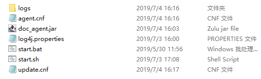
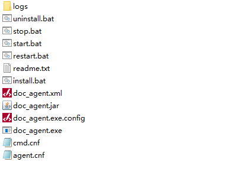

## x1. 说明 ##

 + 本文档描述了用 `Java` 开发的 Agent 的打包与部署

 + 其他语言开发的 Agent，请参考此语言的相关内容，在本文档中暂不提供支持

## x2. 打包 ##

### x2.1 Agent 的打包 ###

　　本节是针对 `Java` 开发语言开发的 `Agent` 而言。由于是使用 `Maven` 作为项目的构建工具，因此 `Agent` 的打包也是通过 `Maven` 来进行。而 `Maven` 的核心就是编写打包所需要的 `pom.xml` 文件，通过此文件来生成部署包。

 + **macroview-agent-mavens**：是本项目中用来存放标准的 `Agent` 打包 `pom.xml` 或其他文件，所以可以浏览此项目中的一些示例来了解和掌握 `pom.xml` 的编写

    - `xxx-plugin-pom.xml` 用来打包的 pom.xml
    - `xxx-plugin.bat`  一个方便使用的打包命令的批命令（一个命令打包）

 + 通常是将 `Agent` 所使用的所有文件，包括：程序、配置文件等，打包成一个 `zip`（甚至可以做成自解压）

#### x2.1.1 打包的内容 ####

　　在打包时，必须要清楚知道一个标准 Agent，能够正常运行所需要的文件内容，主要包括：

 + Agent 本身的运行文件与支持文件

    - Agent 与依赖类库，通常打包方式

        + 将 Agent 与依赖类库整合打包成一个 **`Jar`** 文件 （为了方便管理，通常建议使用这种方式）
        + 将 Agent 与依赖类库各自独立作为 **`Jar`** 文件 （此时，目录可能会有较多的 jar 文件存在）

    - Agent 运行支持文件

        - agent.cnf：配置文件
        - log4j.properties：日志文件
        - start.bat： windows 环境下的 Agent 启动命令
        - start.sh： linux 环境下的 Agent 启动命令

 + 插件或其他定制化所需要的文件

    - 每个插件都有可能有自己的配置文件，也可能有自己的命令文件等支持文件

　　因此每个标准 Agent 或 插件，都应该明白与清晰自身所需要的部署文件

#### x2.1.2 一般 Agent 的打包 ####

　　有了文件清单列表之后，就可以编写打包的 `pom.xml` 文件，下面是示例：

 + **打包文件示例**

    ```xml
    <?xml version="1.0"?> <!-- pom.xml -->
    <project
        xsi:schemaLocation="http://maven.apache.org/POM/4.0.0 http://maven.apache.org/xsd/maven-4.0.0.xsd"
        xmlns="http://maven.apache.org/POM/4.0.0"
        xmlns:xsi="http://www.w3.org/2001/XMLSchema-instance">
        <modelVersion>4.0.0</modelVersion>
        <parent>
            <groupId>com.macroview.agent</groupId>
            <artifactId>macroview-agent-projects</artifactId>
            <version>1.0.0</version>
            <relativePath>../pom.xml</relativePath>
        </parent>
        <artifactId>macroview-agent-mavens</artifactId>
        <name>macroview-agent-mavens</name>
        <url>http://maven.apache.org</url>
        <properties>
            <maven.compiler.encoding>UTF-8</maven.compiler.encoding>
            <project.build.sourceEncoding>UTF-8</project.build.sourceEncoding>
            <project.reporting.outputEncoding>UTF-8</project.reporting.outputEncoding>				
            <maven.compiler.compilerVersion>1.8</maven.compiler.compilerVersion>
            <maven.compiler.target>1.8</maven.compiler.target>
            <maven.compiler.source>1.8</maven.compiler.source>
        </properties>  
      
        <profiles>
            <!-- macroview-agent-plugin-demo 测试打包 -->
            <profile>
                <id>test-demo-plugins</id>
                <activation>
                    <activeByDefault>true</activeByDefault>
                </activation>
                <dependencies>
                    <dependency> <!-- 这是 Agent 框架，为所有插件必须依赖的  -->
                        <groupId>com.macroview.agent</groupId>
                        <artifactId>macroview-agent</artifactId>
                    </dependency>
                    
                    <dependency> <!-- Agent 所带的插件1  -->
                        <groupId>com.macroview.agent</groupId>
                        <artifactId>macroview-agent-plugin-demo</artifactId>
                    </dependency>
        
                    <dependency> <!-- Agent 所带的插件2  -->
                        <groupId>com.macroview.agent</groupId>
                        <artifactId>macroview-agent-plugin-windows</artifactId>
                    </dependency>
                    <!-- 带有其他所依赖的内容 -->
                </dependencies>                
                <build>
                    <finalName>doc_agent</finalName> <!-- 名称 -->
                    <plugins>
                        <plugin>  <!-- Agent 的打包 maven 插件，将 Agent 和依赖打包成一个 Jar 文件  -->
                            <groupId>org.apache.maven.plugins</groupId>
                            <artifactId>maven-shade-plugin</artifactId>
                            <version>2.4.1</version>
                            <executions>
                                <execution>
                                    <phase>package</phase>
                                    <goals>
                                        <goal>shade</goal>
                                    </goals>
                                    <configuration>
                                        <transformers> <!-- agent 的 main() 为必须内容 -->
                                            <transformer
                                                implementation="org.apache.maven.plugins.shade.resource.ManifestResourceTransformer">
                                                <mainClass>com.macroview.agent.AgentApplication</mainClass>
                                            </transformer>
                                        </transformers>
                                        <filters>
                                            <filter> <!-- 需要或不需要打包的文件 -->
                                                <artifact>*:*</artifact>
                                                <excludes> <!-- 由于希望将文件放在处边，因此不将配置打包在 jar 里 -->
                                                    <exclude>agent.cnf</exclude>
                                                    <exclude>log4j.properties</exclude>
                                                    <exclude>start.bat</exclude>
                                                    <exclude>start.sh</exclude>
                                                </excludes>
                                            </filter>
                                        </filters>
                                    </configuration>
                                </execution>
                            </executions>
                        </plugin>

                        <plugin> <!-- 这里是将 doc_agent.jar 与支持文件打包成一个 zip 的插件 -->
                            <groupId>org.apache.maven.plugins</groupId>
                            <artifactId>maven-assembly-plugin</artifactId>
                            <version>3.1.0</version>
                            <configuration>
                                <appendAssemblyId>true</appendAssemblyId>

                                <descriptors> <!-- 要打包什么文件到 zip 的描述  -->
                                    <descriptor>./profiles/test-demo/assembly.xml</descriptor>
                                </descriptors>
                            </configuration>
                            <executions>
                                <execution>
                                    <id>make-assembly</id>
                                    <phase>package</phase>
                                    <goals>
                                        <goal>single</goal>
                                    </goals>
                                </execution>
                            </executions>
                        </plugin>

                    </plugins>
                </build>			
            </profile>
                    
        </profiles>    
        
    </project>

    ```
    ```xml
    <!-- assembly.xml 将内容再次打包成 zip，即便携文件的说明文件 -->
    <?xml version="1.0" encoding="UTF-8"?>
    <assembly
        xmlns="http://maven.apache.org/plugins/maven-assembly-plugin/assembly/1.1.3"
        xmlns:xsi="http://www.w3.org/2001/XMLSchema-instance"
        xsi:schemaLocation="http://maven.apache.org/plugins/maven-assembly-plugin/assembly/1.1.3 http://maven.apache.org/xsd/assembly-1.1.3.xsd">
        <id>1.0</id>
        <!-- 将可执行的 jar 和配置文件打包成 zip -->
        <formats>
            <format>zip</format> <!-- zip 文件格式 -->
        </formats>
        <includeBaseDirectory>true</includeBaseDirectory>
        <baseDirectory>bin</baseDirectory> <!-- 所有文件放到 bin 目录 -->
        <fileSets>
        <fileSet>    
                <directory>src/main/resources</directory>    
                <outputDirectory>/</outputDirectory>    
                <excludes>
                    <exclude>agent.cnf</exclude>
                </excludes>
            </fileSet>
        </fileSets>
        <files> <!-- 要打包的文件 -->
            <file>
                <source>target/doc_agent.jar</source> <!-- pom.xml 生成的 agent 核心程序文件 -->
                <outputDirectory>/</outputDirectory>
            </file>
            <file>
                <source>profiles/test-demo/agent.cnf</source>
                <outputDirectory>/</outputDirectory>
            </file>
            <file>
                <source>../macroview-agent/src/main/resources/start.bat</source>
                <outputDirectory>/</outputDirectory>
            </file>
            <file>
                <source>../macroview-agent/src/main/resources/start.sh</source>
                <outputDirectory>/</outputDirectory>
            </file>        
            <file>
                <source>../macroview-agent/src/main/resources/log4j.properties</source>
                <outputDirectory>/</outputDirectory>        
            </file>
        </files>
    </assembly>    
    ```

 + **使用 Maven 打包**，有了 `pom.xml` 等内容后，我们就可以使用下面的打包命令来打包

    ```shell
     mvn package -f my_pom.xml -Dmaven.test.skip=true
    ```
    - 其中 `my_pom.xml` 就是上面的 `pom` 文件的名称，如果不在当前目录还要带上路径。当然，如果名称为 `pom.xml` 也可以不用使用 `-f` 参数来指定

#### x2.1.3 将 Agent 打包成 Windows Service ####

　　如果是在 Windows 中运行的 Agent，大部分希望以 Service 的方式运行。事实上，`Java` 开发的应用，通常是无法变在 Service 程序，需要借帮外部力量：能作为 Service 运行的外壳程序。

 + **pom.xml**

    ```xml
    <?xml version="1.0"?>
    <project
        xsi:schemaLocation="http://maven.apache.org/POM/4.0.0 http://maven.apache.org/xsd/maven-4.0.0.xsd"
        xmlns="http://maven.apache.org/POM/4.0.0"
        xmlns:xsi="http://www.w3.org/2001/XMLSchema-instance">
        <modelVersion>4.0.0</modelVersion>
        <parent>
            <groupId>com.macroview.agent</groupId>
            <artifactId>macroview-agent-projects</artifactId>
            <version>1.0.0</version>
            <relativePath>../pom.xml</relativePath>
        </parent>
        <artifactId>macroview-agent-mavens</artifactId>
        <name>macroview-agent-mavens</name>
        <url>http://maven.apache.org</url>
        <properties>
            <maven.compiler.encoding>UTF-8</maven.compiler.encoding>
            <project.build.sourceEncoding>UTF-8</project.build.sourceEncoding>
            <project.reporting.outputEncoding>UTF-8</project.reporting.outputEncoding>
            <maven.compiler.compilerVersion>1.8</maven.compiler.compilerVersion>
            <maven.compiler.target>1.8</maven.compiler.target>
            <maven.compiler.source>1.8</maven.compiler.source>
        </properties>
        <dependencies>
            <dependency> <!-- Agent 框架，这是必须的依赖项 -->
                <groupId>com.macroview.agent</groupId>
                <artifactId>macroview-agent</artifactId>
            </dependency>
            <dependency> <!-- Agent 所使用的插件 -->
                <groupId>com.macroview.agent</groupId>
                <artifactId>macroview-agent-plugin-windows</artifactId>
            </dependency>
        </dependencies>

        <build>
            <finalName>doc_agent</finalName> <!-- agent jar 名称 -->
            <plugins>
                <plugin><!-- Agent 的打包 maven 插件，将 Agent 和依赖打包成一个 Jar 文件  -->
                    <groupId>org.apache.maven.plugins</groupId>
                    <artifactId>maven-shade-plugin</artifactId>
                    <version>2.4.1</version>
                    <executions>
                        <execution>
                            <phase>package</phase>
                            <goals>
                                <goal>shade</goal>
                            </goals>
                            <configuration>
                                <transformers> <!-- agent 的 main() 为必须内容 -->
                                    <transformer
                                        implementation="org.apache.maven.plugins.shade.resource.ManifestResourceTransformer">
                                        <mainClass>com.macroview.agent.AgentApplication</mainClass>
                                    </transformer>
                                </transformers>
                                <filters>
                                    <filter><!-- 需要或不需要打包的文件 -->
                                        <artifact>*:*</artifact>
                                        <excludes> <!-- 由于希望将文件放在处边，因此不将配置打包在 jar 里 -->
                                            <exclude>agent.cnf</exclude>
                                            <exclude>log4j.properties</exclude>
                                            <exclude>start.bat</exclude>
                                            <exclude>wmi.cnf</exclude>
                                        </excludes>
                                    </filter>
                                </filters>
                            </configuration>
                        </execution>
                    </executions>
                </plugin>

                <plugin> <!-- 使用这个插件来打包成 Window Service -->
                    <groupId>cn.joylau.code</groupId>
                    <artifactId>joylau-springboot-daemon-windows</artifactId>
                    <version>1.2.RELEASE</version>
                    <executions>
                        <execution>
                            <id>make-win-service</id>
                            <phase>package</phase>
                            <goals>
                                <goal>make-win-service</goal>
                            </goals>
                        </execution>
                    </executions>
                    <configuration> <!-- 名称前缀，或者说是 jar 的名称 -->
                        <prefixName>doc_agent</prefixName>
                        <outputDirectory>bin</outputDirectory>
                        <resources> <!-- 下面是一起打包的内容 -->
                            <resource>
                                <directory>src/main/resources</directory>
                                <includes>
                                    <include>log4j.properties</include>
                                    <include>*</include>
                                </includes>
                                <excludes>
                                    <exclude>agent.cnf</exclude>
                                </excludes>
                            </resource>
                            <resource>
                                <directory>profiles/product-winplugins</directory>
                                <includes>
                                    <include>agent.cnf</include>
                                    <include>log4j.properties</include>
                                </includes>
                            </resource>
                            <resource>
                                <directory>../macroview-agent-plugins/macroview-agent-plugin-windows/src/main/resources</directory>
                                <includes>
                                    <include>cmd.cnf</include>
                                    <include>wmi.cnf</include>
                                </includes>
                            </resource>
                        </resources>
                    </configuration>
                </plugin>
            </plugins>
        </build>
    </project>
    ```
    - 核心就是使用 `joylau-springboot-daemon-windows` 这个 `Maven` 插件提供外壳程序及配置
    - 由于 `joylau-springboot-daemon-windows` 已经能够打包成 `zip`，因此可以不用 `maven-assembly-plugin` 来打包成 `zip`

 + **使用 Maven 打包**，有了 `pom.xml` 等内容后，我们就可以使用下面的打包命令来打包

    ```shell
     mvn package -f my_pom.xml -Dmaven.test.skip=true
    ```
    - 其中 `my_pom.xml` 就是上面的 `pom` 文件的名称，如果不在当前目录还要带上路径。当然，如果名称为 `pom.xml` 也可以不用使用 `-f` 参数来指定

## x3. 部署 ##

### x3.1 简单部署到物理机或VM ###

　　目前而言，Agnet 都是以独立的应用来运行，因此打包成 zip 之后，可以直接拷贝到运行环境中，然后解压。下面是解压后的一些示例内容：(bin 目录)

 

　　一个完整的目录结构示例如下：（经过版本更新后。。。）

 

#### x3.1.1 运行 ####

　　部署后，可以运行起来：

 + Windows：使用 `start.bat` 这个批命令来运行
 + Linux：使用 `start.sh` 这个批命令运行

#### x3.1.2 安装成 Windows Service ####

　　而对于 `Windows Service` 形态的 Agent 来说，内容示例如下：

 

 + **`install.bat`**：这个 `bat` 命令就是将 Agent 安装成 Windows Service，执行它即可
 + **`uninstall.bat`**：这个 `bat` 命令是卸载 Windows Service

### x3.2 部署到 Docker 容器 ###

(待续)

### x3.3 部署到 K8S 集群 ###

(待续)
