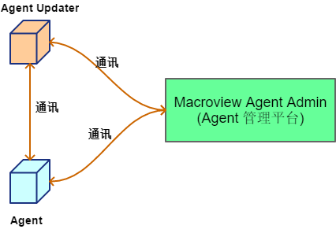

@[toc](目录)

## X1.说明 ##

### X1.1 文档说明 ###

　　本文档描述 `Agent` 与 `管理中心`间的通讯接口，为 `Agent` 与 `管理中心` 的通讯开发提供规范

## X2. 概述 ##

### X2.1 系统部署结构 ###

  

<br>

　　从图中可以看出，有三大部分的通讯内容：

 + Agent <----> Admin
 + Agent Updater <----> Admin
 + Agent <----> Agent Updater

### X2.2 通讯协议格式 ###

 + 所有通讯要求基于 `HTTP/HTTPS` 协议

 + 数据包的格式通常为 `JSON` 格式

### X2.3 通讯数据通用结构说明 ###

　　通讯是双向的，因此数据也分成两部分：

 + 发送数据结构：数据发送时，因应不同的身份有不同的发送要求

    - 管理中心向 `Agent` 发送请求

        ```json
        {
            type: "请求名称",
            managerID: "请求中心ID",
            state: "随机串，Agent 响应需要带回给管理中心",
            timestamp: "长整数时间戳",
            datas:{}  #具体的请求数据
        }
        ```

    - `Agent` 向管理中心发送请求

        ```json
        {
            type: "请求类型名称",
            agentID: "Agent 的唯一性ID",
            agentName: "Agent 的名称",
            agentIP: "Agent 的ip",
            state: "随机串，管理中心回应时要带上",
            timestamp: "长整数时间戳",
            datas:{}  # 具体的请求数据
        }
        ```

 + 响应数据结构：响应也会因应不同的情况不同

    - 通用的结构：

        ```json
        {
            code: "通常为 HTTP Status 或自定义代码",
            body: "字符串或对象",
            timestamp: "长整数时间戳",
            state: "回带请求时过来的 state"
        }
        ```

### X2.4 管理中心向 Agent 发送的请求 ###

#### X2.4.1 Ping Request （Ping 请求） ####

　　`Ping Request` 的目的在于确定 `Agent` 是否还在运行，即至少知道 `Agent` 的 `HttpServer` 是否仍然能接收到请求。

 + 请求：**/agent/ping**

 + 请求方法：**POST**

 + 请求参数：**无**

 + 请求体数据结构：（Request Body）

    ```json
    {
        type: "ping",
        managerID: "请求中心ID",
        state: "即时随机串",
        timestamp: "长整数时间戳"       
    }
    ```

 + 响应要求：

    - HTTP Status 200：正常响应

    ```json
    {
        code: 200,
        timestamp: "长整数时间戳",
        state: "回带请求时过来的 state",
        body: "OK"
    }
    ```

    - HTTP Status 400：请求参数不正确

    ```json
    {
        code: 400,
        timestamp: "长整数时间戳",
        state: "回带请求时过来的 state",
        body: "请求参数不正确"
    }
    ```

#### X2.4.2 About Request (About 请求) ####

　　`About 请求` 目标在于：得到 `Agent` 的一些即时简要信息。

 - 请求规范

    + 请求：**/agent/about**

    + 请求方法：**POST**

    + 请求参数：**无**

    + 请求体数据结构：（Request Body）

        ```json
        {
            type: "about",
            managerID: "请求中心ID",
            state: "即时随机串",
            timestamp: "长整数时间戳"       
        }
        ```

    + 响应要求：

        - HTTP Status 200：正常响应

        ```json
        {
            code: 200,
            timestamp: "长整数时间戳",
            state: "回带请求时过来的 state",
            body: {
                info: {}   # Agent 的基础配置信息
                ,status: "Success!"
                ,system:{
                    "OS": "Agent 所在操作系统",
                    "OS Version": "操作系统版本信息",
                    "Lang": "Agent 的开发语言",
                    "Lang Version": "开发语言的版本"
                }
                ,plugins:[]   # 插件信息列表
            }
        }
        ```

        - HTTP Status 400：请求参数不正确

        ```json
        {
            code: 400,
            timestamp: "长整数时间戳",
            state: "回带请求时过来的 state",
            body: "请求参数不正确"
        }
        ```

        - HTTP Status 500：信息获取失败

        ```json
        {
            code: 500,
            timestamp: "长整数时间戳",
            state: "回带请求时过来的 state",
            body: "信息获取失败的原因或异常信息"
        }
        ```


#### X2.4.3 Get Configs (Get Configs 请求) ####

　　`Get Configs 请求` 目标在于：得到 `Agent` 提供管理的配置。

　　每个 `Agent` 都会有两种类型的配置：

 + 内部使用，不加入到配置管理的配置。（如临时或记录状态的配置）

 + 加入到配置管理，管理中心能进行编辑修改的配置

　　本请求所获取的，就是第二种类型的配置：加入到配置管理的配置。

 + 请求规范

    - 请求：**/agent/configs**

    - 请求方法：**POST**

    - 请求参数：**无**

    - 请求体数据结构：（Request Body）

        ```json
        {
            type: "configs",
            managerID: "请求中心ID",
            state: "即时随机串",
            timestamp: "长整数时间戳"       
        }
        ```

    - 响应要求：

        + HTTP Status 200：正常响应

            ```json
            {
                code: 200,
                timestamp: "长整数时间戳",
                state: "回带请求时过来的 state",
                body: { # 内容为 ConfigSets 接口实现类
                    sections:{
                        "section1":{},  # 一组配置
                        "section2":{},
                        "...":{}
                    }
                } 
            }
            ```

        + HTTP Status 400：请求参数不正确

            ```json
            {
                code: 400,
                timestamp: "长整数时间戳",
                state: "回带请求时过来的 state",
                body: "请求参数不正确"
            }
            ```

        + HTTP Status 500：信息获取失败

            ```json
            {
                code: 500,
                timestamp: "长整数时间戳",
                state: "回带请求时过来的 state",
                body: "信息获取失败的原因或异常信息"
            }
            ```

#### X2.4.4 Push Configs Request (配置推送请求) ####

　　`Push Configs 请求`目标在于：管理中心向 `Agent` 推送配置，以便改变 `Agent` 的行为。

　　同样，本请求也分两阶段完成：

 + 管理中心推送配置到 `Agent`

 + `Agent` 处理完配置后，向管理中心报告处理结果

　　下面是具体的描述：

 + 管理中心推送配置请求规范

    - 请求：**/agent/push-configs**

    - 请求方法：**POST**

    - 请求参数：**无**

    - 请求体数据结构：（Request Body）

        ```json
        {
            type: "push_configs",
            managerID: "请求中心ID",
            state: "即时随机串",
            timestamp: "长整数时间戳",
            datas:{  # ConfigPushMessage 类内容
                version: "长整数版本号",
                pushID: "本次推送标识",
                configID: "本次配置标识",
                forceRestart: "true|false，是否需要强制重启，默认为 false",
                pushMethod: "配置处理方法",
                content: "配置内容，ini 格式"
            }       
        }
        ```
        + **pushMethod**：用来表示新配置与旧配置的关系，包含以下几种：

            - New：替代关系--抛弃原配置，全部使用新配置
            - Merge：合并关系--新配置与旧配置进行合并，新的追加，旧的替换
            - Append：追加--只添加新配置（不理会旧配置）
            - Override：覆盖--只替换旧配置（不理会新配置）
            - Rollback：回滚--全部回到上一个版本

    - 响应要求：

        + HTTP Status 200：正常响应

            ```json
            {
                code: 200,
                timestamp: "长整数时间戳",
                state: "回带请求时过来的 state",
                body: "OK"
            }
            ```

        + HTTP Status 400：请求参数不正确

            ```json
            {
                code: 400,
                timestamp: "长整数时间戳",
                state: "回带请求时过来的 state，如果请求没有 state 或无法解释得到，此值可以为空",
                body: "请求参数不正确"
            }
            ```

 + `Agent` 处理完配置后，向管理中心报告处理结果请求

    - 请求：**/v1/service/agent/configs-mg/push-configs-report**

    - 请求方法：**POST**

    - 请求参数：**无**

    - 请求体数据结构：（Request Body）

        ```json
        {
            type: "push_configs_report",
            agentID: "Agent 的唯一性ID",
            agentName: "Agent 的名称",
            agentIP: "Agent 的ip",
            state: "即时随机串",
            timestamp: "长整数时间戳",
            datas:{  # PushConfigsReport 类内容
                success: "true|false，整体成功与否",
                pushID: "推送请求的ID",
                pushInfos:[ # ConfigsPushInfo 对象列表
                    {
                        section: "配置段名",
                        option: "配置项",
                        value: "配置值",
                        errMessage: "空表示成功，非空表示错误"
                    }
                    ,{...}
                ]
            }       
        }
        ```

    - 响应要求：

        + HTTP Status 200：正常响应

            ```json
            {
                code: 200,
                timestamp: "长整数时间戳",
                state: "回带请求时过来的 state",
                body: "OK"
            }
            ```

        + HTTP Status 400：请求参数不正确

            ```json
            {
                code: 400,
                timestamp: "长整数时间戳",
                state: "回带请求时过来的 state",
                body: "请求参数不正确"
            }
            ```

#### X2.4.5 Upload-notify Request (Upload 请求) ####

　　`upload-notify 请求`目标：对于某些处于等待数据上传状态的 `Agent`，当其设置了管理中心触发上传配置后，发送本请求触发 `Agent` 上传数据。

　　本请求同样分成两部分：

 + 管理中心向 `Agent` 发送上传请求

 + `Agent` 完成操作后，向管理中心发送简报

　　要留意到，每个 `Agent` 都可能有多个插件，因此需要指定上传的插件，下面是具体的设计规范：

 + 管理中心向 `Agent` 发送上传请求规范

    - 请求：**/agent/upload-notify**

    - 请求方法：**POST**

    - 请求参数：**无**

    - 请求体数据结构：（Request Body）

        ```json
        {
            type: "upload_notify",
            managerID: "请求中心ID",
            state: "即时随机串",
            timestamp: "长整数时间戳",
            datas:{  # UploadNotifyMessage 类内容
                uploadNotifyID: "本次推送标识",
                notify: [  # UploadNotifyData 列表
                    {
                        plugin: "插件名称",
                        pluginID: "插件ID",
                        action: "Start|Stop",
                        schedule: "延迟多少秒开始上传"
                    }
                    ,{...}
                ]
            }       
        }
        ```
        + **action**：用来要求 `Agent` 是开始还是停止上传

            - Start：取此值表示开始上传，为默认值
            - Stop：要求 Agent 停止上传，此为预留功能，当前版本未支持
        + **schedule**：可以提供一个延时操作，单位为秒，并且

            - 如果是一个少于 `10` 的数值时，表示为即时上传动作
            - 如果数值大于 `10`，则会延时此数值（秒数），然后再上传

    - 响应要求：

        + HTTP Status 200：正常响应

            ```json
            {
                code: 200,
                timestamp: "长整数时间戳",
                state: "回带请求时过来的 state",
                body: "OK"
            }
            ```

        + HTTP Status 400：请求参数不正确

            ```json
            {
                code: 400,
                timestamp: "长整数时间戳",
                state: "回带请求时过来的 state",
                body: "请求参数不正确"
            }
            ```

        + HTTP Status 500: 请求参数与配置不符，存在错误

            ```json
            {
                code: 500,
                timestamp: "长整数时间戳",
                state: "回带请求时过来的 state",
                body: {  # AgentDataUploadReports 类报告具体的错误
                    uploadNotifyID: "本次推送 ID",
                    report:[ # AgentPluginUploadMessage 列表
                        {
                            plugin: "插件名称",
                            pluginID: "插件ID",
                            status: "处理状态",
                            uploadMode: "数据上传模式",
                            message: "结果的文字描述",
                            schedule: "调度时间",
                            action: "Start|Stop",
                            reportTime: "报告时间戳"
                        },{...}
                    ]
                }
            }
            ```

            - **status**：处理的情况，主要包括：
                + Error：发生了错误（不一定停止上传）
                + Success: 处理成功
                + Stop：客户端主动停止上传（不一定发生错误）
                + Fail：发生异常（严重错误，并且停止上传）
                    - 例如：插件配置了定时上传，但管理中心向其发送了上传命令，这是一个错误
            - **uploadMode**：插件的上传模式
            - **message**：对于错误的一个文字说明，如果是成功可以为空

 + `Agent` 完成操作后，向管理中心发送简报

    - 请求：**/v1/service/agent/agent-data-upload/upload-report**

    - 请求方法：**POST**

    - 请求参数：**无**

    - 请求体数据结构：（Request Body）

        ```json
        {
            type: "upload_notify_reports",
            agentID: "Agent 的唯一性ID",
            agentName: "Agent 的名称",
            agentIP: "Agent 的ip",
            state: "即时随机串",
            timestamp: "长整数时间戳",
            datas:{  # AgentDataUploadReports 类内容
                uploadNotifyID: "本次推送 ID",
                report:[ # AgentPluginUploadMessage 列表
                    {
                        plugin: "插件名称",
                        pluginID: "插件ID",
                        status: "处理状态",
                        uploadMode: "数据上传模式",
                        message: "结果的文字描述",
                        schedule: "调度时间",
                        action: "Start|Stop",
                        reportTime: "报告时间戳"
                    },{...}
                ]
            }       
        }
        ```
        - **status**：处理的情况，主要包括：
            + Error：发生了错误（不一定停止上传）
            + Success: 处理成功
            + Stop：客户端主动停止上传（不一定发生错误）
            + Fail：发生异常（严重错误，并且停止上传）
                - 例如：插件配置了定时上传，但管理中心向其发送了上传命令，这是一个错误
        - **uploadMode**：插件的上传模式
        - **message**：对于错误的一个文字说明，如果是成功可以为空

    - 响应要求：

        + HTTP Status 200：正常响应

            ```json
            {
                code: 200,
                timestamp: "长整数时间戳",
                state: "回带请求时过来的 state",
                body: "OK"
            }
            ```

        + HTTP Status 400：请求参数不正确

            ```json
            {
                code: 400,
                timestamp: "长整数时间戳",
                state: "回带请求时过来的 state",
                body: "请求参数不正确"
            }
            ```

#### x2.4.6 Get Logs (日志请求) ####

　　`Get Logs` 请求目标：从 Agent 中获取日志（文件）内容。可以查阅 Agent 的动行日志。

　　本请求命令分成两步：

 + **`Get Logs File List`**：即获取当前日志文件列表。管理中心向 `Agent` 发送请求规范：

    - 请求：**/agent/logfile-list**

    - 请求方法：**POST**

    - 请求参数：**无**

    - 请求体数据结构：（Request Body）

        ```json
        {
            type: "logfile-list",
            managerID: "请求中心ID",
            state: "即时随机串",
            timestamp: "长整数时间戳",
        }
        ```

    - 响应要求：

        + HTTP Status 200：正常响应

            ```json
            {
                code: 200,
                timestamp: "长整数时间戳",
                state: "回带请求时过来的 state",
                body: [
                    { 
                        file:"log-file1",
                        beginTime: "2020-04-03 20:49:06,988",
                        endTime: "2020-04-33 20:49:06,988"
                    },
                    {
                        file:"log-file2",
                        beginTime: "2020-04-33 20:49:06,988",
                        endTime: "2020-04-53 20:49:06,988"
                    }
                    ...,
                    {...}
                ]
            }
            ```

        + HTTP Status 400：请求参数不正确

            ```json
            {
                code: 400,
                timestamp: "长整数时间戳",
                state: "回带请求时过来的 state",
                body: "请求参数不正确"
            }
            ```

 + **`Query Logs`**：查询某个日志文件中，某个时间段内的日志内容，下面是请求规范：

    - 请求：**/agent/logfile-query**

    - 请求方法：**POST**

    - 请求参数：**无**

    - 请求体数据结构：（Request Body）

        ```json
        {
            type: "logs-query",
            managerID: "请求中心ID",
            state: "即时随机串",
            timestamp: "长整数时间戳",
            datas:{
                file:"log-file1",
                beginTime: "2020-04-03 20:49:06,988",
                endTime: "2020-04-33 20:49:06,988"
            }
        }
        ```
        + **file**：要查询的日志文件，不支持跨文件的查询
        + **beginTime**：开始日期时间，超出的按日志文件的实际开始时间开始
        + **endTime**：结束日期时间，超出的按日志文件的实际结束时间结束

    - 响应要求：

        + HTTP Status 200：正常响应

            ```json
            {
                code: 200,
                timestamp: "长整数时间戳",
                state: "回带请求时过来的 state",
                body: [  # 日志列表
                    "xxxx",
                    "xxxx
                ]
            }
            ```

        + HTTP Status 400：请求参数不正确

            ```json
            {
                code: 400,
                timestamp: "长整数时间戳",
                state: "回带请求时过来的 state",
                body: "请求参数不正确"
            }
            ```

### X2.5 Agent 向管理中心发送的请求 ###

 + 所有的请求前缀为：**/v1/service/agent**

#### X2.5.1 Heartbeat Request (心跳请求) ####

　　`Heartbeat 请求` 目标：每个运行中的 `Agent` 都有义务与责任与管理中心发送存活报告。

　　心跳请求除了报告自己还在世之外，还会夹带一些额外的信息，包括：

 + 上一次心跳的发送与接收回应的时间差 --- 用来评估网络连接质量

 + 系统当前的运行信息，主要包括：

    - 当前 CPU 的使用率（百分比）
    - 当前 内存的使用率（百分比）
    - 当前磁盘空间数据
    - 当前应用本身对内存的使用情况

 + Agent 心跳请求规范

    - 请求：**/v1/service/agent/heartbeat**

    - 请求方法：**POST**

    - 请求参数：**无**

    - 请求体数据结构：（Request Body）

        ```json
        {
            type: "heartbeat",
            agentID: "Agent 的唯一性ID",
            agentName: "Agent 的名称",
            agentIP: "Agent 的ip",
            state: "随机串，管理中心回应时要带上",
            timestamp: "长整数时间戳",
            datas:{   # HeartbeatData 类
                prevDuration: "上一次心跳的时差（请求--响应）",
                runtime: {
                    cpu: "CPU 的使用率，第一次时为0",
                    memory: "memory 的使用率",
                    disk:{
                        "磁盘1": "可用字节数",
                        "..."
                    },
                    app_memory:{  # 应用本身的内存使用情况
                        "max": "最大可用内存",
                        "total": "当前使用量",
                        "free": "还可使用"
                    }
                }
            }
        }
        ```
        + **cpu**：是指系统的使用率，并非 Agent 的使用率
        + **memory**：是指系统的使用率，非仅 Agent 的使用率
        + **app_memory**：要留意，这些数据仅是某个误差范围内的参考值，不是精确值

    - 响应要求：

        + HTTP Status 200：正常响应

            ```json
            {
                code: "200",
                managerID: "请求中心ID",
                state: "返回请求的的 state",
                timestamp: "长整数时间戳",
                body: "OK"       
            }
            ```

        + HTTP Status 400：请求参数不正确

            ```json
            {
                code: 400,
                timestamp: "长整数时间戳",
                state: "回带请求时过来的 state",
                body: "请求参数不正确"
            }
            ```

#### X2.5.2 Exit Message Request (退出报告请求) ####

　　`Exit Request` 目标：当 `Agent` 退出时，会主动向管理中心发送一个退出请求。

　　正常退出基本都能成功发送，对于不正常或系统关闭造成的强制杀死，不一定能发送或发送成功。

 + 请求规范

    - 请求：**/v1/service/agent/exit**

    - 请求方法：**POST**

    - 请求参数：**无**

    - 请求体数据结构：（Request Body）

        ```json
        {
            type: "exit",
            agentID: "Agent 的唯一性ID",
            agentName: "Agent 的名称",
            agentIP: "Agent 的ip",
            state: "随机串，管理中心回应时要带上",
            timestamp: "长整数时间戳",
            exitReason: "Update|Restart|Shutdown|Abort"
        }
        ```
        + **exitReason**：是指本次退出的原因

            - Update：这是更新时的退出
            - Restart：Restart 命令的退出
            - Shutdown：Shutdown 命令的退出
            - Abort：正常或不正常的中止操作

    - 响应要求：（ Agent 会忽略这些返回）

        + HTTP Status 200：正常响应

            ```json
            {
                code: "200",
                managerID: "请求中心ID",
                state: "返回请求的的 state",
                timestamp: "长整数时间戳",
                body: "OK"       
            }
            ```

        + HTTP Status 400：请求参数不正确

            ```json
            {
                code: 400,
                timestamp: "长整数时间戳",
                state: "回带请求时过来的 state",
                body: "请求参数不正确"
            }
            ```

#### X2.5.3 Boot Report Request (启动报告) ####

　　`Boot Report` 目标：`Agent` 在启动时，有义务向管理中心报告。（避免 Agent 悄悄干活）

　　启动报告有两种情况：

 + Agent 正常启动完成之后，发送启动报告

 + Agent 在升级更新事进行重启，启动成功后发送的报告（升级更新的一部分）

　　下面是不同报告的结构规范：

 + Agent 正常启动完成报告规范

    - 请求：**/v1/service/agent/boot**

    - 请求方法：**POST**

    - 请求参数：**无**

    - 请求体数据结构：（Request Body）

        ```json
        {
            type: "boot",
            agentID: "Agent 的唯一性ID",
            agentName: "Agent 的名称",
            agentIP: "Agent 的ip",
            state: "随机串，管理中心回应时要带上",
            timestamp: "长整数时间戳",
            phase: "AfterLoadConfig|AppStartCompleted"
        }
        ```
        + **phase**：指出启动所完成的阶段，目前支持：

            - AfterLoadConfig：成功加载了配置
            - AppStartCompleted：成功完成了启动过程，进入正常的运行当中

    - 响应要求：（ Agent 会忽略这些返回）

        + HTTP Status 200：正常响应

            ```json
            {
                code: "200",
                managerID: "请求中心ID",
                state: "返回请求的的 state",
                timestamp: "长整数时间戳",
                body: "OK"       
            }
            ```

        + HTTP Status 400：请求参数不正确

            ```json
            {
                code: 400,
                timestamp: "长整数时间戳",
                state: "回带请求时过来的 state",
                body: "请求参数不正确"
            }
            ```

 + Agent 在升级更新事进行重启，启动成功后发送的报告请求规范

    - 请求：**/v1/service/agent/boot**

    - 请求方法：**POST**

    - 请求参数：**无**

    - 请求体数据结构：（Request Body）

        ```json
        {
            type: "boot",
            agentID: "Agent 的唯一性ID",
            agentName: "Agent 的名称",
            agentIP: "Agent 的ip",
            state: "随机串，管理中心回应时要带上",
            timestamp: "长整数时间戳",
            datas:{
                phase: "UpdateStartCompleted",
                versionId: "版本唯一编号",
                scheduleId: "更新推送编号"
            }
        }
        ```

    - 响应要求：（ Agent 会忽略这些返回）

        + HTTP Status 200：正常响应

            ```json
            {
                code: "200",
                managerID: "请求中心ID",
                state: "返回请求的的 state",
                timestamp: "长整数时间戳",
                body: "OK"       
            }
            ```

        + HTTP Status 400：请求参数不正确

            ```json
            {
                code: 400,
                timestamp: "长整数时间戳",
                state: "回带请求时过来的 state",
                body: "请求参数不正确"
            }
            ```

#### X2.5.4 Auto Register (自动注册请求) ####

　　`Auto Register` 目标：部署的 `Agent` 从配置中知道自己还没有注册上管理中心时，会发起本请求进行注册。另一方面，管理中心必须配置了接受 `Auto Register` 配置时，才会理会 `Agent` 的 `Auto Register` 请求。

　　`Auto Register` 是在启动完成之后，自动向管理中心发送的请求。

 + Auto-Register 请求规范

    - 请求：**/v1/service/agent/auto-register**

    - 请求方法：**POST**

    - 请求参数：**无**

    - 请求体数据结构：（Request Body）

        ```json
        {
            type: "auto_register",
            agentID: "如果没有可以为空或 xxx-xxx-xxx 替代",
            agentName: "Agent 的名称",
            agentIP: "Agent 的ip",
            state: "随机串，管理中心回应时要带上",
            timestamp: "长整数时间戳",
            datas:{
                autoCreateID: "true | false，是否需要管理中心创建 AgentID，默认为 true",
                agentPort: "Agent HttpServer 端口",
                configSets:{},  # Agent 的基础配置
                system: {},   # Agent 运行环境简单信息，与 About 相同
                plugins: {}   # Agent 的插件信息
            }
        }
        ```

    - 响应要求：

        + HTTP Status 200：注册成功

            ```json
            {
                code: "200",
                managerID: "请求中心ID",
                state: "返回请求的的 state",
                timestamp: "长整数时间戳",
                body: {
                    agentID: "创建的 AgentID",
                    plugins:{}   # 创建了 PluinID 的 plugins 信息
                }       
            }
            ```

        + HTTP Status 201：相同名称与 IP 的Agent 已经存在，不需要再注册

            ```json
            {
                code: "201",
                managerID: "请求中心ID",
                state: "返回请求的的 state",
                timestamp: "长整数时间戳",
            }
            ```

        + HTTP Status 400：请求参数不正确

            ```json
            {
                code: 400,
                timestamp: "长整数时间戳",
                state: "回带请求时过来的 state",
                body: "请求参数不正确"
            }
            ```

        + HTTP Status 401：管理中心拒绝自动注册

            ```json
            {
                code: 401,
                timestamp: "长整数时间戳",
                state: "回带请求时过来的 state",
                body: "管理中心不支持自动注册"
            }
            ```

### X2.6 Agent Updater 的请求规范 ###

　　`Agent Updater` 的工作非常单纯，就是：

 + 更新 `Agent`

 + 重启 `Agent`

#### X2.6.1 About 请求 (管理中心向 Updater 发的 About 请求) ####

　　`Agent Updater` 的 `About` 请求与 `Agent` 的一样，唯一不同的是请求：

 + 请求规范：

    + 请求：**/updater/about**

    + 请求方法：**POST**

    + 请求参数：**无**

    + 请求体数据结构：一致

    + 响应要求：一致

#### X2.6.2 Ping 请求 (管理中心向 Updater 发的 Ping 请求) ####

　　`Agent Updater` 的 `Ping` 请求与 `Agent` 的一样，唯一不同的是请求：

 + 请求规范：

    + 请求：**/updater/ping**

    + 请求方法：**POST**

    + 请求参数：**无**

    + 请求体数据结构：一致

    + 响应要求：一致

#### X2.6.3 Restart 请求 （管理中心发送的 Restart 请求） ####

　　`Restart 请求` 目标：这个重启请求是要求 `Updater` 尝试重启 `Agent`。

　　重启是一个复杂的操作，不但要保证对方退出，还要保证对方能启动起来。

　　因此，重启动作分成多个请求：

 + 管理中心向 Updater 发出 Restart 请求

 + Updater 向管理中心发出 Restart 确认请求

 + Updater 向 Agent 发出 Exit 请求

　　下面是请求的具体内容：

 + 管理中心向 Updater 发出 Restart 请求规范

    - 请求：**/agent/restart**

    - 请求方法：**POST**

    - 请求参数：**无**

    - 请求体数据结构：（Request Body）

        ```json
        {
            type: "restart",
            managerID: "请求中心ID",
            state: "随机串，管理中心回应时要带上",
            timestamp: "长整数时间戳",
            datas:{
                agentID: "要启动的 Agent 的 ID",
                restartID: "本次启动的标识"
            }
        }
        ```

    - 响应要求：

        + HTTP Status 200：请求接收成功

            ```json
            {
                code: "200",
                state: "返回请求的的 state",
                timestamp: "长整数时间戳",
                body: "OK"     
            }
            ```

        + HTTP Status 400：请求参数不正确

            ```json
            {
                code: 400,
                timestamp: "长整数时间戳",
                state: "回带请求时过来的 state",
                body: "请求参数不正确"
            }
            ```

 + Updater 向管理中心发出 Restart 确认请求 (**`暂未实现`**)

    - 请求：**/v1/service/agent/restart-confirm**

    - 请求方法：**POST**

    - 请求参数：**无**

    - 请求体数据结构：（Request Body）

        ```json
        {
            type: "restart-confirm",
            agentID: "请求中心ID",
            agentName: "Agent 的名称",
            agentIP: "IP",
            state: "随机串，管理中心回应时要带上",
            timestamp: "长整数时间戳",
            datas:{
                updaterID: "Updater ID",
                restartID: "本次启动的 ID"
            }
        }
        ```

    - 响应要求：

        + HTTP Status 200：确认本次重启

            ```json
            {
                code: 200,
                managerID: "请求中心ID",
                timestamp: "长整数时间戳",
                state: "回带请求时过来的 state",
                body: "OK"
            }
            ```

        + HTTP Status 400：请求参数不正确，也表明重启无效

            ```json
            {
                code: 400,
                timestamp: "长整数时间戳",
                state: "回带请求时过来的 state",
                body: "请求参数不正确"
            }
            ```

        + HTTP Status 401：重启请求无效

            ```json
            {
                code: 401,
                managerID: "请求中心ID",
                timestamp: "长整数时间戳",
                state: "回带请求时过来的 state",
                body: "不存在或重启请求无效"
            }
            ```

 + Updater 向 Agent 发出 Exit 请求

    - 请求：**/agent/exit**

    - 请求方法：**POST**

    - 请求参数：**无**

    - 请求体数据结构：（Request Body）

        ```json
        {
            type: "exit",
            agentID: "agentID",
            agentName: "Agent 的名称",
            agentIP: "agent 的 IP",
            state: "即时随机串",
            timestamp: "长整数时间戳",
            datas:{
                updaterID: "updaterid",
                exitID: "也就是 restartID"
            }
        }
        ```

    - 响应要求：

        + HTTP Status 200：正常响应

        ```json
        {
            code: 200,
            timestamp: "长整数时间戳",
            state: "回带请求时过来的 state",
        }
        ```

        + HTTP Status 400：请求参数不正确

        ```json
        {
            code: 400,
            timestamp: "长整数时间戳",
            state: "回带请求时过来的 state",
            body: "请求参数不正确"
        }
        ```

#### X2.6.4 Shutdown Agent (管理中心发的 Shutdown Agent 请求) ####

　　`Shutdown 请求`目标：关闭 `Agent` 的运行命令。

　　本命令的宗旨就是停止 `Agent` 的运行，同样也由三部分组成：

 + 管理中心向 Updater 发出 Restart 请求

 + Updater 向管理中心发出 Restart 确认请求

 + Updater 向 Agent 发出 Exit 请求

　　下面是请求的具体内容：

 + 管理中心向 Updater 发出 Shutdown 请求规范

    - 请求：**/agent/shutdown**

    - 请求方法：**POST**

    - 请求参数：**无**

    - 请求体数据结构：（Request Body）

        ```json
        {
            type: "shutdown",
            managerID: "请求中心ID",
            state: "随机串，管理中心回应时要带上",
            timestamp: "长整数时间戳",
            datas:{
                agentID: "要启动的 Agent 的 ID",
                shutdownID: "本次启动的标识"
            }
        }
        ```

    - 响应要求：

        + HTTP Status 200：请求接收成功

            ```json
            {
                code: "200",
                state: "返回请求的的 state",
                timestamp: "长整数时间戳",
                body: "OK"     
            }
            ```

        + HTTP Status 400：请求参数不正确

            ```json
            {
                code: 400,
                timestamp: "长整数时间戳",
                state: "回带请求时过来的 state",
                body: "请求参数不正确"
            }
            ```

 + Updater 向管理中心发出 Shutdown 确认请求 (**`暂未实现`**)

    - 请求：**/v1/service/agent/shutdown-confirm**

    - 请求方法：**POST**

    - 请求参数：**无**

    - 请求体数据结构：（Request Body）

        ```json
        {
            type: "shutdown-confirm",
            agentID: "请求中心ID",
            agentName: "Agent 的名称",
            agentIP: "IP",
            state: "随机串，管理中心回应时要带上",
            timestamp: "长整数时间戳",
            datas:{
                updaterID: "Updater ID",
                shutdownID: "本次shutdown的 ID"
            }
        }
        ```

    - 响应要求：

        + HTTP Status 200：确认本次shutdown

            ```json
            {
                code: 200,
                managerID: "请求中心ID",
                timestamp: "长整数时间戳",
                state: "回带请求时过来的 state",
                body: "OK"
            }
            ```

        + HTTP Status 400：请求参数不正确，也表明shutdown无效

            ```json
            {
                code: 400,
                timestamp: "长整数时间戳",
                state: "回带请求时过来的 state",
                body: "请求参数不正确"
            }
            ```

        + HTTP Status 401：shutdown请求无效

            ```json
            {
                code: 401,
                managerID: "请求中心ID",
                timestamp: "长整数时间戳",
                state: "回带请求时过来的 state",
                body: "不存在或重启请求无效"
            }
            ```

 + Updater 向 Agent 发出 Exit 请求

    - 请求的内容与 `Restart` 中的一致


#### X2.6.5 Start Agent (管理中心发出的启动 Agent 请求) ####

　　`Start Agent` 目标：启动 Agent，本操作并不要求 Updater 检查 Agent 是否已经运行。

　　启动请求不需要验证。

 + Start Agent 的请求规范

    - 请求：**/agent/start**

    - 请求方法：**POST**

    - 请求参数：**无**

    - 请求体数据结构：（Request Body）

        ```json
        {
            type: "start",
            managerID: "请求中心ID",
            state: "随机串，管理中心回应时要带上",
            timestamp: "长整数时间戳",
        }
        ```

    - 响应要求：

        + HTTP Status 200：请求接收成功

            ```json
            {
                code: "200",
                state: "返回请求的的 state",
                timestamp: "长整数时间戳",
                body: "OK"     
            }
            ```

        + HTTP Status 400：请求参数不正确

            ```json
            {
                code: 400,
                timestamp: "长整数时间戳",
                state: "回带请求时过来的 state",
                body: "请求参数不正确"
            }
            ```


#### X2.6.6 Update Agent (管理中心发出的更新 Agent 请求) ####

　　`Update Agent` 目标：更新 `Agent`

　　更新或升级是一个复杂的过程，从请求的角度，主要包括：

 + 管理中心向 Updater 推送更新请求

 + Updater 在向管理中心下载更新包

 + Updater 向 Agent 发出 Exit 请求

　　下面是具体的规范内容：

 + 管理中心向 Updater 推送更新请求规范

    - 请求：**/agent/update**

    - 请求方法：**POST**

    - 请求参数：**无**

    - 请求体数据结构：（Request Body）

        ```json
        {
            type: "update",
            managerID: "请求中心ID",
            state: "随机串，管理中心回应时要带上",
            timestamp: "长整数时间戳",
            datas:{ # UpdateConfigMessage 类
                version: "版本号",
                versionID: "版本的唯一标识",
                scheduleId: "本次更新的唯一标识",
                schedule: "启动重新的时间，为长整数",
                force: "true | false 是否强制更新",
                description: "所更新版本的一个简单描述",
                files:[   # UpdateFileSec 类列表，表示文件
                    {
                        id: "标识",
                        sha1: "文件的SHA 散列码",
                        file: "文件名称",
                        size: "文件大小"
                    }
                    ,{...}
                ]
            }
        }
        ```

    - 响应要求：

        + HTTP Status 200：请求接收成功

            ```json
            {
                code: "200",
                state: "返回请求的的 state",
                timestamp: "长整数时间戳",
                body: "OK"     
            }
            ```

        + HTTP Status 400：请求参数不正确

            ```json
            {
                code: 400,
                timestamp: "长整数时间戳",
                state: "回带请求时过来的 state",
                body: "请求参数不正确"
            }
            ```

 + Updater 在向管理中心下载更新包请求规范

    - 请求：**/v1/service/agent/versions/download/{versionID}/{fileID}**

    - 请求方法：**POST**

    - 请求参数：

        + versionID: 更新请求中所带的 `versionID`

        + fileID: 更新请求中，每个文件的 `id`

    - 请求体数据结构：（Request Body）(无)

    - 响应要求：

        + HTTP Status 200：请求接收成功，返回要下载的文件内容

 + Updater 向 Agent 发出 Exit 请求

    - 这是退出请求，与之前的 `Exit` 请求一致

#### X2.6.7 Updater Heartbeat ####

　　`Updater` 的心跳与 `Agent` 的心跳是有区别的，`Agent`的心跳会报告数据，而 `Updater` 的心跳仅表示 **`我在`**，并不上报数据。

 + Updater 心跳请求规范

    - 请求：**/v1/service/agent/heartbeat**

    - 请求方法：**POST**

    - 请求参数：**无**

    - 请求体数据结构：（Request Body）

        ```json
        {
            type: "updater-heartbeat",
            agentID: "agent Updater 的唯一性ID",
            agentName: "Agent 的名称，不是 Updater",
            agentIP: "Agent 的ip",
            state: "随机串，管理中心回应时要带上",
            timestamp: "长整数时间戳"
        }
        ```

    - 响应要求：

        + HTTP Status 200：正常响应

            ```json
            {
                code: "200",
                managerID: "请求中心ID",
                state: "返回请求的的 state",
                timestamp: "长整数时间戳",
                body: "OK"       
            }
            ```

        + HTTP Status 400：请求参数不正确

            ```json
            {
                code: 400,
                timestamp: "长整数时间戳",
                state: "回带请求时过来的 state",
                body: "请求参数不正确"
            }
            ```


