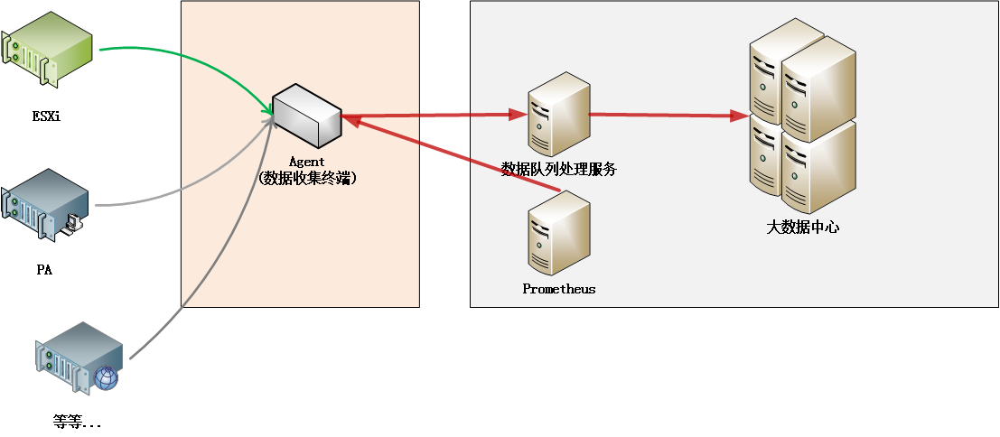
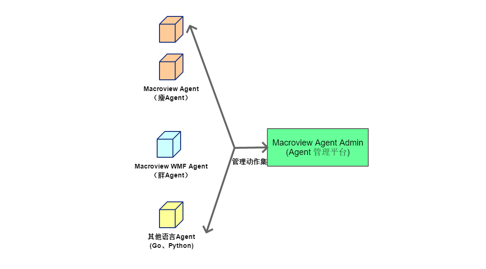
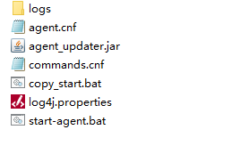

@[toc](目录)

## 0. Macroview Agents 项目 ##

### 0.1 相关文档快速入口 ###

#### 0.1.1 数据缓存使用指南: [入口](./Agent&#32;数据缓存使用指南.md) ####

#### 0.1.2 通讯接口说明文档：[入口](./Agent与管理中心间通讯接口说明文档.md) ####

<br>

## 1. 说明 ##

　　本文档主要用来对 `Macroview Agents 项目` 的内容及相关开发事项，作一般性的说明。

### 1.1 关联 Git 项目 ###
　　
　　本项目在 `Gitea` 上为 `Macroview-Agent-Projects` 项目 

## 2. 项目需求（工作范围） ##

　　本项目属于 `大数据收集、分析与处理平台`中的一部分，这个平台按功能大致分成三大部分：（并非指具体的系统组成）



<br>

### 2.1 数据收（采）集 ### 

#### 2.1.1 采集终端 ####

　　根据需要，从不同的设备中收集所需要的数据，并汇总、上传到`存储与分析`系统。

　　`所谓不同的设备`，是指客户（或系统目标）中存在的，各种类型的，软件系统或硬件设备，例如：

 + **操作系统**（Windows, Linux等）

 + **EXSi/虚拟机平台**

 + **防火墙**

 + **网络监控设备**

 + **等等...**

　　本平台，将提供一些数据收集终端，位置可以是客户指定地方或我们部署到某个位置，以便连接与访问采集对象，并最终将数据汇总到分析平台。

　　收集终端存在形式：

 + **部署到采集对象内的应用**

    例如，部署到 `windows` 内，以收集相关的数据的应用

 + **独立部署的服务器系统（胖终端）**

 + **硬件形式（如机顶盒之类）**

    例如一些`哑`终端（没有界面）

　　为了方便或快速地获取终端，我们也支持不同语言开发的终端应用：

 + **Java 语言**（这是首选）

 + **Go 语言**

#### 2.1.2 采集终端管理 #### 

　　为了确保采集终端正常、顺利工作，我们需要：

 + **知道终端是否存活**

 + **终端当前状态**

 + **终端升级**

　　要支持这些工作，我们需要一个 `管理平台`，以实现上述的功能活动：

 

 <br>

　　采集终端管理平台，应该具有下面功能：

 + **心跳与Ping**

   - **心跳**：终端会定期向管理平台发送`心跳`请求，管理平台通过心跳请求来确定终端是否存活

   - **Ping**：是指管理平台主动向终端发送 `ping` 请求，终端接收请求后会回应管理平台

 + **终端状态报告**

   - **启动报告**：每个终端在启动时，都会向管理平台发送启动报告。

   - **退出报告**：每个终端在退出时，都会向管理平台发送退出报告。

   - **当前配置请求**：管理平台主动向终端发送 `获取当前配置请求`，终端接收请求后会回应

   - **修改配置**：管理平台能够向终端发送配置，改变终端行为

   - **获取日志请求**：管理平台主动向终端发送 `获取日志请求`，终端接收请求后会回应

   - **终端状态统计**：统计与评估终端的工作情况

 + **终端升级**

   - **版本管理**：管理不同终端的不同版本

   - **升级管理**：向终端推送升级版本

     + 能够有选择推送

     + 升级失败及错误后的回滚处理

     + 升级情况报告

### 2.2 数据存储与分析 ### 

　　数据存储与分析（包括显示），可以分成存储与分析两部分，也可以合并成一部分，具体情况视客户与环境需求。目前数据存储与分析方案：

 + **Kafka + ElasticSearch + Grafana**

    `接收数据` + `存储数据` + `显示`

 + **Prometheus + Grafana**

    `收取与存储数据` + `显示`

### 2.3 数据处理

　　数据处理偏向于一些自动化工作，这里暂时还没有

## 3. Macroview Agents 项目组织结构 ##

　　`Macroview Agents`不是一个单一项目，是由一组项目组成，以适应不同的场景与应用需求，下面是项目的组织关联图：

 

　　不同颜色的项目属于不同的类型，越是在上面的项目，越是通用性强（要求），下面从上到下来说明项目的需求与实现目标：

### 3.1 agent-commons 底层公共类库

   **项目名称：`macroview-agent-commons`**

　　这个类型属于 `Agent` 与 `Agent Admin` 共用类库，主要是两者间通讯的共用数据类与工具，主要包括：

 + 两者间请求的数据结构

 + 两者间请求的响应数据结构

 + 辅助与工具类

### 3.2 agent-core 所有形式 Agent 的公共类库

   **项目名称：`macroview-agent-core`**

　　因应不同的需求，我们可以有 `瘦终端`和`胖终端` 两种，这两者应用场合：

 + 简单的数据或单一的功能需求，使用 `瘦终端`

 + 复杂的数据或功能需求，使用 `胖终端`

   - 例如，采集手段多样化（SNMP, Syslog 等等）
   - 复杂的数据过滤与定制化等等

　　不同类型的终端，运行环境与手段不同，所以我们将公共内容抽出成一个基础项目，主要包括：

 + **配置抽象类与接口**

    提供了配置层的接口，具体的配置实现（如存储介质）由下一层处理，这里提供接口，同时为本项目的其他包服务

 + **请求接口层**

     同样为 `Agent` 与 `Agent Admin` 请求通讯定义接口与实现，然后各自终端以自己的方式来关联、映射这些实现，目前的一些实现：（具体见项目）

      - 心跳请求 （向 Agent Admin 发起请求）
      - About 响应（一个简单询问，可以忽略）
      - Ping 响应 （Agent Admin 过来的请求）
      - Exit 响应 （Agent Admin 过来的请求）
      - UpdateExit 响应（Agent Updater 过来的请求）
      - .... 后续会不断添加

 + **通用任务管理**

     无论何种数据采集，很多时间会用到定时任务（或线程），这里提供一个通用的任务管理，方便下一层使用。

 + **插件管理层** 

     提供 `插件`接口与管理机制

 + **终端启动流程模板类**

     为终端启动定义的一个基础模板类

　　无论是何种形式的（用 java ）编写的终端，需要依赖本项目。

### 3.3 agent-httpserver 瘦终端的 HTTP 服务器

   **项目名称：`macroview-agent-httpserver`**

　　`瘦终端`本身就定义为一个功能简单，小巧干净的应用。应用对外只提供简单的 `Http` 请求响应功能，因此不需要高性能，高要求的 `HTTP Server`。（Tomcat，Jetty 之类，是青龙刀）

　　本项目，是对 `JDK`（一定是 JDK 或 ServerJRE，不能是普通 JRE）中内置的 `HTTP Server`的一个封装处理。自从 JDK6 以来，本身就带有一个简单，易用的 `HTTP Server`，本项目的主要封装：

 + 提供简便的启动与使用

 + 对请求响应进行抽象，实现了 `macroview-agent-core` （上一层）所定义的请求抽象层，方便 `瘦终端`使用

### 3.4 WMF Agent 胖终端示例项目

　　`WMF Agent`并非一个应用项目，而是为基于 `MWF`（运行在 Tomcat 等）的 `胖终端`，提供一个整合到本体系的一个示例，示例项目：

   **项目名称：`macroview-agent-examples/macroview-agent-mwf-example`**

　　示例项目，主要是实现了 `macroview-agent-core` （上一层）所需要的接口，这些实现可以直接拷贝或参考使用。（内容不复杂，也不多）

### 3.5 agent-main 基础类库（瘦终端与Updater 公共类库）

   **项目名称：`macroview-agent-main`**

　　`Agent Updater`是一个专门用来 `升级` `Agent` 的 `瘦终端`。这种特殊的瘦终端，与数据采集类型的瘦终端不一样，本类就是公共内容的一个集合，主要：

 + 具体的配置管理。（瘦终端的配置存储介质以文本文件为主，配置都会放到一个配置文件当中）

    以 `win ini`文件格式来存储配置，本类库提供了从配置文件中加载（映射成配置类）和写入文件的功能

 + 操作系统命令行操作工具。（执行一些操作系统命令）

### 3.6 agent-api 基础类库（瘦终端与插件的公共类库）

   **项目名称：`macroview-agent-api`**
　　
　　为了终端的灵活性，我们引入插件的概念，终端应用的主体提供运行基础（与环境），而具体的数据采集部分（模块）或发送部分（模块），可以单独作为插件存在。

　　这样，我们就可以根据需要，组合使用数据采集与发送。`macroview-agent-api`将终端应用的主体进行抽象，形成可以供插件使用的层（即插件只需要与 `macroview-agent-api`打交道）

 + 数据接收与发送任务

 + 数据队列

#### 3.6.1 macroview-agent-plugins 这是插件的项目集，编写的插件可以作为子项目放在这里

　　通常，插件项目的命名规则建议为：`macorivew-agent-plugins-<名称>` 或 `agent-plugins-<名称>`

 + **macroview-agent-plugins-demo**

　　这是一个插件开发示例，包含了最基础的插件实现（如实现插件接口，添加请求处理映射等）

 + **macroview-agent-plugins-windows** Windows 数据采集插件

　　这是一个可用于生产环境的，`Windows`操作系统数据采集插件，目前能够采集的 `windows`数据如下：

     - computer system （系统名称等）
     - cpu 数据
     - network 网络数据
     - memory 内存使用数据
     - logical_disk 磁盘使用情况
     - process 每个进程的信息
     - 。。。后续有需要会更多（如 AD, .net 等）

### 3.7 agent 瘦终端主体程序

   **项目名称：`macroview-agent`**

　　这是`瘦终端`的主体程序，实现了瘦终端所需要的主体功能（包括整合了上层功能），但不包括具体的数据采集与发送工作（这由插件来完成），主要：

 + 应用启动入口（main 方法）：com.macroview.agent.AgentApplication
   
    - 加载配置 
    - 加载与初始化插件
    - 启动 HTTP Server
    - 完成任务的挂接与启动

### 3.8 agent updater 终端升级程序
 
   **项目名称：`macroview-agent-updater`**

　　任何程序是无法完整升级自己的，需要额外的第三方来进行，对于终端而言，这个第三方就是 `Agent Updater`。

　　`Agent Updater`通过与 `Agent`、`Agent Admin`交互来实现升级流程。

### 3.9 agent admin 管理平台功能类库

   **项目名称：`macroview-agent-admin`**

　　本项目实现了 `Agent`管理平台的所有功能代码（但不包括界面部分），为本管理平台，又或者第三方需要整合管理平台的系统，提供功能支持。

　　无论是本项目提供的管理平台，还是第三方想整合管理平台，需要依赖本项目即可

### 3.10 agent admin web 管理平台界面

   **项目名称：`macroview-agent-admin-web`**

　　这是管理平台的界面部分，如果不需要就不用依赖本库。

### 3.11 agent admin main 管理平台启动项目

   **项目名称：`macroview-agent-admin-main`**

　　这是本项目的管理平台主体（整合 macroview-agent-admin 与 macroview-agent-admin-web），可以部署到 Tomcat 中运行。

### 3.12 agent mavens 终端集中打包项目

   **项目名称：`macroview-agent-mavens`**

　　可以根据需要编写打包流程（pom 文件），最终打包成一个可部署应用。
 
 + 打包成一个 zip 文件

 + 打包成一个 windows service 应用（作为服务运行在 windows 操作系统中） 

　　每位开发人员都可以在这个项目中编写与存放打包流程，目前项目已有的打包流程为：

 + Agent Updater 的打包

   - agent-updater-pom.xml 文件
   - agent-updater.bat 打包批命令
 
 + Agent for windows 采集终端打包 -- 打包成 windows service 的应用例子

   - build-win-plugin-pom.xml
   - build-win-plugin.bat 打包批命令

 + Agent for demo 终端打包 --  Agent 主体 + Demo Plugin 的示例

   - Agent 主体连同所需要的插件打包示例
   - test-demo-plugins-pom.xml
   - test-demo-plugins.bat

 + profiles 目录存放打包不同应用时，所需要的打包配置或配置文件

## 4. 项目内容 ##

### 4.1 agent 瘦终端主体程序 ###

   **项目名称：`macroview-agent`**

   **主程序：`com.macroview.agent.AgentApplication`**

#### 4.1.1 Agent 的主体结构 ####


#### 4.1.2 插件或部件间通讯

　　由于项目引入 `macroview-container`类库，所以我们可以使用类库的事件发布与侦听机制，插件间或部件间以事件的形式成行通讯。

#### 4.1.3 Agent 的部署结构 ####

 + **打包**

    　　在项目组中 `macroview-agent-mavens` 项目，就是用来构建项目部署（打包）的项目，目前项目中已经编写好三种类型的 `Agent` 项目的打包：

    - `一般带插件 Agent`（可以运行在 windows 或 linux OS 上）

    - `Agent Updater`（可以运行在 windows 或 linux OS 上）

    - `Agent with windows plugin for windows service` （以 windows 服务形式，运行在 windows 操作系统上）

    　　对于上述的打包类型，分别的示例：

    - pom: `test-demo-plugins-pom.xml`，bat: `test-demo-plugins.bat`

    - pom: `agent-updater-pom.xml`，bat: `agent-updater.bat`

    - pom: `build-win-plugin-pom.xml`，bat: `build-win-plugin.bat`

 + **Agent 的目录结构**

    

   - bin：这是 Agent 的主体目录，包括了可执行内容及资源文件

   - update：这是 Agent 的版本更新目录，在更新时自动生成

 <br>

 + **Agent bin 目录内容**(这是 Agent 的执行主体)

    

    - doc_agent.jar ：这是 Java 可执行打包文件，已经打包了所有 Java 执行内容
    - agent.cnf ：这是配置文件
    - log4j.properties：log4j 配置文件
    - start.bat ：这是 windows 批命令，用于启动 agent
    - update.cnf：这是由 Agent 在升级过程中生成文件，不需要我们干预

 + **Agent-Updater 的部署结构**

    

    - agent_updater.jar：可执行 jar 包

    - agent.cnf：这是配置文件

    - commands.cnf：这是用来更新、启动 `Agent`的命令文件

    - copy_start.bat：这是更新时，文件拷贝与启动的批命令

    - log4j.properties：这是 log4j 配置文件

    - start-agent.bat：这是单纯的，用来启动 `Agent`的批命令

 + **能以 windows service 部署与启动的 Agent 结构**
 
    

    - readme.txt：这是一个安装与使用文件，在部署之前可以先看看这个文件

    - install.bat：用来将应用安装成 `windows service`

    - uninstall.bat：这是用来卸载 `windows service`

    **注意**：目前未测试过，使用作为 `Service`的 `Agent`和`Agent Updater` 进行启动，升级更新等操作（预估失败可能性较高，这需要后期进行改进）

#### 4.1.4 Windows ini 文件配置结构说明 ####

　　`WinIni`文件格式最初由 `Microsoft Windows` 引入，并作为标准的配置文件格式。其通常由 `section`(段或组)和 `item`（配置项)两种结构组成：

 + `section` 的表达格式为 `[section_name]`，通常表示一组相关的配置，用于分组与归类。
  
 + `item` 的表达格式通常为 `item_name=item_value`（即由名称、赋值号和值）组成，表示一个具体的配置项。

　　下面是一个配置示例：([agent]、[httpServer]即为 `section`，agentId 等为配置项)

```ini
[agent]
agentId=xxx-xxx-xxx-xxx
agentName=172.22.125.72
agentIp=172.22.125.72

#安装路径
install=""

#心跳
heartbeat=5

[httpServer]
port=8060
```

　　本系统将使用 `ini4j` 这个用于读取 `winini` 格式的 `java` 类库。 

#### 4.1.5 Windows ini 文件配置类说明 ####

　　所有配置并非放在一个 `大类` 当中，而是通过 `section` 来映射到不同的配置类，下面作具体的说明。

 + 每个 `section` 对应一个配置类

     `section`与配置类的映射方法有两种：

     - 通过实现接口 `AgentConfigType` 为管理器提供映射名称（即指定 section 名称），可以映射到多个 `section`
     - 不实现接口，而是使用类名作为 `section`名称（在这种情况下，一个 section 通常只会对应一个配置类）。

 + 配置项为配置类中的字段（属性）

 + 配置文件名称：`agent.cnf`
 
 + 配置文件位置：`classpath:/` （即 class 的根目录）

 + `AgentConfigType` 接口用来指示类对应的 `section`

```java
   public interface AgentConfigType {

      /**
       * 返回一组 section 名称，配置类可以映射到多个 section
       */
      public List<String> sectionNames();
   }
```

 + `AgentConfigManager` 为配置管理类，对外提供配置文件的读取与存储功能

   - `loadConfig(String fileName)`：加载所有配置

   - `saveConfig()`：保存由 `loadConfig(...)`加载的配置到文件

   - `saveConfig(Object)`：保存配置类到 `loadConfig(...)` 加载的配置文件（注意，如果配置文件当中没有对应的配置项，则将忽略而不作处理）

   - `getConfig(section, configClass)`：用 section 中的配置来创建和初始化配置类 configClass

   - `getConfig(configObject)`：用配置来填充配置对象。此对象所属类必须符合配置类所要求的规范。

   - `T getConfig(Class<T>)`：创建配置，T 必须实现 `AgentConfigType` 接口


### 第三方整合管理平台功能 ###

　　虽然本系统提供了一个较为完整的 `Agent` 管理平台，不过为了方便将这些功能，整合到第三方的管理平台中，项目也提供了方便的方法。

　　下面就以第三方的 `MWF Web 应用`来例，介绍如何整合 `Agent`的管理功能：

#### 添加 Maven 依赖 ####

　　首先就是在应用中添加下面的两个依赖：

```xml
	<dependency>
		<groupId>com.macroview.agent</groupId>
		<artifactId>macroview-agent-admin</artifactId>
		<version>1.0.0</version>
	</dependency>

	<dependency>
		<groupId>com.macroview.agent</groupId>
		<artifactId>macroview-agent-admin-web</artifactId>
		<type>war</type>
		<version>1.0.0</version>
	</dependency>
```

　　第一个依赖，是代码（服务器端）实现，这也是一个使用 `MWF` 框架来完成工作的库。

　　第二个依赖，是前端显示（JSP），如果有不同的前端显示要求，可以参考这个项目来自己创建一个（此时，也可以不依赖这个 war 文件）

#### 添加初始化支持 ####

　　在系统启动时，对于 `WMF Web 应用`而言，通常会侦听 `ServletInitEvent` 事件来进行初始化，其中比较常见的是系统初始化类：`SystemModuleInitAndDestroy`

　　下面的示例，就是在 `SystemModuleInitAndDestroy` 的初始化方法中添加初始化支持：

```java
	/**
	 * 初始化
	 *
	 * @param event
	 */
	@Observes
	public void moduleInit(ServletInitEvent event){
		System.out.println("....模块初始化...");
		
		GlobalConfig.setOpenDirectToJsp(true); //直接加载 jsp
		GlobalConfig.setRemoveSuffix(false);
		
		//1. 自定义 Application/json 请求的转换（替换默认），针对特殊的对象进行的转换
		WebResolveArgumentFactory.updateResolveArgumentObject(
									WebResolveArgumentType.JSON, new VdiJsonResolveArgument());
		
		//2. 初始化任务管理器 （如果已经有，可以不添加此行）
		AppWorkerManager.initAppWorkerPool("Agent-Admin-%d");
		
		//3. 提交一个检查 Agent 心跳的任务
		AppWorkerManager.submitWorker(new CheckAgentInfoTask());
	}	
```

#### 数据库中导入结构与数据 ####

　　请参考数据库文件：./resources/database.sql (也可以在`macroview-agent-admin/doc/sql/database.sql` 中找到)

　　添加的数据项包括两大类：

 + **平台数据表**

 　　这些数据表，可以参考上面的文件手工添加，也可以在运行系统时，由系统自动创建。

 + **Sysconfig 配置**

　　包括了一些配置，建议参考文件手工添加

 + **uiproperties 表菜单项**

　　包含了功能的菜单项，参考上面的文件手工添加

#### 完成 ####

　　通过上面的整合后，可以运行系统测试


