## x0. 说明 ##

　　本文档用来描述 `macroview-agents` 项目的发展蓝图

 + 2020 年，以月为周期单位，都会推出至少一个里程碑版本

    - 2020-03 的版本是：2020.03a

## x1. 1.0 版本内容 ##

### x1.1 现行架构 ###

 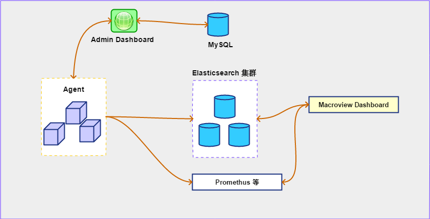

### x1.2 Agents Framework 1.0 数据采集终端 ###

#### x1.2.1 内部架构 ####

 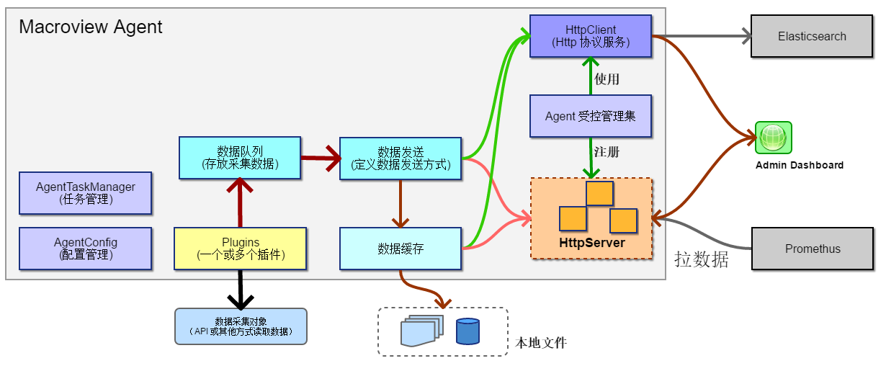

#### x1.2.2 Agent 的工作流程 ####

 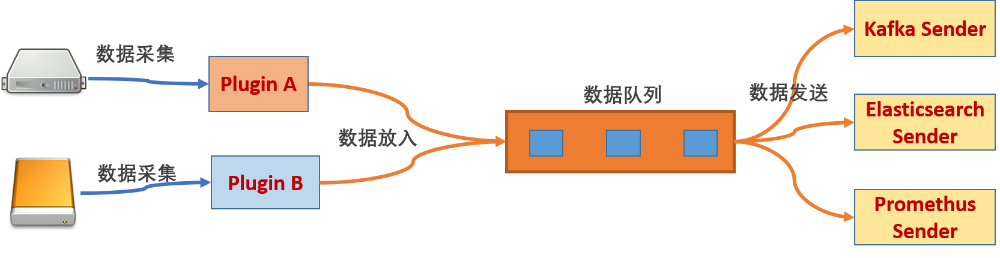 

 + Plugin 负责具体数据采集，并放入队列

 + Sender 负责从队列取数据发送

#### x1.2.3 Agent 与微服务 ####

 + `Agent` 是一个微型服务（理念）

    - 注册到 Admin Dashboard （服务管理）
    - 发送心跳到 Admin Dashboard
    - Http/Https 协议通讯
    - 数据格式为 JSON
    - 接收 Admin Dashboard 操作指令
    - 配置管理
    - 版本与升级

 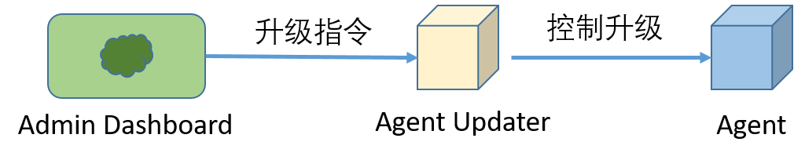

#### x1.2.4 Agent 插件 ####

 + Agent 以Plugin形式来提供灵活功能

    - 一个 Agent 可以有一个或多个插件

 + 目前已经实现的 Agent Plugin

    - Checkpoint
    - ESXi
    - FortiGate
    - Meraki
    - PA
    - UCCX
    - WLC
    - Windows
    - …

 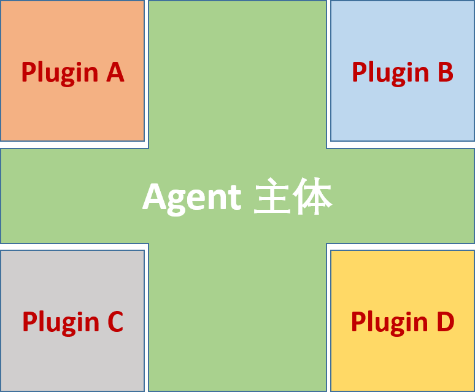

#### x1.2.5 Agent 的数据采集 ####

 + 采集特定数据

    - 对采集对象进行定制配置
    - 对采集数据提供有限的处理
    - 提供临时的数据缓存

 + 数据上传服务

    - 将数据上传到 Kafka
    - 将数据上传到 Elasticsearch
    - 将数据上传到 Promethus

 + 支持多种数据接收端

    

#### x1.2.6 Agent 数据缓存 ####

　　将数据缓存到本地。

 + 临时存储到本地（离线存储）

 + 支持多种存储介质

    - JSON 格式存储到文件
    - Sqlite 本地数据库存储
    - H2Database 本地数据库存储

 + 支持多种条件触发上传
    - 固定间隔
    - 每天某个时间点（如凌晨 1 点）
    - 管理中心通知上传
    - 连通某个地址（或网址）上传

 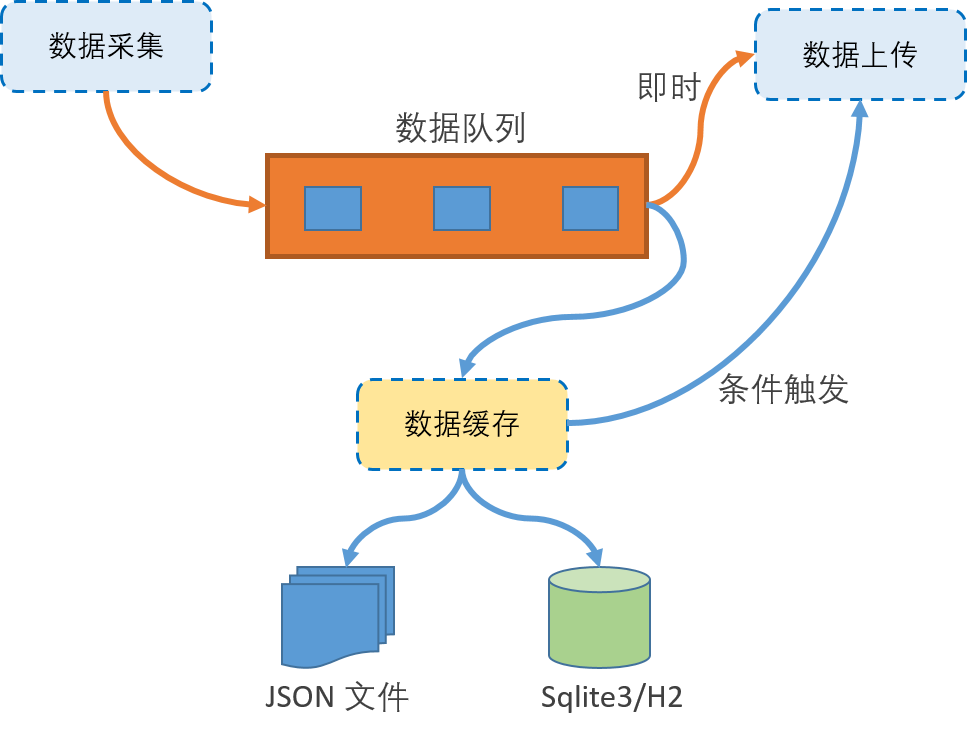

### x1.3 Agents Framework 1.0 项目开发组织结构 ###

　　`Agents` 的开发组织结构：

 + 基础模块项目

 + 第三方类库

 + 瘦 Agent/ 胖 Agent

 + Other Lang
    - Go
    - Python
    - …

 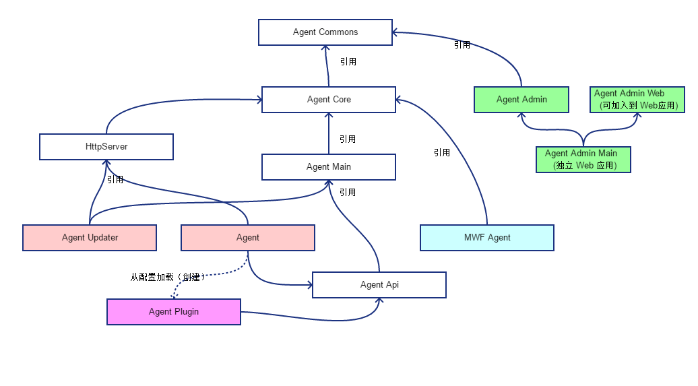

#### x1.3.1 项目分层结构 ####

　　为了方便开发与定制，整个项目的子项目结构情况如下：

 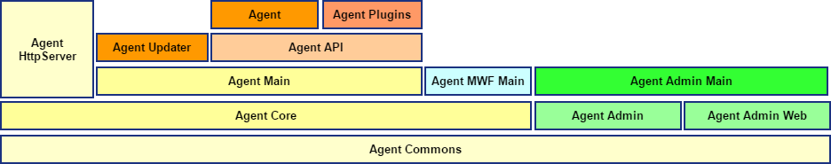

 + **Agent HttpServer** 为 Agent 提供 HTTPServer 及相关接口实现

 + **Agent MWF Main** 为 Agent 提供 Tomcat 等及相关接口实现（胖 Agent）

 + **Agent Updater** 这是 Agent 伴生应用，用于 Agent 的更新、重启等

 + **Agent Admin** 提供 Agent 管理功能

 + **Agent Admin Main** 是独立完整的 Agent 管理中心

### x1.4 Admin Dashboard 1.0 ###

 + 基于 `Servlet Web System`

 + `Agent` 信息管理，包括
    - ID/Name/IP
    - Plugins
    - Metric
        + CPU
        + Memory
        + …
    - Runtime
        + Start/Stop

 

 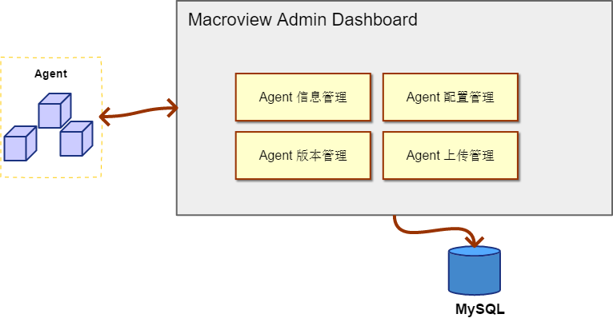

#### x1.4.1 Agent Manager ####

 + 管理界面：

    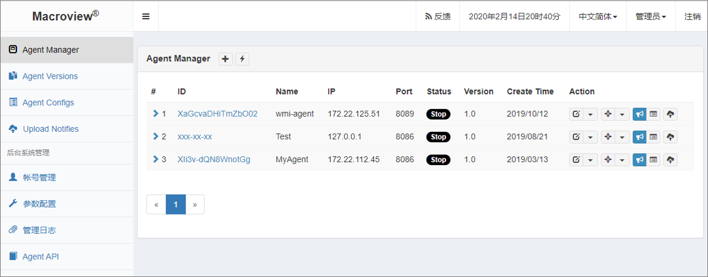

 + `Agent` 信息界面

    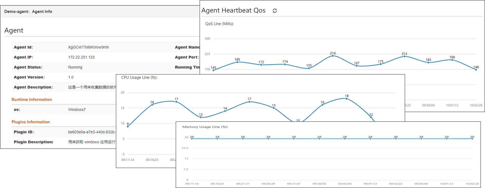

#### x1.4.2 Agent 版本管理 ####

 + 定义多个版本

 + 每个版本可以对应多个 Agent

 + 推送升级消息给 Agent 的伴生应用 Updater

    - Agent Updater 控制 Agent 的升级
    - Agent Updater 停止或重启 Agent
 
 + 每个升级的状态
 
 + 回滚

 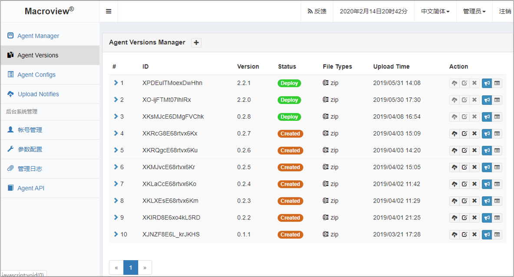

#### x1.4.3 Agent 配置管理 ####

 + 定义多个配置集

 + 获取 Agent 当前运行配置

 + 编辑配置并推送配置
    - 将某个配置推送到一个或多个 Agent

 + 配置应用(Apply) 状态

 + 回滚

 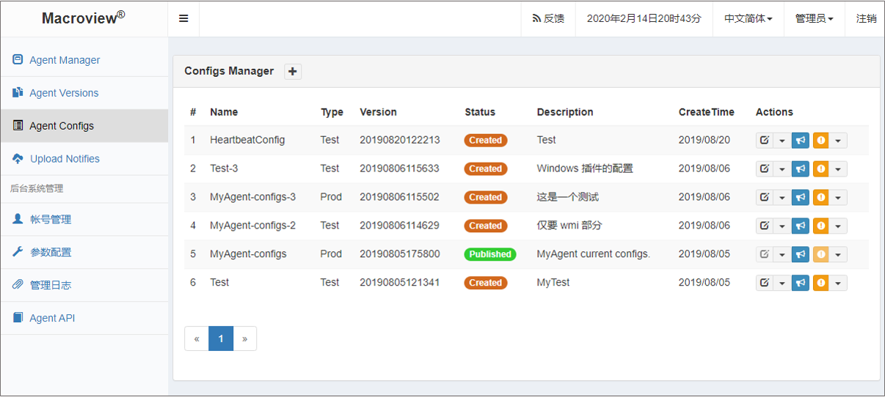

## x2. 后续版本架构 ###

### x2.1 进化方向 ###

 + 云端
 
 + 微服务化

 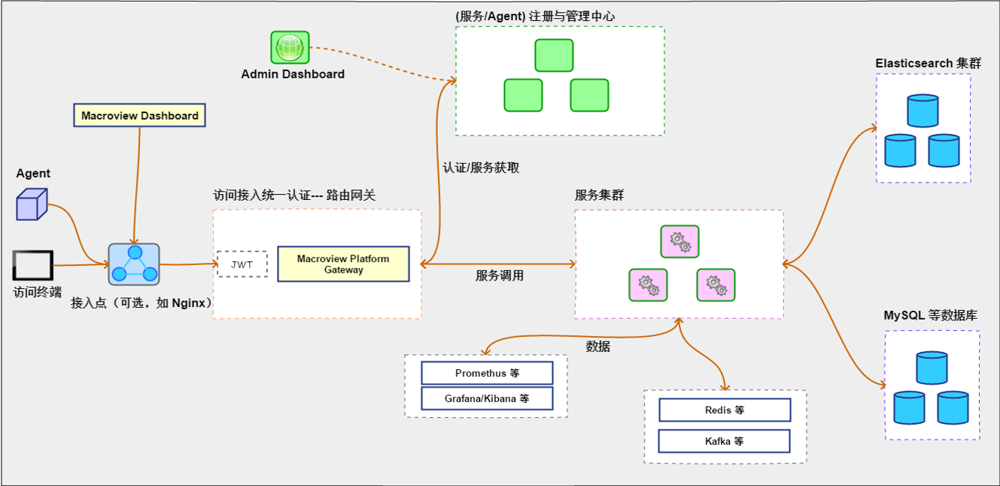

### x2.2 Macroview Platform Gateway ###

　　统一路由网关。

 + 为所有访问提供一个单一入口
 + 服务路由
 + 认证与授权（通过认证与授权服务提供）
 + 流量管控
 + 缓存
 + 熔断
 + 灰度发布
 + 日志
 + …

### x2.3 Macroview Agent & Service Manager ###

 + 多租户、多层次管理
    - Organization – Team – User
        + Org – 公司、组织等
        + Team  -- 部门、团队等
        + User – 使用者、应用等

    - Agent 注册与管理
        + Agent 注册与管理
        + Agent 版本管理
        + Agent 配置管理
        + Agent 监控
        + …

    - Service 注册与管理
        + 服务注册与发现

 + Agent & Service
    - 实现更多的针对性 PlugIn

    - 更多定制性配置
        + 动态指定上传对象
        + 数据的选择或简单过滤处理等

    - 对 Agent 有更多的了解与监控
        + 上传的信息统计（如上传数量或批次统计，上传质量等）
        + 有限的针对性操作
            - OS Command
            - 为告警而提供的特定 Command
            - …

### x2.4 Macroview Admin Dashboard Platform ###

　　统一 UI 平台

 + 前端分离

 + UI 部件化
    - UI 上的部件可配置与定制
    - 提供注册机制，部件将注册到平台
    - 带 UI 的 Agent 或 Service，能方便注册到 Platform

 + 针对不同 User 与角色定义
    - 定义服务
    - 定义 UI 布局内容

### x2.5 服务集群 ###

 + 功能与控制集群
 + 数据分析服务
 + 数据处理服务

### x2.6 DevOps 与应用管理 ###

 + K8s 多集群管理系统

 + 统一管理多个 K8S 集群

 + Rancher ? 或其他

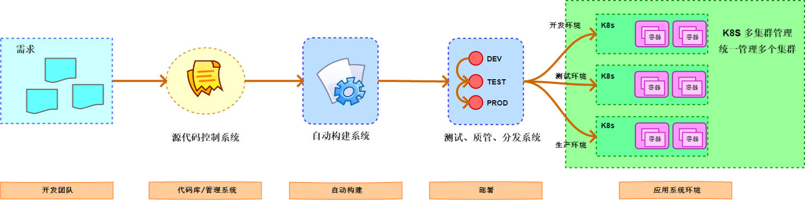

## 问题与讨论 ##
