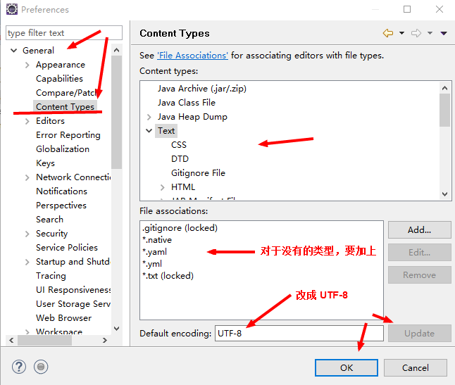
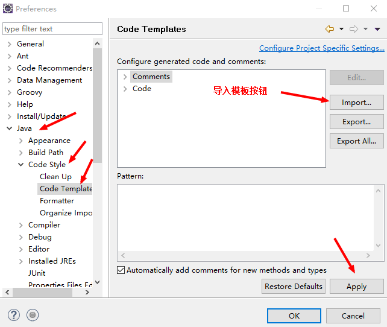
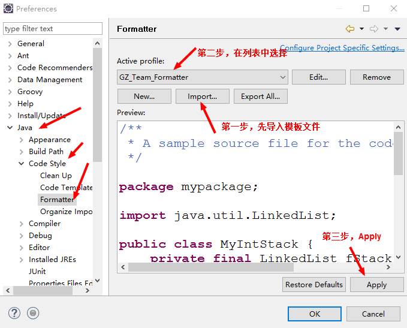
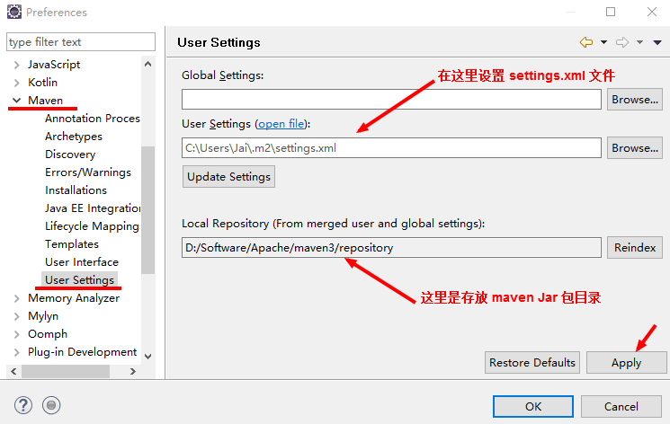
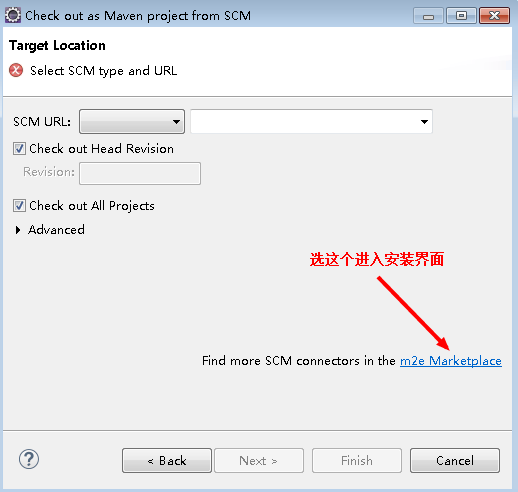
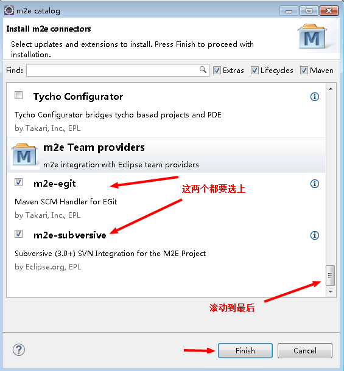
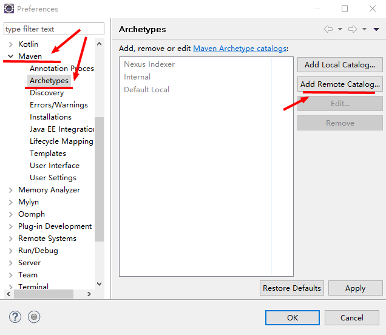
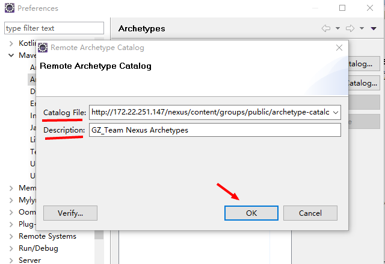
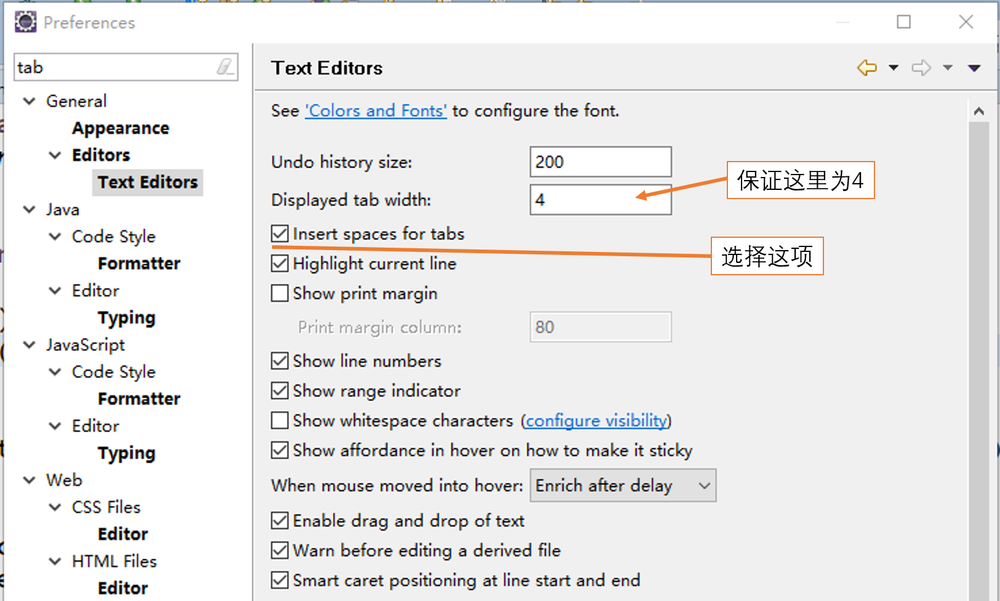

@[toc](目录)

### 1. 文档摘要

　　说明使用 `Eclipse` 做开发 IDE 时，要进行的一些必要配置。

### 2. 文档编码

　　所有项目中，文本文件的编码一律使用 **`UTF-8`**，包括：

    java、txt、jsp、md、yaml、json 等等

　　文档编码在 `Eclipse` 中的修改位置如下：

    Window >> Preferences >> General >> Content Types

　　如下图所示：选择对话框中的所有 **Content Types`** 然后修改为 `UTF-8`

  

　　要注意，就是在类型树上，选择每一项（展开树），然后将非 `UTF-8` 的类型改成 `UTF-8`  

### 3. 代码风格与格式

　　在团队开发的所有项目当中，我们都要求使用要同的风格与格式，例如注释等。并且已经将这些风格与格式做成了模板，需要在`Eclise`中导入这些模板。

　　下面是这些模板的导入方法：
  
#### 3.1 代码模板

　　代码风格模板文件在当前目录 `files` 当中：**Code_Templates_2012.xml**，将其下载到本地（或者打开粘贴成文件）。然后，在 `Eclipse`当中进行如下操作：

    Window >> Preferences >> Java >> Code Style >> Code Templates

　　如下图所示：
  
  
  
　　在上述对话框中导入上述的模板文件，然后点击“Apply” 即可。

#### 3.2 代码格式

　　代码风格模板文件在当前目录 `files` 当中：**Code_Format_2012.xml**，将其下载到本地（或者打开粘贴成文件）。然后，在 `Eclipse`当中进行如下操作：

    Window >> Preferences >> Java >> Code Style >> Formatter

　　如下图所示：
  
  
  
　　在上述对话框中导入上述的模板文件，然后点击“Apply” 即可。

### 4. Maven 设置

　　使用 `Maven` 管理我们的项目，已经是常态，所以要在 `Eclipse` 中做开发，就必须首先设置好 `Maven`环境。

　　使用下面的步骤配置好 `Eclipse` 中的 `Maven` 环境：

 + 首先要创建一个 `Maven` 目录（如果不创建，将默认在 OS 的 登录用户目录下的`.m2` 中）
 
   - 如果这个目录还没有，可以手工创建。（先进入 console 窗口，然后用命令 `md .m2` 来创建）
   
   - 如果是自己创建的目录（不是 `.m2`)，还需要在这个目录下创建名为 `repository` 目录，用来存放 jar 文件

 + 将 `files` 目录中的文件 `settings.xml` 拷贝到上面已经创建好的目录
 
   - 打开 `settings.xml` 文件，修改其中的 `<localRepository>` 设置，指向你上面创建的 `repository`
 
 + 用下述方法在 `Eclipse` 中配置 `Maven`

    Window >> Preferences >> Maven >> User Settings

    

　　要注意其中的 `repository` 目录，这里将存放 `Maven`下载管理的 jar 包。

### 5. SVN/Git M2e Connecters 的安装

　　在 `Eclipse`中使用 `Maven`时，由于项目来源于`SVN/Git`，所以还需要安装一些整合组件，才能更加顺利地使用。（这些内容并不自带）

　　下面步骤说明其安装步骤（两者可以同时安装）：

 + 选择： File >> New >> Project 进入 `New Project` 对话框
 
 + 在对话框的目录树中，找到 Maven 选择 `Check out Maven Projects from SCM` 进入对话框，如下图所述

 

 + 选择 `m2e Marketplace` 进入对话框，滚动到最后，选择 git, svn 的 m2e providers

 

　　选择后，点“Finish” 按钮进行安装，安装完成之后，我们就可以用 `Maven` 来方便处理从 SVN 或 Git 服务器上 Check out 的项目了

### 6. 添加 Nexus Server ArchType Catalog

　　我们开发组本身有一个私有的 Maven Repository Server，就是 `172.22.251.147`(Nexus Server)。开发组的一些公用类库等，都会放在这个服务器上。同样，也会开发一些 `Maven ArchType Plugin`，即Maven 项目骨架，并放到服务器上。当我们需要这些插件时，就需要将相关的路径添加到 Eclise 当中，下面是添加步骤：

 + 选择：Window >> Preferences >> Maven >> Archetypes

  

 + 在对话框中选择 `Add Remote Catalog...` 按钮，并输入下面内容：

    - Catalog File: http://172.22.251.147/nexus/content/groups/public/archetype-catalog.xml

    - Description: GZ_Team Nexus Archetypes

 

 + 按 `OK` 按钮之后，就可以使用我们的 `Maven Archetypes`

### 7. 使用空格代替 Tab

　　在输入过程中，我们要求尽量使用空格，而不是 `Tab`。不过，单击 `Tab`往往会比输入若干个空格方便，所以一些编辑器会提供按一下`Tab`，相当于输入几个空格的配置。

　　通常，我们都会约定按一下`Tab`，等同输入4个空格键。在 `Eclipse`中，就提供了这样的配置，下面是配置的方法：

 + 选择：Window >> Preferences

 + 在对话框顶部的 `type filter text`中直接输入 `Tab` （只显示与 Tab 有关的内容）

 + 然后对照下图（对应的路径与配置项）进行配置：

  

 

