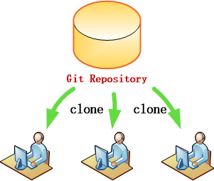
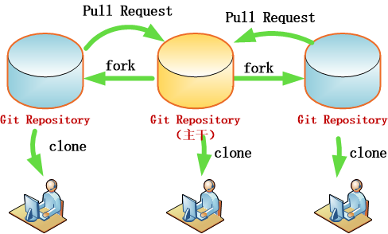
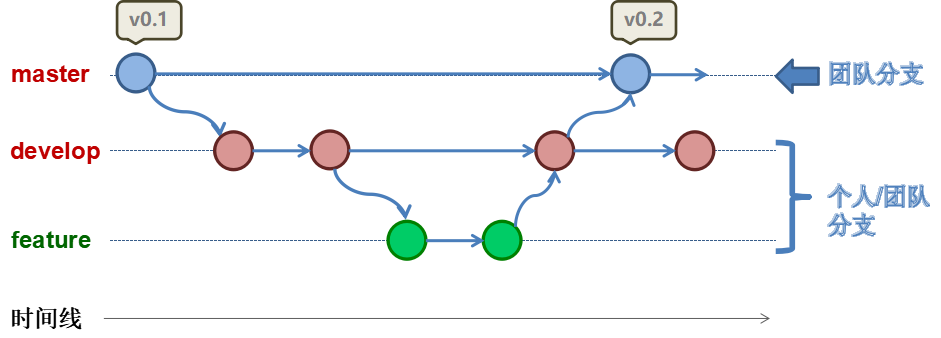
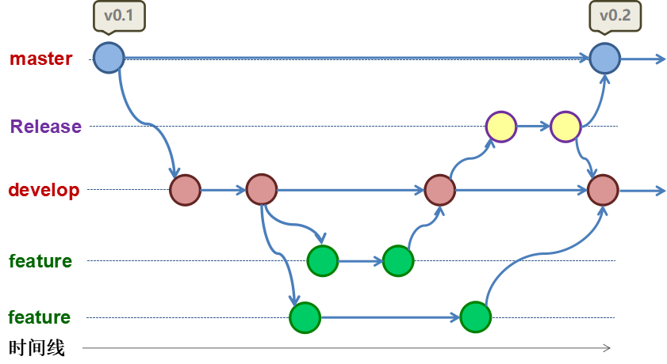
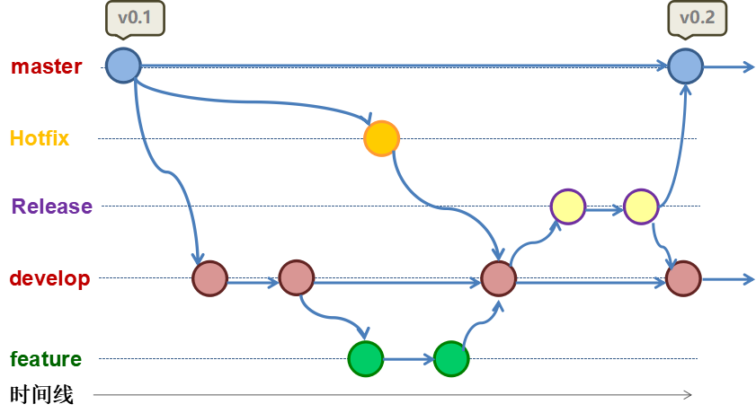
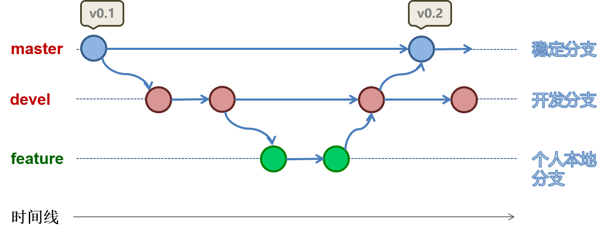

@[toc](目录)

## 1. Git 常用工作模式

　　`Git` 由于其分布性、灵活性，可以带来非常多的使用模式，下面因我们开发团队的特性，总结性地给出其中三种。

### 1.1 克隆模式（Clone）

 + Clone 模式就是团队成员，都通过克隆远程服务器项目进行开发。

 

 + 成员各自

    - 提交代码到服务器

    - 合并各成员代码

    - 处理合并冲突

 + 特点与不足

    - 不需要专职的项目管理人员（或者说，在项目管理上不需要太多花费）

    - 不足就是对于复杂项目，或参与人员比较多的项目，容易造成混乱。

### 1.2 Fork/Pull Request 模式

 

 + 项目有专职管理员（通常是项目拥有者）

 + 参与者使用 Fork （派生）方式来创建属于自己的独立项目

    由于派生项目是独立于主干的项目，所以参与者可以自由地在派生项目上进行开发。

 + 需要提交时，将变更以 Pull Request 方式提交合并

 + 项目管理中通过充分沟通认可，将代码合并到主干项目（冲突等处理，也由管理员进行）

### 1.3 混合模式

　　混合模式就是将上述两种模式混合使用，通常有两种混合方式：

 + 方式一：

    - 核心参与者使用 `Clone 模式` 来工作

    - 非核心（甚至外部贡献者）使用 `Fork/Pull Request 模式` 

 + 方式二：

    - 使用 Clone 模式作为核心模式

    - 对于功能分支（特别是不特定性）使用 Fork/Pull Request 模式

## 2. 团队 Git 工作模式使用指南

　　对于上述模式，下面给出开发团队参考指南（以项目分类为导向）

### 2.1 客户项目

　　对于客户类型的项目，可以使用下面三种模式，而以第一种为优先选用：

 + **Clone 模式**

 + Fork/Request 模式

 + 混合模式

### 2.2 团队开发库项目

　　而对于团队开发项目所使用的类库项目，将独立出来作为一个单独分类，并使用下述模式进行协同开发：

 + **Fork/Request 模式**

 + 注意使用 maven 打包时，只能使用 mvn install 来打包。（即避免放上 maven 服务器，替换生产用 jar 包）

## 3. Git 开发流程指南

　　源代码的版本、分支管理，是开发过程中的一个关注点。随着项目的进展，不可避免地出现一些分支或冲突。为了能够更好地管理这些分支与冲突，遵循一个约束并可管理的规范是必要，同时也是一种需要。

　　下面同样以开发组特点为例，定义一个开发流程规范，作为项目开发过程的参考。并建议在遵循的基础上灵活使用。

### 3.1 基本演进流程

　　由于 `Git` 允许本地分支的存在，所以开发流程能明确分清团队流程与个人流程。下面所述的流程虽然重点在`项目团队流程`上，但也可以为个人流程提供参考。

　　下面是流程图示：

 

　　图中：

 + `master` 是整个项目的主干，是项目中最经受过测试和认可的代码（文件），并且也是项目最终交付与部署的内容。这个分支必定是团队分支，必定会存在服务器上。

 + `develop` 是开发分支，所有成员在通过自己的本地测试后，向服务器提交的代码，在代码再通过整合测试后，最终合并到 `master` 分支。这个分支可以因应项目的大小和参与人员，决定存在于团体（即服务器上），还是在于个人（本地）。

 + `feature` 是功能分支。功能分支是团队或个人，为某个（些）特定功能的研发讨论而建立的分支：

     - 功能分支可以有一个或多个

     - 创建场景通常如下：如果团队或个人对项目的某个功能，在实现上存在分歧或模糊不清或尝试找到更好的实现方法等，为了避免对 `develop`（开发主线）产生干扰而创建的分支。

     - 分支结果被认可后，会合并到 `develop` 分支

     - 无论分支内容认不认可，都可以被放弃或删除

### 3.2 基本流程的衍化

　　有了上述的基础流程之后，我们可以因应项目情况进行变化，下面例出一些变化示例：

 + 添加 `release` 分支，专用于系统整合测试。（对于复杂较多模块的项目）

 

 + 添加 `hotfix` 分支，用于项目已经有多个实际运行版本。

 

## 4. 我们团队开发流程指南

　　基于上面的知识，我们开发团队的基准流程定义如下：

 

 

　　在基准流程中，我们将分支分成两大类：

 + 服务器端分支：即提交并存在在服务器上的分支

   - **`master`** 分支：通过了整合测试，代码稳定并达到能够部署到生产环境的要求的代码分支

   - **`devel`** 分支：开发分支，通过了编译（或单元测试），代码能够打包部署到测试环境中测试的代码分支

   - **`版本`** 分支：实现版本需求，并通过了测试和部署都生产环境中运行。版本分支中的功能已经固定，通常的修改或变更在于 `Bug Fix` 。（这种分支，有时跟 `Release`分支表达同样的含义）

 + 本地分支：只存在本地（个人），不提交上服务器的支分。本地分支通常是开发者，根据需要来创建和命名分支。

　　在实际的项目开发当中，为了测试或配置方便，也可以将 `master` 分支的要求有所减低，即将 `master`与`devel`两个分支合并在一起，但有个前提就是：保证代码能够部署到运行环境（如测试环境）中运行，不允许提交有明显错误（如编译错误）的代码到分支。

