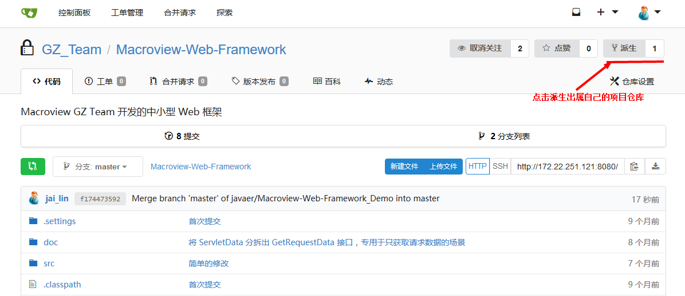
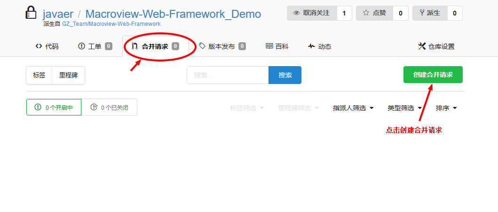
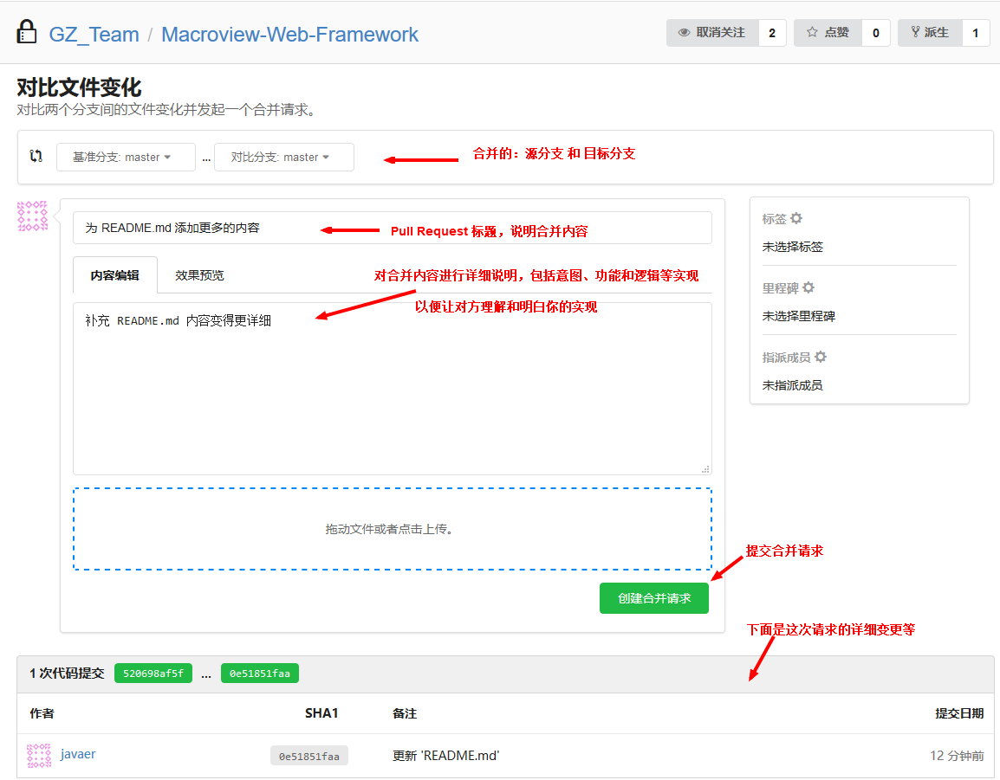
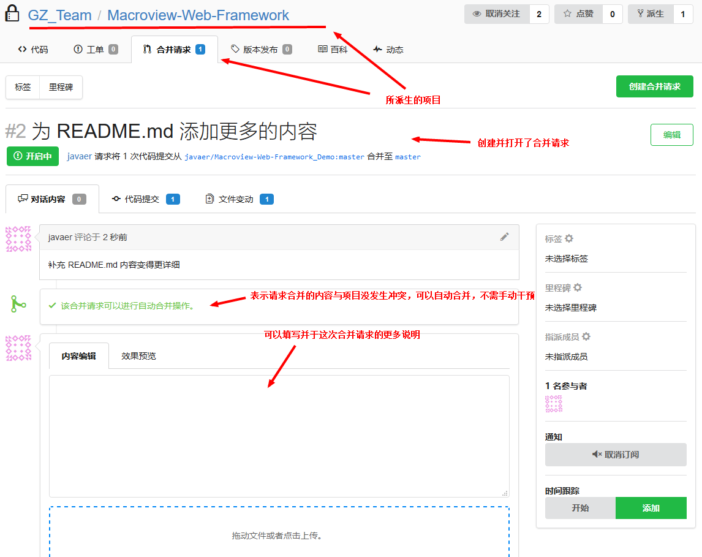
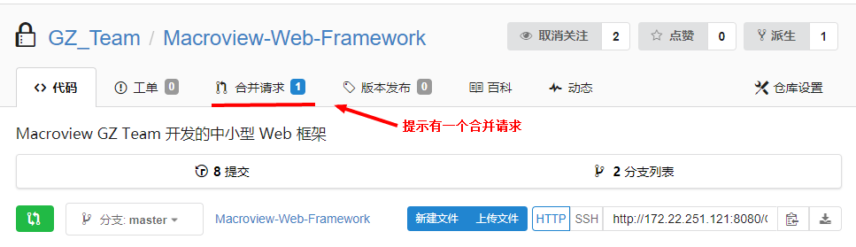
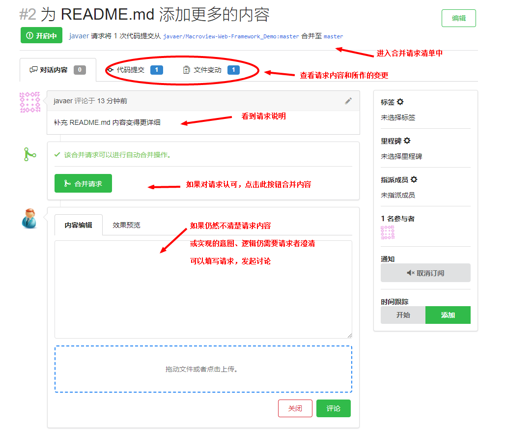
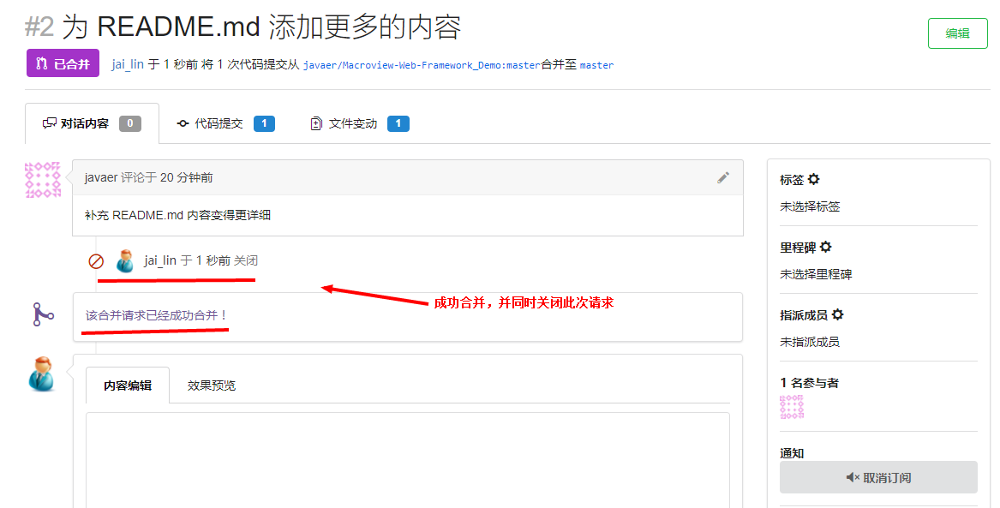

## 1. 说明

　　本文说明在 `Gitea` 中如何进行 `Fork` 和 `Pull Request` 操作。

## 2. 过程

　　上游项目：派生自的项目。（父）

　　下游项目或项目：派生得到的项目。（子）

### 2.1 从要参与的项目派生项目

　　登录进入 Gitea，找到此项目并进入项目首页。如下图示例所示派生：

 

　　派生后就拥有属于自己的项目仓库：（示例）

 

### 2.2 发起 Pull Request （合并请求）

　　当我们一个阶段的工作量结束后，经过测试项目主干代码无误，并希望合并到原项目（即派生自项目）时，可以向此项目发送 `Pull Request`，操作如下面示例所示：

 + 进入 `Pull Request`（合并请求）界面

 

 + 创建合并请求，填写合并内容所实现的意图、功能和逻辑

 

　　合并请求创建后，会自动进入上游项目的合并请求界面。如果有需要的话，可以继续追加请求的解释，或与有关人员就此合并进行讨论。

 

### 2.3 上游项目管理员的合并处理

　　合并请求创建之后，上游项目的管理员就会收到请求：

 

 + 管理员进入合并请求清单，查看请求者的意图，然后根据情况来判断是合并，还是发起更多的讨论

 

 + 如果管理员合并了此次请求，则会关闭此次合并请求清单

  

