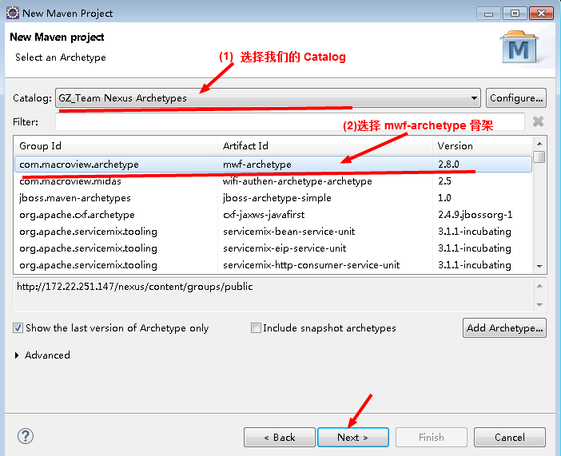
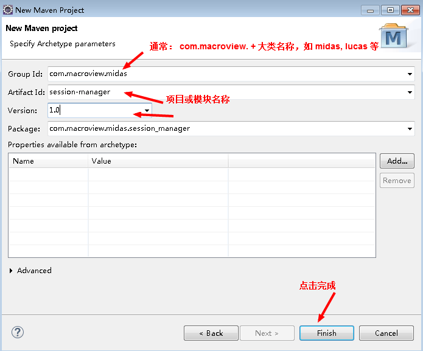
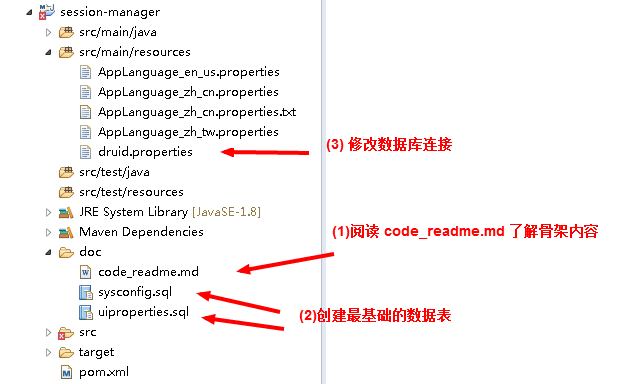

### ※ 文档摘要

　　本文档描述使用`MWF Archetype Plugin`快速创建项目骨架。

### ※ MWF Archetype Plugin

　　插件是用来快速创建 `MWF`项目的，Maven Archetypes Plugin。目前这个插件的信息如下：

     Macroview GZ Team 基础类库 `2.8.0` 版本

     UI 风格样式库是：webfront-adminlte 1.2.0

### ※ 快速创建项目骨架

　　要使用这件插件，就要预先在`Eclipse`中添加`Nexus Archetypes Catalog`（我们的 Nexus Archetypes Catalog），如果还没有添加，可以参考下面的文章（第六章）进行：

 [6. 添加 Nexus Server ArchType Catalog](./eclipse/README.md)

　　有了上面的准备之后，我们可以使用下面的步骤来创建：

 + 选择：File >> New >> Project... 显示对话框

 + 在对话框中的目录树选择： Maven >> Maven Project 创建一个 Maven Project

 + 选择 "Next" 进入下面对话框中：(Select an Archetype)

  

   按上图来选择选项，然后“Next”。

 + 进入“Specify Archetype parameters”，如下图所示：

  

 + 点击 `Finish` 之后，Eclipse 就会创建 `MWF`项目骨架

　　这个项目骨架如下图所示：

  

　　在项目的`\doc`目录中，会包含一份项目内容描述和最基本的数据表创建语句，项目管理员需要知道骨架所包含的内容，并进行一些基础的设置。

　　这个项目创建之后，只要配置好数据库连接，本身就已经可以运行了。

