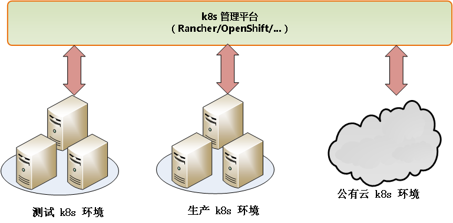
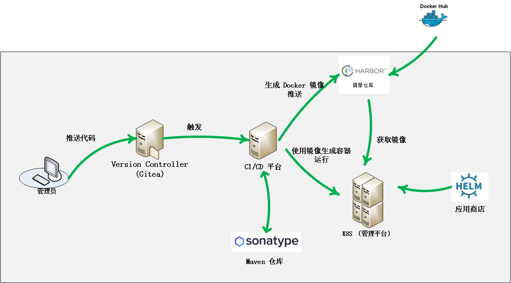

@[toc](目录)

## 1. 说明

###  1.1 关于本文档

　　本文档为团队关于 `DevOps` 开发过程实践提供指导性说明，包括过程架构、使用的平台系统及相关的语言等。

　　本文档是一个一般性的叙述，不作具体的约束性要求。

###  1.2 版本：1.0

## 2. 内容

###  2.1 DevOps 目的与实践原则

　　下面对开发团队引入 `DevOps` 的目的作原则性的说明与要求：

 + 开发过程自动化的需要

 + 简化开发者工作，提升开发效率

 + 为所开发的应用，提供更好的管理、测试与部署工具

 + 以 `Docker` 为基础的部署与运行环境

###  2.2 DevOps 基础结构图

　　当前情况下，我们的 `DevOps` 平台的基础结构（过程）如下：

#### 2.2.1 Docker 平台管理结构示意图

　　平台管理结构图：

　　同一管理平台，将管理多个不同的 `k8s`集群。

#### 2.2.2 DevOps 基础流程结构

　　在容器平台的基础上，我们的 `DevOps`的过程如下：

 

 + 源代码控制系统(Gitea/Svn)运行在独立的服务器中

 + Maven 仓库运行在独立的服务器中

 + 其他的系统，将以容器的形式运行在 `k8s` 上（同时通常过管理平台进行管理）

### 2.3 DevOps 过程系统选型

#### 2.3.1 K8S 管理平台

　　虽然`K8s`本身也提供了管理界面，但更多的是低层次操作，很多配置与应用安装都需要通过命令，或进入 OS 层面来完成，同时也无法提供多个`K8s`的管理。
　　业界有比较多的系统（国内与国外），充分利用`K8s`的API，提供更高层次的功能集成与封装，包括公有云和私有云两块，下面所选的是私有云方面的管理平台：

 + **Readhat OpenShift**

　　`Readhat OpenShift`即提供了公有云的在线系统，同样也提供一个开源免费的本地安装的私有云版本。

　　`ReadHat OpenShift`团队既参与`K8s`的开发（代码提交），同时也将`K8s`上的功能融入`OpenShift`当中，让`OpenShift`成为一个功能强大的企业级的`K8s`管理平台。

　　`OpenShift`的优点在于，有`ReadHat`的强大技术支持，有完善的英文文档，与`K8s`的紧密结合。

　　`OpenShift`的缺点在于，仅支持有限的单一的`K8s`集群，在操作上抽象度仍不高。

+ **Rancher**

　　`Rancher Server`同样也是一个开源免费的私有云版本，`Rancher`团队也参与`K8s`的开发。

　　`Rancher`的优点在于，安装简单方便，支持更多的`K8s`集群（包括公有或私有）。

#### 2.3.2 CI/CD平台

　　`CI/CD`是持续交付的核心内容，通常整个自动化流程，都会由`CI/CD`根据预先定义好的流程，进行调度与执行，所以良好的、功能强大的`CI/CD`平台，是`DevOps`的根基。

　　业界中无论是商用，还是开源免费的`CI/CD`平台并不多，如果只关注开源免费的平台，通常只有下面的两种选择：

 + **Jenkins/Jenkins X**

　　作为传统的`CI/CD`平台，`Jenkins`作为开源免费的产品，有着广泛的应用，几乎是首选的产品。

　　`Jenkins`的最大特点在于有着非常多和丰富的插件，几乎所有与`CI/CD`相关联的系统，都会提供`Jenkins`的连接（如插件）。

　　`Jenkins`作为传统的`CI/CD`平台，代表着是传统的运作形式，而在容器化世界里（强调个性化），贴近与协调性差强人意，于是`Jenkins X`就诞生了。

　　`Jenkins X`是建立在`Jenkins`之上，为容器（主要是`K8s`）而生的`CI/CD`平台，即能充分利用`Jenkins`的优势，又与`K8s`紧密相连。

 + **Drone**

　　`Drone`是新兴的，完全基于`Docker`的`CI/CD`新贵。`Drone`贴近与依附于`项目`（如 Git 系统），并与容器关联起来，所以比较受开发人员的喜爱。

　　不像`Jenkins`，要编写流程控制需要在`Jenkins`中进行，`Drone`就是直接将流程编写在`项目`文件当中，不需要离开`项目`即能构建项目的`CI/CD`流程，方便编写与管理。

#### 2.3.3 镜像仓库

　　所有运行中容器，都是从容器`镜像`中创建和衍生出来，`镜像`可以理解为“母碟”，是静态的内容。当我们要启动（运行）一个容器时，就是从`镜像`中创建、复制或`派生`出来。

　　而用来存储和管理`镜像`的系统，通常称之为`镜像仓库`。`镜像仓库`包括公有和私有两类，公有仓库就是有名的 `Docker Hub`，几乎所有`镜像`的第一来源就是这个公有仓库。

　　但是`Docker Hub`一方面因为速度或访问控制等因素，可用性对于公司而言并不太好，另一方面公司自己的应用`镜像`也不方便放上`Docker Hub`进行管理（虽然也提供针对公司或私人的管理功能）。于是在公司内部建立本地化的`镜像仓库`成为常规的选择。

　　下面是可供选择的开源免费`镜像仓库`管理平台：

 + **Harbor**

　　从某种意义来说，`Harbor`是唯一选择。

　　`Harbor`提供针对用户或项目的镜像管理，同时也提供镜像公用与私用的访问权限，使用起来非常灵活。

　　我们可以配置`Harbor`从上游('Docker Hub')获取基础镜像，同时也能作为镜像仓库，为`Docker`或`k8s`在创建容器时，提供镜像服务。

#### 2.3.4 应用商店

　　作为一个应用，可以是简单（如只需要一个 Docker），也可以是复杂（如需要关联多个系统，应用本身可以需要负载等等）。

　　对于简单的应用，创建起来比较简单而不太费时，但对于复杂的应用来说，就有可能费时费力才能“折腾”起来，如果这个费时费力的工作，每次构建都要重新搭建的话，肯定是一件比较崩溃之事。

　　所以提供比较方便的系统自动构建，是`DevOps`必须提供和实现的手段。在`K8S`中，应用商店概念就是这样类似的工具，`Helm`是其中一个官方的实现。应用商店中的每个应用，都是预定义好的`Script`，当我们需要创建应用时，不需要或作简单的配置，就能够构建出符合需要的应用。

　　`应用商店`本身包括：

 + `应用`的创建与运行，`应用仓库`的管理（添加、删除等）

 + `应用仓库`（添加、删除应用等）

　　`Helm`是官方的实现，而应用仓库有不同的提供方，除了 `Helm`本身也提供应用仓库之外，还有一些第三方的仓库提供者，例如：

 + `Rancher` 在 `Rancher` 内置自己的仓库

 + `OpenShift` 也有自己内置的仓库

#### 2.3.5 Mavn 仓库

　　我们的 Java 项目是使用 `Maven` 来作为管理工具，包括项目：

 + 所使用的类库

 + 项目的编译、测试、打包等

 + 类库上传管理

　　因此，我们需要在 `CI/CD` 中加入 `Maven`的支持，以方便自动化管理。

### 2.4 自动化测试

### 2.5 自动化部署

### 2.6 自动化监控

 + 日志收集与分析

 + 配置管理

