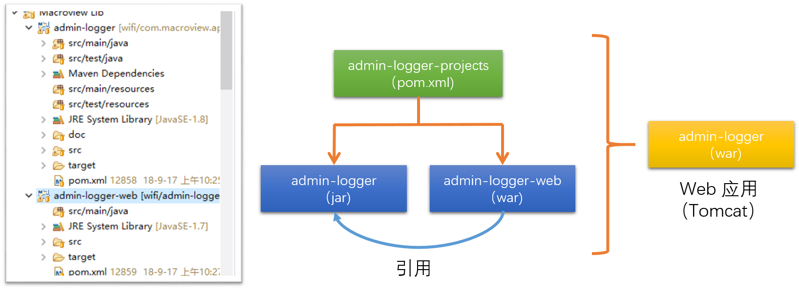
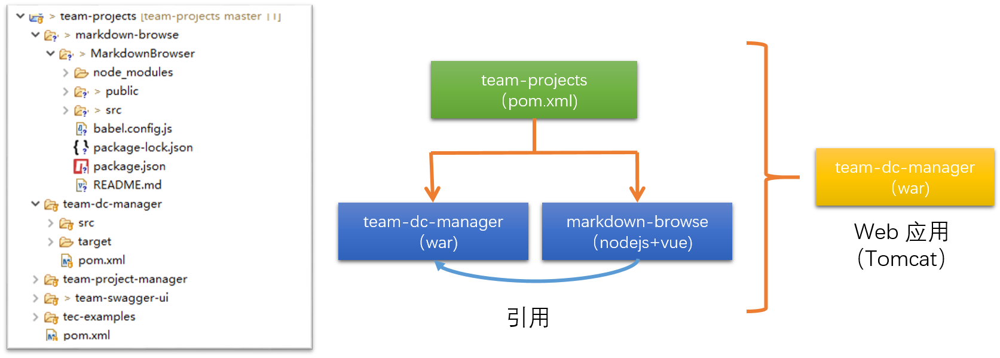
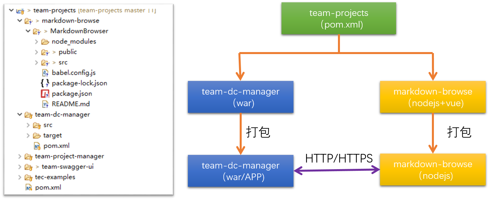

@[toc](目录)


## 1. 说明

###  1.1 关于本文档

　　本文档为团队关于前后端分离的处理（流程）提供一个指南，项目开发在使用本指南，并选择相应的解决方案时，如果有内容与本指南不同，请在项目文档中加以说明。

　　本文档提供一个普遍性的约束，希望大家能遵守原则性的内容。

###  1.2 版本：1.0

## 2. 内容

##  2.1 前后端分离的目的与原则

　　**目的与原则：无论采用何种方案，归根到底就是为了提供项目的如下特性**

### （1）可维护性

　　系统从来都是不断演进，所以系统良好的可维护性，会让系统更加稳定和易于处理各种问题。

### （2）代码可读性

　　很多系统是“铁打的系统，流动的开发人员”。代码的高可读性，意味着易于维护与扩展。

### （3）稳定与质量

　　系统的复杂度与稳定通常成反比，越是复杂的系统，稳定性压力就越大，所以不能为了前后端分离引入不必要的复杂，在资源有限（时间、人员配置等）情况下，需要多方衡量与兼顾。

### (4)复用与可扩展性

　　复用通过了“考验”或成熟的部件（组件、类库或方法等），往往会有更好的效率与可维护性，也意味着有更好的质量。在引入新方法、新方案时，同样要兼顾“成熟”的内容。

###  2.2 方案

　　目前，随着各种开发工具的涌现，让我们有更多的手段来提交我们的开发效率与质量。

　　整个项目的开发生命周期，如果浓缩起来，可以分而两大阶段：

 + 开发

 + 部署

　　同理，我们以这大阶段来看前后端分离的方案，主要包含了以下三种方案：（以 `Java` 开发 `web` 系统为例）

 + **方案一**：将服务器端内容（`java`代码）与前端页面（`JSP`或其他服务器端模板语言），在项目管理层面分离成独立的子项目，最终生成一个 `war`项目，运行在 `Servlet` 容器（主要是`Tomcat`）中


   

    方案的优点与缺点及应用场景：

     - 服务器端代码与前端页面的分离，有利于代码的复用
     - 开发工具或技术都在同一技术体系下，不需要太多额外的学习与资源成本
     - 适用于中小规模、不复杂的界面结构或组件的场景
     - 但当界面比较复杂时，由于同一开发人员，加重了开发人员的工作量，特别是当前端的工作量比服务器更重时，此方案不利于项目的演进

 + **方案二**：将服务器端内容（`java`代码）与前端页面（主要是客户端语言或工具，不再使用服务器端模板语言），在项目管理层面分离成独立的子项目，最终生成一个`war`项目，运行在 `Servlet`容器（主要是`Tomcat`）中

   

    方案一与方案二的区别在于，方案二的界面`渲染`将在前端（浏览器）中完成，而不是在服务器端进行，前后端在技术层面上实现分离。方案的优点与缺点及应用场景：

     - 服务器端代码与前端页面的分离，有利于代码的复用
     - 服务器端的开发技术与前端的开发技术在本方案中发生了分离，这种分离带来：
       * 开发工具的分离，可以引入专业或更好的，适用于前端开发的开发与管理工具
       * 技术的分离，也利于引入专业或更好的开发人员
     - 如果在岗位不分离的情况下，此方案要求开发人员，需要学习或掌握更多的技能，增加了人员的学习成本
     - 适用于中大规模、较为复杂（包括变更上产生的复杂度）的界面的场景。
     - 缺点在于前端仍然需要与服务器代码运行在同一环境下，无法充分利用前端独立的优势

 + **方案三**：将服务器端内容（`java`代码）与前端页面（主要是客户端语言或工具，不再使用服务器端模板语言），在项目管理层面分离成独立的子项目，服务器端为独立应用，运行在JVM中（可以是Tomcat，也可以是独立的Application），同时前端也作为独立应用运行在自己的环境当中（如NodeJs），两者之间通过通讯协议（通常是HTTP/HTTPS）进行通讯。

   

    方案二与方案三的区别在于，方案三不仅前后端在技术层面上实现分离，还在实际部署中，运行环境的分离。方案的优点与缺点及应用场景：

     - 服务器端代码与前端页面的分离，有利于代码的复用
     - 服务器端的开发技术与前端的开发技术在本方案中发生了分离，这种分离带来：
       * 开发工具的分离，可以引入专业或更好的，适用于前端开发的开发与管理工具
       * 技术的分离，也利于引入专业或更好的开发人员
     - 如果在岗位不分离的情况下，此方案要求开发人员，需要学习或掌握更多的技能，增加了人员的学习成本
     - 适用于大规模、非常复杂（包括变更上产生的复杂度）的界面的场景。

###  2.3 接口规范

　　当前端与后端分离时，前端与后端如何衔接，这是一个必须规范的问题。

　　接口规范通常包括下述几个方面：

 + 人员之间的沟通

 + 工具的使用

   - 前端：Visual Studio Code
   - 后端：Eclipse

 + 前后端通讯接口规范

   - 使用 `HTTP` 协议进行通讯
   - 数据描述格式以 `JSON` 作为描述规范
   - 使用 `Swagger` 注解来定义服务器端接口文档

####   2.3.1 使用 Swagger 定义接口

　　`Swagger`是对 `OpenAPI`的一个实现，目前的对应关系如下：

 + `Swagger` 1.x 对应 `OpenAPI` 1.x, 2.x

 + `Swagger` 2.x 对应 `OpenAPI` 3.x

　　目前暂时使用 `OpenAPI` 2.x 的标准来定义接口文档。

####   2.3.2 响应的格式结构

　　当前端向后端发出请求时，后端会将处理结果返回给前端。这个返回结果的结构组成，将在本节作一个统一的定义说明。

　　这是的描述是一般性说明，在具体的项目还需要对结构进一步明确说明。

 + 核心结构内容：（一般性结构）

    ```json
    {
        "success": true,
        "code": 200,
        "message": "说明",
        "value": "具体数据值"
    }
    ```

     - `success`：取值 true/false，是一个简单的请求处理成功或失败标识
     - `code`：数值编号，可以表达不同的状态。
     - `message`：文本信息说明，特别是错误原因的描述
     - `value`：返回数据的字段，可以是字符串值，也可以是数组，还可以是一个对象，因应具体的需求而定

 + 可选辅加内容：

     - `uuid`：用来标识每个请求的响应
     - `token`：涉及到安全的响应值
     - `timestamp`：响应的时间戳

####   2.3.3 统一的数值编号

　　特别是对错误的编号说明。

