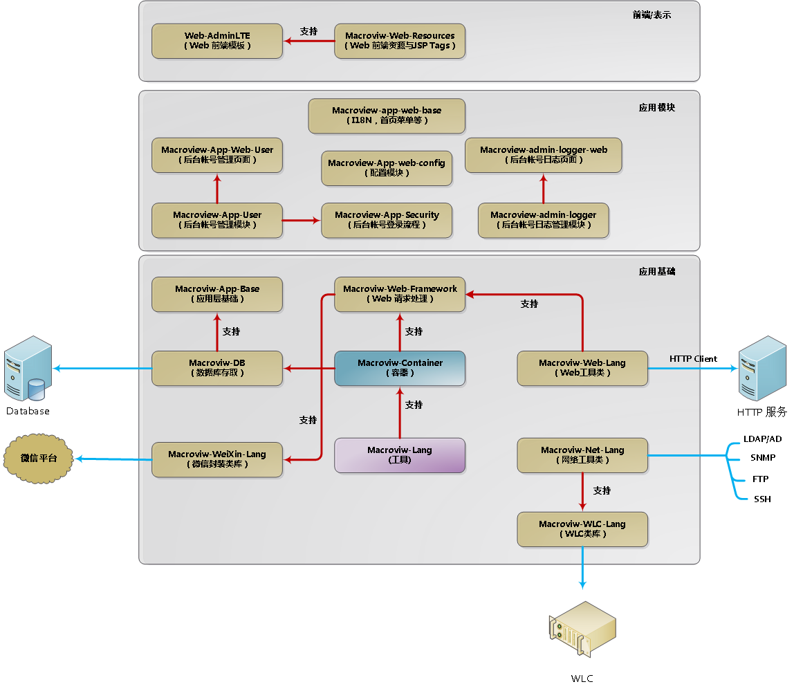
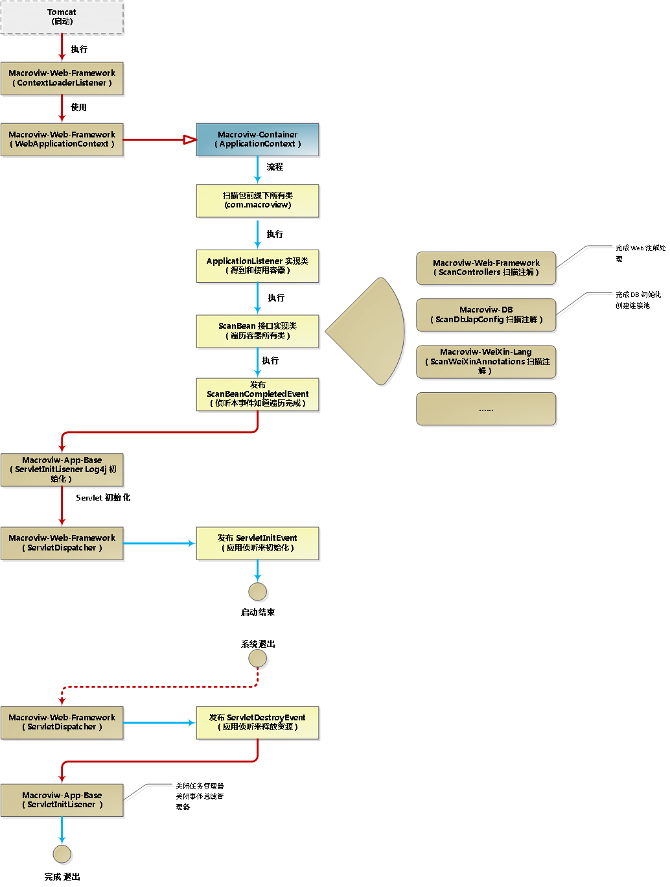
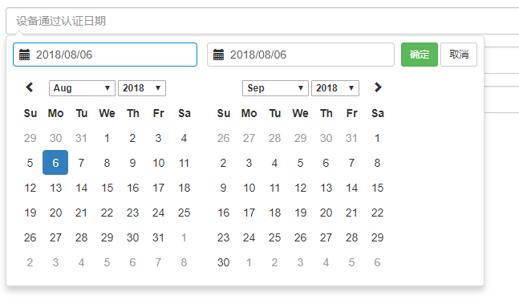

@[toc](目录)

## 1. 开发框架组织

 


## 2. MWF 的启动流程（生命周期）

 + v2.8.0

 

　　在整个生命周期中，我们可以通过不同手段来参与流程。

### 2.1 实现 ApplicationListener 接口，得到容器对象

 + MWF 在加载所有指定包前缀的类后，就会自动执行接口 `ApplicationListener`的实现类

 + 注意：

   - 这个时候 Macroview-web-framework 还没有启动，所以无法得到 action 配置信息
   - 这个时候 Macroview-db 还没有启动，所以无法与数据库建立连接

### 2.2 实现 ScanBean 接口，处理注解或接口实现

 + ScanBean 能遍历所有容器中的类

 + 当我们需要处理自定义注解或接口时，实现 ScanBean 接口是最好的选择

#### 2.2.1 ScanBean 接口

```java
public interface ScanBean {

	/**
	 * 遍历每个 Bean
	 *
	 * @param bean
	 */
	public void doWith(BeanInfo bean);
}
```

　　接口只有一个方法，就是对传入的类（bean）进行处理。例如 `Macroview-Web-Framrwork` 会看看这个类是否定义 `@Controller`等注解。

#### 2.2.2 BeanInfo 封装了类的信息和操作

　　`BeanInfo` 类是对 `Class` 的一个再包装，并提供了非常多的有用的操作：

 + **Class<?> getBeanClass()** 获得所包装的类对象

　　要知道 `BeanInfo` 所包装的是什么类，使用 `getBeanClass()`方法就得到。

 + 判断类是否定义了某注解：**boolean beanIsAnnotationPresent(Class<? extends Annotation> clazz)**

```java
/**
 * 判断类是否添加了 @Entity 注解
 */
  public void doWith(BeanInfo bean){
      if(bean.beanIsAnnotationPresent(Entity.class)){
          //定义了 @Entity ，表示此类为（MD）实体类，就对此类进行处理，例如映射的数据表名，对应字段等
          //...
      }
  }
```

 + 判断类是否继承或实现了某接口或某类：**boolean beanIsImplements(Class<?> clazz)**

```java
/**
 * 判断类是否实现了 Processor 接口
 */
  public void doWith(BeanInfo bean){
      if(bean.beanIsImplements(Processor.class)){
          //说明这个类是一个 Processor （处理器），下面就对这个类进行处理
          //...
      }
  }
```

 + 判断是否继承或实现了某接口或某类，并且能实例化：**boolean canInstanceAndImplements(Class<?> clazz)**
　　本方法与 `beanIsImplements(Class<?> clazz)` 区别在于，`beanIsImplements(Class<?> clazz)`并不保证 bean 能否实例化，换言之，bean 可能会是一个抽象类或子接口，这时 bean 是不能实例化的。

　　`canInstanceAndImplements(Class<?> clazz)`能保证这个 bean 能够实例化，所以如果需要实例化 bean 时，通常使用本方法会有保证。（抽象类或接口在实例化时，会抛出异常）

```java
/**
 * 判断类是否实现了 Processor 接口
 */
  public void doWith(BeanInfo bean){
      if(bean.canInstanceAndImplements(Processor.class)){
          //说明这个类是一个 Processor （处理器），下面就对这个类进行处理
          //甚至在这里可以创建 Processor 实例
      }
  }
```

 + 判断 Bean 能否实例化：**boolean canInstance()**

 + 判断 Bean 是单例还多实例：**boolean isSingleton()**

　　对于无状态对象而言，通常都是以单实例存在，单实例的优点在于节省空间和提高性能。而多实例往往也意味着有状态。
　　例如，我们的 `Web Action`对象，就是单实例对象，而数据实体类（如 User），往往是多实例（每个 User 对象都对应不同的实体）。
　　可以使用注解 `@Singleton` 明确表示单实例类。（这个注解是官方标准注解）

 + 实例化 Bean：**Object getInstance()**

　　这个方法会判断，如果是单实例 Bean 并且已经创建了实例时，会直接返回已有实例（复用），如果未创建实例，又或者是多实例类，会创建此 Bean 的实例并返回。

 + 获取 Bean 上定义的注解：**A getAnnotation(Class clazz)**

```java
/**
 * 判断类是否添加了 @Entity 注解
 */
  public void doWith(BeanInfo bean){
      if(bean.beanIsAnnotationPresent(Entity.class)){
          //定义了 @Entity ，表示此类为（MD）实体类，就对此类进行处理，例如映射的数据表名，对应字段等
          
          Entity entity = bean.getAnnotation(Entity.class); //获得注解
      }
  }
```

 + 获取 Bean 的名称：**String getBeanName()**

　　Bean 的名称通常唯一，并且命名规则如下：

     * 如果 Bean 上定义了注解 @Named，并且注解使用 value 给出名称，Bean 名称就是 value 的值
     * 否则取 class.getSimpleName() 为 Bean 名

　　由于 Bean 名并非唯一，所以大家要留意。

### 2.3 侦听 ScanBeanCompletedEvent 事件，知道 Container 扫描结束

　　在这种情况下表示，`Web Framework` 已经分析了所有 `Web Action`；`MDB` 已经分析了所有实体类，并创建了数据源（连接池），所以在这种情况下，可以使用数据连接来存取数据。

### 2.4 log4j 的初始化

　　自动加载下述位置的，文件名为 `log4j.properties` 的配置：（找到能用的配置就停止）

 + **WEB-INF\data\log4j.properties**

 + **WEB-INF\classes\log4j.properties**

　　使用配置来初始化 log4j

### 2.5 侦听 ServletInitEvent 来做应用的初始化

　　虽然我们可以通过侦听 `ScanBeanCompletedEvent` 来做系统的初始化（例如 启动线程，预加载数据等），但此时还没有 lo4j 的配置，所以无法输出到日志。

　　所以，应用系统的初始化，通常会在 `ServletInitEvent` 事件侦听器中进行。

```java
/**
 * 系统模块的初始化与销毁
 *
 * @author Jai
 * @since: v1.0
 */
public class SystemModuleInitAndDestroy {

	private final static Logger logger = Logger.getLogger(SystemModuleInitAndDestroy.class);
	
	/**
	 * 侦听 ServletInitEvent 事件，进行模块初始化
	 *
	 * @param event
	 */
	@Observes
	public void moduleInit(ServletInitEvent event){
		
		GlobalConfig.setOpenDirectToJsp(true); //直接加载 jsp
		GlobalConfig.setRemoveSuffix(false);
		
		logger.info("[系统初始化]==> 开始加载 Radius Server DICT Files...");
		RadiusDictionaryInit.loadDict();
		logger.info("[系统初始化]==> 完成加载 Radius Server DICT Files...");
		
		MidasRadiusClientCacheManager.initRadiusClientCache();
		
		logger.info("[系统初始化]==> 开始启动 Radius Server...");
		MidasRadiusServerFactory.startSyncServer();
		logger.info("[系统初始化]==> 启动 Radius Server...完成");
		
		RadiusSessionSaveQueue.startQueue();
		logger.info("[系统初始化]==> 启动 Radius Session 队列...完成");
	}
    //...
}
```

### 2.6 侦听 ServletDestroyEvent 来释放系统资源


　　当应用系统关闭（退出或重启）时，需要对所使用的资源进行关闭（如网络连接）、释放（如任务池），此时可以通过侦听 `ServletDestroyEvent`事件进行。

```java
public class SystemModuleInitAndDestroy {

	private final static Logger logger = Logger.getLogger(SystemModuleInitAndDestroy.class);
		
	/**
	 * 侦听 ServletDestroyEvent 来做释放资源操作
	 *
	 * @param event
	 */
	@Observes
	public void moduleDestroy(ServletDestroyEvent event){
		logger.info("[停止任务]==> 开始停止...");
		logger.info("[停止任务]==> 开始停止 Radius Server...");
		MidasRadiusServerFactory.stopServer();

		logger.info("[停止任务]==> 停止 Radius Server...完成");		
		RadiusSessionSaveQueue.stopQueue();
	}	
}
```

## 3. Macroview-Container 容器

　　容器存放着系统所使用的所有类及其信息，还有就是提供一些基础工具。

### 3.1 简单的 IOC 功能

　　目前 `MC` 只支持简单的 bean 定义与依赖：（Java 标准注解）

 + @Named：声明一个 Bean （用于注入）
 + @Resource：引入一个依赖（指向 Bean）

　　定义 Bean 示例：（示例类就能够注入到 LoginAuthenService 接口属性）

```java
/**
 * 这是标准 Account 管理模块的登录服务，当项目使用了本模块，<br>
 * 并且又没有提供登录接口 LoginAuthenService 实现时，就使用本服务作为一个实现
 *
 * @author Jai
 * @since: v1.0
 */
@Named
public class AccountLoginAuthenService  implements LoginAuthenService{

	private final static Logger logger = Logger.getLogger(AccountLoginAuthenService.class);
	
	/**
	 * 实现登录逻辑
	 *
	 * @param loginBean
	 * @return
	 * 
	 */
	@Override
	public LoginAuthenResult signInFlow(LoginSubmit submit) {
        //....
    }
}
```

　　有了上面所定义的 bean ，我们就可以在其他地方通过 @Resource 来注入。

```java
@Named
public class StandardLoginAuthenService {

	private final static Logger logger = Logger.getLogger(StandardLoginAuthenService.class);
	
    /**
     * 自动注入 登录认证服务
     */
	@Resource
	private LoginAuthenService loginAuthenService;

    //...
}
```

### 3.2 简单的事件总线

　　`MC`提供了一个简单和够用的事件发送小系统。

　　事件驱动编程本身就是一种广泛使用的编程方式，这种编程方式的最大特点就是发送者与接受者，得到最大程度的“解耦”。发送者又可称为“生产者”，而接受者又可称为“消费者”。

　　所以，事件系统又是一个典型的 “生产者-消费者”模式。

#### 3.2.1 事件总线使用场景

　　事件总线的使用场景是比较广泛的，当然作为一个小型的事件系统，通常使用的场景：

 + 比较复杂的处理流程中，需要向外部传递处理状态（如 中间数据、处理阶段属性等）
 + “生产者-消费者” 模式应用，例如完成登录认证后，将认证帐号数据发布出去，让不同的消费者来处理。
 + 完成某项工作后，通知相关方处理额外处理。

#### 3.2.2 事件类型及使用场景

 + 同步事件：也就是侦听器会立即执行（与事件发布处于同一线程），在所有侦听器完成后，才会继承执行下去。

   - 使用场景：所发布的事件，希望得到即时的回应（如 返回处理等）
  
 + 异步事件：事件发布后不需要等待，所有侦听者会在一个新任务线程中执行。（不影响事件发布者的后续工作）

   - 使用场景：所发布的事件，不需要即时回应；又或者侦听者相对独立，与事件发布者的可以并行工作。

#### 3.2.3 同步事件示例

 + 定义事件对象（Java 对象）

```java
/**
 * Servlet 初始化事件
 *
 * @author Jai
 * @since: v1.0
 */
public class ServletInitEvent {

	private final ServletConfig servletConfig;
	
	public ServletInitEvent(ServletConfig config){
		this.servletConfig = config;
	}
	
	/**
	 * 获取 Servlet 配置
	 *
	 * @return
	 */
	public ServletConfig getServletConfig(){
		return this.servletConfig;
	}
}
```

 + 定义侦听器（也是 Java 对象）：在方法上加 @Observes 注解

```java
/**
 * 系统模块的初始化与销毁
 *
 * @author Jai
 * @since: v1.0
 */
public class SystemModuleInitAndDestroy {

	private final static Logger logger = Logger.getLogger(SystemModuleInitAndDestroy.class);
	
	/**
	 * 侦听 ServletInitEvent 事件，进行模块初始化
	 *
	 * @param event
	 */
	@Observes
	public void moduleInit(ServletInitEvent event){
		
		GlobalConfig.setOpenDirectToJsp(true); //直接加载 jsp
		GlobalConfig.setRemoveSuffix(false);
		
        //....
	}
    //...
}
```

 + 事件发布（在需要的位置发布）：EventBusServiceFactory.post(event)

```java
public class ServletDispatcher extends HttpServlet{

	/**
	 * 初始化
	 *
	 * @param config
	 */
	private void servletInit(ServletConfig config){
		if(!init){
			init = true;
			logger.info("[MWF]==> Servlet Init...");
			initGlobalConfig(config);
			dispatchManager = new DispatchManager(config.getServletContext());
			
			//执行框架使用者的初始化动作
			EventBusServiceFactory.post(new ServletInitEvent(config));
		}
	}
    //...
}
```


#### 3.2.4 异步事件示例

 + 定义事件对象（ Java 对象）

```java
/**
 * Radius 认证通过事件对象
 *
 * @author Jai
 * @since: v1.0
 */
public class AccountAcceptEvent {
	
	private final AuthVerifyContext context;

	/**
	 * @param context
	 */
	public AccountAcceptEvent(AuthVerifyContext context) {
		this.context = context;
	}
	
	
	public final AuthVerifyContext getContext(){
		return this.context;
	}

}
```
 
 + 定义事件侦听器（也是 Java 对象）：在方法上加 @Observes 注解

```java
/**
 * AccountAcceptEvent 事件侦听，将记录保存到数据库
 *
 * @author Jai
 * @since: v1.0
 */
public class DefaultAccountAcceptEventListener extends BaseAuthEventListener{

	@Observes
	public void handler(AccountAcceptEvent event){
		saveSessionToDb(RadiusSessionStatus.AUTH_ACCEPTED, event.getContext());
	}
}
```

 + 事件发布（在需要的位置发布）：EventBusServiceFactory.asyncPost(event)

```java
/**
 * 核心服务器
 *
 * @author Jai
 * @since: v1.0
 */
public class MidasRadiusServer extends RadiusServer{

	public RadiusPacket accessRequestReceived(AccessRequest accessRequest, InetSocketAddress client) throws RadiusException {
		AuthVerifyContext context = new AuthVerifyContext(accessRequest, client);
		int type = RadiusPacket.ACCESS_REJECT;

		if (RadiusPacketHandlerFactory.verifyPassword(context)){ //检验帐号与密码成功
			type = RadiusPacket.ACCESS_ACCEPT;
			
            //通过异步方式发布 AccountAcceptEvent 事件
			EventBusServiceFactory.asyncPost(new AccountAcceptEvent(context));
        }
        //... 后面处理
    }    
}
```

## 4. Macroview-Web-Framework Web 响应处理

　　Macroview-Web-Framework 是一个 web 框架。

### 4.1 使用 Java 代码注册 Action

　　使用注解来定义 `path->Action`是在代码编写阶段就固定下来，这符合大多数场景的使用（毕竟路由在系统设计的时候，就已经确定下来）。

　　但在一些较为特殊的场景下，例如希望使用外部配置来定义映射，此时使用注解是无法满足需求，但我们可以使用代码来动态注册映射。

 + **使用`ActionRegisterFactory`类来动态注册映射**

   - ActionRegisterFactory 分别提供了 `get`、`post`、`put`、`delete` 两种类型注册方法
  
   - ActionRegisterFactory 所注册的 Action 类，目前只支持实现如下接口：

      + BaseAction：execute(HttpServletRequest request, HttpServletResponse response) 原始的 Servlet 操作方式
      + IndexAction：R execute(); 带一个返回值，但没有输入参数

         - 返回 ModelAndView 和 String 将根据内容处理，返回其他值则作为返回 json 处理。

      + Action：R execute(E data); 带一个参数，同时也有返回值，传入参数可以是：

         - Pojo、基本类型包装类、请求路径参数、Map
         - ServletData 接口（接口包含了获取 HttpServletRequest、HttpServletResponse 方法）
         - 单个 HttpServletRequest、HttpServletResponse、InputStream、OutputStream、Reader、Writer

 + 下面的示例来自 MIDAS 的自定义流程

```YAML
# MIDAS 外部配置文件内容

globalConfig:                                 # 全局性配置或参数
    wifiDeviceCache: false                    # onlineWifiDevice 不使用缓存
    authenType: Sms                           # 短信认证

authenFlows:                                  # 认证流程定义
    authenPolicy:                             # 整体认证策略
        policy: Passthrough
        fail: wifiauthen/error.jsp
 
    defaultRequest:                                           # WLC 跳转请求
        action:
            path: Get /authen/index                           # 默认为 Get，仅支持 Get, Post 两种
            
        workflow:
            - InlinePredicateProcessor:                     # 如果满足重连条件，则直接放行
                if: not FalsePredicate                     
                do: ForTestProcessor
```

　　这是一个简单的认证流程，在流程配置当中，`path: Get /authen/index` 就是一个请求路径，当系统接收到 `Get /authen/index`请求后，就是执行下面的 `workflow`流程。

　　由于请求是外部配置，并且也是在启动后才知，所以使用代码来注册能满足这种场景需要：

```java
/**
 * 对流程配置进行预处理，使得配置内容更符合使用要求，并顺利进行一些简单的语法校验
 * 
 * 并将 midas.yaml 中自定义的请求注册到 MWF
 *
 * @author Jai
 * @since: v1.0
 */
public class FlowConfigPretreatmentHelper {

    //...

	/**
	 * 将 http 请求路径与处理方法注册到 MWF，目前仅支持 Get, Post 两个形式请求。
	 * 
	 * 并且 action 也仅支持 实现接口 Action<E, R> 的类
	 */
	private static void doRegistryHttpRequest(AuthenRequestConfig config) throws Exception{
		RequestActionConfig action = config.getAction();
		if(action != null && action.isNotEmpty()){
			
			Action o = getWorkflowAction().registryRequestPath(config);
			switch(action.getRequest()){
				case GET:
					ActionRegisterFactory.get(action.getPath(), o);
					break;
				case POST:
					ActionRegisterFactory.post(action.getPath(), o);
					break;
			}
		}
	}
}
```

　　在代码中，使用 `ActionRegisterFactory.get()` 和 `ActionRegisterFactory.post()` 来注册请求处理。


## 5. Macroview-DB 数据存取

### 5.1 数据查询

　　为了方便使用，MD 引入一套查询注解，通过注解来定义查询内容，方便优雅的同时，也避免了字符串拼接带来的问题。

　　一般情况下，建议尽量使用查询注解来建立查询语句。

　　当然，查询注解也有其缺点：

 + **查询注解是一种联合查询（即 And 的关系），而不是 (Or 的关系)，要创建 Or 查询就无法使得注解。**

#### 5.1.1 常用的查询注解

 + Equals：相等
 + Like：like 操作
 + In：in 操作
 + Between: between 操作
 + Max：小于或等于
 + Min：大于或等于
 + CustomConditions：自定义查询语句
 + OrderBy：排序
 + NotEquals：不等于

```java
/*
 * 查询 WifiDeviceLog 的Bean
 *
 * @author Jai
 * @since: v1.0
 */
public class WifiDeviceLogQueryBean extends DefaultPageBean{

	private final static Logger logger = Logger.getLogger(WifiDeviceLogQueryBean.class);
	
	/**
	 * 如果是手机就是手机号码，如果不是；就是设备的逻辑编号，例如微信号，员工编号等
     * 相当于： like %authenNumber%
	 */
	@Like
	private String authenNumber;
	
	/**
	 * 设备的 mac 地址
	 */
	@Like
	private String deviceMac;
	
	@Like
	private String apMac;

	/**
	 * 设备的认证方式
     * 相当于  authenType = :authenType
	 */	
	private String authenType;
	
	/**
	 * 登录时间范围
     * 相当于 Between begintTime And endTime
	 */
	@Between
	private DateTimeRange signIn;

	/**
	 * 用来构建 signIn 时间范围
     * 不用于查询
	 */
	@NotNamed
	private String signInRange;
	
	/**
	 * 退出时间范围
	 */
	@Between
	private DateTimeRange signOut;
	
	/**
	 * 用来构建退出时间范围
	 */
	@NotNamed
	private String signOutRange;
	
	/**
	 * 设备类型
	 */
	private String deviceType;

    //...
}
```

　　上面查询类，如果所有字段有值的话，就可以生成下面的查询语句：

     (authenNumber like %authenNumber%) AND (deviceMac like %deviceMac%) AND (apMac like %apMac%)
     AND (authenType=:authenType) AND (signIn Between :beginTime And :endTime)
     AND (signOut Between :beginTime And :endTime) AND (deviceType = :deviceType)

　　下面是上述注解对应的前端部分代码：

```html
	<form class="navbar-form navbar-left query-form export-form">		    		
		<div class="form-group"> <!-- @Like private String authenNumber -->
			<input type="text" id="authenNumber" name="authenNumber" class="form-control typeahead" data-search="authenNumber" placeholder="手机号/OpenId" />
		</div>

		<div class="form-group"> <!-- private String authenType -->
			<select id="authenTypeId" name="authenType" class="form-control" >
				<option value="*" selected><mv:i18n message='wifi.onlinewifi.manager.authenType' />:<mv:i18n message='common.all' /></option>
				<option value="Sms"><mv:i18n message='wifi.onlinewifi.manager.authenType' />:<mv:i18n message='wifi.onlinewifi.manager.authenType.sms' /></option>
				<option value="WeiXin"><mv:i18n message='wifi.onlinewifi.manager.authenType' />:<mv:i18n message='wifi.onlinewifi.manager.authenType.weixin' /></option>
			</select>
		</div>

		<div class="form-group sign-range"> <!-- @Between private DateTimeRange signIn -->
			<input type="text" id="signin-range" name="signIn" class="form-control" title="通过认证日期" placeholder="设备通过认证日期">
		</div>
		
		<div class="form-group sign-range"> <!-- @Between private DateTimeRange signOut -->
			<input type="text" id="signout-range" name="signOut" class="form-control" title="设备下线日期" placeholder="设备下线日期">
		</div>
	</form>
```

　　**注意：**关于 `@Between`的最新使用，需要最新的 `Macroview-Lang`(2.8.0)支持，所以建议重新从 Maven 上下载最新版本的 jar 包。

　　**注意：**关于 `@Between`的时间范围定义，可以参考后面 `6.4.2 选择日期范围`，通过日期范围选择插件来实现时间范围的查询。（更加方便）


#### 5.1.2 v2.8.0 引入的新查询功能

　　在 `2.8.0` 当中，查询注解引入一个叫 'name' 的属性，可以用来定义查询字段名称。一般而言，查询类的属性名称将对应查询字段名称，例如表 `User` 有一个字段 `name`，那么查询类也就顺理成章地定义属性 `name` 来匹配。但在情况下，例如：
 
 + 数据表字段名比较特殊（例如汉字命名，不符合 Java 属性命名规则的名称等）
 + 多变的字段名

　　此时，现有的注解就无法支持，因此在 `2.8.0` 中，每个查询注解都增加了一个 `name` 属性，这个属性在默认情况下为空串（即使用查询类属性名作为字段名进行查询），如果字段名不符合Java的命名习惯时，就可以显式使用这个属性来定义查询字段名称。

```java
public class UserQueryBean {

    /**
     * 按照标准的数据库字段定义，fk 前缀表示外键
     * 这里使用 name 来表示对应的查询字段名称
     */
    @Equals(name="fkDepartment")
    private Long department;

    //...
}
```
　　当 `department=1`时，查询条件就变成：`fkDepartment=1`。


　　对于希望字段名称由前端回传，而不是在查询类写死，同样也可以使用 `name` 属性来定义，此时的`name`定义格式为：`$属性名`，表示查询字段名称由属性来（动态）提供，下面示例：

```java
public class DeviceQueryBean extends DefaultPageBean{

	/**
	 * 查询类型
	 */
	@NotNamed
    private String queryType;

    /**
     * 查询值， name="$queryType" 表示，查询字段名称由属性 queryType 提供
     */
	@Like(name="$queryType")
    private String queryValue;

    @Enumerated(EnumType.STRING)
    private CmDevRegStat status;

    /**
     * 定义排序字段，并且字段名称由 orderBy 的值提供（而不是 orderBy 这个名称）
     */
    @OrderBy(byFieldValue=true)
    @NotNamed
    private String orderBy;

    //...
}
```

　　于是 `queryType="name"`，`queryValue="Jai"`时，查询条件就变成：`name="Jai"`，同理 `queryType="department"、queryValue="软件部"`时，查询条件就变成：`department="软件部"`，这样提供一个灵活的查询操作。

### 5.2 应用复杂的查询

　　由于需求原因，`MD`并没有实现 `JPA` 的 `OneToOne`、`OneToMany`等，关于多表关联的操作，所以当需要用到多表关联时，我们就需要回到 `SQL`拼接这种`较为原始`的手法。

　　那么，除了拼接之外，还有没有更好的方法呢？。。下面提供两个建议：

#### 5.2.1 使用视图

　　大多数数据库都提供创建视图的功能，并且还会对视图进行优化，所以将复杂的查询语句预定义为视图，不失为一个非常好的选择。

　　所以对于固定的多表关联，可以定义为数据视图，然后再进行查询。

#### 5.2.2 使用外置 SQL 语句

　　MD 本身支持 `SQL` 语句外置，将语句外置带来的好处就是维护方便，并且在需要时，还可以动态修改和更新。

 + 第一步，就是编写 `JSON` 格式的外置语句，下面是示例：

```json
{
	id: "acl",   /* id 是一个唯一标识，需要用到*/
	
	maps:{  /* 内容为：查询名 为 Key，查询语句为值，组成 JSON 的键值  */
		queryAcl: "Select a.*, count(r.id) AS ruleCount From WlcAclTable a left Join WlcAclRecord r On a.id=r.aclId Group By a.name Order By a.id",
		queryAclRulesById: "Select r.id, r.ruleIndex, r.action, r.direction, concat(r.sourceIpAddress, '/', r.sourceIpNetmask) As sourceIp, concat(r.destinationIpAddress, '/', r.destination) As destIp, r.protocol, r.startSourcePort, r.endSourcePort, r.startDestinationPort, r.endDestinationPort, r.dscp, r.direction From wlcaclrecord r Join wlcacltable a On r.aclName=a.name Where a.id=? Order By r.ruleIndex"
	}
}
```

```json
{
	id: "issue",
	
	maps:{
		totalComplete: "Select count(*) As total From ${Table} Where (STATUS='关闭' or STATUS='已经解决') ${condition}"	
	}
}
```

　　`${Table}`为内置表明，而 `${condition}` 为外部给出的条件语句。。。。语句可以使用格式为:`${名称}`的占位符，占位符的内容由外部提供。

　　`id`为外置SQL的唯一标识，在代码要用到，而具体的语句放在 `maps`当中，每一个`map`为一条 `SQL`语句，每条`SQL`语句都由一个名称和内容组成。

 + 第二步，将外置 SQL 引入到代码。（与实体类关联起来）

```java
/**
 *  使用 @SqlMapResource 注解，将外置 sql 文件关联到实体类
 */
@Entity
@Table
@SqlMapResource(resource="package:acl.json")
public class WlcAclTable extends HasCreateTimeEntity{

    //...
}
```

　　`@SqlMapResource` 注解将sql文件与实体类关联起来，文件路径支持格式：

     **package:acl.json**：表示 `acl.json` 文件与实体类（WlcAclTable）在同一个包路径下

     **classpath:acl.json**：表示 `acl.json` 在目录 `WEB-INF/classes` 下

 + 第三步，使用查询语句（实体类基类提供读取语句方法）

   - List<T> queryForSqlMapTo(Class<T> toEntityClass, String sqlMapName, Object...objects)

      执行（不含占位符）查询语句，并映射到实体类 `toEntityClass` 

   - List<T> queryBySqlMapWithParams(Class<?> entityClass, String sqlMapName, Map<String, String> params, Object...objects)

      执行包含了占位符的查询语句，并映射到实体类 `entityClass`

   - List<T> findBySqlMapWithParams(String sqlMapName, Map<String, String> params, Object[] objects)

      执行包含了占位符的查询语句，并映射到自身

   - String getSqlFromSqlMap(String sqlMapName) 通过名称来得到 sql 语句

　　要留意，上述的方法，都是 `protected`（类及其子类才能使用）方法。


```java
/**
 *  使用 @SqlMapResource 注解，将外置 sql 文件关联到实体类
 */
@Entity
@Table
@SqlMapResource(resource="package:acl.json")
public class WlcAclTable extends HasCreateTimeEntity{

    //...

	/**
	 * 使用外部sql语句（queryAcl）来查询所有 ACL
	 *
	 * @param clazz
	 * @return
	 * @throws Exception
	 */
	public <T> List<T> findAllAcls(Class<T> clazz) throws Exception{
		return this.queryForSqlMapTo(clazz, "queryAcl", new Object[0]);
	}

    //...
}
```

## 6. Macroview-web-resources 

　　这是一个 `war`类型的项目，包含了前端开发所使用的框架：

 + **Bootstrap 3** 和常用插件

 + **JQuery**

　　下面是所包含的一些插件的说明

### 6.1 Fontawesome 图库

　　将图标作为字体的形式提供，目前所包含的版本是 4.7 超过一百多个图标。我们可以通过下面的网址来查看这些图标：

 + https://fontawesome.com/v4.7.0/icons/

### 6.2 datepicker 日期选择与输入插件（略）

　　选择单个日期的插件

### 6.3 timepicker 时间选择与输入插件（略）

### 6.4 daterangepicker 日期范围选择与输入插件

　　本插件与 `datepicker`不同，本插件用于日期范围的选择，常用于日期范围查询，定义日期范围等场景。

 + 当前版本：2.1.18

 + 示例网址：http://www.daterangepicker.com/

 + 插件引用示例

```html
  <link href="${BaseContextPath}/static/bootstrap/daterangepicker/daterangepicker.css" rel="stylesheet">

  <script type="text/javascript" src="${BaseContextPath}/static/bootstrap/daterangepicker/moment.min.js"></script>
  <script type="text/javascript" src="${BaseContextPath}/static/bootstrap/daterangepicker/daterangepicker.js"></script>
```

#### 6.4.1 作为单个日期插件使用

　　在这种状态下，其实是可以替代 `datepicker`的。

 + HTML 示例代码

```html
    <div id="my-form" class="container">
		<div class="row">
			<form id="form_demo" class="form form-horizontal" action="" method="post" enctype="multipart/form-data" role="form">

				<div class="form-group">
		            <input type="text" id="signIn-single" name="signIn" class="form-control" title="设备上线日期" placeholder="设备上线日期">
				</div>
				
			</form>
		</div>
	</div>
```		

 + JavaScript 示例代码

```javascript
	$("#signIn-single").daterangepicker({
		locale:{
			format: 'YYYY-MM-DD',     //定义日期显示格式
			cancelLabel: '取消',      //使用中文标签
			applyLabel: '确定'
		},
		singleDatePicker: true,    //单个日期选择
		showDropdowns: true,       //点击显示下接日历选择
		minYear: 2010            	
	});
```

#### 6.4.2 选择日期范围

　　日期范围常用表示格式：（开始日期与结束日期，只能使用 '-' 或 '~' 来分隔，通常的建议是使用'~'比较好）

+ **YYYY/MM/DD - YYYY/MM/DD**：例如 `2018/02/22 - 2018/04/22`，使用横线分隔。

+ **YYYY-MM-DD ~ YYYY-MM-DD**：例如 `2018-02-22 ~ 2018-04-22`，使用波浪线分隔。

　　下面是使用的示例代码：

 + HTML 代码
  
```html
    <div id="my-form" class="container">
		<div class="row">
			<form id="form_demo" class="form form-horizontal" action="" method="post" enctype="multipart/form-data" role="form">
				
				<div class="form-group sign-range">
		            <input type="text" id="signin-range" name="signIn" class="form-control" title="通过认证日期" placeholder="设备通过认证日期">
				</div>
				
				<div class="form-group sign-range">
		            <input type="text" id="signout-range" name="signOut" class="form-control" title="设备下线日期" placeholder="设备下线日期">
				</div>				
			</form>
		</div>
	</div>
```

 + Javascript 代码

```javascript
	//时间范围组件
	$("#signin-range, #signout-range").daterangepicker({
		//parentEl: '#my-demo-body',  // 控件容器，默认为 body

		locale:{
			format: 'YYYY/MM/DD',
			cancelLabel: '取消',
			applyLabel: '确定'
		},
		autoUpdateInput: false,  //表示不会将选择输入到输入框，必须要与下面所示的事件 apply.daterangepicker 等配合来设置值
		showDropdowns: true,     //年，月显示下拉列表
		alwaysShowCalendars: true,
	});		
	
	// 组织选择后的值格式，配合 autoUpdateInput: false 参数
	$('#signin-range, #signout-range').on('apply.daterangepicker', function(ev, picker) {
		$(this).val(picker.startDate.format('YYYY/MM/DD') + ' ~ ' + picker.endDate.format('YYYY/MM/DD'));
	});

	$('#signin-range, #signout-range').on('cancel.daterangepicker', function(ev, picker) {
		$(this).val('');
	});
```

 + 服务器端示例

```java
 public class MyQueryBean extends DefaultPageBean{
	 
	 @Between
	 private DateTimeRange signIn;

	 @Between
	 private DateTimeRange signOut;

	 //..下面是 set/get 方法，这里略
 }
```

 + 效果图

 


#### 6.4.3 添加时间的选择

　　除了可以选择日期之外，还可以添加时间的选择。

 + 添加时间后的格式：YYYY/MM/DD hh:mm:ss  或者 YYYY-MM-DD hh:mm:ss

 + 增加设置参数：**timePicker: true** 开启时间输入组件

 + javascript 示例

```javascript
	$("#signin-range, #signout-range").daterangepicker({
		//parentEl: '#my-demo-body',  // 控件容器，默认为 body

		locale:{
			format: 'YYYY/MM/DD hh:mm',    //这里也要加入时间显示格式
			cancelLabel: '取消',
			applyLabel: '确定'
		},
		timePicker: true,        //这里开启时间选择部件
		autoUpdateInput: false,  //表示不会将选择输入到输入框，必须要与下面所示的事件 apply.daterangepicker 等配合来设置值
		showDropdowns: true,     //年，月显示下拉列表
		alwaysShowCalendars: true,
	});
```

### 6.5 select2 功能强大的列表选择插件

　　`Select2` 是用来替换标准的 `Select` 表单控件的插件，并且功能更加强大：

 + 标准的下拉选择功能
  
 + 自动完成（智能判断）

 + 查询部件：提供一个查询部件，可以输入查询内容。

 + 更多的自定义功能（自定义数据范围、数据格式、查询条件等等）

 + 当前版本：4.0.3

 + 官方示例网址：https://select2.org/

 + 插件引用

```html
   <!-- css 引用 -->
	<link rel="stylesheet" type="text/css" href="${BaseContextPath}/static/bootstrap/select2/select2.min.css">
	<link rel="stylesheet" type="text/css" href="${BaseContextPath}/static/bootstrap/select2/select2-bootstrap.min.css">

  <!-- js 引用-->
   	<script type="text/javascript" src="${BaseContextPath}/static/bootstrap/select2/select2.min.js"></script>
   	<script type="text/javascript" src="${BaseContextPath}/static/bootstrap/select2/zh-CN.js"></script>
```

 + HTML 示例，使用标准的 select 标签

```html
	<select id="role" 
		name="role" size="1" class="form-control" placeholder="用户角色">
		<option value="1">普通用户</option>
		<option value="2">管理员</option>
		<option value="3">超级管理员</option>
	</select>
```

 + Javascript 示例

```javascript
  $("#role").select2();
```	

　　`Select2`功能强大，有非常多的配置参数、方法和事件，具体参见上面提供的官方文档。

## 7. Macroview-Lang 类库

　　`Macroview-Lang`作为最基础的类库，包含了众多的、常用的工具方法，是其他类库必须的基础类库，主要包含了下述几大类的工具：

 + 基础类型的扩展工具

   - StringUtils、IntegerUtils、ByteUtils、BooleanUtils、NumberUtils、LongUtils等等
   - ListUtils、ArrayUtils、MapUtils、CollectionUtils、SetUtils等等

 + 反射方法

   - ReflectUtils：反射综合工具
   - BeanUtils：Bean 操作
   - ClassUtils：Class 操作
   - PropertyUtils：property 层面操作
   - ObjectUtils：Object 操作

 + 数据转换集

   - 这是 web-framework 与 md 有关数据转换的核心

 + IO操作工具

   - filenameUtils、FileUtils、ZipUtils、ClassPathUtils、IOUtils、NetworkUtils等等

 + 加密方向工具方法

   - CryptoUtils、DigestUtils、SecurityUtils

### 7.1 数据转换集

　　数据转换是软件开发经常遇到的事情，例如前端提交的数据转成后端的对象，数据库记录映射成对象等等，都多多少少涉及到数据转换的问题。

　　所以，数据转换是最基础的内容。类库提供了支持不同情况下的数据转换：

 + **Converter**接口，用来定义准确的一对一转换

   - 字符串转 Boolean 类型就是这样的范例，支持 "true/false"、"on/off"、"yes/no"、"1/0"、"真/假"

 + **GenericConverter**接口，定义多种类型对一种类型的转换

   - 例如 StringGenericConverter 支持多种类型转字符串类型
   - DateGenericConverter 支持多种类型转日期类型（如 long, string, timestamp 转日期）

 + **ConditionalGenericConverter**接口，指定某些类型转换

 + **ConverterFactory**转换工厂接口，可以定义更丰富的转换规则

　　目前，类库已经实现的数据类型转换如下：

 + 数组对数组的转换 （如字符串数组转日期数组）
 + 字符串数组对数值的转换
 + 数组转字符串
 + 不同类型转布尔类型
 + 容器类转数组
 + 容器类转哈希表（Map）
 + 容器类转字符串
 + 不同类型转日期类型
 + 不同类型转字符类型
 + 字符串转数组
 + 字符串转容器类
 + 字符串转枚举
 + 字符串转数值
 + 字符串转日期范围类
 + 字符串转整数范围类
 + 哈希表转对象（Map --> Bean）

　　基本上满足了其他框架所需要的类型转换。

　　同时，也提供了转换服务类和一个静态的转换工具类：

 + **ConversionService** 转换服务类，提供了转换类型的添加、删除和统一转换接口方法

```java
  //使用缺省的转换服务类
  ConversionService conversion = ConversionServiceFactory.createDefaultConversionService();
  
  //字符串转日期
  Date date = conversion.convert("2018-08-06", Date.class);
```

　　如果无法转换，根据下述情况返回：

 + 如果是基本类型的转换（如数值、布尔），无法转换情况下会抛出异常
 + 除非其他情况无法转换时，返回 ConversionService.NOT_FOUND_CONVERTER 这个Object

　　所以，如果抛异常，或者得到 NOT_FOUND_CONVERTER 值，则表示转换失败。


 + **ConversionServiceUtils** 转换工具类，内部创建了**ConversionService**对象，并加入上述已经实现的转换类，并以静态方法方式提供方便使用的转换方法。

　　下面是转换工具的使用示例：

```java
   //将字符串类型转成日期类型
   Date date = ConversionServiceUtils.convert("2018-08-06", Date.class);

   //将长整数转成日期类型
   Date date = ConversionServiceUtils.convert(1464745823875L, Date.class);

   //将一个 Map<String, Object> 转成 Bean，map.key 对应 Bean.field
   User user = ConversionServiceUtils.entityConvert(map, User.class);
```
