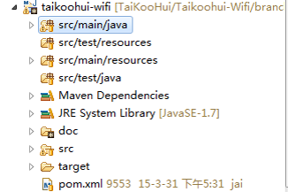

@[toc](目录)


## 1. 说明

### 1.1 关于本文档

　　本文档为 `团队项目代码开发规范指南`。是我们开发部门所使用的，在开发过程中遵循的，具有一定约束性的规范。

### 1.2 版本：2.0

　　规范会根据需要不定期更新。

## 2. 规范概要

### 2.1 规范编写目的

 + 代码编写的一致性，可以减少维护成本。

    由于代码一致性，可以降低代码学习曲线，让维护人员更加快地熟悉习惯进入维护角色。

 + 提高代码可读性和可维护性。

   - 没有格式与个人风格阅读障碍。

   - 公共词汇与隐喻，方便交流、沟通和加深理解。

 + 提高团队开发的合作效率，更利于共享代码。

   - 公共词汇与隐喻，方便交流、沟通和加深理解。

   - 共享代码不会受个人风格干扰。

 + 培养开发人员的良好编程习惯。

### 2.2 开发原则与信条

 + **整洁就是美**

   - 编写整洁而易于阅读的代码是每个开发人员都要遵守的原则与信条。

 + **简单就是美**

   - **KISS 原则**：Keep It Simple and Stupid

   - 单一职责原则

   - 在实现需求的同时，立足于：

      + 易于阅读
      + 易于维护
      + 足够性能

 + **Review与重构**

   - Review：代码审查

   - 重构：

      + 过程：在不改变代码外在行为的前提下，对代码进行改进，从而最终改进程序的内部结构。
      + 本质：在代码写好之后改进它的设计。
      + Review不仅限于团队工作，个人一样可以不断审查自己写的代码。
      + 重构不仅仅是个行为，更重要的是一项技能

 + **我能做得更好：功能、扩展性、性能**

   - 正确实现功能。
      + 设计文档定义内容。
      + 隐喻、惯例（潜规则）

   - 扩展性
      + 易于修改、维护

   - 性能
      + 兼顾性能

   - 阶梯: 功能 > 扩展性 > 性能

 + **DRY原则：别重复自己**

   - 重复可能是软件中一切“邪恶”的根源。
   - 重复不利于维护/修改。
   - 重复往往不完全相同，细小的差异容易被遗留和忽视。
   - 系统运行“灵异事件”
   - 重复不利于扩展。
   - 重复不利于优化。

### 2.3 项目源代码结构组织

 + **原则与目的**

   - 文件易于查找
   - 文件易于管理

 + **版本控制系统目录组织**

   - 多版本
   - 分支/标签

 + **本地项目源代码目录组织**
   - 源代码
   - 文档
   - 部署/发布内容

#### 2.3.1 Maven 项目源代码管理结构

　　我们的开发团队使用 **`Maven`** 来管理代码的构建周期，主要包括：

 + 编译
 + 测试
 + 打包
 + 安装和部署

　　所以，我们的项目源代码结构，必然使用和符合 `Maven` 所要求的结构：



 + **`src/main`**：这是项目工作代码与资源目录，这个目录通常又包括两个子目录

   - src/main/java：这是源代码目录
   - src/main/resources：这是资源文件目录，通常用于存放非源代码文件（但需要部署或运行使用的文件）

 + **`src/test`**：这是项目测试代码与资源目录，专存放用来进行单元测试的代码或其他文件，同样也包括两个子目录：

    - src/test/java：单元测试代码，或其他测试代码
    - src/test/resources：测试所使用的资源文件（如果没有，这个目录可以不需要）

 + **`doc`**：项目文档目录，通常存放设计、分析、安装或使用文档。这些通常不是部署或运行所使用的文件

 + **`pom.xml`**：Maven POM 文件。这是 Maven 用来描述和配置项目管理的文件，Maven 使用这个文件来执行预定的动作（编译、打包、部署等）

 + **`target`**：这是 Maven 在运行时产生的文件存放目录，是由 Maven 自动创建和管理，通常不需要我们干预（当然，也不需要提交给版本控制系统进行管理）

 + **`README.md`**：这是一个项目说明文档，这个文档通常包括：项目的描述（目标，实现的功能等）；版本信息；部署方法或使用方法；依赖或相关项目等等，一般来说建议每个项目都要创建这个文档

 #### 2.3.2 项目名称定义

　　项目名称通常有两个，一个是全称，另一个是缩写。这两个名称在项目中使用不同，全称通常在说明文档中使用，而缩写的使用就比较广泛，包括项目名（创建项目时的名称）、包名等。

　　特别是项目名称与包名，具体将在 `Java 语言编`中再详细说明。

## 3. Java 语言规范

　　`Java`开发语言是我们项目开发的核心语言，无论是代码编写还是阅读代码，都离不开 `Java`，因此建立`开发规范`是非常有必要。

### 3.1 命名规范

　　俗话说：**`一个好名字，顶上一堆注释`**，所以为包、类、方法或变量等，起一个贴切的名字，是良好的习惯。

 + 名称应该使用富于描述的单词或短语。

   - 尽量不使用拼音来命名

       坏：xianShiTuPian；好：showPicture、showPieChart(饼图)

   - 不使用个人惯用语、非正式的缩写语。
      
       坏：SP、PPL；好：support；people

   - 尽量不使用匈牙利命名法。

      在名称前加上类型缩写：String name --> sName

 + 使用缩写时，除了首字母大写，其余应小写。

     XmlWriter (类名)；HttpClient; createHtml

   - 在一些特别场合或习惯用法，可以全大写. (常见后缀)

      UserDAO；buildAST()；

 + 短语应该使用“驼峰写法”。

     CouldNotReadCoreException

#### 3.1.1 包命名

 + 包名称全部使用小写字母

   >com.macroview.ipt
   >com.macroview.cms.command

 + 推荐以一个单词或正式缩写为单位，以“.”分隔。

 + 公司项目包名结构组成：

   - 组成格式：**`com.macroview.项目名称.子项目`**

     + com.macroview：这是公司的前缀，可以看作代码版权声明

     + 项目名称：由项目文档中定义的项目名称（一般是缩写/简称）

        >如 ipt、cms、spear、midas、cmi等

     + 子项目：一般由项目文档定义或开发人员自决定的名称

       例子：
        >com.macroview.cms.command  
        >com.macroview.szt.web.customer  
        >com.macroview.cms.action  

 + 通用/惯用的包名子分类名称

   - common：公共类包
     >com.macroview.cms.common : CMS 项目的公共类包

   - Util ：工具类包
     >com.macroview.szt.util

   - manager:  管理类包 ---- 一般是数据（域对象）管理类
     >com.macroview.cms.manager

   - service :  业务/服务类包

   - dao : DAO 层类
     >com.macroview.nco.dao

   - action/web ：通常是 web action 类

   - domain/entity: 域对象类

#### 3.1.2 类/接口/enum命名

 + 首字母要大写

   >User、Customer、MessageManager

 + 类名一般为名词。单个词或简洁短语

 + 对于涉及到专业领域的类，优先使用专业名词或短语作为类名。

 + 抽象类一律使用前缀 `Abstract` 或 后缀 `Base` 来命名，明确此类为抽象类

```java
  //Abstract 前缀
  public abstract class AbstractUser {
    //something...
  }

  //Base 后缀
  public abstract class AccountBase {

  }
```

#### 3.1.3 方法名称

 + 方法名称尽量简洁而富于描述。

   - 名称是对方法所实现的功能的最精简注释

   - 不要`太长`或`罗嗦`。
     >loadSomeServerConfigFromXmlConfigFileByNameList()

 + 名称首字母要小写
   >deleteUser()

 + 方法通常是一个动作（动词）
   >doXXXX  
   >toXXXX  
   >executeXXX

#### 3.1.4 变量名称

 + 名称首字母应该小写。

 + 名称应该简洁而富于描述。

   - 类成员变量不要使用单个字母做变量。

   - 对于`临时/局部`变量，用到单个字母做变量时，下面是惯用/通用的做法：
     + 循环变量、数值类型：i、j、k、m、n、x、y、z；（不建议用l，因为同数字1容易混淆）
     + 字符变量：c、ch...
     + 字符串变量：s、str、string
     + 返回值变量：result

#### 3.1.5 常量名称

 + 常量通常使用单个单词，或使用“_”连接起来的单词组成。
   >MAX_TOTAL  
   >CALL_TIMEOUT;

 + 常量也包括enum(枚举)中的常量。

### 3.2 显示格式规范

　　代码是用来看的。

 + **目标：**

   - 赏心悦目

   - 错落有致

 + **垂直方向**

   - 善用空白行分隔块，达到层次分明效果

 + **水平方向**

   - 块缩进

   - 使用空格来提高代码可读性

   - 每行的长度控制在 80 个字符左右，避免超出屏幕（需要水平滚动）

     + 太长时，通过换行来截断

### 3.3 代码注释

#### 3.3.1 注释目的：（为什么要使用注释）

 + 要用JavaDoc生成 API 文档；

 + 名称不能表达内容，或者包括了复杂的算法、流程。

 + 对方法实现不满意，表示日后会修改。

 + 需要特别提醒使用者要注意的使用事项。

 + 未完成，需要将来补完。

#### 3.3.2 包注释

 + 头部版权/授权声明

   - IDE 自动生成（Eclipse注释模板）

 + 包的内容说明文件。（并非必要）

   - package.html
   - package-info.java / package-info.html

#### 3.3.3 类/接口/enum/annotation注释

 + JavaDoc

   - @see
   - @since

#### 3.3.4 方法注释

 + 约束说明

   - 前置条件：参数要求、格式与约束。

   - 后置条件：功能与实现

 + JavaDoc

   - @param
   - @return
   - @exception

#### 3.3.5 方法体内注释

 + 简洁说明代码目的。

 + 注释使用“//”行注释，并尽量放到要注释代码上面

#### 3.3.6 变量注释

 + 一般有个好名称就OK

 + 说明引入这个变量的作用和意图

## 4. 开发最佳实践

 + 每行长度控制在 120 个字符内，最长不要超过 200 个字符

### 4.1 OOP 设计与开发原则

 + **单一职责原则（SRP）**：只做一件事

   - 尽量不要将所有事情放在同一个方法内完成

   - 每个类只表述一个概念，不要将类变成数据大杂烩

 + **高内聚低偶合原则**

   - 高相关的内容放在一起，不相关或低相关的内容尽量分离

 + **开闭原则（OCP）**：对扩展开放，对修改关闭

   - 扩展开放：扩展代码而不需要修改原有内容

   - 修改关闭：修改内容而不会影响到外部（其他）内容

 + **依赖倒置原则（DIP）**：类应该依赖抽象，而不是具体实现类

   - IOC/DI ：

     + IOC ： 由环境（如Spring）控制系统的装配和运行。
     + DI：使用装配。

   - 好莱坞原则：Do not call us, we will call you.

     + 你不需要创建对象，由我来创建，并且装配给你，你照做就OK。

 + **里氏替换原则（LSP）**：子类应该在任何情况都能替换父类

   - 子类所实现的功能不能是父类的超集。

     + 不能提供父类没有的功能。
     + 不能放弃父类的功能

   - OO的继承应该是一个强约束，这样才能保证多态特性。

 + **接口隔离原则（ISP）**：使用接口将抽象与实现隔离开来。

 + **Law-Of-Demeter原则**：模块不应了解它所操作对象的内部情况。

   - ISP 原则相通。
   - 陌生人原则：不要与陌生人谈话。

 + **类封装原则**：类应该封装隐藏数据，只提供外部所需要操作

### 4.2 Java 语言使用最佳实践

#### 4.2.1 类设计与使用

 + 短小的类，更有利于理解和修改

 + 匿名类行数尽量控制在20行内，超过则可以转为普通类。

 + 除非使用低于1.5的JDK，否则尽量使用泛型。

   - 使用容器类的泛型

#### 4.2.2 Lambda 表达式

　　自 `JDK1.8` 开始，Java 提供了 `Lambda`表达式的支持，开启了 Java 对函数式编程的有限支持年代。

 + 尽量使用 Lambda 表达式来替换匿名类

   - Lambda 表达式会更加简洁，增强可读性

 + 在不追求高性能的场景下，使用 forEach 循环替换 for-in 循环

```java
  //for-in 循环
  for(String value: values){
    System.out.println(value);
  }

  //forEach 循环
  values.forEach(v->System.out.println(v));
  values.forEach(System.out::println);
```

 + 支持函数式编程

　　利用 `java.util.function` 中的接口来支持 Lambda 函数式编程

 + 利用 `Stream API` 管道方法提高性能与可读性


#### 4.2.3 方法设计与使用

 + 方法应该短小、简洁，避免巨型方法。

 + 行数控制在 50 行内，避免超过 100 行。

 + 每个方法只完成一件事。

 + 方法参数控制在5个之内，多于 5个应该重构为参数类。

 + 参数、返回值类型尽量基于接口，而不是具体的实现

   - 可以有更多的变化

 + 尽量通过返回值输出，避免使用输出参数。

   - 无法分辨是输入还是输出

 + 尽量返回一个合适的值，而不是 null 值

 + 尽量避免传入 null 值

   - 从另一个角度来看，防卫代码就是对传入参数总是进行有效性检验

#### 4.2.4 变量设计与使用

 + 变量类型尽量使用接口和泛型。

 + 类成员变量，尽量使用 private 来修饰。

 + 类成员是布尔变量（boolean）类型时，严禁添加 `is` 前缀。在非成员变量等场合，需要添加 `is`前缀的，要遵守具体应用场合的描述

 ```java
    public class User {

         private boolean deleted;  //正确

         private boolean isDeleted;  //错误！！
    }
  ```  

#### 4.2.5 常量的使用

 + 常量一般会声明为类/接口的静态和final 成员变量

 + 常量比较多时，可以独立放到一个接口中，使用者通过 implements 方式来使用。

 + 应该使用enum来表示一组相关的常量。

   - enum 会提供编译期类型检查

 + 不要使用魔术数字，应该将其定义为常量，再使用

#### 4.2.6 语句的使用

 + 语句与大括号之间，需要使用一个空格分离

 + 尽量使用空格来缩进（要求4个空格），禁止和避免使用 `Tab`来缩进。

    - 有些编辑器（IDE）支持将 `Tab` 用空格替代，例如Eclipse。
    - 使用 Eclipse 时，要求导入我们提供的代码模板，模板可以通过下面地址下载

      + [代码模板](http://172.22.251.147/software/开发组通用模板/Eclipse Code Style 2012/Code_Format_2019.xml)

 + if 语句的嵌套层数控制在 3 层之内，多于3层时可以使用卫语句或switch 来提高可读性卫语句（Guard clauses）

```
if ( ... )  {
   //do ...
   return ..
}
```

 + 如果 if 语句的嵌套层超过 3 层（有可能超过），并且语句内容较多（多于5行），同时带有分类性质时，可以重构为设计模式中的`策略模式`

　　- switch 语句和卫语句（Guard clauses）着重于可读性，而 `策略模式` 着重于可扩展性（不修改代码情况下）

 + if 语句即使只有一行，都应该使用大括号，并且不能写在一行上

   - 正确：

    ```java
      boolean isDaemon == Thread.currentThread().isDaemon();
      if (isDaemon) {
          server.start();
      }
    ```
   - 错误：
   ```java
     if(user == null) return false;

     if(password == null)
         return false;
   ```

 + 没有必要，避免让 catch 块空着。

   - 当然，如果想让 exception 沉默，可以不加内容

 + 对于正式发布的系统，使用Log来输出异常内容

   - 避免使用：System.out.print / e.printStackTrace()

 + 重新抛出异常时，应该保留原有的异常。
 
   - 不要抛弃我喔。。。

 + 条件表达式的条件判断（&&、||）尽量控制在5个之内

   - 过多的条件判断，阅读比较困难

 + JDK1.5以上，for-in 比 for 有更好的可读性

```
  for(String value: values){
    //do...
  }
```

#### 4.2.7 性能

 + 在进行较多字符串操作时，使用StringBuffer/StringBuilder 替代String，能够大幅提升性能。

 + 在对性能要求比较严格的环境中，选择合适的容器类有助于提升性能。

   - Map/Set 的查询性能高于 List

 + 对于不需要复用或多态的方法，添加：final和static 有助于提长方法执行性能。（调用性能）

 + 尽量使用局部变量代替类变量

#### 4.2.8 并发与线程安全

 + 尽量避免共享数据

 + 优先使用只读对象作为共享对象

   - 类数据成员只提供 get 方法。
   - 类数据成员都使用 final 修饰。
   - 无状态对象

 + 传递共享对象时，传递对象的克隆对象。

   - 克隆对象(clone)是新对象。

 + 避免使用不必要的锁。

 + JDK1.5 以上，优先使用 java.util.concurrent.* 类做开发

## 5. 数据库规范 ##

### 5.1 通用规范 ###

#### 5.1.1 数据表 ####

 + 每个数据表都必须建立主关键字（Primary Key），通常为自增字段

 + 除非特定表，否则每个表都必须要有 `createTime` 字段，记录每条记录的创建时间

## 6. JSP/HTML 规范 ##

 + 注意版面格式的整洁

 + 使用 XHTML格式编写 JSP/HTML代码。

   - XML 有良好的格式结构，利于检查

 + 使用 UTF-8作为文档编码

   - JSP编码

     + `contentType="text/html; charset=UTF-8" pageEncoding="UTF-8"`

   - HTML编码

     + `<meta http-equiv="Content-Type" content="text/html; charset=UTF-8">`

 + 使用TAB缩进来格式化内容。

   - 错落有致

 + 当JavaScript比较复杂时，需要添加注释。

   - 注释的格式可以参考 Java的相关规范

 + JSP/HTML只是View层内容，与显示无关的业务逻辑不应该写在JSP/HTML内，而是移到后台Java类中。

   - 避免在JSP/HTML中使用<%%>编写Java代码。
   - 优先使用EL/Tag来输出数据，比<%%>提供更好的可读性。
   - 避免在JSP中访问请求参数
   - 避免在JSP中访问数据库
   - 避免在JSP中访问文件
   - 避免在JSP中生成HTML内容


