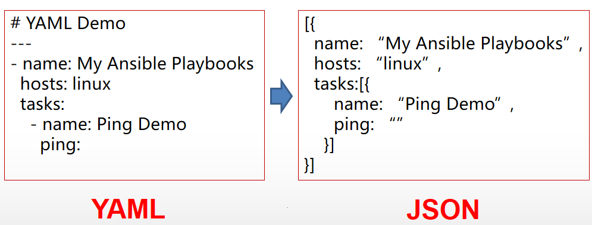
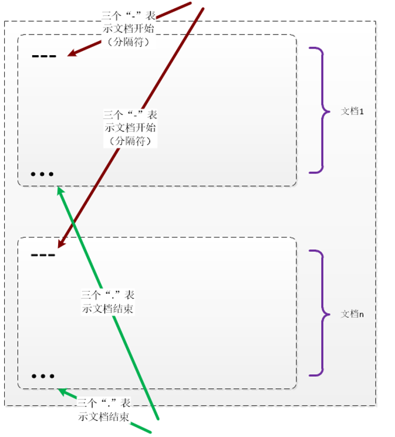
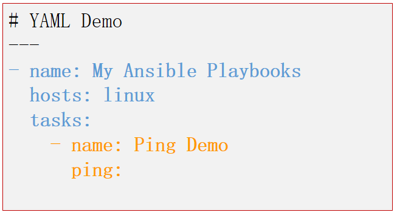
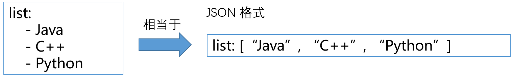

## YAML 设计目标 ##

 + 人类容易阅读

 + 可用于不同程序间的数据交换

 + 适合描述程序所使用的数据结构，特别是脚本语言

 + 丰富的表达能力与可扩展性

 + 易于使用

 + JSON 可以看作是 YAML 的子集

## 一个简单的示例 (与 JSON 作对比) ##

 


## YAML 文件结构 ##

　　`YAML` 文件与 `YAML` 文档可以看成是两个不同的概念，文件通常是指存储介质，而文档是指内容，下面是两者的关系：

+ 一个 `YAML` 文件由一或多个文档组成

+ 每个文档以“---”（三条横线）表示开始，如果只有一个文档时，可不添加

+ 每个文档以“...”（三个点）表示结束（可选）

 

## YAML 格式规范 ##

 + 使用 Unicode 编码（如 UTF-8），完全支持中文

 + 使用空格来嵌套缩进，建议两个空格或四个空格，不建议使用tab

    

 + 使用“#” 来做注释，即在注释前添加 **`#`**

 + 内容由三种基本数据结构组成

    - 标量（数据类型，如字符串，数值等）
    - 序列结构（数组，列表）
    - 键值表（Map）

### 标量（纯量） ###

+ 字符串

    - 使用“” （双引号） 或 ‘’ （单引号）括起来的字符
        + color: "red"
        + ip: '172.22.250.201'

    - 也可以不添加双引号或单引号。（通常对于类似枚举形式数值而言，其他的通常不建议这样）
        + color: red    (枚举量)
        + shell: {{command}}   (错误！，如果字符串中包含特殊字符开头，如 {}，则一定要用引号：`shell:"{{command}}"`)

 + 数值，通常包括十进制整数、十六进制数、小数、浮点数等
    - age: 24
    - number: 12.4
    - hex: 0xFF0000
    - float: 1.2e+3

 + 布尔值

    - success: true
    - status: false

 + 日期类型

    - date: 2017-07-02T02:11:30

 + null 值：**`~`**

    - point: ~

 + 特殊值
  
    - **`.NaN`** 表示无效数字

### 序列（列表、数组） ###

　　序列就是一组数据，通常有以下三种使用方法：

 + (1) 使用 **`"-" + 空格 + 内容`** 表示列表项，一个或多个列表项组成一个序列（数组）

    

 + (2) 由于兼容 `JSON` 格式，因此也可以用 `JSON` 格式定义列表

    ```YAML
     color: [red, green, blue]   # 这里没有使用引号，但值是字符串值
     list: [5, 6]
    ``` 

 + 可以组合使用 (1)、(2) 变成多维数组

    ```YAML
     - color: [red, blue, green]
     - align: [left, center, right]
     - age: 12
    ```
    如果用 `JSON` 表示就是：
    ```JSON
    [{color:[red, blue, green]}, {align:[left, center, right]}, {age:12}]
    ```
    所以从可读性的角度来看，`YAML` 的可读性高一些。

### 键值表（对象结构） ###

　　所谓键值就是指 **`key: value`** 这样的一对键与值。

 + 键值的结构就是 **`key: value`**，要留意在冒号 **`:`** 的后面有一个空格，也就是在 `value` 前要有一个空格。当字符串的第一个字符是空格时，就需要用引号来定义字符串。

    ```YAML
    color: red,         # 要留意 `:` 与 `red` 之间是有一个空格位置
    align: center,
    size: 14
    ```

 + 使用 **`{}`** 来表示一组相关的键值（相当于一个对象）

    ```YAML
    login: true,
    user: {
        name: "David",
        age: 28,
        job: engineer
    }
    ```
    在这种情况下，其实 `{}` 是可以省略，而借助空格缩进来表示一组键值：
    ```YAML
    login: true,
    user:                   # 使用缩进来替代 {}
        name: "David",
        age: 28,
        job: engineer
    ```

 + 如果键是一个 **列表或键值表** 时，就需要使用 **"?"** + 空格来处理

    ```YAML
    ? [red, blue, green]: color,            # 要注意 ? 后面有一个空格位置
    ? {age: 28, job: enginner}: David
    ```

 + 下面是一个复杂示例：

    ```YAML
    ---
    - hosts: db
      vars:  # 键值表，用空格缩进来替代 {}
        version: 1.7
        config: []
        default_config:
          - { key: bootstrap.mlockall, value: "true" }  # 键值表

      tasks:  # 一个列表
        - name: elasticsearch | add repository key
          apt_key: url=http://packages.elasticsearch.org/GPG-KEY-elasticsearch
          tags: elasticsearch

        # 这也是一个键值表，同时也是 tasks 列表的一个元素
        - name: elasticsearch | install
          apt: pkg=elasticsearch state=latest update_cache=yes
          tags: elasticsearch
    ```

### 块结构（用于字符串） ###

 + 使用 "|" + 缩进表示段落。（保留块内段落的回车）

    ```YAML
    # 注意 ":" 与 "|" 之间的空格
    yaml: |  
        JSON的语法其实是YAML的子集，大部分JSON都可以被YAML的解释器解释。
        如果你想更深入的学习YAML，我建议你去 http://www.yaml.org 看看
    ```

 + 使用“>” + 缩进表示一行。（删除内部回车，可以用空行来分段落）

    ```YAML
    # 注意 ":" 与 ">" 之间的空格
    yaml: > 
        JSON的语法其实是YAML的子集，
        大部分JSON都可以被YAML的解释器解释。

        如果你想更深入的学习YAML，我建议你去 http://www.yaml.org 看看
    ```

## 资源 ##

 + [http://www.yaml.org/](http://www.yaml.org/)
