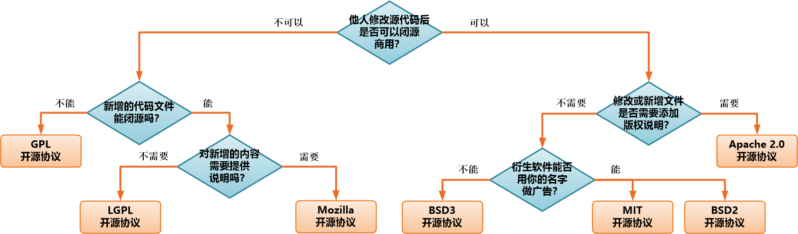
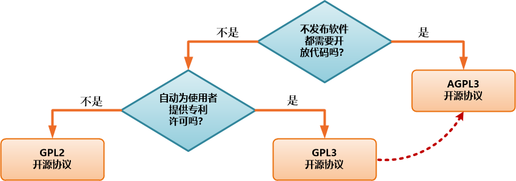

### 1. 内容

　　响应公司合规代的需要，着重介绍开发过程中遇到的开源协议，以及如何选择的问题。

 + **演讲者**：Jai

### 2. 常用开源协议简介与选择

#### 2.1 协议核心内容

 + 授权永久性、全球性、免费、无排他、不可撤消

    - 授权给你使用时，你可以永久使用，不会中途变挂

    - 通常是全球性，不会只针对某个特定国家或区域

    - 源代码免费获取。（当然，也有一些规避手段。。）

    - 无排他性并不会随时撤消（已经授权或发布）

 + 专利使用（代码中包含或实现专利）

 + 软件本身（可执行或二进制代码）

    - 所有开源协议都支持免费使用

 + 软件源代码

    - 所有开源协议的代码，原则上免费获得

#### 2.2 开源协议的选择

　　用图示方式来表示：

  

#### 2.3 GPL 家族选择

　　用图示方式来表示：

  

#### 2.4 其他开源协议

 + CPL（Common Public License）

    - 可开源，可闭源，可混合其他协议

    - 一但使用，不能更改

    - 独立模块不需要开源

 + EPL（Eclipse 开源协议）

    - 继承自 CPL

 + CDDL协议

    - 继承自 MPL，并明确专利许可

#### 2.5 一些常用的软件与开发库

　　下面是一些常用软件与开发库，所使用的开源协议：

 + **MIT**

   - Bootstrap （前端 HTML5 + Javascript 开发框架）

   - Gitea （Git 服务器）

   - Blumind （思维导图软件）

 + **Apache**

   - Apache 基金会所有项目

   - Spring 家族

 + **GPL v2**

   - Linux  （操作系统）

   - MySQL  （数据库系统）

   - Git  （分布式源代码管理系统）

   - HeidiSQL  （MySQL 数据库管理图形客户端）

   - Pencil （设计草图软件，可画流程图、软件界面或手机应用界面图）

 + **LGPL v2**

   - JRadius  （Radius 开发库）

 + **GPL v3**

   - JQuery-easyui

   - Ansible  （运维工具）

 + **AGPL**

   - MongoDB  （NoSQL 数据库管理系统）

 + **EPL**

   - Eclipse 基金会所有项目

#### 2.6 自由软件、免费软件和开源软件

 + **自由软件**：你享有自由使用、分发和拷贝权利

   - Paint.net  （类似 PhotoShop 的图像处理软件）

 + **免费软件**：你可以免费使用，但不一定有复制、修改和分发等权利，或者具有明确的使用者约束条款

   - Visual Studio Code  （微软使用协议）

   - MS SQLServer Express （微软使用协议）

   - 社区版

   - 个人版

 + **共享软件**：通常是指“先使用后付费”的软件

 + **开源软件**：你可以得到软件的源代码，并能按源代码的协议来使用这些源代码

