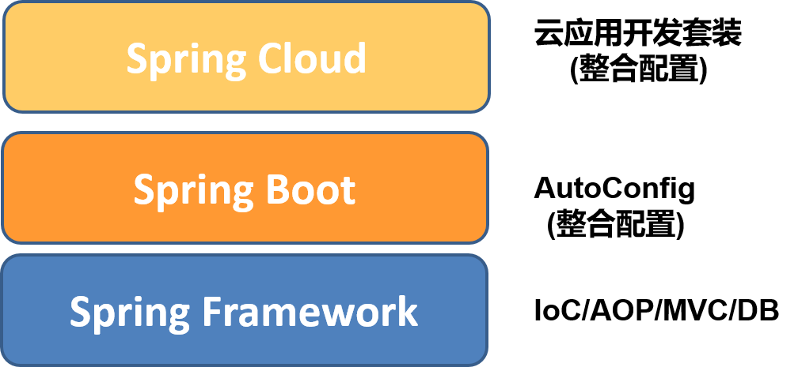
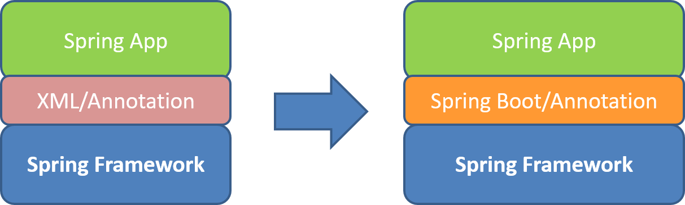
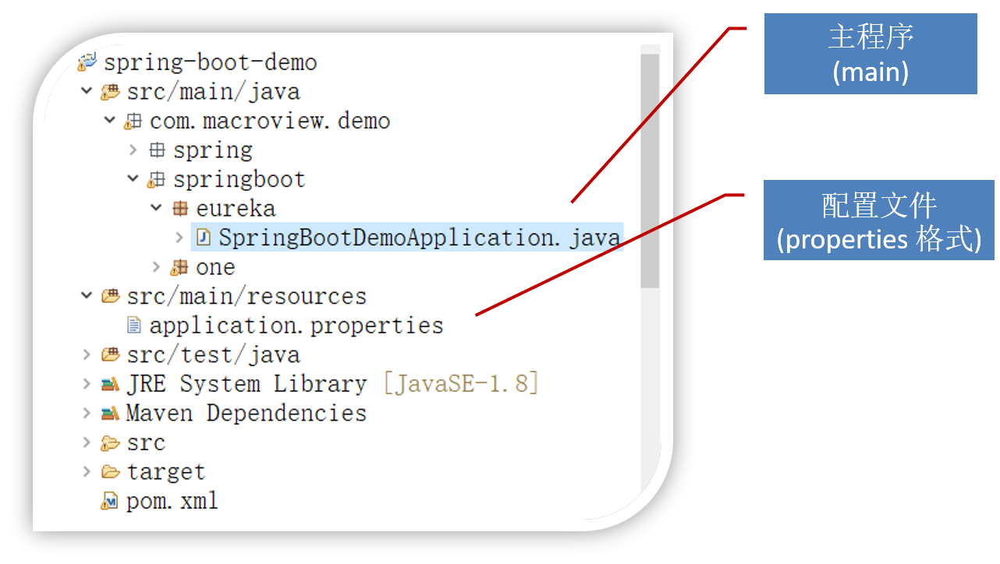
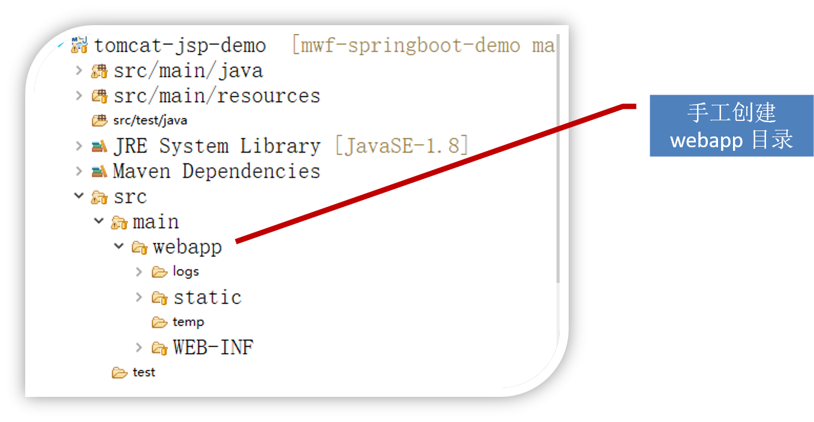
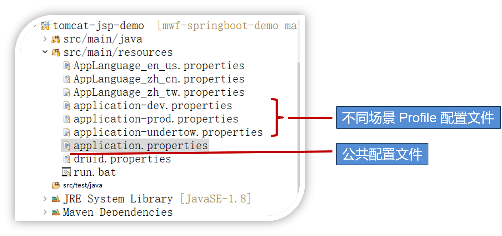
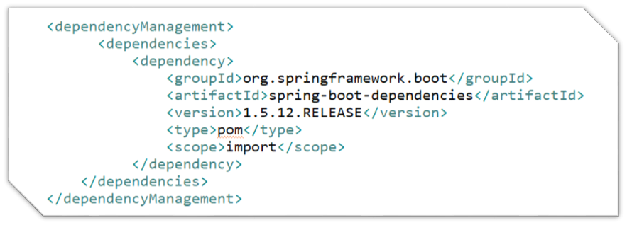
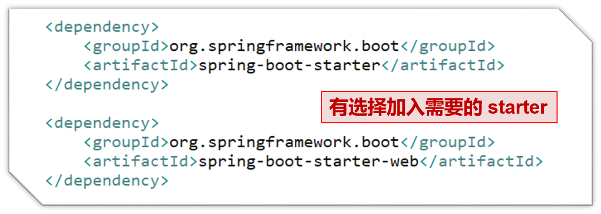
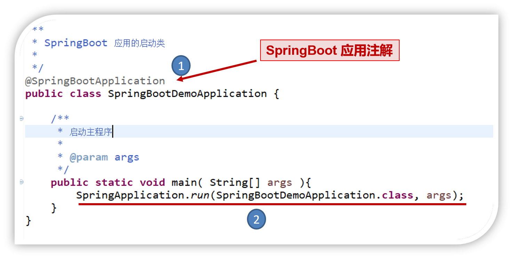
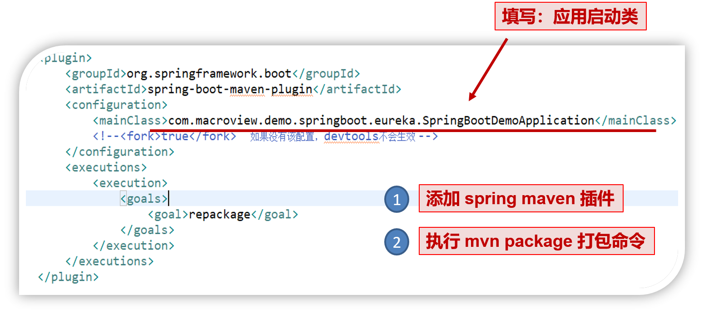


@[toc](目录)

## 1. 内容

　　团队微服务云应用开发技术实践的第一篇

 + **演讲者**：Jai

## 2. 基础架构

 

### 2.1 理解微服务应用架构

 + **一种分布式系统设计思想**

   - 按业务拆分服务

     + 水平拆分：业务、职责拆分

     + 垂直拆分：前后端分离

   - 独立部署与互相隔离

     + 保证服务的高可用性

   - 服务间采取轻量级通讯机制：通讯与协作

     + 通常基于HTTP协议的RESTful API

   - 可以根据具体业务需要，使用不同语言或不同数据库存储

### 2.2 设计与开发原则

 + **微服务拆分原则：扩展立方体**

    - X轴：负载均衡（同一应用多个运行版本）

    - Y轴：功能分解

    - Z轴：数据分割

 

 + **前后端分离原则**

    - 后端微服务只会提供 API 调用

    - 前端应用也是纯粹使用 HTML、CSS、Javascript 构建，简化维护

    - 具体的技术上
    
       + 前端不再局限于 JSP 
       + 前端可选的技术
          - HTML5 + Ajax
          - JSP
          - Thymeleaf 模板
          - NodeJS 

 

 + **无状态服务原则**

    - 无状态服务有更好的维护性和伸缩性

    - 通过将状态保存到分布式缓存中，以将状态业务变成计算节点（状态由服务内转到外部，从而让服务变成无状态服务）

 

 + **通讯 REST + JSON 化**

    - 无状态通讯原则

    - HTTP 协议与应用非常成熟，要安全有安全，要性能有性能

    - 语言无关，轻量简单

    - 除非特殊场景，一般都支持使用 HTTP REST + JSON

### 2.3 微服务（云应用）运行基础设施

 + **Docker（容器）**

    - Docker-Compose (简单的 Docker 编排 系统)

    - OpenShift（基于 k8s 的容器云管理系统）

 + **Kafka（消息与事件系统）**

    - 测试用

      + 单节点 kafka  172.22.251.110:9092
      + 单节点 zookeeper  172.22.251.110:2181

 + **RabbitMQ（传统事件队列）**

 + **Git（版本管理系统）**

 + **Redis（分布式缓存）**

 + **Jenkins（持续集成）**

## 3. Spring Boot 开发基础

### 3.1 Spring Cloud 的基础

　　通过下面图示了解框架位置：

### 3.2 Spring Framework 生态系统

　　从上图可以看到，无论是 `Spring Boot`还是`Spring Cloud`，都是以`Spring Framework`为基础，而`Spring Framework`的生态环境非常丰富，可以用图示如下：

### 3.3 Spring Boot 生态系统

 + **Spring Framework 配置过于繁多**

 + **Spring Boot 为简化配置而生**

   - 引入自动配置架构

   - 提供大量的与第三方的整合类库
     + 主流应用都提供 Spring Boot Starter 
     + 每个整合类库统一称为 Starter

   - 充分使用Maven来管理依赖
     + 简化类库的引用和管理

   - 让自动化生成代码更加容易与简单
     + 引入配置类库，突出重要配置，隐藏配置细节

   - 提倡打包成可执行 jar 包而非war
     + 打包成可执行jar文件，注意便携性
  
 

### 3.4 Spring Boot 应用开发
 
#### 3.4.1 Spring Boot 项目结构

 + **划重点：Spring Boot 应用都是一个 Maven 项目**

 + **Spring Boot 应用并非都是 web 应用**

   - 非Web应用，但通过 Servlet 提供 http 请求支持
     + 嵌入式 Tomcat （同时支持 JSP ）性能一般
     + Jetty（也支持JSP）            性能与Tomcat差不多
     + **Undertow（不支持JSP）  性能高**

   - 对于Web应用，可以打包成 jar 或 war
     + 嵌入式Tomcat，使用 JSP
     + Undertow ，使用 HTML + Ajax 或 Thymeleaf 等

 + **非Web应用（Maven 结构）下的项目结构**

 + **Web应用结构（Maven）（非JSP）项目结构**

 + **Web应用结构（Maven）（基于Tomcat 的JSP）项目结构**

#### 3.4.2 Spring Boot 应用的配置

 + **仍然需要配置，只不多减少配置**
   - 配置文件（一般放在 /src/resources 中）

   - 文件格式
     + Properties 格式（即 key=value 结构，扩展名：properties）
     + YAML格式（推荐，扩展名：yml）

   - 默认文件名称（格式不同，扩展名不同）
     + bootstrap （启动配置，优先级高，可省略）
       - 优先级高、比较固定的配置
     + application（启动后配置）
       - 常用、可变配置

   - Profiles 概念：因应不同场景的配置
     + 支持多种场景配置，如 dev、test、production 等
     + 只有 application 支持 profiles 配置
       - 文件名称格式：application- + profile_name
         + application-dev.yml，application-test.properties
         + application-master.yml，application-slave.yml

     + Profile 配置
       - 可以是独立文件
       - 使用 YAML 格式时，可以放在一个文件中
       - 使用 spring.profiles.active=profile_name 来指定

     + Profile 配置示例

    

     + Profile 配置使用
       - 在 application.yml 中使用 spring.profiles.active 来指定
         + 例如：spring.profiles.active=dev 指 application-dev.properties 文件

       - 通过命令行参数指定: java –jar app.jar –spring.profiles.active=dev

#### 3.4.3 SpringBoot 使用 maven 来管理依赖

 + **在项目的 pom.xml 引入 Spring Boot 依赖**

 

 添加了总的依赖管理之后，项目需要应用本身的需要，添加具体所要的 Starter，例如：

 

 + **常用的几个核心 Starter 简介**

   - spring-boot-starter   基础与核心，这是必选项
   - spring-boot-starter-web  提供 web应用支持
   - spring-boot-starter-tomcat 提供嵌入tomcat支持
      + 不包括 jsp 支持，要另外添加 tomcat-embed-jasper 类库

   - spring-boot-starter-undertow 提供 undertow 支持
   - spring-boot-starter-actuator 提供应用监控支持
      + 例如健康状况、数据量度、JMX等

#### 3.4.4 Spring Boot 应用启动程序

 + **作为可执行jar文件的启动程序** main 方法编写如下：

 

#### 3.4.5 Spring Boot 应用打包

 + **将应用打包成可执行 jar (pom.xml)**

　　有了内容（添加依赖、启动程序等）之后，我们就可以使用 maven 来将项目打包成可执行 jar 文件:

 

 + **执行一个Jar包**
 
   - 最基本：java -jar myprogram.jar
   
   - JDK9+ 的执行方法：java -jar --add-modules java.xml.bin myprogram.jar

   - 使用 Profile：java -jar myprogram.jar --spring.profiles.active=name

   