
@[toc](目录)

### 1. 内容

　　团队微服务云应用开发技术前瞻。

 + **演讲者**：Jai

### 2. 传统云应用架构

 + **传统的云应用架构**

 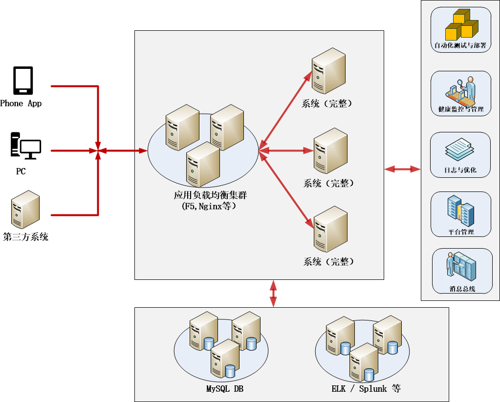

   - 只是简单将完整系统运行在主机上

   - 缺点：
   
     + 随着需求增加，系统增大

     + 开发难度加大

     + 可扩展性变差

     + 测试难度加大

     + 部署举步维艰

     + 可用性与可靠性变差

     。。。

### 3. 微服务云应用架构

 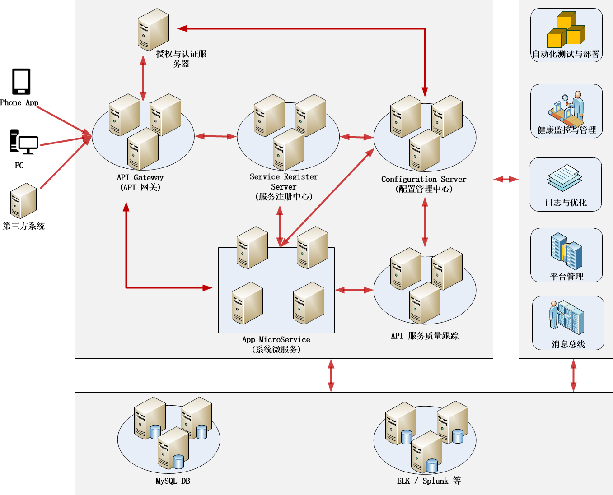

#### 3.1 优点与不足

 + **以微服务+DOCKER方式运行**

 + **优点：**

    - 复杂度可控（应用分解带来）

    - 微服务的独立部署（不需整体部署，可并行部署）

    - 技术选型灵活（跨组跨部门可选技术，重构容易）

    - 容错性好（微服务相互隔离，利于提供多种容错手段）

    - 更好扩展性

 + **开发角度，带来下面实在的好处**

    - 开发效率更高

    - 沟通成本更低

    - 响应速度更快

    - 迭代周期更短

 + **微服务架构的不足**

    - 服务间的调用带来性能耗损
    
    - 跨服务间的测试更加复杂
    
    - 分布式系统带来的固有复杂性
    
    - 运维更具挑战性
    
    - 强一致性（事务）的妥协（数据库方面）

#### 3.2 解微服务应用架构

 + **一种分布式系统设计思想**

   - 按业务拆分服务

     + 水平拆分：业务、职责拆分

     + 垂直拆分：前后端分离

   - 独立部署与互相隔离

   - 保证服务的高可用性

   - 服务间采取轻量级通讯机制：通讯与协作

   - 通常基于HTTP协议的RESTful API

   - 可以根据具体业务需要，使用不同语言或不同数据库存储

#### 3.3 设计与开发原则

 + **微服务拆分原则：扩展立方体**

    - X轴：负载均衡（同一应用多个运行版本）

    - Y轴：功能分解

    - Z轴：数据分割

 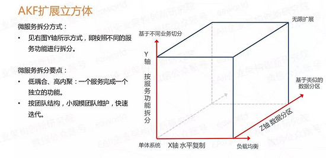

 + **前后端分离原则**

    - 后端微服务只会提供 API 调用

    - 前端应用也是纯粹使用 HTML、CSS、Javascript 构建，简化维护

 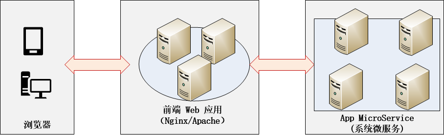

 + **无状态服务原则**

    - 无状态服务有更好的维护性和伸缩性

    - 通过将状态保存到分布式缓存中，以将状态业务变成计算节点（状态由服务内转到外部，从而让服务变成无状态服务）

 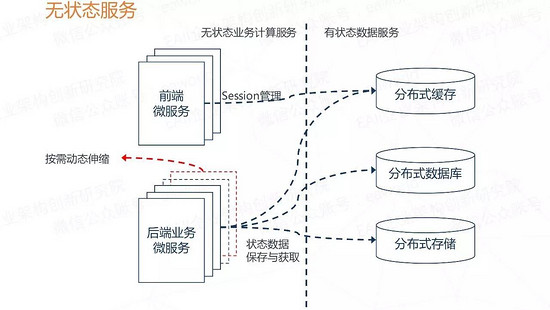

 + **通讯 REST + JSON 化**

    - 无状态通讯原则

    - HTTP 协议与应用非常成熟，要安全有安全，要性能有性能

    - 语言无关，轻量简单

    - 除非特殊场景，一般都支持使用 HTTP REST + JSON

 + **传统与具体的一个对比**

 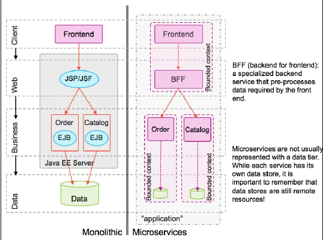

#### 3.4 微服务体系结构简介

 + **API Gateway（Api 网关）**

   - 为体系（或子系统）提供统一的访问入口
   
   - 在统一访问的基础上，能够实现
   
      + 访问的认证与授权（策略控制）
      
      + 动态路由
      
      + 服务迁移
      
      + 负载均衡
      
      + 限流、降级等反向代理
      
      + 测试规划
      
        - 压力测试

        - 金丝雀测试（灰度测试）

 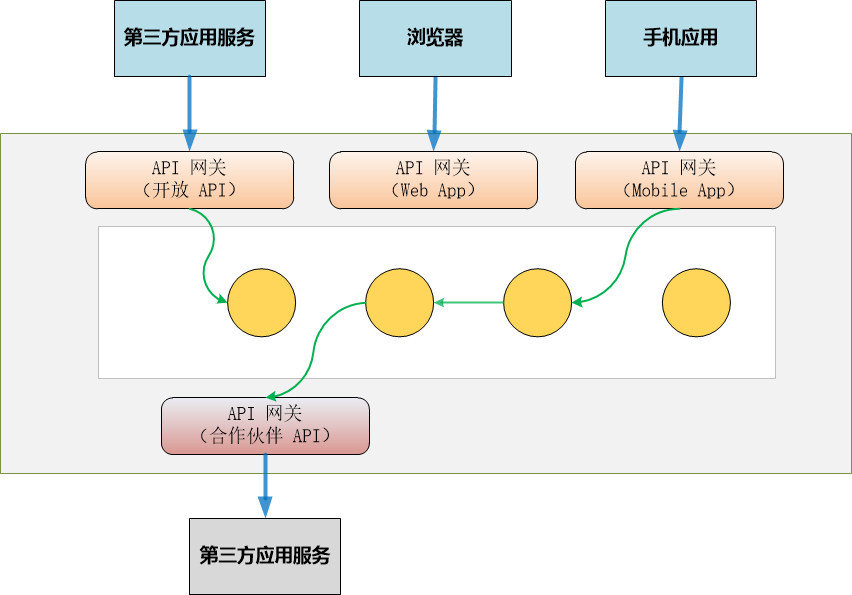

+ **服务注册中心（Service Register Server）**

   - 所有微服务都会注册在中心
   
   - 注册中心提供功能（服务器端）
   
      + 服务注册
      
      + 服务下线
      
      + 服务续约
      
      + 剔除失效服务
      
   - 客户端

      + 服务获取
      
      + 服务调用
      
      + 容错

 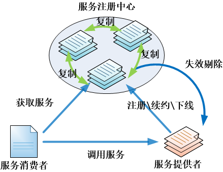

 + **配置管理中心（Configuration Server）**

   - 分布式配置管理中心
   
      + 每个服务都有可能包含不同类型的配置
         
         - 开发环境、测试环境和生产环境

   - 提供的常用功能
   
      + 提供统一、集中配置管理

         - 配置一致性

      + 不同环境提供不同配置

         - 开发、测试和生产
      
      + 运行期间的动态配置更新
      
      + 配置版本管理（回滚）

 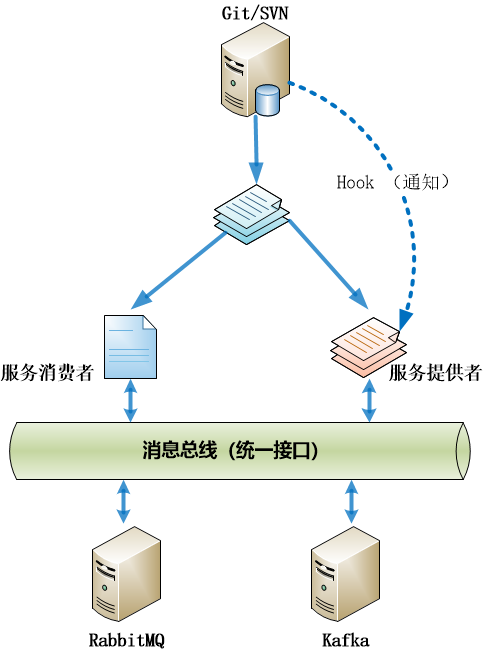

 + **授权与认证服务（策略控制）**

    - 通常是身份认证与安全控制

    - 服务提供的功能

       + 安全、简单和开放
       
       + 服务无状态

       + 能跨语言、跨服务（甚至跨域）调用传递

       + 具有足够性能

       + OAuth2/JWT

          - JWT: JSON Web Token

 + **断路器与容错机制**

   - 分布式系统中不可避免失败，所以需要建立一种有效的防御机制来避免和隔离失败

   - 断路器或容错机制需要面对：

      + 隔离：线程隔离，信号量隔离。避免个别服务故障扩大。

      + 熔断：当失败率达某阈值时，触发快速失败

      + 降级：超时降级、熔断降级，可以使用回调返回保底数据

      + 缓存：请求缓存、请求合并

      + 实时监控与报警

 + **分布式服务追踪与日志整合**

   - 根据服务的划分，带来就是一个业务会由多个服务协作完成，形成调用链。

   - 我们需要追踪和监控这些链路，最终掌握服务的工作质量

     + 每个调用的实时数据收集

     + 数据存储

     + 数据分析与展示

 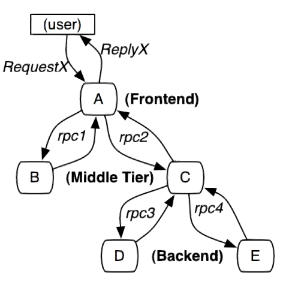

 + **消息总线与消息驱动**

   - EDA：事件驱动架构，本身就是一个应用广泛的设计与开发思想。消息发布者只关注消息的发布，而消费者只关注自己感兴趣的消息。

   - EDA 带来的好处：

     + 低耦合

     + 持久性

     + 高可扩展性

     + 高灵活性

 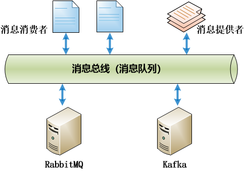

 + **运行环境平台管理**

   - 使用 Docker 作为每个微服务的运行容器

   - 引入 Docker 管理平台

      + OpenShift Origin （RadHat）

         - 基于 Docker + Kubernetes 

      + Kubernetes（CNCF）

 

 + **其他内容**

   - 数据存储

      + MySQL

      + Splunk

      + ELK

      + Redis

   - 消息忠线

      + RabbitMQ/Kafka

   - DevOps

      + Jenkins  --- 持续集成

      + Git  --- 源代码管理

      + Ansible --- 运维

   - ...

 + **云应用开发框架**

   - Spring Cloud 全家桶

      + 基础：Spring Framework + Spring Boot

   - Dubbo （阿里巴巴）

      + Spring Framework + zk

   - Vert.X （Eclipse 基金会）

      + 异步消息总线（自成系统）

#### 3.5 Spring Cloud 全家桶

 + **Spring 家族**

   - Spring Framework  -- 基础

   - Spring Boot -- 应用整合

     + 简化配置

     + 大量应用整合

   - Spring Data 数据存取

   - Spring Cloud 云应用整合

   - Spring Security -- 安全

 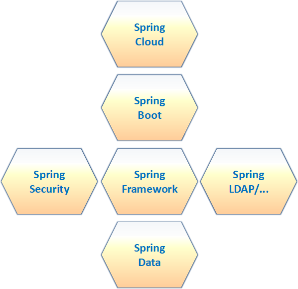

 + **Spring Cloud 全家桶**

   - 提供完整微服务开发框架

   - API 网关

     + Spring Cloud Netflix Zuul

     + Spring Cloud Gateway

   - 服务注册中心

     + Spring Cloud Netflix Eureka

     + Spring Cloud Consul

     + Spring Cloud ZooKeeper

   - 配置管理中心
   
     + Spring Cloud Config

   - 授权与认证服务

     + Spring Cloud Security

   - 断路器与容错处理

     + Spring Cloud Netflix Hystrix

   - 分布式服务追踪与日志整合

     + Spring Cloud Sleuth

     + Spring Cloud Zipkin

   - 消息总线与消息驱动

     + Spring Cloud Stream

     + Spring Cloud Bus

   - 其他

     + 客户端负载均衡：Spring Cloud Ribbon

     + REST 声明式编程：Spring Cloud Feign

     + ....

