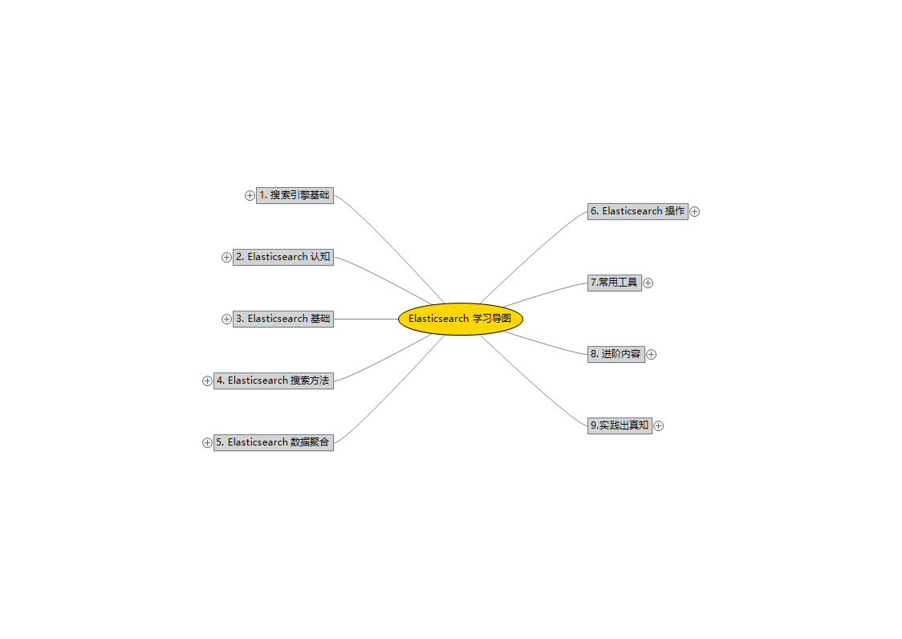
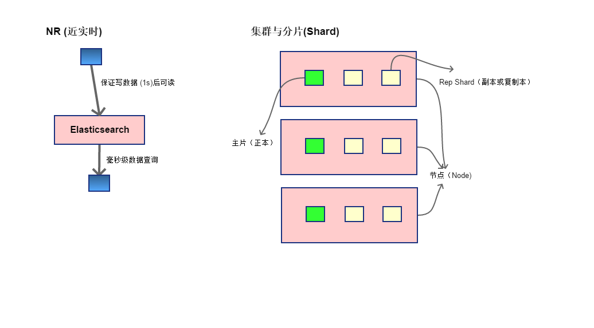
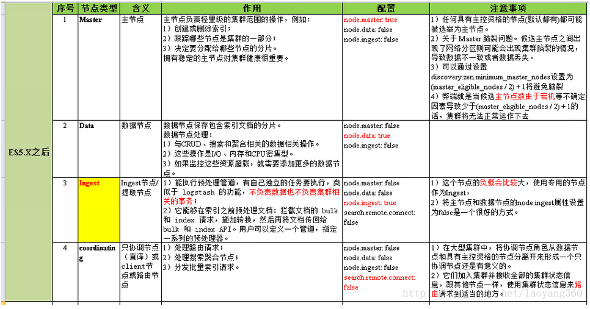
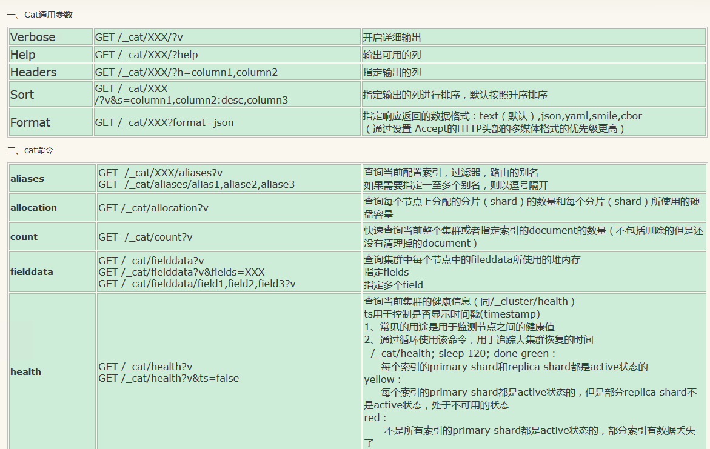
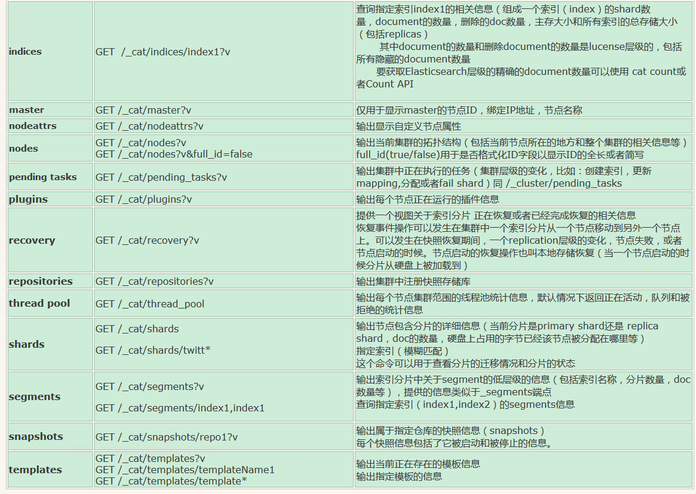
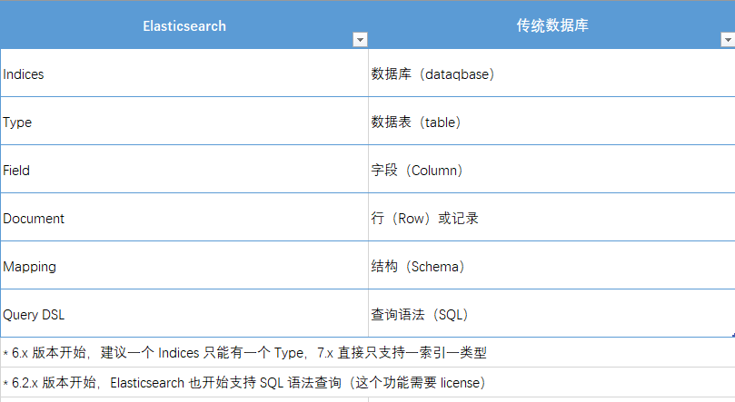
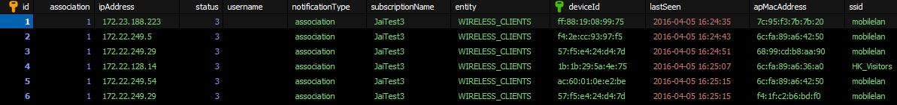
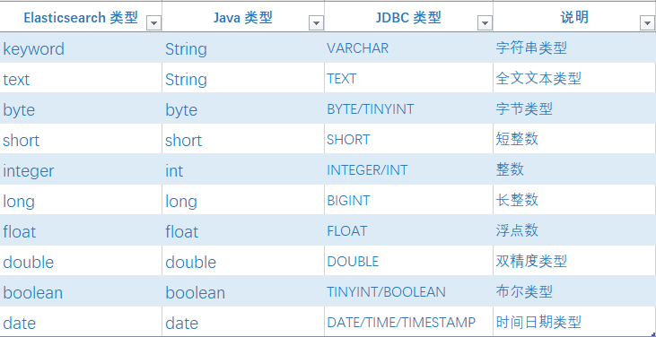
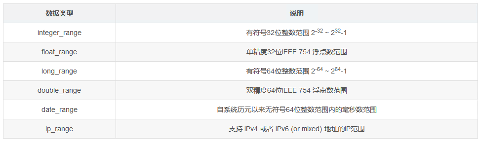
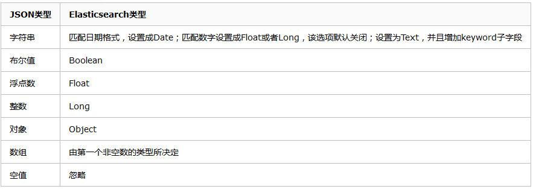

@[toc](目录)

## 1. 前言 ##

### 1.1 说明 ###

　　`Elasticsearch`入门使用教材，主要包括：

 + 历史与使用场景
  
 + 基础原理与概念

 + 数据操作（增、查与统计）

### 1.2 学习导图 ###



<br>


<br>

### 1.3 适应版本 ###

　　本文档适应的 `ES` 版本为 `7.x`，重点是 `7.4`

## 2. 历史与使用场景 ##

　　`Elasticsearch` 是建立在 `Apache Lucene`（搜索引擎）基础上的，分布式高性能文本存储、搜索与分析服务器。

　　`Elasticsearch`为各种类型的文本数据（结构文本或非结构文本，数据，地理信息等），提供实时搜索与分析。应用场景通常包括：

 + 为系统或网站提供一个搜索功能
 + 存储与分析日志，量度数据或涉及安全的事件数据
 + 机器学习建模实时数据
 + 商务流程自动化数据存储
 + 用于GIS(地理信息系统)管理、整合和分析特定信息
 + 。。。

## 3. 基础原理与概念 ##

　　`Elasticsearch`与我们常用的数据库系统（如MySQL）不同，它是基于称为文档的形式保存，因此没有传统的`行`或`列`的概念，代之以 `JSON` 格式来存储复杂的数据结构（信息）。

　　由于`Elasticsearch`是分布式系统，因而当多个 `Elasticsearch`组成一个集群时，文档将会被`交叉`存储于多个节点，并且我们从任意一个节点，都可以查询这些文档。

　　`Elasticsearch` 的查询速度优势在于：

 + 对文本建立反向索引，能够非常快速进行全文搜索 （数字与地理信息则会做成 `BKD` 树）
 + 尽量将搜索放在内存中进行（所以内存越大，搜索效率越高）
 + 当多个分片（集群）存在时，会在分片上进行并发搜索，最后汇总到主片形成结果

　　因为上述优势，所以能战胜 `MongoDB` 成为以速度统计为目的的，文本信息存储主力。

　　`Elasticsearch` 作为与传统不同的数据存储系统，有着自己固有的概念与数据组织形式，下面进行描述。

### 3.1 系统层面：集群、节点与片 ###


 

<br>

#### 3.1.1 集群 ####

　　`ES`是一个分布式的搜索引擎系统，所以通常是以集群形式存在并提供服务。

 + 集群健康状态：`GET /_cluster/health`

#### 3.1.2 节点 ####

　　`节点` 是指集群中的一台服务器。如果按功能来区分，可以有以下几种节点：

 + 主节点：所有功能集中于一身的节点，包括管理、数据存储与操作等。作为管理者时，健康状态是监控与关注的重点。

 + 数据节点：只提供数据的存储、搜索等功能（不包括管理）。数据节点对 cpu、内存与 io 要求高，资源利用率真是监控与关注的重点。

 + 客户端节点：只处理路由请求，处理搜索，分发索引操作，负载均衡等。

   - 使用官方提供的 Java API 可以将应用作为客户端

 + `Ingest` 节点：数据索引前预处理节点，简单些就是数据--提取、转换、加载节点。（从数据节点分离出来功能节点）

 

　　下面是建议：

 + 小规模的集群：例如 3 个节点，通常每个节点都是主节点，以保证管理与数据不出问题。

 + 中、大规模的集群

   - 主节点与数据节点分离
   - 主节点 3 个或以上，保证集群的健康管理，而数据节点可以根据需求增，减。
   - 如果用户请求比较频率（如大量的搜索请求工作），则可以添加独立的客户端节点，专负责请求转发与负载等
   - 如果需要对添加的文档进行预处理，如添加内容，删除内容（清洗数据等），可以添加独立的 `Ingest` 节点


#### 3.1.3 片 ####

　　`shard(片)` 是最小的文档存储单元，所有文档都会按照索引的分片设置进行存储。

 + `primary shard`（主片）：用于数据的存储、搜索等处理

   - 主片用于数据水平扩展，即添加节点时的扩展
   - 每个文档只会存储在一个主片当中，而整个索引分被分布到所有主片中
   - 索引建立时设置主片数量，并且一但设置不能修改，默认为5个

 + `replica shard`（副本）：用于数据的备份与搜索（读操作）

   - 副本主要用于备份，兼顾搜索（读），提高搜索性能
   - 一个主片会对应一个或多个副本，默认是 1 个主片对应一个副本，5 个主片则有10个副本
   - 副本可以在使用过程中动态修改
   - 在超过一个节点的集群中，通常主片与对应的副本不会在同一个节点上

#### 3.1.4 _cat RESTful API 操作 ####

　　对于节点、分片、索引、健康状态等等的信息、状态查看，可以通过 `_cat API` 进行： 

 
 

<br>

#### 3.1.5 健康程度的颜色表示 ####

 + `Green`：主片和副本都正常分配
 + `Yellow`：主片正常分配，有副本未能正常分配
 + `Red`：有主片未能分配

### 3.2 索引与文档基础 ###

　　`Elasticsearch`称为文档存储系统，所有数据以 `JSON` 格式存储在叫 `Indices`（索引）中。`Indices` 常翻译为 `索引`，但要与传统数据库中的`索引`区别开来。

 + 所有数据存储在`索引`当中
 + `索引`的数据格式为 `JSON` 格式
 + `JSON`的字段名与字段类型，组成了一个叫 `Type`（类型）
 + `索引`中所存储的每个数据，又叫 `Document`（文档）

　　下面我们可以将这些概念与传统数据库作一个对比来加深理解：




　　要留意，同传统数据库相比，一个数据库中可以有1个或多个（乃至成百上千个）表，在 `Elasticsearch`的新版本中，一个 `Indices`只能有一个 `Type`（即一个数据库只能有一个表），目的就是避免麻烦与提高效能。

　　在 `6.x` 之前的版本，`Elasticsearch`仅支持自己特有的 `Query DSL`（查询语法）来操纵数据，到了 `6.x`之后，在安装了免费许可的情况下，`Elasticsearch`也可以使用 `SQL`（语法）来操纵数据。不过，无论如何 `Query DSL`仍是全面而核心的数据操纵语法。

　　通过上面的对比，可以知道，对应传统数据库的记录，在 `ES`中称之为`文档`，下面是对比的示例：

 + 传统数据表记录

 

<br>

 + 在 `Elasticsearch`中的记录（文档），则是以 `JSON` 格式存在，下面是搜索结果示例：

```json
{
    "took": 30,
    "timed_out": false,
    "_shards": {
        "total": 1,
        "successful": 1,
        "skipped": 0,
        "failed": 0
    },
    "hits": {
        "total": {
            "value": 2,
            "relation": "eq"
        },
        "max_score": 11.991367,
        "hits": [
            {
                "_index": "bank",
                "_type": "_doc",
                "_id": "6",
                "_score": 11.991367,
                "_source": {
                    "account_number": 6,
                    "balance": 5686,
                    "firstname": "Hattie",
                    "lastname": "Bond",
                    "age": 36,
                    "gender": "M",
                    "address": "671 Bristol Street",
                    "employer": "Netagy",
                    "email": "hattiebond@netagy.com",
                    "city": "Dante",
                    "state": "TN"
                }
            },
            {
                "_index": "bank",
                "_type": "_doc",
                "_id": "VwgtFm4BOh15qQ1Q4fj-",
                "_score": 5.9956837,
                "_source": {
                    "account_number": "1024",
                    "address": "671 Bristol StreetT",
                    "age": "38",
                    "balance": "8372",
                    "city": "DanteT",
                    "email": "hattiebondT@netagy.com",
                    "employer": "NetagyT",
                    "firstname": "HattieT",
                    "gender": "M",
                    "lastname": "BondT",
                    "state": "TN"
                }
            }
        ]
    }
}
```

　　通过对比，很容易感受到两者之间的差异。

#### 3.2.1 索引的创建要义 ####

　　`Elasticsearch`（免费版，后面所讲的都是免费版的情况）本身没有命令行之类的内容，也没有`强劲`的操纵界面，我们要与 `Elasticsearch`通讯交互，都是通过 `HTTP RESTful`来进行，具体的内容在后续章节有详细的说明。在这里，我们只需要知道，`HTTP RESETful API`是我们唯一与 `Elasticsearrch`打交道的工具。

　　所以，对于索引的名称定义，我们都建议尽量符合 `URL` 的编码规范。（即尽量以字母与数字来命名，避免一些需要编码的符号等字符）。下面的是关于索引名称的规则：

 + 对于字母，通常使用小写。（或者说只支持小写字母）
 + 不能使用的字符包括：`\`、`/`、`*`、`?`、`"`、`<`、`>`、`|`、`空格`、`,`、`#`、`:`
 + 不能以 `-`、`_`、`+`开头
 + 不能只是 `.`、`..`
 + 不能超过 255 个字符（不是字，是字符）


　　下面是开始使用 `Elasticsearch` 存储数据的建议：

 + 定义索引名称。（给数据库起名）
 + 收集与确定字段的名称与类型（表字段名称与类型）
 + 使用字段信息构建 `Mapping`(即每个数据的 JSON 应有结构，类似数据库中构建表结构)
 + 使用 `HTTP RESTful API`创建索引
 + 向索引中添加数据等（操纵数据）

　　另外，对于 `Mapping`，其实 `Elasticsearch`并没有强制要求，我们只需要给出索引名，`Elasticsearch`就会自动生成一个默认的 `Mapping`，当我们添加数据到索引时，`Elasticsearch`就会根据数据的内容，推断出数据的类型（并非百分百准确），然后自动转换或匹配那个默认的 `Mapping`，这是一种偷懒与取巧方法。对于数据结构比较简单，类型比较单一时，这不失为快捷方法，而对于数据结构比较复杂，类型多样时，人工构建正确的 `Mapping`，会非常有利于数据的操纵（搜索与统计）。

#### 3.2.2 索引的创建方法 ####

　　正如上面所述，`HTTP RESTful API`是我们唯一与 `Elasticsearch` 通讯的方法，所以我们创建索引也就是 `Post`与`Put`的操作。

　　由于免费版的 `Elasticsearch`不提供认证功能（是祼库），所以我们不需要预先要做认证工作，可以直接使用 API 来进行操作。

　　索引的创建基本上有两种方法：
 
 + 快速创建：即使用默认的字段映射（Mapping）来创建

 + 完整创建：使用自定义的字段映射（Mapping）来创建

　　无论是那种创建方法，`API`请求路径是一样的，不同的是参数：

 **`PUT /<索引名称>`**

 + HTTP 请求方法：**`PUT`**

 + 请求路径：**`/<索引名称>`**

   - 请求很简单，仅需要一个 `索引名称` 即可
   - 注意索引名称的 `命名规范`
     
 + 请求参数：（请求路径后可加一些可选参数）

   - `wait_for_active_shards`
   - `timeout`

 + 请求数据：（由于是 PUT，通过 playload 发送数据）

　　从操作来说，`ES`操作索引可以是很简单，也可以很复杂。如果对索引没什么要求（性能等），索引创建起来就很简单，只需要一个索引名称即可，下面演示了从简单到复杂的操作。

 + (1) **`PUT /<index>`** 不带任何参数，即创建一个新的空索引

    ```shell
      PUT /bank
    ```

    索引创建后，我们就可以添加：

    - 索引设置 `Settings`
    - 索引映射 `Mapping`
    - 索引的别名 `alias`

 + (2) **`PUT /<index>/_doc/<_id>`** 或 **`POST /<index>/_doc`** 直接发送文档数据，此时会发生两件事：

    - 如果索引不存在，会创建此索引
    - 自动分析上传数据，根据数据的类型，动态创建映射
    - 当然，如果有模板匹配的话，会自动匹配映射模板

    ```shell
       PUT /bank/_doc/1
    ```
    **Request Body:**
    ```json
      {
        "account_number":1,
        "balance":39225,
        "firstname":"Amber",
        "lastname":"Duke",
        "age":32,
        "gender":"M",
        "address":"880 Holmes Lane",
        "employer":"Pyrami",
        "email":"amberduke@pyrami.com",
        "city":"Brogan",
        "state":"IL"
      }    
    ```
     自动检查判断，字段 `account_number` 为数值类型，而`firstname`则为字符串类型等等 

 + (3) **`PUT /<index>`** 创建索引同时，添加设置

    ```shell
      PUT /bank
    ```
    **Request Body:**
    ```json
      {
          "settings" : {
              "number_of_shards" : 3,
              "number_of_replicas" : 2
          }
      }
    ```

 + (4) **`PUT /<index>`** 创建索引同时，也定义了字段映射

    ```shell
      PUT /student
    ```
    **Request Body:**
    ```json
      {
        "mappings": {
          "properties": {
            "age":    { "type": "integer" },  
            "email":  { "type": "keyword"  }, 
            "name":   { "type": "text"  }     
          }
        }
      }
    ```    

 + (5) **`PUT /<index>`** 创建索引同时，也添加设置与定义字段映射

    ```shell
      PUT /student
    ```
    **Request Body:**
    ```json
      {
        "mappings": {
          "properties": {
            "age":    { "type": "integer" },  
            "email":  { "type": "keyword"  }, 
            "name":   { "type": "text"  }     
          }
        },
        "settings" : {
            "number_of_shards" : 3,
            "number_of_replicas" : 2
        }
      }
    ```    

### 3.2.3 索引删除 ###

　　我们对不需要的索引可以进行删除，不过删除操作是个 `危险` 的动作，在进行删除之前要谨慎，再三确认才删除。

 + 请求范式：**`DELETE /<index-name>`**

　　删除是简单而 `爽快` 的，所以要三思：

 ```shell
   DELETE /bank
 ```

<br>

### 3.3 索引的设置 ###

　　索引是以`倒排索引`方式存储在存储设备上，因此索引形式、存储结构等可以因应需要进行调整，从而在底层上影响到索引的搜索效率与存储性能。

　　索引的设置比较多，并且分成两大类：

 + 静态设置：表示在索引创建时就必须要设置，一但设置就不能修改
 + 动态设置：表示在索引创建时可以设置，在索引创建后的使用过程中，仍然可以修改

#### 3.3.1 静态参数 ####

　　`静态参数` 就是一但设置就无法变更，所以要 `审慎` 对待，下面是设置的内容：

 + **`index.number_of_shards`**：主分片数，默认为 `1`，最大为 `1024`（每索引），这个最大值可以通过启动参数进行修改。
 + `index.shard.check_on_startup`：打开分片时，是否检测分片好坏（从而是否阻止分片的打开）。检测项越多，耗时越长。这个参数可选值：

   - `false`：不检测，这是默认值
   - `checksum`：只检测是否物理损坏
   - `true`：同时检测物理与逻辑损坏

 + `index.codec`：数据存储时所使用的压缩算法，可选值：

   - `default`：使用 `LZ4`算法，这是性价比均衡的算法，为默认值
   - `best_compression`：使用 `DEFLATE`算法，提供高压缩比，但降低存储速率，如果想高压缩率，同时不在意存储或搜索速度时，可用这个算法。

 + `index.routing_partition_size`：路由分区数，如果设置了该参数，其路由算法为： (hash(_routing) + hash(_id) % index.routing_parttion_size ) % number_of_shards。如果该值不设置，则路由算法为 hash(_routing) % number_of_shardings，_routing默认值为_id。此值默认为 `1`，并且必须小于 `index.number_of_shards`（仅为 `1` 时相等）

 + `index.load_fixed_bitset_filters_eagerly`：指示是否为嵌套查询预加载缓存过滤器，默认值为 `true` ，可改为 `false`来关闭

#### 3.3.1 动态参数 ####

　　`动态参数` 表示在索引的使用过程中，可以随时进行变更。

 + **`index.number_of_replicas`**：主片的副本数，默认为 `1`。

 + `index.auto_expand_replicas`：根据集群中数据节点的数量自动扩展副本的数量，设置为以破折号分隔的下界和上界（例如0-5），或将all用于上界（例如0-all），默认为false（即禁用）

 + `index.search.idle.after`：分片在被认为是搜索空闲之前不能接收搜索或获取请求的时间，默认为 `30s`

 + `index.refresh_interval`：多久执行一次刷新操作，使最近对索引的更改对搜索可见，默认为 `1s`，可以设置为 `-1` 以禁用刷新。

 + `index.max_result_window`：此索引的搜索from + size的最大值，默认为`10000`，搜索请求占用的堆内存和时间与from + size成正比。

 + `index.max_inner_result_window`：from + size的最大值，用于将内部命中定义和顶部命中聚合到此索引，默认为 `100`

 + `index.max_rescore_window`：在此索引的搜索中，rescore请求的window_size的最大值，默认为 `index.max_result_window`，其默认值为 `10000`

 + `index.max_docvalue_fields_search`：查询中允许的docvalue_fields的最大数量，默认为 `100`，Doc_values 字段代价高昂，因为它们可能导致每个字段每个文档的搜索。

 + `index.max_script_fields`：查询中允许的最大 `script_fields` 数量，默认为 `32`

 + `index.max_ngram_diff`：NGramTokenizer和NGramTokenFilter的min_gram和max_gram之间允许的最大差异，默认为 `1`

 + `index.max_shingle_diff`：对于ShingleTokenFilter，max_shingle_size和min_shingle_size之间允许的最大差异，默认为 `3`

 + `index.blocks.read_only`：设置为 `true` 使索引和索引元数据只读，设置为 `false` 允许写入和元数据更改

 + `index.blocks.read_only_allow_delete`：与 `index.blocks.read_only` 相同，但是允许删除索引来释放资源。

 + `index.blocks.read`：设置为 `true` 以禁用对索引的读取操作

 + `index.blocks.write`：设置为 `true` 可禁用对索引的数据写操作，与 `read_only` 不同，此设置不影响元数据

 + `index.blocks.metadata`：设置为 `true` 可禁用索引元数据的读写

 + `index.max_refresh_listeners`：索引的每个片上可用的刷新侦听器的最大数量，这些侦听器用于实现 `refresh=wait_for`

 + `index.analyze.max_token_count`：使用_analyze API可以生成的最大令牌数量，默认为 `10000`

 + `index.highlight.max_analyzed_offset`：

    为高亮显示请求分析的最大字符数，此设置仅适用于在索引没有偏移量或术语向量的文本上请求高亮显示时，默认为 `1000000`。

 + `index.max_terms_count`

    可以在 `terms` 查询中使用的术语的最大数量，默认为 `65536`。

 + `index.max_regex_length`

    可用于 `Regexp` 查询的正则表达式的最大长度，默认为 `1000`。

 + `index.routing.allocation.enable`

    控制此索引的分片分配（集群中节点变化时），它可以被设置为：
      - `all`（默认值）— 所有类型的分片都可以重新分配。
      - `primaries` — 只允许主分片分配。
      - `new_primary` — 只允许分配新创建的主分片。
      - `none` — 所有的分片都不允许分配。

 + `index.routing.rebalance.enable`

    启用此索引的分片重新平衡，它可以被设置为：
      - `all`（默认值）—允许对所有分片进行再平衡。
      - `primaries` — 只允许对主片进行再平衡。
      - `replicas` — 只允许对副本进行再平衡。
      - `none` — 不允许对任何分片进行再平衡。

 + `index.gc_deletes`

    已删除文档的版本号仍可用于进一步版本化操作的时间长度，默认为 `60s`。

 + `index.default_pipeline`

    此索引的默认摄取节点管道，如果设置了默认管道且管道不存在，则索引请求将失败，可以使用 `pipeline` 参数重写默认值，特殊管道名称 `_none` 表示不应该运行摄取管道。

#### 3.3.2 修改动态参数 ####

　　上面已经说过，我们可以在使用过程中来调整索引的动态参数，下面是设置方法：

 + 请求范式：**`PUT /<index>/_settings`**

   请求体：（与创建索引一致，只是不再需要放在 `_settings` 字段下）
   ```json
     {
       "参数1": "值",
       "参数2": "值",
       "参数n": "值
     }
   ```  

 + 设置动态参数示例：

   ```shell
     PUT /students/_settings
   ```
   ```json
     {
       "index": {
         "number_of_replicas": 3
       }
     }
   ```
   将 `index.number_of_replicas` （副本数）修改为 `3`  

 + 恢复默认值。我们可以将参数的值设置为 `null` 来重置为默认值。

   ```json
     {
       "index": {
         "number_of_replicas": null
       }
     }
   ```
   将副本数重置回默认值

 + 修改字段的分词器

   由于 `分词器` 与索引字段内容有着比较密切的关系，因此修改字段内容的 `分词器`需要有一个过程（注意：修改字段的查询分词器，则不需要如此），下面是示例：

   - 第一步：首先要关闭索引

     ```shell
      POST /my_index/_close
     ```

   - 第二步：修改索引字段的分词器

     ```shell
      PUT /my_index/_settings
     ```
     ```json
        {
          "analysis" : {
            "analyzer":{
              "content":{
                "type":"custom",
                "tokenizer":"whitespace"
              }
            }
          }
        }
     ```

   - 第三步：打开索引（打开关闭的索引）

     ```shell
      POST /my_index/_open
     ```
     `ES` 会对打开的索引内容进行重新处理（甚至包括使用分词器重新处理索引）


### 3.4 索引的映射 (Mapping) ###

　　索引映射，是指索引文档的字段类型定义。在 `ES` 中，字段类型非常丰富，可以根据需要而定义。明确的类型，有利于提高搜索性能，也有利于准确搜索结果，所以通常情况下，会建议创建明确的映射。

　　同样，映射也包含了两类：

 + 动态映射：是指 `ES` 根据传入的文档来分析，从而推断出字段所属类型。这种方式可能无法准确推断出正确的类型。
 + 静态映射：是明确定义字段的类型，除非没必要，通常会推荐这种方法

#### 3.4.0 映射操作 RESTful API ####

 + 查看所有索引：**`GET /_mapping`**

 + 查看：**`GET /<index-name>/_mapping`**

  ```shell
    GET /students/_mapping
  ```

 + 添加：**`PUT /<index-name>/_mapping`**，既可以添加完整 `mapping`，也可以在原有基础上添加或修改，但要注意，删除操作就比较复杂了。


#### 3.4.1 索引字段类型 ####

　　要说明类型映射，首先就要知道 `ES` 所支持的类型的详细内容。`ES` 所支持的类型及类型的配置情况非常丰富，在本文章当中，仅说明类型的简要情况，而具体到某个类型的详细情况，可能要专文说明（例如时间日期，内容就可以写上一篇大文章）。

　　下面是类型的一个对应表（包含 ES 本身类型与 Java 对应类型），给出常用的基本类型：



<br>

　　上述表是一个基础类型，但 `ES`本身的类型很多，不止上面，下面较为详细的列一列：

 + 字符串：`text`、`keyword`

 + 数值类型：`long`, `integer`, `short`, `byte`, `double`, `float`, `half_float`, `scaled_float`

 + 日期：`date`
  
    - 默认情况下，支持的格式定义为：**`strict_date_optional_time||epoch_millis`**

      + `yyyy-MM-ddThh:mm:ssZ`：日期字符串（如 `2019-10-31T11:58:30Z`、`2019-10-31`）
      + 精确到毫秒的长整数（如：`1420070400001`）

 + 日期纳秒：`date_nanos`

 + 布尔类型：`boolean`

 + 二进制类型：`binary`

 + 范围类型：`integer_range`, `float_range`, `long_range`, `double_range`, `date_range`

   

   <br>

 + 对象类型：`object` ，表示 `JSON` 对象

 + 数组类型：`Nested` ，表示 `JSON` 数组

 + 地理位置类型：

    - `geo_point`：经纬度数据（点）
    - `geo_shape`：复杂位置数据（类以区域）

 + 特殊类型

    - `ip`：IPV4 和 IPV6 地址
    - `completion `：provide auto-complete suggestions
    - `token_count`：count the number of tokens in a string
    - `murmur3`：compute hashes of values at index-time and store them in the index
    - `annotated-text`：index text containing special markup (typically used for identifying named entities)
    - `percolator`：Accepts queries from the query-dsl
    - `join`：Defines parent/child relation for documents within the same index
    - Rank feature：Record numeric feature to boost hits at query time.
    - Rank features：Record numeric features to boost hits at query time.
    - Dense vector：Record dense vectors of float values.
    - Sparse vector：Record sparse vectors of float values.
    - Search-as-you-type：A text-like field optimized for queries to implement as-you-type completion
    - Alias：Defines an alias to an existing field.
    - Flattened：Allows an entire JSON object to be indexed as a single field.
    - Shape：shape for arbitrary cartesian geometries.

　　`ES`提供的类型是丰富的，同时还提供了这些类型的 “微调参数”，通过类型的配置参数，可以更好地利用类型来达成服务。下面是一些常用的配置参数：

 + `analyer`：分词设置。`ES`将分词设置分成三个可用阶段 `per-query`、`per-field`、`per-index`，即无论在什么阶段，我们都可以通过指定分词设置来对内容进行处理。（分词，就是根据某种规则，对内容拆分成 `关键字` 流，例如通过空格拆分等）

  ```json
    {
      "mappings": {
        "properties": {
          "content": {
            "type": "text",
            "analyzer": "ik_max_word",//写入时使用的分词器
            "search_analyzer": "ik_max_word"//搜索时使用的分词器
          }
        }
      }
    }
  ```  

 + `normalizer`：`keyword`类型的标准化解析器。要注意的是 `keyword`类型不会被分词，但并不表示这种类型不能进行一些处理，例如转为小写或大写，过滤特殊字符等等，这是 `normalizer` 的工作。

  ```json
    {
      "settings": {
        "analysis": {
          "normalizer": {
            "my_normalizer": {
              "type": "custom",
              "char_filter": [],
              "filter": ["lowercase", "asciifolding"]
            }
          }
        }
      },
      "mappings": {
        "properties": {
          "foo": {
            "type": "keyword",
            "normalizer": "my_normalizer"
          }
        }
      }
    }
  ```  

 + `boost`：权重值，提升在查询时的权重，影响到查询的相关性值（如 BM25 的评分机制，高相关度会被优先选出），默认为 `1.0`。这个参数会影响到词根查询，但对前缀、范围和全文查询不生效。对这参数的使用要留意：

   - 只在 `查询`中使用此参数，不要在类型映射中使用。
   - 在 5.0 版本后，此参数已经不建议在类型映射中使用（过期，但在当前版本  7.x 中仍然保留）

 + `coerce`：隐式转换。在 `ES`中常常假设提交的数据（类型）并非百分百准确（不干净数据），例如数字 `5` ，可能是 `5` ，也可能是 `"5"` 字符串，或者 `5.0`、`"5.0"` 等等。在默认情况下，`ES`会尽量转换（鲁棒性）成数字，但我们可以通过 `coerce: false` 来关闭此功能，此时只能接受数字 `5` ，其他形式将抛出异常。

  ```json
    {
      "mappings": {
        "properties": {
          "number_one": {
            "type": "integer"
          },
          "number_two": {
            "type": "integer",
            "coerce": false
          }
        }
      }
    }
  ```

 + `copy_to`：允许将一个或多个字段的值复制到某个字段中。通过这个参数，我们可以构建一些组合字段方便我们查询。要注意这些组合字段：

   - 使用原始值复制，而不是分词后的词根。（原始值）
   - 这些组合字段不会出现在 `_source` 中，但可以用这些字段来查询。
   - 同一个字段可以复制到多个字段 `"copy_to": [ "field_1", "field_2" ]`
   - 复制不具有传递性。即 A 复制到 B，B 复制到 C，并不必然 A 会被复制到 C 。

    ```json
      {
        "mappings": {
          "my_type": {
            "properties": {
              "first_name": {
                "type": "text",
                "copy_to": "full_name" 
              },
              "last_name": {
                "type": "text",
                "copy_to": "full_name" 
              },
              "full_name": {
                "type": "text"
              }
            }
          }
        }
      }
    ```    

 + `doc_values`：`ES`所使用的倒排索引，对高效搜索数据非常有利，但对排序即不怎么好用。而列式存储（如传统数据库），则对排序很有效，所以在 `ES` 中也对数据提供额外的列式存储。默认是开启列式存储，通过`doc_values: false` 可以关闭这个功能。（text 类型没有这功能） 

 + `dynamic`：是否允许动态增加字段。无论是使用静态映射还是动态映射来创建索引，当我们所提交的数据存在未定义的字段时，如何对待这个字段？`ES` 会根据 `dynamic` 参数的值作不同处理：

   - true ：这是默认值，表示将新的字段加入到类型映射当中。（自动类型推断）
   - false ：字段会被忽略。（不存储字段，也不能用于查询）
   - strict ：出错，并返回异常。（所有数据不会被存储，除非此字段被明确定义或从数据中删除）

    注意：这个参数可以修改。（即设置后可以在使用过程中被改变）

 + `enabled`：表示此字段是否能被搜索（只存储，不索引）。默认为 `true`，如果设置为 `false` 时，不能用来搜索，但会跟随 `_source`返回。（如果希望某字段不被索引，可以设置为 `false`）

 + `eager_global_ordinals`：对于 `text` 和 `keyword` 类型数据，`ES`会提供一个全局唯一递增编号关联。这个序号不但是在分片唯一，并且也与分片关联，数据搜索与聚合时也会依赖此序号。当在搜索时，`ES`会加载此序号。如果我们关注搜索性能多于内存空间时（即用空间换时间），可以设置此参数来进行预加载（默认为 `false` 表示不加载），以提高搜索性能。（设置为 `true` 表示预先加载）

 + `fielddata`：上面的参数 `doc_values`是为非 `text` 类型提供高效排序的设置，而本参数则是为 `text` 类型提供的排序设置。这是不同于 `doc_values` 的存储结构，默认在第一次聚合和排序时创建，并加载到内存。但由于这种结构会消耗大量的内存，因此非必要（不追求极致的全文聚合排序性能时）不建议使用。（默认为 false ，即关闭）

 + `format`：内容格式化，此参数主要是针对日期时间类型 `date`。`ES` 使用一组预先配置的格式来识别和解析这些字符串，并将其解析为long类型的数值(毫秒)。
    日期格式主要包括如下3种方式：

      - 自定义格式
      - date mesh(已在DSL查询API中详解)
      - 内置格式
      - 具体参见：[日期时间格式](./Elasticsearch_datetype.md)

 + `ignore_above`：大小超过ignore_above设置的字符串不会被索引或存储。（字段串还是会存储，但不被索引，也就是无法用来查询）而对于字符串数组，则会逐个元素进行匹配，超过阀值一律只存储不索引。对于 `keyword` 类型，`ignore_above` 最大值为 `32766` 字节数（`Lucene` 的限制），如果是按 `UTF-8` 存储，则为 `8191` 个（如汉字）,对于 `text` 类型，没有最大值（即不受限）。（此配置可以动态修改）

 + `ignore_malformed`：是否忽略错误数据设置。默认为 `false`，即对错误零容忍，遇到错误数据时（如数值类型赋给字符串，非法日期数据等）就会不处理直接返回错误。如果设置为 `true`，表示容忍错误，遇到错误数据时，会忽略错误数据，而其他正常的字段数据会被存储。

 + `index`：设置字段是否索引。默认值为 `true` 表示索引，能索引就表示能用于查询。`false` 表示不索引，也就无法用于查询

 + `index_options`：可以在反向索引中添加额外的内容，这些内容可以从下面选出：（默认情况下，分词字段使用 `positions`，其他字段类型使用 `docs`）

   - `docs`：添加文档编号（即将文档编号添加到反向索引中）
   - `freqs`：添加文档编号和词频(出现频率)
   - `positions`：添加文档编号、访问频率、词位置（顺序性），proximity 和phrase queries 需要用到该模式
   - `offsets`：文档编号，词频率，词偏移量（开始和结束位置）和词位置（序号），高亮显示，需要设置为该模式。

 + `index_phrases`：默认为 `false`。

 + `index_prefixes`：对前缀进行索引的配置，目的是加速前缀搜索。此参有两个配置子项：

   - `min_chars`：最小长度，必须大于 0，默认为 2。（包含在内，如设置为2，表示最少为2）
   - `max_chars`：最大长度，必须小于 20，默认为 5。（包含在内，如最大为5，包含 5 个字符）

    ```json
      "full_name": {
        "type": "text",
        "index_prefixes": {
          "min_chars" : 1,
          "max_chars" : 10
        }
      } 
    ```     

 + `fields`：为一个字段映射多个数据类型。例如一个字段既可以是 `text` 字段，也可以再映射为 `keyword` 类型，这样既可以分词，也可以进行聚合排序（精确匹配）；又或者定义不同的分词处理器。（这个参数可以动态设置）

   ```json
      "city": {
        "type": "text",
        "fields": {
          "raw": { 
            "type":  "keyword"
          }
        }
      }
   ```
   需要使用 `keyword` 类型时，可以用 `city.raw` 引用。下面示例定义多个分词器：       

   ```json
      "text": { 
        "type": "text",
        "fields": {
          "english": { 
            "type":     "text",
            "analyzer": "english"
          }
        }
      }
   ```

 + `norms`：用于计算文档的样关性设置，通过设置本参数可以提高评会计算效率，但以牺牲磁盘空间为代价，所以除非有必要，通常不建议开启。（默认为 false，可以定义为 true 开启；另外，可以通过 API 动态将 true 改为 false，但不能将 false 修改为 true）

 + `null_value`：空值处理设置，将一个空值替换成何值。在 `ES`中，空值常被认为是`没有值` 而被`忽略`，但很多情况下并非如此，因此我们可以用 `null_value` 来代替空值，让此字段能够被索引和查询。（此值仅用于索引，而不会被存储）

   ```json
      "status_code": {
        "type":       "keyword",
        "null_value": "NULL" 
      }
   ```
   要注意的是，不同类型的`空值`不同，不能定义不同类型的空值，例如整数类型就不能用 `NULL`（字符串）。下面是查询示例：
   ```json
      {
        "query": {
          "term": {
            "status_code": "NULL" 
          }
        }
      }
   ```

 + `position_increment_gap`：针对多值字段，定义值与值之间的空隙。（常用于数组分词）分拆时，下一个词的位置等于原位置再加上 `position_increment_gap` 值。（默认为 0，不人为添加空隙）

 + `properties`：为 `object` 和 `nested` 类型定义子映射，下面用示例来说明：

   ```json
    {
      "mappings": {
        "properties": { 
          "manager": {
            "properties": { 
              "age":  { "type": "integer" },
              "name": { "type": "text"  }
            }
          },
          "employees": {
            "type": "nested",
            "properties": { 
              "age":  { "type": "integer" },
              "name": { "type": "text"  }
            }
          }
        }
      }
    }
   ```
   示例当中 `manager` 为一个 `object` 类型，本身就有属性与类型，而 `employees` 则是 `nested`类型（数组类型，而数组元素本身也是一个 `object` 。（可以用 API 动态添加字段）

 + `search_analyzer`：定义查询分词器。索引与搜索时可以用同一个分词器，也可以在某些查询当中，用新的分词器来进行分词，以便得到更好的结果。（可以使用 API 动态设置）

 + `similarity`：指定相似度算法，其可选值：

   - `BM25`：`BM25` 算法，这是默认值
   - `classic`：使用 `TF/IDF` 算法，曾经是 `ES` 默认相似度算法
   - `boolean`：一个简单的布尔相似度，当不需要全文排序时使用，并且分数应该只基于查询条件是否匹配。布尔相似度为术语提供了一个与它们的查询boost相等的分数。

 + `store`：默认情况下，字段值被索引以使其可搜索，但它们不存储（因为全部可以在 `_source` 这个存储字段中得到）。但有一些场合下，我们希望单独对某个或某些字段进行存储时，可以使用此参数，不过要留意额外 `存储代价`：

   - 有较多大数据字段，每次搜索 `_source` 代价比较大，并且经常性只查某一个或某一些字段时，可以使用此参数
   - 需要单独对某些字段进行索引重建等等

    ```json
      "properties": {
        "title": {
          "type": "text",
          "store": true 
        },
        "date": {
          "type": "date",
          "store": true 
        },
        "content": {
          "type": "text"
        }
      }    
    ```
    查询时的示例：
    ```shell
      POST /my_index/_search
    ```
    ```json
      {
        "stored_fields": [ "title", "date" ] 
      }
    ```

 + `term_vector`：词条、术语信息。在分析（分词）过程中，会产生的一些术语、专业用词等，这些词信息会包括：

   - 术语列表
   - 每一项的位置（或顺序）
   - 开始和结束字符偏移量

    根据这些信息，`term_vector` 可取下列值：

   - `no`：不存储 `term_vector` 信息，这是默认值
   - `yes`：只存储字段中的值
   - `with_positions`：存储值和位置信息
   - `with_offsets`：存储值和偏移量
   - `with_positions_offsets`：存储值、位置和偏移量


#### 3.4.2 索引类型的静态映射 ####

　　除非是简单的索引内容，自动映射能够准确完成类型定义，又或者套用模板，否则建议使用静态映射来定义索引的映射类型。

　　索引的静态映射，可以在索引创建之后添加，也可以在索引创建时同时添加，两种方法效果一样（并且结构没什么差异），只是请求 `API`不同。

　　由于是使用 `HTTP RESTful API`，并且是`JSON`格式操作，所以静态映射的组织结构如下图示例：（通常是 PUT/POST  请求，将映射内容放到 `Request Body` 发送给 ES）

```json
{
  "mappings": {
    "properties": {
      "age":    { "type": "integer" },  
      "email":  { "type": "keyword"  }, 
      "name":   { "type": "text"  }     
    }
  }
}
```

　　这是一个简单的静态映射结构，`mappings`字段名表示内容为映射内容，`properties` 表示为映射的属性（字段）类型定义，然后每个字段都由字段名与类型组成。如 `age` 字段，其类型为 `integer`，而名称 `type`就是类型的意思，由于每个类型都有可以带配置项（类型本身也提供详细描述，所以 `type` 这个名称不能省略），下面是关于字段定义复杂少少的示例：

```json
{
  "mappings": {
    "properties": {
      "age":    { "type": "integer" },  
      "email":  { "type": "keyword"  }, 
      "name":   { "type": "text"  },
      "mobile": {
        "type": "keyword",
        "ignore_above": 256,
        "index": false
      },
      "createTime":{
        "type": "date",
        "format": "yyyy-MM-dd HH:mm:ss||yyyy-MM-dd||epoch_millis"
      }
    }
  }
}
```

　　每种类型，都会有一些细小的配置项，我们可以根据需要来调整这些配置项。

　　由于允许对象类型，所以 `properties`这个名称，就表示此为一个对象，下面是使用对象类型的示例：

```json
{
  "mappings": {
    "properties": {
      "age":    { "type": "integer" },  
      "email":  { "type": "keyword"  }, 
      "name":   { "type": "text"  },
      "fullName":{
        "properties":{
          "firstName": { "type": "keyword"},
          "lastName": { "type": "keyword"},
          "middleName": {"type": "keyword"}
        }
      }
    }
  }
}
```

　　上面的示例中，字段 `fullName` 就是一个复杂对象类型，它又包含了若干对象。有了对象类型定义方法之后，我们就可以定义非常复杂的数据结构，又或者说适应各种数据结构。

　　有了映射结构之后，我们就可以使用下面的方法，为索引添加静态类型映射。

 + 在索引创建的同时添加类型映射。（如上面创建索引中所述，在 `PUT` 请求的 `Request Body`添加映射即可）

 + 在索引创建后，再添加类型： 

      **请求方法**：**`PUT /<index-name>/_mapping`** 其中`_mapping` 为固定请求名称，下面是示例：
      ```shell
        PUT /students/_mapping
      ```
      ```json
        {
            "properties": {
              "age":    { "type": "integer" },  
              "email":  { "type": "keyword"  }, 
              "name":   { "type": "text"  }     
            }
        }      
      ```

      **要注意**：在已有索引上添加映射时，是不需要带 **`mappings`** 这个关键字的。（因为本身就是添加映射操作）

#### 3.4.3 类型的动态映射 ####

　　为了方便使用，`ES`并不要求索引的类型映射一定要手工添加，而是可以通过类型识别，由 `ES` 根据提交的第一个文档中，所存在的数据的类型来推断出字段的类型，具体来说：

 + 当向 `ES` 提交文档时，如果索引不存在，则自动创建索引（ URL 上提供索引名称，或请求体合法提供名称）
 + 创建索引后，自动根据所提供的文档的信息，推断出字段的类型
 + 注意：类型推断并不总是正确的，如果出错，会导致一些功能（你希望的）无法正常使用

　　下面是默认的推断类型：

 

<br>

　　一般来说，如果是临时数据，或者对类型不作限制要求的话，可以使用动态映射，省时省力。但是如果对类型有要求（要使用到类型本身的功能时），总是建议使用手工添加映射。

#### 3.4.4 内置映射字段 ####

　　在 `ES` 当中，除了文档本身的数据之外，还除加了一些 `ES`本身所需要的，内置数据字段。每添加一个文档时，会被自动添加到此文档中，下面列一列：

 + `_id`：这是每个文档的唯一标识，并且也是一些 `API` 用来操作文档的标识字段。`_id`可以由 `ES`自动生成，也可以由外部提供，但无论如何都需要保证其唯一性，并且长度限制在`512`个字节。

 + `_field_names`：用来存储文档中所有非空字段的名字，这个字段常用于 `exists` 查询。（当前版本中，此字段已经不再增加额外的索引空间，因此不必需要禁用来节省额外的资源）

 + `_ignored`：用来索引和存储那些错误（可忽略）的字段。（有些字段通过 `ignore_malformed=true`来表示，此字段可以忽略错误值，例如为数值数据赋给字符串）

    可以通过 `term`、`terms`、`exists`来查询这个字段，如：

    ```shell
      GET /xxx/_search
    ```
    ```json
      {
        "query": {
          "exists": {
            "field": "_ignored"
          }
        }
      }
    ```    

 + `_index`：指示文档所在的索引名称。由于 `ES`支持多索引搜索，而此字段就是用来指示结果文档所在的`索引`。

 + `_meta`：用户自定义字段，`ES`不处理这个字段内容，但用户自己可以提供一些额外的描述信息。

     ```shell
      PUT my_index
    ```
    ```json
      {
        "mappings": {
          "_meta": { 
            "class": "MyApp::User",
            "version": {
              "min": "1.0",
              "max": "1.3"
            }
          }
        }
      }  
    ```

 + `_routing`：将文档路由到指定分片的路由值，默认值是文档的`_id`。

     通俗地说：就是指示文档存储在什么位置（分片），下面是标准的计算公式：
     `shard_num = hash(_routing) % num_primary_shards`

     在不提供路由指示的情况下，搜索会被发布到所有分片上，然后等待结果再汇总。而在明确指示路由的情况下，搜索只会发布到路由分片上，并将结果汇总，这显然能提高搜索性能（减少了不必要的请求与查询）

 + `_source`：用来存储文档正文内容。添加文档时，提交的内容会被存储在`_source`字段中，但不会被建立索引。

     - 简单地说，文档内容会被拆分进行索引，但搜索时往往是显示完整的内容。这个字段目的在此，搜索索引得到结果，然后将结果的 `_source`内容显示出来。
     - `_source`字段是可以屏蔽，例如出于节省空间的目的，不要此字段。（不过，这种理由比较牵强）
     - 可以通过 `includes/excludes` 来定义 `_source` 包含或不包含某些字段

     ```json
        {
          "mappings": {
            "_source": {
              "includes": [
                "*.count",
                "meta.*"
              ],
              "excludes": [
                "meta.description",
                "meta.other.*"
              ]
            }
          }
        }     
     ```

### 3.5 索引映射的新增与变更操作 ###

　　由于索引映射的变更操作内容有一些多，所以独立成一个大节。

#### 3.5.1 为索引设置映射 ####

　　我们可以为一个空索引添加一个完整的映射，下面是操作示例：

 ```shell
   PUT /students/_mapping
 ```
 ```json
  {
      "properties": {
        "age":    { "type": "integer" },  
        "email":  { "type": "keyword"  }, 
        "name":   { "type": "text"  },
        "mobile": {
          "type": "keyword",
          "ignore_above": 256,
          "index": false
        },
        "createTime":{
          "type": "date",
          "format": "yyyy-MM-dd HH:mm:ss||yyyy-MM-dd||epoch_millis"
        },
        "city":{
          "type": "text"
        }
      }
  }
 ``` 

　　因为 URL 已经有 `index` 和 `mapping`， 所以不需要额外添加标识字段。

#### 3.5.2 为多个索引添加相同的映射 ####

　　例如，对同一格式数据，由于客户不同需要存储在不同索引中时，我们不需要逐一设置，而是一次设置即可。

 ```shell
   PUT /qin_hua_students,bei_da_students/_mapping      # 索引名使用逗号分隔
 ```
 ```json
  {
      "properties": {
        "age":    { "type": "integer" },  
        "email":  { "type": "keyword"  }, 
        "name":   { "type": "text"  },
        "mobile": {
          "type": "keyword",
          "ignore_above": 256,
          "index": false
        },
        "createTime":{
          "type": "date",
          "format": "yyyy-MM-dd HH:mm:ss||yyyy-MM-dd||epoch_millis"
        },
        "city":{
          "type": "text"
        }
      }
  }
 ``` 

#### 3.5.3 为已经有映射添加新字段 ####

　　方法与上面的一样，下面添加 `grade` 字段：

 ```shell
   PUT /students/_mapping
 ```
 ```json
  {
      "properties": {
        "grade":    { "type": "integer" },  
      }
  }
 ``` 

#### 3.5.4 为已经存在的字段添加多类型映射 ####

　　还记得上面讲字段的映射参数时，有个 `fields` 参数否？这个参数就用来为字段添加多个类型，例如下面为 `city` 添加多一个 `keyword` 类型，以便提供精确查询：（查询时使用 `city.raw` 引用附加的类型）

 ```shell
   PUT /students/_mapping
 ```
 ```json
    {
      "properties": {
        "city": {
          "type": "text",
          "fields": {
            "raw": {
              "type": "keyword"
            }
          }
        }
      }
    }
 ```

#### 3.5.5 修改已有字段的映射参数 ####

　　在上面介绍了一些字段映射参数，有些参数一但设置就不能更改，而有些设置是可以更改，下面示例将 `mobile` 接受长度修改为 `30`：

 ```shell
   PUT /students/_mapping
 ```
 ```json
    {
      "properties": {
          "mobile":{
            "ignore_above": 30
          }
      }
    }
 ```   

#### 3.5.6 修改字段类型或删除字段 ####

　　字段一经设置是不能简单就能修改其类型或删除，我们只能通过重建索引的方式来进行（注：删除字段还有另一种方法，将在后面介绍）。例如，我们错误地将 `age` （或因为动态映射关系）的类型设置为 `text` 类型，希望改回 `integer`类型，操作过程如下：（如果是基于别名操作，整个过程可以不影响搜索而透明平滑）

 + 创建一个新索引，如 `students_new` 

 + 在 `students_new` 中定义好正确的类型映射 `mapping`

 + 使用 `reindex` 操作，将旧数据（`students`），复制到新索引（`students_new`）

 ```shell
  POST /_reindex
 ```
 ```json
  {
    "source": {
      "index": "users"
    },
    "dest": {
      "index": "new_users"
    }
  }
 ``` 

　　操作`代价` 有点大，所以在定义映射类型时，最好还是 `“精心规划”` 好。

#### 3.5.7 修改字段的名称 ####

　　上面介绍是修改字段的类型，而对于修改字段的名称，同样也是件 `麻烦` 事，不过好在 `ES` 提供了一个 `技巧` 来 `部分实现` 修改名称的 `愿望`：给字段起个 `别名`（改个名字需要重建索引，代价比较大，用别名是一种替代方案）。下面，希望将 `city` 修改为 `address`，显然是不可能的，但可以加个别名：

 ```shell
  PUT /students/_mapping
 ```
 ```json   
  {
    "properties": {
      "address": {
        "type": "alias",
        "path": "city"
      }
    }
  }
 ```

　　示例中，定义了一个新字段 `address`，这个新字段的类型固定为 `alias` （表示别名），并且使用 `path` 指向 `city` 表示这是 `city` 的别名。这样，在查询时就可以直接使用 `address` 来替换 `city` 查询等

#### 3.5.8 删除字段 ####

　　由于涉及到重整索引，所以删除字段本身并不是一个 `鼓励` 的操作。不过，这个操作并非不可能发生。`ES` 并没有提供一个直接删除的方法，我们只能通过某种 `技巧` 进行，用 `3.5.6` 是一个方法，除此之外，我们还可以用另一种方法，也就是使用 `script` 来进行，下面是操作的流程：

 + 确保 `elasticsearch.yml` 配置中，允许使用 `script` 修改文档。（默认不支持）

```properties
  script.inline: true
  script.indexed: true
```

 + 以文档更新的方式来执行 `script` （相当于删除文档数据）

 ```shell
  POST /students/{id}/_udpate
 ```
 ```json
  {
    "script": "ctx._source.remove('field_name')"
  }
 ```  

　　（感受不太靠谱）

#### 3.5.9 获取某个指定字段的信息 ####

　　如果只想看映射的某个字段的信息（有时字段太多，会看眼花），可以使用下述方法：

 + 请求范式：**`GET /<index>/_mapping/field/<field_name>`**

### 3.6 索引别名 ###

　　`索引别名` 就是给索引起个 `花名`，无论是在查询还是聚合时，使用`索引别名`跟索引本名一致。`别名`最大的好处在于：与索引名称独立开来，并且可以代表一个或多个索引。（灵活、快捷、业务松耦合）

　　例如 `midas_201910`、`midas_201909`、`midas_201908` 这些索引可以有一个共同的别名：`midas`。这样在查询或聚合时，就可以跨索引进行。

　　更具体来说，别名提供以下好处：（所以善用别名好处多）

 + 由于别名可以指代一个或多个索引，于是可以利用别名来进行索引分组。（如每三个月日志为一组，即一个别名）
 + 可以不停机情况下，可以由一个索引切换到另一个索引（透明切换）。（后面的索引重命名，或字段重命名就很有用）
 + 在索引中的文档子集上创建“视图”（结合业务场景，会提升检索效率）

#### 3.6.1 创建索引别名 ####

　　别名的创建比较简单，并且可以有多种创建方式：

 + 在索引创建的同时，指定别名

   - 我们可以在创建索引的时候，为索引指定一个或多个别名（可以归于不同的组）
   - 索引的创建可以参见相关章节，下面给出示例：

    ```shell
      PUT /logs_20302801
    ```
    ```json
      {
          "mappings" : {
              "properties" : {
                  "year" : {"type" : "integer"}
              }
          },
          "aliases" : {
              "current_day" : {},
              "2030" : {
                  "filter" : {
                      "term" : {"year" : 2030 }
                  }
              }
          }
      }
    ```

 + 使用别名 API 来创建（注意，索引要存在）

   - 请求范式：
     + **`PUT /<index>/_alias/<alias>`**

     + **`POST /_aliases`**：这个功能更强大，可以多个增、删
   
        请求体：
        ```json
          {
            "actions":[
                {"add":{"index":"索引名称", "alias":"别名"}},
                {"remove":{"index":"索引名称", "alias":"别名"}}
            ]
          }
        ```
        - 其中：`add` 表示添加别名，而 `remove` 的操作表示删除一个别名。`actions` 是个操作数组，可以有多个添加或删除。
        - `actions` 操作都是原子操作，所以不怕发生`并发`问题。
        - `actions` 操作可以作为一个操作流进行，即 `顺序执行`实现一个任务

   - 请求体可选：
      + filter
      + routing
   - 创建别名示例:

    ```shell
      PUT /midas_log_201911/_alias/midas_2019     # 用 midas_2019 别名归集 2019 的 midas logs
    ```

   - 一次性建立多个别名

     ```shell
       POST /_aliases
     ```  
     ```json
        {
            "actions" : [
                { "add" : { "index" : "test1", "alias" : "alias1" } },
                { "add" : { "index" : "test2", "alias" : "alias1" } },
                { "remove" : { "index" : "test4", "alias" : "alias4" } }
            ]
        }     
     ```

 + 添加一个别名同时指向多个索引

   ```shell
     POST /_aliases
   ```
   ```json
      {
        "actions":[
          {"add": {"indices":["midas_log*", "midas_authen"], "alias":"midas"}}
        ]
      }
   ```
   使用 `indices` 参数数组来指定多个索引

 + 用别名来建立视图：所谓视图，就是索引中文档子集（即部分文档）

   ```shell
     PUT /students/_alias/age_18
   ```
   ```json
     {
       "filter": {
         "term": {
           "age": 18
         }
       }
     }
   ```
   将年龄为 18 岁的学生归集到 `age_18`  这个组（别名），下面的操作效果是一样。

   ```json
     {
       "actions":[
         { 
           "add": {
             "index": "students",
             "alias": "age_18",
             "filter": {
               "term": {
                 "age": 18
               }
             }
           }
         }
       ]
     }

 + 创建一个别名，并将与别名相同的索引删除

   ```shell
     POST /_aliases
   ```
   ```json
     {
       "actions":[
         {"add":{"index":"my_index", "alias":"test"}},
         {"remove_index":{"index":"test"}}
       ]
     }
   ```
   创建一个叫 `test` 的别名，同时将 `test` 删除。

#### 3.6.2 显示索引别名信息 ####

　　当我们创建了别名时，可以随时查看别名情况：

 + 请求范式

   - **`GET /_alias`** ：查看所有
   - **`GET /_alias/<alias-patterns>`**：使用别名格式，查看某个或某些别名
   - **`GET /<index>/_alias/<alias-patterns>`**：查看索引的别名

 + 用别名直接查看别名信息

   ```shell
    GET /_alias/age_18
   ```
   查看别名 `age_18` 的信息，返回示例：
   ```json
     {
       "students":{
         "aliases":{
           "age_18":{
             "filter":{
               "term":{
                 "age": 18
               }
             }
           }
         }
       }
     }
   ```

 + 别名是可以使用通配符的

   ```shell
     GET /_alias/age_*
   ```

 + 查看索引的所有别名

   ```shell
     GET /students/_alias/*
   ```

 + 查看 `ES` 的所有别名

   ```shell
     GET /_alias   # _alias 与 _aliases 结果一样
   ```

#### 3.6.3 删除索引别名 ####

　　当我们不需要别名时，可随时将其删除。

 + 请求范式：**`DELETE /<index>/_alias/<alias>`**

 + 删除一个别名示例

   ```shell
     DELETE /students/_alias/age_18
   ```
   将 `age_18` 删除

　　注意：还有一种删除方法，就是上面所介绍的 **`"POST /_aliases"`** 在 `actions` 当中使用 `remove` 操作来删除，在这里不再示例。


#### 3.6.4 判断别名是否存在 ####

　　还有一个比较特别的操作，就是判断某个别名是否存在，除了用 `GET` 之外，还提供了一个判断操作。

 + 请求范式：

   - **`HEAD /_alias/<alias>`**
   - **`HEAD /<index>/_alias/<alias>`**

 + 通过请求返回状态码来告知是否存在。（简单）

   - **`200`**：返回这个 `HTTP 状态码` 表示别名存在
   - **`404`**：返回这个表示不存在


#### 3.6.5 通过别名写数据 ####

　　能否通过别名来添加文档到索引？。这是肯定的，但是必须满足下述条件的别名，才能写数据：

 + 别名只指向一个索引。（即当这个别只向指一个索引，而同时这个索引再也没有其他写索引时）

 + 当别名指向多个索引，但只有指向此索引时打开了 `is_write_index`（`is_write_index=true`）设置 

　　`is_write_index` 就是别名的 `写索引` 设置，这个设置要求当别名指向多个索引时，要想通过此别名向索引写入数据，则必须将此设置（`is_write_index`）打开。

　　下面示例：`midas_201911`、`midas_201910`、`midas_201909`，这三个索引都定义为别名 `midas`，并且希望当我们向 `midas` 添加文档时，数据会自动添加到索引 `midas_201911`，下面是操作：

 ```shell
   POST /_aliases
 ```
 ```json
   {
      "actions":[
          {
            "add":{
              "index": "mdias_201911",
              "alias": "midas",
              "is_write_index": true
            }
          },
          {
            "add":{
              "index": ["midas_201910", "midas_201909"],
              "alias": "midas"
            }
          }
      ]
   }
 ```
  只有 `midas_201911` 打开 `is_write_index` 设置，其他没有。

　　这个设置是可动态改变，也就是当我们需要改变 `写索引` 时，可以切换数据提交对象，下面是将数据提交改为 `midas_201910` 的示例：

  ```shell
    POST /_aliases
  ```
 ```json
   {
      "actions":[
          {
            "add":{
              "index": "mdias_201911",
              "alias": "midas",
              "is_write_index": false
            }
          },
          {
            "add":{
              "index": "midas_201910",
              "alias": "midas",
              "is_write_index": true
            }
          }
      ]
   }
 ```

 将原来的设置关闭，然后将新的写入索引打开（`始终保持只能有一个写入索引`）


### 3.7 索引模板 ###

　　考虑到这样的应用场景：用 `ES` 来存储日志，由于日志量非常大，决定按月来存储，也就是每个月一个索引，此时如果每次新建索引时，都要手动创建映射，配置参数等，就显得很麻烦。`ES` 的 `索引模板` 为我们提供了解决这个麻烦的方法。
　　
　　索引模板：就是根据索引的定义，预先创建一个模板，当我们需要创建一个同类型的索引时，直接套用此模板即可，一次搞定永除烦恼。

　　模板的内容包含了定义一个索引的所有内容，包括：

 + `index_patterns` 索引名称匹配模式：必须，即创建什么索引名称时，将匹配使用那个模板。这是个字符串名称数组，并且支持通配符，下面是示例：
 
  - `*`：单个 `*` 表示匹配所有，即所有索引在创建时，都会匹配这个模板
  - `students*`：凡是 `students` 前缀的索引都会匹配中
 
 + `order` 序号：可选，表示优先级。匹配多个模板时，优先使用序号小的，同时数字大的覆盖小的
 + `aliases` 别名：可选
 + `mappings` 类型映射：可选
 + `settings` 索引设置：可选
 + `version` 版本号：可选，可用来标识模板的版本。（ ES 不会自动创建这个东东）

　　对于索引模板，在使用时要注意：

 + 模板只是在索引创建时套用，然后就是老死不相往来，即修改模板不影响之前套用的索引，同样修改索引设置也不影响所套用的模板。
 + 在套用模板时，我们仍然可以在创建索引时，带索引设置，并且其优先级高于模板上的设置
 + 当索引命中多个模板时，如果有 `order` 则根据 `order` 从小套用到大，如果没有按 `ES` `自己认为的顺序匹配`

#### 3.7.1 创建索引模板 ####

 + 请求范式：**`PUT /_template/<index-template>`**，其中 `index-template` 是模板名称，例如 `user-template`

 + 请求体：（即模板的内容，如上面介绍所包含的内容，根据需要来提供）

    ```json
      {
        "index_patterns": [],
        "order": 0,
        "aliases":{},
        "settings":{},
        "mappings": {},
        "version": 12 
      }
    ```

 + 下面是示例

  ```shell
    PUT /_template/server_template
  ```
  ```json
    {
      "index_patterns": ["te*", "bar*"],
      "order": 0,
      "settings": {
        "number_of_shards": 1
      },
      "mappings": {
        "_source": {
          "enabled": false
        },
        "properties": {
          "host_name": {
            "type": "keyword"
          },
          "created_at": {
            "type": "date",
            "format": "yyyy-MM-dd hh:mm:ss"
          }
        }
      },
      "version": 1
    }
  ```

 + 要注意 `index_patterns` 是一个数组，数据中的名称字符串可以使用通配符。

 + 在模板中可以使用 `{index}`（索引名称）作为占位符，在模板中引用索引的名称。例如，希望别名的前缀是索引名称，可以这样：（创建 `students` 索引时，会自动创建一个叫 `students-alias` 的别名）

    ```json
      {
        "aliases":{
          "{index}-alias": {}
        }
      }
    ```  

#### 3.7.2 查看索引模板 ####

　　有了索引模板后，我们就可以使用下面的方法来查看：

 + 请求范式：**`GET /_template/<index-template>`**

 + 示例：

   - 查看所有模板

    ```shell
      GET /_template
    ```
   
   - 查看某个模板

     ```shell
       GET /_template/server_template      # 查看名称为 server_template 的模板
     ```

   - 查看多个模板

     ```shell
       GET /_template/server_template,students_tmp      # 逗号分隔
     ```

   - 查看带通配符模板

     ```shell
       GET /_template/midas_logs_*
     ```

#### 3.7.3 删除索引模板 ####

　　当某个模板不再需要时，我们可以删除之

 + 请求范式：**`DELETE /_template/<index-template>`**

 ```shell
   DELETE /_template/shop_*
 ```

### 3.8 索引的自动创建操作 `Rollover` ###

　　上面在讲索引的 `别名` 时，说过我们可以将索引内容进行拆分，并使用 `别名` 来指向这些拆分后的索引，这样就可以将索引与查询分离，从而让程序更具通用性。

　　为了方便这种拆分操作，`ES` 本身也提供了自动拆分功能：当索引的内容满足某种条件后，自动生成新索引，并将别名指向新建索引。这个操作叫 `Rollover`。

　　`Rollover` 是通过别名来 `滚动` 生成新的索引，而 `别名` 可能指向多个索引，如何进行滚动操作？下面是相关的操作过程与规则：

 + `别名指向单个索引`：这种情况比较易处理，处理过程如下

  - 创建一个新索引（根据命名规则）
  - 将 `别名` 指向这个新索引
  - 将 `别名` 从上一个索引中移除（即始终指向最新的索引）

 + `别名指向多个索引`：这种情况需要一个辅助设置 `is_write_index = true` （参见别名章节），处理过程如下

  - 找到 `is_write_index=true` 的那个索引
  - 以此索引为 `蓝本` 创建新索引 （滚动）
  - 为新索引设置 `is_write_index=true` 
  - 将之前 `is_write_index=true` 的那个索引，设置 `is_write_index=false`

　　在创建新索引时，对索引名称有一些规则，对于自动生成的新索引名称，规则如下：

 + 可以明确指定一个新的索引名称 （固定名称）

 + 以序号定义新索引名称，规则如下：

   **`<prefix_name>-<6位数字序号>`**

   - `prefix_name`：索引的前缀名称，只要是符合索引命名规则即可，如 `log`、`midas` 等等
   - `6位数字序号`：当第一个索引名称以 `6位数字序号` 结尾时，`ES`自动建新索引时，会在这个数字的基础上增加（加 `1` ），再以前缀 `prefix_name` 结合成新索引名称，例如第一个索引名称为 `midas_000001`，那么下一个自动创建的索引的名称就是 `midas_000002`，再下一个是 `midas_000003` 等等如此类推

 + 使用时间日期来定义新索引名称，这个功能比较强大也比较复杂，规则如下：

    **`<prefix_name>-<{日期时间表达式{格式|时区}}>-<6位数字序号>`**

    - `prefix_name`：是名称前缀，是固定部分，如 `midas`, `logs` 等
    - `{日期时间表达式{格式|时区}}`：`ES` 所支持定义的日期时间格式，默认是 `yyyy.MM.dd`，时区默认为 `utc`。下面通过示例来解释此部分：（假设当前时间为 `2019年12月12日`）

       + `{now/d}` ：表示 `2019.12.12`
       + `{now/M}` ：表示 `2019.12.01` （当月，但有日份，格式默认 `yyyy.MM.dd`）
       + `{now/M{yyyy.MM}}`： 表示 `2019.12` （有格式部分 `yyyy.MM`）指定到月
       + `{now/d{yyyy.MM.dd|+12:00}}` ：不但带格式，同时还带时区

    - `6位数字序号`：当第一个索引名称以 `6位数字序号` 结尾时，`ES`自动建新索引时，会在这个数字的基础上增加（加 `1` ），无论日期时间部分是否为当前第一个，都会加 `1`。
    - **`注意：整个索引名称在使用时，需要加上 < 和 > 括上，并进行 URI 编码`**

　　有了上面的名称指示，下面就是使用实例，通过示例来了解操作使用：

 + 请求范式

   - **`POST /<alias>/_rollover`** ：根据规则自动生成名称
   - **`POST /<alias>/_rollover/<target-index>`** ：明确给出名称

 + 请求体内容：（请求范式提交的请求体：`Request Body`）

   ```json
     {
       "aliases": {"别名，可选"},
       "conditions":{
          "max_age": "时间阀值：即超过此时间后，会自动生成下一个索引",
          "max_docs": "文档数量阀值：即文档数超过此记录数后，自动生成下一个索引",
          "max_size": "主片最大存储阀值：即超过此值后，自动生成下一个索引"
       },
       "mappings": {},
       "settings": {}
     }
   ```
    请求体中，要留意：
    - `max_age`：时间阀值，是时间单位，常用 `d`（表示天）、`h`（小时）、`m`（分钟）、`s`（秒），例如 `7d`（表示 `7` 天），`3h`（表示三小时）   
    - `max_size`：存储阀值要留意，片存储是无法精确计算的，所以此条件并不建议使用，如果要用时，不要期望能有精确值。此参数同样有单位，常用 `kb`、`mb`、`gb`、`tb`，如 `2gb`
    - `mappings`和 `settings`等数据，是指创建下一个索引时，使用这些内容来生成，如果不提供这些内容的话，克隆第一个索引的映射、配置等。当然，也可以配合 `索引模板` 来创建索引

 + 以序号形式来生成索引名（即第二种命名规则）

    下面示例让 `ES` 自动生成一系统的日志索引：`midas-000002`、`mdias-000003`、...

    - 第一步，定义别名 `mdias` 指向第一个索引 `midas-000001`

      ```shell
        PUT /midas-000001
      ```
      ```json
        {
          "aliases":{
            "midas": {}
          }
        }  
      ```

    - 第二步，定义 `rollover` 条件（即满足条件后，自动生成下一个索引）

      ```shell
        POST /midas/_rollover
      ```
      ```json
        {
          "conditions":{
            "max_age": "30d",
            "max_docs": 100000,
            "max_size": "5gb"
          }
        }  
      ```
      所定义的条件分别是：`30天后生成新索引`、`十万条记录生成新索引`、`存储超过5G生成新索引`。只要有一个条件成立，就会自动生成 `midas-000002`，依此类推后续生成 `mdias-000003`...等等

    - 请求命令成功后，将返回下面示例：

     ```json
      {
        "acknowledged": true,
        "shards_acknowledged": true,
        "old_index": "midas-000001",
        "new_index": "midas-000002",
        "rolled_over": true, 
        "dry_run": false, 
        "conditions": { 
          "[max_age: 30d]": false,
          "[max_docs: 100000]": true,
          "[max_size: 5gb]": false,
        }
      }
     ```
     当命令请求执行时，会自动尝试适配，上面示例表示，当前的 `midas-000001` 满足第二个条件，当即生效生成了新索引 `midas-000002`，并将 `midas` 也指向此索引。

 + 使用时间日期格式套用格式

    使用时间日期时，要留意 `URI` 编码与索引名称格式。下面以 `midas-yyyy.MM.dd-000001` 为例来说明操作：

    - 第一步，定义符合格式的第一个索引名称 （并定义别名指向）: `<midas-{now/d}-000001>`（要用 uri 编码）

      ```shell
        PUT /%3Cmidas-%7Bnow%2Fd%7D-000001%3E   # uri 编码的内容，明文：<midas-{now/d}-000001>
      ```
      ```json
        {
          "aliases":{
            "midas": {}
          }
        }  
      ```

    - 第二步，定义生成新索引的条件

      ```shell
        POST /midas/_rollover
      ```
      ```json
        {
          "conditions":{
            "max_docs": 100000,
          }
        }  
      ```
      在这个格式规则下，`max_age`的条件意义不大，示例只用到了 `max_docs` 这个条件，当条件满足时，就会根据第一个索引名称格式来生成下一个索引。如在同一天时，第二个索引的名称为 `midas-2019.11.12-000002`，如果不在同一天（即第二天才满足条件），则第二个索引的名称会是 `midas-2019.11.13-000002`（后 `6` 位序号依然会增加）

 + 不执行实际滚动的情况下检查请求条件。当我们不太确定条件时，可以尝试检查请求条件：

      ```shell
        POST /midas/_rollover?dry_run
      ```
      ```json
        {
          "conditions":{
            "max_age": "30d",
            "max_docs": 100000,
            "max_size": "5gb"
          }
        }  
      ```


### 3.9 索引的其他操作 ### 

#### 3.9.1 克隆索引 ####

　　要注意 `clone`（克隆）操作与之前的 `reindex` （拷贝）操作不同，`reindex` 可以将数据拷贝到不同结构的索引，又或者只拷贝部分数据，而 `clone` 操作则是得到一个一模一样的索引，并且还有一些注意事项：

 + 所克隆的索引必须处于 `只读` (read-only) 状态
 + 所克隆的索引的健康状态必须为 `green` （绿色，即无论是主片和副本都正常分配）
 + 必须要有足够空间存储新索引
 + 目标索引（同名索引）不能存在
 + 源索引与目标索引的主片数必须一致
 + 在提交克隆操作时，可以为目标索引添加新的别名

 + 请求范式：**`POST /<source-index>/_clone/<target-index>`**

 + 示例：

    - 将源索引设置为只读

    ```shell
      PUT /my_source_index/_settings         # 将源索引设置为只读
    ```
    ```json
      {
        "settings": {
          "index.blocks.write": true
        }
      }
    ```  
    - 克隆索引

    ```shell
      POST /my_source_index/_clone/my_target_index
    ```
    可以对目标索引进行一些设置（即操作可以带请求体）
    ```json
      {
        "aliases":{
          "my_search_incies":{}
        }
      }
    ```  

#### 3.9.2 关闭索引 ####

　　索引可以关闭或开启，在正常的情况下，`ES`为了能快速搜索（或聚合）索引数据，往往会将索引的信息内容加载到内存中，当我们不再需要（或暂时不需要）从某个索引中搜索数据时，为了节省内存空间，可以将此索引关闭。

 + 请求范式：**`POST /<index>/_close`**

  ```shell
    POST /my_index/_close
  ```
  成功关闭后，将返回下述的成功信息：

  ```json
    {
        "acknowledged" : true,
        "shards_acknowledged" : true,
        "indices" : {
            "my_index" : {
                "closed" : true
            }
        }
    }  
  ```

#### 3.9.3 打开索引 ####

　　方法用于打开一个关闭的索引（也只对关闭索引有效）。

 + 请求范式： **`POST /<index>/_open`**

 + 示例：

   ```shell
     POST /my_index/_open
   ```
   成功会响应： 
   ```json
      {
          "acknowledged" : true,
          "shards_acknowledged" : true
      }
   ```

#### 3.9.4 Freeze Index/Unfreeze Index （冻结/解冻索引） ####

　　`冻结`索引，就是将索引转成只查，并且不会加载到内存，从而减少集群的内存压力，优化集群的查询与内存使用。

　　应用场景：`当索引不再新增内容，并且偶然间需要查询一下，不追求查询速度`（如历史归档数据，历史日志或时间数据，这些数据往往只有历史查询意义）。当索引被 `冻结` 后：

 + 索引结构不再加载到内存（以提高查询速度），从而释放和节省内存空间。对于非常多索引的集群而言，此操作有利于优化内存作用。

 + 索引将转为只读状态，不能再写文档到此索引

 + 索引内容仍然能够查询，但会比较慢（少了很多缓存等加速查询的结构）

　　不同于 `关闭索引` ，索引被关闭后是不能查询的。

 + 冻结索引请求范式：**`POST /<index-name>/_freeze`**

   - 示例:

   ```shell
     POST /bank/_freeze
   ```

 + 解冻索引请求范式：**`POST /<index-name>/_unfreeze`**

   - 示例：

   ```shell
     POST /bank/_unfreeze
   ```

#### 3.9.5 Shrink Index （缩小索引分片） ####

　　在集群环境下，很多时候对索引的分片，采取 `料事放宽` 策略，将索引的分片（通常是主片）定义大一些（多一些），但在实际使用过程中，索引数据量比预期少而不需要这么多的分片（又或者冷冻索引占用比较多的分片）。由于分片是处于 `master` 节点管理当中，分片越多就意味着 `管理压力` 就越大，同时 `recovery` 时间，查询工作等等也就越大，因此有一些场合下，对分配过多分片的索引进行 `缩减`，以优化集群管理与使用性能。

　　`Shrink Index` 提供这样的操作功能，其工作原理如下：

 + 第一步，使用相同配置创建一个目标索引，并且：

   - 目标索引的分片数必须少于源索引（要缩减的索引），否则没意义
   - 目标索引的分片数必须是源索引的整倍减少。（如原来是 `8` 片，则只能缩减到 `4`、`2`、`1`，如果是素数，如 `3`、`5`等，只能减到 `1`） 

 + 第二步，从源索引到目的索引创建硬链接（hard-linking）。如果操作系统不支持硬链接，就拷贝所有分段（此举将花费大量时间）

 + 最后，目标索引会被打开（关闭再打开）以便能够使用

 + 操作请求范式：**`POST /<source-index>/_shrink/<target-index>`**

 + 请求体（`Request Body`），能使用 `settings`和`aliases` 现个内容，用以对 `target-index` 进行适当的配置。

　　要注意，一个索引能否缩减分片，必须满足以下几个条件：

 + 要缩减的索引必须存在
 + 索引处于只读状态
 + 集群状态（索引健康状态）必须为绿色　　
 + 所拷贝的片需要在同一个节点
 + 索引中的所有文档，拷贝到目标索引时，单个分片的文档数量不能超过 2,147,483,519，因为这是一个分片的承受的最大文档数量
 + 执行缩小进程的节点必须要有足够的空闲磁盘空间

　　我们可以使用下面的设置，来让源索引满足上述条件：

  ```shell
    PUT /source_index/_settings
  ```
  ```json
    {
      "settings": {
        "index.routing.allocation.require._name": "shrink_node_name", 
        "index.blocks.write": true 
      }
    }
  ```
  第一个设置是强制要复制的片重定位到名叫 `shrink_node_name`节点；第二个设置是将索引设置为只读。 
  但是，如果使用了上面的设置时，在缩减操作时，要相应地对目标索引，清除上述设置，如：

  ```shell
    PUT /source_index/_shrink/my_target_index
  ```
  ```json
    {
      "settings": {
        "index.routing.allocation.require._name": null, 
        "index.blocks.write": null 
      }
    }
  ```
  设置 `null` 表示用回默认值

 + 操作示例：

 ```shell
  POST /my_source_index/_shrink/my_target_index
 ```
 ```json  
  {
    "settings": {
      "index.number_of_replicas": 1,
      "index.number_of_shards": 1, 
      "index.codec": "best_compression" 
    },
    "aliases": {
      "my_search_indices": {}
    }
  }
 ```

#### 3.9.6 Split Index （扩大索引分片） ####

　　`Split Index`是扩大索引分片，与 `Shrink Index` 相反。当索引当前的分片设置，不足以支撑将来的数据量时，需要扩大其分片数量，以支持更多的文档。

　　能扩大索引的必要条件：
 
 + 索引处于只读状态
 + 集群状态必须为绿色
 + 目标索引必须不存在
 + 索引的主碎片必须少于目标索引。
 + 目标索引中的主碎片数量必须是源索引中的主碎片数量的一个因子。
 + 处理拆分进程的节点必须有足够的空闲磁盘空间来容纳现有索引的第二个副本。

　　索引可以拆分多次，但拆分的最大分片数，由创建索引时的 `number_of_routing_shards` 决定。拆分后的分片数量需是 `number_of_routing_shards` 的因子，即 `number_of_routing_shards` 是拆分后分片数的倍数。

　　例如，原有主分片为 `5`，`number_of_routing_shards=30` 的索引，可以按如下几种情况拆分：

    5 → 10 → 30 (split by 2, then by 3)
    5 → 15 → 30 (split by 3, then by 2)
    5 → 30 (split by 6)

 + 请求范式：**`POST /<source-index>/_split/<target-index>`**

 + 请求体：可以接收 `settings` 和 `aliases` 设置

 + 示例：

   - 创建用于拆分的索引

   ```basic
    PUT /my_source_index
   ```
   ```json
    {
        "settings": {
            "index.number_of_shards" : 1,
            "index.number_of_routing_shards" : 6 
        }
    }
   ``` 

   - 设置为只读

   ```basic
    PUT /my_source_index/_settings
   ```
   ```json 
    {
      "settings": {
        "index.blocks.write": true 
      }
    }
   ```

   - 拆分索引分片

   ```basic
    POST my_source_index/_split/my_target_index
   ```
   ```json
    {
      "settings": {
        "index.number_of_shards": 3
      }
    }
   ```


   - 支持 `settings` 和 `aliases` 参数的示例

    ```basic
      POST my_source_index/_split/my_target_index
    ```
    ```json
      {
        "settings": {
          "index.number_of_shards": 5 
        },
        "aliases": {
          "my_search_indices": {}
        }
      }
   ```

<br>

### 3.10 Snapshot 快照：数据的备份与恢复 ###

　　`数据备份与恢复`应该说是每一个数据系统，都需要面对的事情，`ES` 也不例外，`ES` 提供集群高容错性工作，但仍然需要提供类似的工作机制，在 `ES` 当中，提供以 `Snapshot`（快照）方式实现类似的操作，能实现：

 + **数据灾备**：即使整个集群失灵，无法工作，仍然能在重建后恢复数据
 + **数据归档**：当集群积累了大量的历史数据时，而这些历史数据逐渐失活，为了减少资源的占用，需要将这些历史数据进行归档处理。
 + **迁移数据**：将数据由一个集群迁移到另一个集群，则 `备份-恢复` 机制是一个很好的功能选项。


　　如同其他具有备份与恢复功能的系统一样，`ES` 也包括了以下三个操作方面：

 + **备份到那**：指定数据（可选）备份的位置。
 + **如何备份**：备份命令
 + **如何恢复**：恢复备份的内容

#### 3.10.1 备份到那 ####

　　备份的位置往往是一个可访问的存储结构，这些可访问的存储结构也称为 `存储后端`，`ES` 内置支持或插件支持多种的 `存储后端`：

 + **fs**：共享文件系统，将存储系统映射到一个共享文件目录当中，让 `ES` 能访问存储数据。不过要注意，最好是设置一个每个节点都能访问并且有写权限的共享目录，如smb目录等，特别对于集群，避免使用本地目录，这样备份就会散于每个节点，不利于管理与恢复。

 + **url**：指定文件系统的 URL 路径，支持协议：http,https,ftp,file,jar。
 + **S3**：通过插件 `repository-s3`，将数据备份到 `S3` 上
 + **HDFS**：通过插件 `repository-hdfs`，将数据备份到 `HDFS` 上
 + **azure**：通过插件 `repository-azure`，将数据备份到 `Azure` 上
 + **gcs**：通过插件 `repository-gcs`，将数据备份到 `Google Cloud Storage` 上

　　下面将以共享文件系统为例来说明，如何定义备份位置。

 + **`准备好共享文件系统`**
 
    - 如果是单节点，可以创建一个本地目录作为存储备份的根目录
    - 如果是集群的话，可以定义集群可访问的共享目录
        + 支持 `Microsoft Windows UNC paths`，例如 `path.repo: ["\\\\MY_SERVER\\Snapshots"]`

 + **`将共享文件路径添加到 elasticsearch.yml`**

    - 将准备好的目录配置到 `elasticsearch.yml` 文件当中，这是必须要做的，否则后续无法工作
    - 示例：（共享目录）

        ```ini
        path.repo: ["/es/elasticsearch-6.5.0/backup"]
        ```
        这是单个目录，如果多个目录可以：
        ```ini
        path.repo: ["/mount/backups", "/mount/longterm_backups"]
        ```

 + **`注册快照`**：在共享目录上注册一个快照目录

    - 在进行备份之前，通常会先注册一个快照目录
    - 如果多个集群使用同一个快照目录时，就要注意：

        + 如果是同一版本集群，集群会自动识别与协调：只有一个集群具有写权限，其他集群只有读权限。
        + 对于不同版本集群时，只能由管理员进行手工配置协调

    - 注册快照的命令与结构范式：

        ```shell
        PUT /_snapshot/<register_name>
        ```
        + `register_name`：表示注册名称，这个名称必须全用小写，如 `my_snapshot_name`

        + `fs`：共享文件存储后端的请求体结构范式

            ```json
            {
                "type": "fs",
                "settings":{
                    "location": "存储目录",
                    "compress": "true/false 是否进行压缩",
                    "chunk_size": "对大文件进行分割存储，默认为 null，即不分割存储下去",
                    "max_restore_bytes_per_sec": "节点恢复速率，默认为：40mb，即 40mb/秒",
                    "max_snapshot_bytes_per_sec": "节点备份速率，默认为：40mb，即 40mb/秒",
                    "readonly": "备份目录读/写权限，默认为 false，即可写可读"
                }
            }
            ```
            - `location`：存储目录名称，可以包含完整目录，也可以是相对目录，例如 `elasticsearch.yml` 中配置的存储目录名称为 `path.repo: ["/mount/backups", "/mount/log_backups"]` 时，可以有以下目录定义：
                + `location: "/mount/backups/my_fs_backup"`：这是全称目录定义
                + `location: "my_fs_backup"`：这是相对目录定义，相对于第一个目录配置 `/mount/backups`。当然，如果此目录在第二个或更后的存储目录中定义的话，则一定要用全称目录定义，如 `/mount/log_backups/my_fs_backup`。

            - `compress`：是一个布尔值，用于对数据是否进行压缩的操作
            - `chunk_size`：对大文件进行分割存储，其值格式是：`数字<GB|MB|KB|B>`。如 `2GB`、`100MB`、`50KB`等。默认值为 `null`，也就是说不进行分割，持续存储在同一个文件区域中（无限大小）
            - `readonly`：是一个布尔值，设置目录的写权限，如果为 `true` 表示只读，`false` 表示可写。

            - 示例：

                ```shell
                PUT http://localhost:9200/_snapshot/my_backup
                ```
                最简单的方式（使用默认值）:
                ```json
                {
                    "type": "fs",
                    "settings": {
                    "location": "/mount/backups/my_fs_backup"
                    }
                }
                ```
                复杂一些：
                ```json
                {
                    "type": "fs",
                    "settings": {
                        "location": "/mount/backups/my_fs_backup",
                        "max_snapshot_bytes_per_sec" : "50mb",
                        "max_restore_bytes_per_sec" : "50mb",
                        "compress" : true
                    }
                }
                ```

 + **`获取已经注册的快照信息`**

    ```shell
    GET /_snapshot/<register_name>
    ```
    - `register_name`：注册名称。名称支持通配符，如果是多个名称时，可以用逗号分隔
    - 如：`GET /_snapshot/my_backup` 或者 `GET /_snapshot/repo*,*backup*`
    - 如果不带 `register_name` 表示获取所有快照信息，如 `GET /_snapshot` 或 `GET /_snapshot/_all`
 
 + **`存储后端验证`**：一个快照被注册时，`ES` 会自动验证集群的所有节点能否支持。

    - 可以带参数 `verify=false` 来阻止验证，如 `PUT /_snapshot/my_snapshot?verify=false`，在注册快照时不会进行验证
    - 也可以在注册了快照后进行验证，如 `POST /_snapshot/my_snapshot/_verify`。注意请求是 `POST`

 + **`清除快照内容`**：不需要时可以清除，命令：`POST /_snapshot/<register_name>/_cleanup`

    - 例如：`POST /_snapshot/my_snapshot/_cleanup`

 + **`删除注册的快照`**：我们可以将已经注册的快照删除

    - 命令：**`DELETE /_snapshot/<register_name>`**
    - 示例：`DELETE /_snapshot/my_snapshot`

#### 3.10.2 如何备份 ####

　　在做好了 `前面工作` 后，我们就可以根据需要来对索引进行备份，下面是备份命令：

 + 命令

    ```shell
    PUT /_snapshot/<register_name>/<snapshot_name>
    ```
    - `register_name`：就是前面所注册的名称
    - `snapshot_name`：快照的名称，我们可以针对不同的索引定义不同的快照名称。另外，本名称也支持 `日期时间表达式`，也就是说，当名称使用 `日期表达式` 时，`ES` 会自动进行处理（如名称滚动等）

    - 例如：

        ```shell
        # PUT /_snapshot/my_backup/<snapshot-{now/d}>
        PUT /_snapshot/my_backup/%3Csnapshot-%7Bnow%2Fd%7D%3E
        ```
        自动生成一个带日期的名称，例如：`snapshot-2019.12.01`，明天就自动滚动为：`snapshot-2019.12.02`

　　如果在不提供任何的请求体结构情况下，意味着使用默认值，对所有索引进行备份，如果需要定制备份的话，就要提供一个请求体来进行，下面是请求体的结构范式：

 + 结构范式

    ```json
    {
        "indices": "要备份的索引名称，如果有多个则使用逗号分隔",
        "ignore_unavailable": "如果要备份的索引不存在，true -- 将忽略，false-出错，默认为: false",
        "include_global_state": "是否将全局状态也备份，true -- 备份, false - 忽略，默认为: true",
        "partial": "当某个索引存在主片不可用时，是否出错（即备份失败）, true - 不失败，false - 失败，默认：false",
        "metadata": {
            "一定附加数据，可以用来对备份进行注释，如备份人，备份原因等"
        }  
    }
    ```

 + 示例：

    ```json
    {
        "indices": "my_index1,my_index2",
        "ignore_unavailable": true,
        "include_global_state": false,
        "metadata": {
            "backup_man": "Ken",
            "because": "backup before upgrading"
        }  
    }
    ```

 + **`查看快照当前情况`**：
 
    - 命令：**`GET /_snapshot/<register_name>/_current`**
    - 示例：`GET /_snapshot/my_backup/_current`

 + **`删除一个备份`**

    - 命令：**`DELETE /_snapshot/<register_name>/<snapshot_name>`**
    - 示例：`DELETE /_snapshot/my_backup/shnapshot_2`


#### 3.10.3 如何恢复 ####

　　当我们需要将备份的数据恢复时，就要发送恢复命令来进行恢复。在进行恢复前，我们需要注意或预备的内容：

 + 如果要恢复的索引已经存在（有同名索引在集群中）

    - 如果不再需要索引的数据，可以预先删除些索引
    - 如果索引的数据可能还有用，可以预先备份这些数据
    - 在恢复之前，先将索引关闭。（ closed ）

 + 如果要恢复的索引不存在集群当中，就无需进行额外的准备工作

 + 备份中的索引名称是否与要恢复到的索引名称一致

    - 如果名称不同，预先确定好新索引名称（将在命令中使用）

 + 备份中的索引的配置（包括字段映射等），是否与要恢复到的索引一致

    - 如果不想一致，预先确定好新索引的字段映射或其他配置（将在命令中使用）

 + 备份原来的集群与要恢复的集群的分片是否一致

    - 如果不一致的话，要留意命令中的相关参数使用

　　有了上述的准备之后，我们就可以使用恢复命令进行恢复操作：

 + 命令结构：**`POST /_snapshot/<register_name>/<snapshot_name>/_restore`**

    ```shell
      POST /_snapshot/my_backup/snapshot_1/_restore  # 不带请求体，可以使用默认值来恢复
    ```

 + 请求体结构范式：

    ```json
    {
      "indices": "要恢复的索引名称，如果多个时使用逗号分隔",
      "ignore_unavailable": "是否忽略不存在的索引，true - 忽略, false - 直接出错，默认：false",
      "include_global_state": "是否恢复包含的状态，true - 恢复，false - 忽略，默认: false",
      "include_aliases": "是否恢复关联的别名，true - 恢复, false -- 不恢复，默认：true",
      "rename_pattern": "索引改名所用的正则表达式，用来匹配要改名的索引名称",
      "rename_replacement": "索引要改的名称表达式（即要改成什么样的名称）",
      "partial": "备份分片与要恢复的集群分片不一致时，如何处理。true -- 仅恢复成功分片，不成功的为空，false - 直接出错中止恢复，默认：false",
      "index_settings": {
        "修改要恢复索引的配置"
      },
      "ignore_index_settings":{
        "忽略备份中存在的索引配置"
      }
    }
    ```
    - `rename_pattern`：当要恢复的索引的名称与原来不同时，特别是要恢复多个索引，而这个索引列表中，有一些不需要改名，而有一些需要改名，则本字段的正则表达式，就用来匹配（区分）要改名的索引。

        + 例如 `rename_pattern: "index_(.+)"`，要对所有 `index_` 前缀的索引进行改名

    - `rename_replacement`：要恢复的索引的名称如何构造或定义？此字段用来定义恢复后索引的名称的结构。通常会与 `rename_pattern` 配合使用。

        + `rename_pattern: "index_(.+)"`：要留意正则表达式中的 `(.+)` 分组捕捉
        + 在 `rename_replacement` 可以引用上面所定义的分组，如：`"rename_replacement": "restored_index_$1"`，其中的占位符 `$1` 表示引用 `rename_pattern` 中的分组

 + 示例一：

    ```shell
    POST /_snapshot/my_backup/snapshot_1/_restore
    ```
    ```json
    {
      "indices": "index_1,index_2",
      "ignore_unavailable": true,
      "include_global_state": true,
      "rename_pattern": "index_(.+)",
      "rename_replacement": "restored_index_$1"
    }
    ```

 + 示例二：（改变恢复后的索引的设置）

    ```shell
    POST /_snapshot/my_backup/snapshot_1/_restore
    ```
    ```json
    {
      "indices": "index_1",
      "index_settings": {
        "index.number_of_replicas": 0
      },
      "ignore_index_settings": [
        "index.refresh_interval"
      ]
    } 
    ```

#### 3.10.4 状态查看 ####

 + 命令: **`GET /_snapshot/_status`** 全局状态

 + 命令：**`GET /_snapshot/<register_name>/_status`** 快照状态

 + 命令：**`GET /_snapshot/<register_name>/<snapshot_name>/_status`** 某个备份状态

    - 命令的返回示例：

        ```json
        {
        "snapshots": [
            {
            "snapshot": "snapshot_1",
            "repository": "my_backup",
            "uuid": "XuBo4l4ISYiVg0nYUen9zg",
            "state": "SUCCESS",
            "include_global_state": true,
            "shards_stats": {
                "initializing": 0,
                "started": 0,
                "finalizing": 0,
                "done": 5,
                "failed": 0,
                "total": 5
            },
            "stats": {
                "incremental": {
                "file_count": 8,
                "size_in_bytes": 4704
                },
                "processed": {
                "file_count": 7,
                "size_in_bytes": 4254
                },
                "total": {
                "file_count": 8,
                "size_in_bytes": 4704
                },
                "start_time_in_millis": 1526280280355,
                "time_in_millis": 358
            }
            }
        ]
        }
        ```
        - 其中最要关注的就是状态字段：**`state`**，可能出现的值

            + `IN_PROGRESS`：快照正在进行当中（备份数据进行时）
            + `SUCCESS`：工作完成，并且所有分片都成功备份
            + `FAILED`：工作完成，但出现了错误，并且备份失败（最终没有备份任何数据）
            + `PARTIAL`：集群全局状态存储，并且至少有一个分片没有备份成功（部分成功）
            + `INCOMPATIBLE`：备份版本过旧，与所要恢复到的集群不兼容

<br>

## 4. 文档数据增、删、查、改 ##

### 4.0 文档基础 ###

　　`document`（文档）通常是指索引上的一条记录（理解为数据表的一条行）。

### 4.1 文档的增加操作 ###

　　文档的添加包含两种添加形式：

 + 单个文档添加：即一个一个文档添加

   - 文档 `_id` 由 `ES` 自动生成

      + 请求范式：**`POST /<indices_name>/_doc`**

        ```shell
          POST /students/_doc
        ```
        ```json
          {
            "name": "David",
            "age": 21,
            "email": "david@macroview.com"
          }
        ```
        响应：
        ```json
          {
            "_shards" : {
                "total" : 2,
                "failed" : 0,
                "successful" : 2
            },
            "_index" : "students",
            "_type" : "_doc",
            "_id" : "W0tpsmIBdwcYyG50zbta",
            "_version" : 1,
            "_seq_no" : 0,
            "_primary_term" : 1,
            "result": "created"
          }
        ```

   - 文档 `_id` 由外部提供，此时注意 `_id` 的唯一性

      + 请求范式：**`PUT /<indices_name>/_doc/<_id>`**
      + 请求范式：**`POST /<indices_name>/_create/<_id>`**

         - 这个请求相当于：**`PUT /<indices_name>/_doc/<_id>?op_type=create`**

      + 两者之间的区别在于：`_doc` 在发现 `_id` 已经存在的情况下，会变成更新，而 `_create` 会返回冲突响应

 + 批量文档添加：即一次添加一批

    批量添加文档，需要用到叫 `bulk` 的批量处理 `API`。这个 `API` 功能强大，不但可以批量添加，也能批量修改与删除。
     - 请求范式：**`POST /_bulk`** 和 **`POST /<index>/_bulk`**
     - 请求体的内容格式：（数据由 `Request Body` 提交，内容并遵循下面的规则）

      ```
        {action:{<meta_data>}} \n
        {option_source} \n
      ```
      `action`：为操作名称，目前支持的操作 `index`、`create`、`update`、`delete`。除了 `delete`操作不需要 `{option_source}` 之外，其他操作的第二行是 `{option_source}` 。

      `meta_data`：是文档的 `mapping-field` （内置字段），通常包括 `_index`、`_id`等

      `option_source`：是具体的操作参数（即标准 `API` 的 `Request Body` 内容）

      **`注意：最后要加一个空行`**

      下面是一些示例：
      ```shell
        POST /students/_bulk
      ```
      ```
        {"index":{"_id": 1}}        // index 操作，指定 _id = 1
        {"name": "GoodBoy", "age": 22, "email":"goodboy@macroview.com"}   //第二行 请求内容
        {"index":{"_id": 2}}       // index 操作，指定 _id = 2
        {"doc":{"name": "Tony", "age": 24, "email":"tony@macroview.com"}}  //请求内容，"doc" 可以忽略
        {"create":{"_id": 3}}       // create 操作，指定 _id = 3
        {"doc":{"name": "Merry", "age": 24, "email":"merry@macroview.com"}}  //请求内容，"doc" 可以忽略
        {"update":{"_id": 2}}       // update 操作
        {"doc":{"age": 25}}
        {"update":{"_id": 3}}       // update 操作
        {"script":{"source":"ctx._source.age += 5", "lang":"painless"}}
        {"delete":{"_id": 4}}       // delete 操作
        //结尾要加个空行
      ```

### 4.2 文档的修改操作 ###

　　在通常情况下，文档的内容都会被索引（除非明确指定），因此被修改的文档必须开启 `_source`（原始数据）字段，而修改的过程大至如下：

 + 根据条件搜索到要修改内容。（ _id 或其他查询方法）
 + 执行修改方案
 + 删除旧的内容，同时建立新内容的索引。（注意，倒排索引是根据内容查索引，所以当内容发生变化时，需要调整索引）

　　由于修改的过程存在新老交替的情景，因此为了方便处理，在上述操作过程中，`ES` 会自动生成一个 `ctx` 变量（指针），记录所操作文档上下文：

 + `ctx._source`：这个指针变量，指向文档的 `_source` 字段。（所以要开启 `_source` 字段）
 + `ctx.opt`：记录是什么操作（更新，还是删除之类）
 + `ctx._index`：指向文档的 `meta-fields` （即内置字段），要留意内置字段有一些是只读字段。

　　有了这个上下文变量，我们就可以很灵活地操纵文档的修改。

　　文档的修改包含两种形式：

 + 单个文档/Script 修改

     - 请求范式：**`POST /<index-name>/_update/<_id>`**，而修改的内容由 `Request Body` 以 `JSON` 形式给出

     - 直接修改替换

        ```shell
          POST /students/_update/1
        ```
        ```json
          {
            "doc":{
              "email":"david@macroview.com"
            }            
          }
        ```
        这个修改意思就是将 `_id` 为 `1` 的文档的 `email`字段修改成 `david@macroview.com`

     - 有则替换，没有则添加。（使用 `upsert`）
        ```json
          {
            "doc":{
              "email":"david@macroview.com"
            }
            ,"upsert":{
              "email":"david@macroview.com"
            }            
          }
        ```
        因为在提交文档（创建时），对于非必需字段可以不提供值，因此某些文档中，有可能存在没有此字段的情况。

     - 使用 `script` 修改。可以使用 `script` 进行一些复杂的修改动作。

        - 目前 `ES` 支持下述三种内置 `script`：（当然，也可以安装 `script` 插件，得到更多的支持）
          
          + `painless`：`ES` 自带，可用于任何可以写 `script` 的地方
          + `expression`：`ES` 自带，常用于快速定义排序、分级、排位等场景
          + `mustache`：`ES`自带，这是模板语言，常用于一些模板操作（如搜索模板等）

        - 其中的 `painless` 为最常用，下面是示例：

        ```shell
          POST /students/_update/1
        ```
        ```json
          {
            "script":{
              "source": "ctx._source.age += params.count",
              "lang": "painless",
              "params":{
                "count": 1
              }
            }            
          }
        ```
        其中： `source` 就是 `script` 内容，`lang` 表示所使用的 `script` 类型，而 `params` 就是表达式所使用到的参数的值。

 + 使用查询进行修改（单个或批量修改）

    - 请求范式：**`POST /<index-name>/_update_by_query`**，而修改的内容由 `Request Body` 以 `JSON` 形式给出
    - 下面是一个示例：

      ```shell
        POST twitter/_update_by_query
      ```
      ```json
        {
          "script": {
            "source": "ctx._source.likes++",
            "lang": "painless"
          },
          "query": {
            "term": {
              "user": "kimchy"
            }
          }
        }
      ```

### 4.3 文档的删除操作 ###

　　我们可以对文档进行删除。

　　从数据收集与搜索来看，从搜索引擎中删除数据的操作通常比较少，甚至比修改少得多，换句话来说，除非有必要，通常少用删除操作。

 + 单个文档删除

   - 请求范式：**`DELETE /<index>/_doc/<_id>`** 本操作不需要 `Request Body`

   - 使用 `_id` 来指定删除的文档

    ```shell
      DELETE /students/_doc/1
    ```
    删除成功的话，返回示例：
    ```json
      {
          "_shards" : {
              "total" : 2,
              "failed" : 0,
              "successful" : 2
          },
          "_index" : "students",
          "_type" : "_doc",
          "_id" : "1",
          "_version" : 2,
          "_primary_term": 1,
          "_seq_no": 5,
          "result": "deleted"
      }
    ```

 + 批量删除操作

   - 请求范式：**`POST /<index>/_delete_by_query`** （注意是 `POST` 操作）
   - 删除索引的所有文档  

     ```shell
       POST /students/_delete_by_query?conflicts=proceed
     ```
     ```json
      {
        "query":{
          "match_all":{}
        }
      }
     ```
     删除成功的话，返回结果示例：
     ```json
        {
          "took" : 147,
          "timed_out": false,
          "total": 119,
          "deleted": 119,
          "batches": 1,
          "version_conflicts": 0,
          "noops": 0,
          "retries": {
            "bulk": 0,
            "search": 0
          },
          "throttled_millis": 0,
          "requests_per_second": -1.0,
          "throttled_until_millis": 0,
          "failures" : [ ]
        }
     ```       

   - 下面的示例是删除一个范围：（请求体）

      ```json
        {
          "query":{
            "range":{
              "age":{
                "gte": 30
              }
            }
          }
        }
      ```


### 4.4 索引文档的拷贝 ###

　　当我们需要将某个索引的文档，拷贝到另一个索引时，可以使用这个操作。例如，当我们需要对索引的某个特定范围文档，进行额外处理时，可以拷贝出来独立处理。

　　在使用本功能时要注意：

 + 源索引文档的 `_source` 必须要打开（`enabled`）
 + 拷贝操作只拷贝文档，不会拷贝 `Mapping` 与 `Setting` 内容，所以在准备目标索引时，要预先创建好这些内容

　　操作内容：

 + 请求范式：**`POST /_reindex`**
 + 请求体（`Request Body`）

   ```JSON
    {
      "source":{
        "index": "源索引名称"
      }
      ,"dest":{
        "index": "目标索引名称"
      }
    }
   ```  

 + 只拷贝某个范围的文档（请求体）

   ```JSON
    {
      "source":{
        "index": "源索引名称",
        "query":{
          "range":{
            "age":{
              "gte": 30
            }
          }
        }
      }
      ,"dest":{
        "index": "目标索引名称"
      }
    }
   ```  

### 4.5 通过 `ids` 获取多条文档 ###

　　在不使用 `Query DSL` 的情况下，如果要获取文档，可以通过文档 `id` 来进行（即内置 `_id` 字段值），下面展示通过 `id` 来获取文档：

 + 请求范式：**`POST /<index>/_mget`**

 + 请求体数据格式：`{ "ids": [id1, id2, id3,....,idn] }`

　　下面是一个示例：

 ```shell
   POST /students/_mget
 ```
 ```json
   {
     "ids": ["XcPJ9B8_YnXpr--g", "XcLX3cI3s1Sn4tRl"]
   }
 ```

　　示例获取两个文档记录。

### 4.6 使用 Scroll API 进行分页查询与导出 ###

　　在之前的章节提过，`ES` 提供多种的分页查询方法，其中 `Scroll API`(游标)的分页技术，是其中一种比较 `古老` 而实在的技术，此技术的特点在于：

 + 支持大数据量的分页查询。（ES 本身就是大数据系统）
 + 性能与资源使用的一个平衡
 + 使用比较简单
 + 不支持实时数据查询。
  
    - 在分页获取过程中，如果有新数据加入时，不会被获取
    - 更多体现为数据 `快照` （某一时间的数据）
 + 应用场景在于静态的浏览或数据导出

　　`Scroll API`的使用，是一个分段使用方法：

 + 第一步，提交查询语句。此时系统查询得到结果，并返回一个 `scroll_id` 来作为标识

 + 后续，只需要提交 `scroll_id` 即可得到分页数据，要留意，每次返回的结果都会带下一页的 `scroll_id`。

 + 当 `hits.hits = []` （即结果为空时），表示分页结束（即再也没有下一页）

　　有了上面的知识之后，我们就可以开始具体的 `API` 使用之旅。

 + 第一步的查询命令：**`POST /<index_name>/_search?scroll=<time>`**

    - `index_name`：就是索引名称，要查询的索引
    - `scroll`：就表示本次查询需要进行 `scroll` 分页
    - `time`：表示 `scroll_id` 在系统对本次分页的保留时间（也就是内部的分页结构保留时间，一但超时分页失效）
    - 示例：`POST /my_index/_search?scroll=1m` 对 `my_index` 进行分页查询，结果保留 `1m`（即一分钟）
    - 请求体结构：（同查询一样，不过通常会明确给出分页记录数字段 `size`）

        ```json
        {
          "size": "当前页记录数",
          "query": {
            "查询条件"
          }
        }
        ``` 

    - 下面是一个示例：    

        ```shell
        POST /my_index/_search?scroll=5m
        ```
        请求体：
        ```json
        {
          "size": 100,
          "query":{
            "match":{
              "title": "elasticsearch"
            }
          }
        }
        ```

    - 执行查询之后，返回一个示例结果：    

        ```json
        {
            "_scroll_id": "DnF1ZXJ5VGhlbkZldGNoBQAAAAAAdsMqFmVkZTBJalJWUmp5UmI3V0FYc2lQbVEAAAAAAHbDKRZlZGUwSWpSVlJqeVJiN1dBWHNpUG1RAAAAAABpX2sWclBEekhiRVpSRktHWXFudnVaQ3dIQQAAAAAAaV9qFnJQRHpIYkVaUkZLR1lxbnZ1WkN3SEEAAAAAAGlfaRZyUER6SGJFWlJGS0dZcW52dVpDd0hB",
            "took": 200,
            "timed_out": false,
            "_shards": {
                "total": 100,
                "successful": 100,
                "skipped": 0,
                "failed": 0
            },
            "hits": {
                "total": 100,
                "max_score": null,
                "hits": [
                  {
                    xxx
                  },
                  {
                    xxxx
                  }
                ]
            }
        }
        ```
        + 结果中有两个关注字段：

           - `_scroll_id`：这是下一页的 `scroll_id`，要想得到下一页的数据，就必须用到此字段值
           - `hits.hits`：这是查询记录的结果集（记录列表），如果为空表示分页结束

 + 第二步至第 N 步命令：**`POST /_search/scroll`**

    - 后续不再需要提供索引名称，因为所有查询都已经包含在 `scroll_id` 当中
    - 请求体内容也与第一次不同：

      ```json
      {
        "scroll": "本次分页保留时间",
        "scroll_id": "本页的 scroll_id，也就是上一次查询返回的 _scroll_id 值",
        "size": "可选，就是返回的记录数量，如果不提供就是第一次查询的数量值"
      }
      ```


　　示例：查询 15 分钟内，每 30s 总接收记录并返回头 50 条记录的直方图

```json
{
  "size": 50,   
  "sort": [
    {
      "notifications.lastSeen": {
        "order": "desc",
        "unmapped_type": "boolean"
      }
    }
  ],
  "highlight": {
    "pre_tags": [
      "@kibana-highlighted-field@"
    ],
    "post_tags": [
      "@/kibana-highlighted-field@"
    ],
    "fields": {
      "*": {}
    },
    "require_field_match": false,
    "fragment_size": 2147483647
  },
  "query": {
    "filtered": {
      "query": {
        "query_string": {
          "query": "*",
          "analyze_wildcard": true
        }
      },
      "filter": {
        "bool": {
          "must": [
            {
              "range": {
                "notifications.lastSeen": {
                  "gte": "now-15m",
                  "lte": "now",
                  "format": "epoch_millis"
                }
              }
            }
          ],
          "must_not": []
        }
      }
    }
  },
  "aggs": {
    "2": {
      "date_histogram": {
        "field": "notifications.lastSeen",
        "interval": "30s",                       //30 秒间隔
        "time_zone": "Asia/Shanghai",
        "min_doc_count": 0,
        "extended_bounds": {
          "min": "now-15m-1ms",                
          "max": "now-1ms"                  
        }
      }
    }
  },
  "fields": [
    "*",
    "_source"
  ],
  "script_fields": {},
  "fielddata_fields": [
    "notifications.lastSeen",
    "@timestamp"
  ]
}
```

## Java 开发 ##

　　由于 `Elasticsearch` 是用 `Java` 开发的系统，因此提供 `JAVA API SDK`也就是很正常的事情。

　　官方提供了两个开发库：

 + **Java REST Client**：这个库又分成两部分

   - **Java Low Level REST Client**：封装 `Apache HttpComponents` 底层操作库

   - **Java High Level REST Client**：建立在 `LLRC` 基础上的，提供全面的封装与开发。（体积惊人）

 + **Java API**

   这是库名字叫 `TransportClient`，将逐步被 `放弃`，到 `ES8` 时将移除（即不再更新），建议迁移到 `Java High Level REST Client`。


