@[toc](目录)

# 0. 前言 #

## 0.1 说明 ##

　　本文档主要包括数据的查询内容，基础部分参见：[入门](./Elasticsearch_入门.md)

# 1. 基础内容 #

　　无论是查询还是聚合，都是由一些表达式组成，在本节首先描述一下表达式中所使用的基本元素。

## 1.1 时间单位 ##

　　表达式中，用来表示时间数量的单位，例如 `3天`、`5小时`、`半年`等这样的称呼或描述，下面是单位列表：

 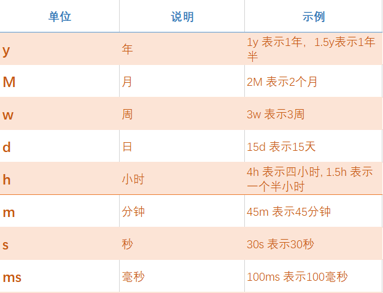

<br>

## 1.2 字节单位 ##

　　涉及到字节存储的单位有：

 + **`b`**：字节，如 `100b`

 + **`kb`**：如 `12kb`

 + **`mb`**：如 `25mb`

 + **`gb`**：如 `3gb`

 + **`tb`**：如 `1tb`

 + **`pb`**：如 `1pb`

## 1.3 范围表达式 ##

　　无论是搜索还是聚合，往往需要按 `范围` 查询，`ES` 提供了丰富的范围表达方式。

### 1.3.1 通用内容 ###

　　在查询中通用的表达式格式。

 ```json
    {
        "range":{
            "field":{
                "算符": "数值、日期、字符串等"
            }
        }
    }
 ```

 其中：`range` 为范围关键字，固定不变；`field` 为要表达的字段名称，而 `算符` 则为范围表示运算符。 

　　可以使用的 `运算符` 如下：

 + **`gte`**：大于或等于

 + **`gt`**：大于

 + **`lte`**：小于或等于

 + **`lt`**：小于

 + **`boost`**：匹配精度，权重值，默认为 `1.0`

　　下面是一些示例：

 + 表示年龄段：`18 ~ 30`

 ```json
   {
       "range":{
           "age":{
               "gte": 18,
               "lte": 30
           }
       }
   }
 ```

 + 表示无界（如无上界或无下界），下面是表示大于或等于 `18` 岁

 ```json
   {
       "range":{
           "age":{
               "gte": 18
           }
       }
   }
 ```   

### 1.3.2 时间范围 ###

　　日期时间的范围表示就复杂得多，通常有两种表示方式：

 + 具体的时间与日期范围，如 `2019-11-13 ~ 2019-11-14`

 + 相对或数量表示，如以当时间为基准的：3个小时前，2天前；又或者某个时间点的2周后

　　第一种方式比较简单一些，而第二种就比较复杂，需要建立一套 `符号规则` 来描述什么叫 `前`，`后`，谁是 `基准`等。

#### 1.3.2.1 时间表达式 ####

　　在 `ES` 中 `基准` 称为 `锚点`（anchor），并且明确定义了 `时间单位` （参见 `1.1` 节的内容）和一些符号：

 + **`now`**：表示当前时间

 + **`+`**：表示添加时间，如 `+1h` 表示在时间锚点上添加 `1` 小时

 + **`-`**：表示减去时间，如 `-2d` 表示在时间锚点基础上减去 `2` 天

 + **`/`**：表示向下取整到某个时间单位，如 `/d` 表示向下取整到天（四舍五入）

 + **`||`**：表示为日期时间串结尾，如 `2019-11-14||` 表示 `||` 之前的内容为一个日期或日期字符串

　　下面是上述符号格式的应用示例：

 + `now+1h`：当前时间加上 `1` 小时 （精确到毫秒）

 + `now+2h+1m`：当前时间加上 `2`小时`1`分 （精确到毫秒）

 + `now-1h/d`：当前时间减去 `1`小时，然后四舍五入到最近的一天的起始（取整到天），例如，当前时间 `2019-10-01 12:00:00` 运算的结果是 `2019-10-01 00:00:00`

#### 1.3.2.2 时间的四舍五入 ####

　　对日期时间进行四舍五入时，取决于范围的结尾是包含还是排除，通常的准则：

 + `向上舍入`：移动到舍入范围的最后一毫秒。

 + `向下舍入`：一定到舍入范围的第一毫秒。

　　下面示例说明：

 + `"gt": "2018-12-18||/M"`  --- 大于日期（取整到月），需要向上舍入，结果是 `2018-12-31T23:59:59.999`，也就是不包含整个 `12`月。

 + `"gte": "2018-12-18||/M"` --- 大于或等于日期（取整到月），向下舍入，结果是 `2018-12-01` ，也就包含整个 `12` 月。

 + `"lt": "2018-12-18||/M"`  --- 小于日期（取整到月），需要向上舍入，结果是 `2018-12-01`，也就是不包含整个 `12`月。

 + `"lte": "2018-12-18||/M"` --- 小于或等于日期（取整到月），向下舍入，结果是 `2018-12-31T23:59:59.999` ，也就包含整个 `12` 月。

#### 1.3.2.3 时间范围示例 ####

　　有了上述的知识基础之后，就可以理解和明白如何编写日期时间范围了：

 ```json
   {
       "range":{
           "birthday":{
               "gte": "now-1d/d",  //当前时间的上一天，四舍五入到最近的一天
               "lt": "now/d"    //当前时间，四舍五入到最近的一天
           }
       }
   }
 ```

 ```json
    "range" : {
        "timestamp" : {
            "gt" : "2019-01-01 00:00:00",
            "lt" : "2019-01-01 00:00:00||+1M" 
        }
    }
 ```

### 1.3.3 范围匹配参数 ###

　　`ES`的字段中存在 `范围` 的类型，下面是这种类型的 `匹配` 方法：（由参数字段 `relation` 来指示）

 - `relation`：主要是针对 `范围类型` 的匹配方式，可选值如下：

    + `INTERSECTS`：字段值集与查询范围存在交集（字段范围与查询范围交集非空），即可选中，这是默认值。
    + `CONTAINS`：字段范围包含查询范围，即选中
    + `WITHIN`：查询范围包含字段范围（字段范围是查询范围的子集），即选中


## 1.4 正则表达式 ##

　　`ES` 正则表达式并没有支持完整的表达式语法，目前版本仅支持下述的操作符：(`. ? + * | {} [] () '' | # @ & <> ~`)

 + **`.`**：点操作代表任意字符（单个），如 `abcde`，可以用 `ab...` 或者 `a.c.e` 来匹配。
 + **`?`**：代表问号之前的最小单元匹配 `零或1次`
 + **`+`**：代表加号之前的最小单元匹配 `1或多次`，如 `aaabbb`，可以用下面表达式来匹配：

    - `a+b+`
    - `aa+bb+`
    - `a+.+`
    - `aa+bbb+`

 + **`*`**：代表星号之前的最小单元匹配 `零或多次`，如

    `ab*`     # 匹配 `ab`, `abb`, `abbb`, `abbbb`, etc.

 + **`|`**：表示 `或` 操作，左边或右边只有一个匹配就认为匹配

    - `abc|xyz` ：`abc` 或 `xyz`

 + **`{}`**：代表括号之前的最小单元，匹配一个指定的最小值和最大值范围。

    - `a{2}`：表示 `a` 匹配两次，如 `aa`
    - `a{2, 4}`：表示 `a` 匹配次数在 `2` 到 `4` 之间，如 `aa`、`aaa`、`aaaa`
    - `a{2,}`：表示 `a` 匹配两次至无限次（没上限）

 + **`[]`**：表示选择符，意思是中括号内的任意字符出现都认为是匹配成功

    - `[abc]`：`a` 或 `b` 或 `c`
    - `[a-c]`：表示范围 `a ~ c` ，即 `a`、`b`、`c`
    - `[-ac]`：如果 `-` 不是出现在中间，则表示自身 `-`
    - `[^abc]`：`^` 是非的意思，表示除了 `a`、`b`、`c` 之外其他字符

 + **`()`**：用来分组构成一个最小单元或者说是子模式，也称为 `捕获组`

    - `abc(def)?`：表示 `def` 本身为不能分割的组，即 `abc` 或 `abcdef`

　　然后，除了上面的操作符之外，还支持下面 `可选`（通过查询参数 `flags` 来配置是否需要）操作：

 + **`ALL`**：`flags` 参数，表示需要所有操作符
 + **`COMPLEMENT`**: 可用 `~`，否定最短的跟随模式。也就是 `非后续最小单元` 的意思

    - `a~bc`：表示 `a` 的后面 `非后续 b`，意思是一定不能是 `b`，其他都可以

 + **`INTERVAL`**：可用 `<>`，表示数值的范围，如 `abc<1-3>`，表示 `abc1`、`abc2`、`abc3`。

 + **`INTERSECTION`**：可用 `&`，表示 `与操作`，即左边与右边都要匹配

 + **`ANYSTRING`**：可用 `@`，表示匹配任意字符串

    - `@&~(foo.+)`：表示匹配所有非以 `foo` 开头的任意字符串

　　因为并不支持完整的正则表达式，所以在 `ES` 中不支持以下的操作符功能：

 + **`^`**：作为字符串开始的限定符功能（即行开始）
 + **`$`**：作为字符串结尾的限定符功能（即限定行结尾）

<br>

# 2. 数据查询与搜索 #

## 2.1 概念与术语 ##

　　在了解 `ES` 之前，首先要了解一些概念和术语。

### 2.1.1 相似度、相关性、评分与权重 ###

　　`ES` 本身是建立在全文搜索引擎 `Lucene` 之上的系统，因此也就继承和包含了 `Lucene` 的概念与特性。

　　`相似度`（`相关性`）是全文搜索的一个非常重要的概念，与传统匹配式的点查询不同，全文搜索更加在意的是`相关性`面式查询。 原因在于，全文搜索往往是大数量的搜索，如按传统的 `点` 式匹配，得到大量的匹配记录，作为查询人员来说，从海量的匹配记录中找到自己所需要的内容，很明显费时费力，甚至是徒劳无功，因此我们必须要对结果进行 `重要性评估`（权重），根据某种需要，对查询结果进行 `评分`，然后按 `评分` 排序或再查询，这样得到的查询结果不但大大缩小，同时也能让我们快速得到所需要的内容。

　　所以 `相似度`、`相关性`、`评分`、`权重` 等一系列的概念，都是围绕着如何，更好更快地得到我们 `所需` 而定义与展开。

　　可以用一个例子来理解上述的内容：`搜索标题中包含java的帖子，同时呢，如果标题中包含hadoop或elasticsearch就优先搜索出来，同时呢，如果一个帖子包含java hadoop，一个帖子包含java elasticsearch，包含hadoop的帖子要比elasticsearch优先搜索出来`

　　大家可以想象一下，如果用传统的匹配查询，如何才能实现上述的查询需求。

　　在 `ES` 中，是通过一些数学算法来计算 `相似度`，得到的计算结果（数值），就是 `评分`，然后成为此查询记录是否优先显示的 `权重`，再经过各方综合得到一个结果（排序结果）。

　　下面是 `ES` 中常用的 `相似度` 计算算法：（算法不少，只说常用）

 + `布尔模型`：就是 `传统` 的 `与`、`或`、`否` 匹配，模型过程简单快速，往往会首先用于排除无关文档。

 + `TF/IDF 算法`：这是 `ES` 比较常用算法，全称为 `词频/逆向文档频率算法`，这个算法由下面三个指标决策与组成

   - `词频`（term frequency）：要搜索单词在文档中出现的频率。很明显（在感观上），出现次数越多表示 `相关性`就越高，多现 `5` 次总的来说，比出现 `1` 次更 `有用`。所以出现次数成为评分权重，频率越高权重就越高。 

   - `逆向文档频率`（inverse document frequency）：术语（单词）在所有文档集合中出现的频率。频率越高，表示其重要性越低，也就是权重越低。老话说得好：“熟视无睹”、“物以稀为贵”，就很好地诠释这个概念。例如常用词 `the`、`is`、`是`等，对 `相关度`计算的贡献就非常低（甚至说没什么用） 

   - `字段长度归一值`（field-length norm）：“较短字段”比“较长字段”更重要

 + `Okapi BM25 算法`：这个算法与 `TF/IDF` 类似，但因更具 `弹性` 和 `可调性`，而比 `TF/IDF`更先进，从而被用作 `ES` 默认（首选）算法。例如 `词频`很重要，但太多有时反而变得不重要，同样 `逆向文档频率`中的`术语`会因为过多而被“移除”，但有时在某些场合也会有用，因此不能简单处理了事等等。

　　当然，还有一些其他的内容，如`向量空间模型`、`点击频率`、`点赞次数`等等，都有可能影响到搜索结果评分，在这里不再一一介绍或详述。

　　与此相关联的字段名称：`score`，包括以此单词为前缀、后缀等字段或函数，都会与 `相似度` 有关，如 `_score`、`function_score` 等等。


### 2.1.2 分词 ###

　　有了 `相似度`的认识后，要理解 `分词` 就容易得多，从上一节的内容可以知道，相似度算法往往与 `术语`、`单词`等为计算或统计单位，因此如何将内容分解成 `术语`或`单词`，就是本节 `分词` 的内容。

　　所谓 `分词` 就是指：接受一个字符串作为 `输入`，根据某种规则（或算法），将这个字符串拆分成独立的词或词汇单元（`token`）（这个过程可能会丢弃一些标点符号等字符），然后 `输出` 一个词汇单元流（`token stream`）的过程。

<br>

 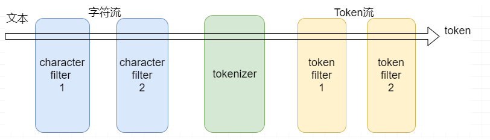

<br>

　　不同的规则或算法，即使对同一种语言，会产生不同的词汇单元流。而实现这些规则或算法的代码（程序），称之为 `分词器`。当索引在创建时，指定了分词器后，添加文档时就会用此分词器来处理相关字段的字符串内容。

　　`分词器`种类繁多，下面列出几种常见的分词器：

 + `Whitespace 分词器`：基于空白字符（`空格`、`换行符`、`制表符`等）进行简单的拆分，然后假定连续的非空字符组成一个词汇单元。
 + `Simple 分词器`：按任何非字符（即字母之外的字符）来拆分字符串，同时抛弃数字内容，并且将字母一律转为小写。
 + `Stop 分词器`：在 `Simple 分词器` 的基础上增加 `常用词黑名单` （即去掉如 `the`, `a` 这样的常用词）
 + `Keyword 分词器`：将整个字符串作为一个词汇单元。目的是方便文本索引与检索，例如邮政编码，身份证号码等
 + `Standard 分词器`：类似 `Stop 分词器`，以 `Unicode` 文本分割算法为基础来寻找单词间的界限。本分词器是 `ES` 默认分词器，也是西方语言特定分词器的基础。但中文分词可用性不高。
 + `Pattern 分词器`：通过配置给出的 `正则表达式` 来分词
 + `Language 分词器`：用于解析特殊语言文本的分词器集合（都是西方语言，没有中文）
 + `中文分词`：上述分词器无论能否用于中文，其准确性不高（`惨不忍睹`），于是催生了一些第三方的分词器插件

 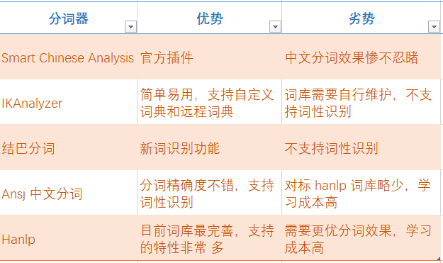

 <br>

　　根据分词器的不同特点，在实际应用中选用不同的分词器。

### 2.1.3 过滤与查询 ###

　　对于内容搜索，`ES` 提供了两种搜索方式：

 + 过滤：根据条件过滤数据

 + 查询：根据条件查询数据

　　两者都能搜索文档，并且都能应用于不同的搜索场景（作为查询与聚合的子句），不过两者的应用场合存在差异：

 + `过滤`

   - 不进行 `相似度`（评分）计算，因此速度较快
   - 仅作 **`这篇文档是否匹配？`** 式的查询，并且结果也仅为 `是`或`否` 两种二选一情况
   - 常用于 `范围查询`，如属于某种类型；值区间；时间区间；成功或失败等
   - 因此 `过滤` 操作常能加载到内存（缓存）处理，所以速度更加快 

 + `查询`

   - 需要进行 `相似度`（评分）计算
   - 不但要判断文档是否 `匹配`，还要判断 `匹配程度` （有多匹配）
   - 全文搜索的不二选择

　　不过，对于高版本的 `ES`，这两者的界线越来越模糊，很多查询操作也具有 `过滤` 特性了。

　　两者之间的使用情况：
 
 + 两者可以单独使用

 + 两者可以组合使用，在组合使用时，可以先用 `过滤` 快速缩小工作范围，然后再用 `查询` 来匹配

### 2.1.4 高亮 ###

　　所谓 `高亮` 就是指将文本中的匹配部分加亮显示。当我们进行搜索时，会有很多搜索结果，而每个搜索结果可能会有很多内容（字段或文本等），高亮的目的在于，将 `匹配` 部分加亮显示，以表示此结果被选中的原因（凸显）。

　　下面就是我们在百度查询时，以高亮方式显示查询关键字内容：（红色加亮，就是匹配查询条件内容）

<br>

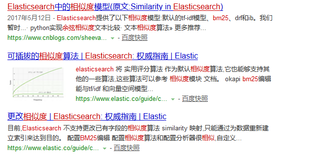

<br>

### 2.1.5 字段折叠与去重 ###

　　`字段折叠`（Field Collapsing）是 `去重`的形象性术语。也就是根据 `字段` 进行分组，取顶部文档的操作（其他结构折叠起来不显示，这就是本概念的含义）

　　在 `5.x` 之前的版本，去重是个比较复杂的操作（精度也不太好），`5.x` 用 `Field Collapsing` 提供简单而有效的 `去重`操作。

　　`Field Collapsing` 注意与功能如下：

 + 目前仅对打开 `doc_values` 参数的 `keyword` 及 `numeric` 两种类型有效
 + 可以对折叠结果进行内部提取。（即取 `top 1` 作为去重结果之外，还可以附带取 `top2`、`top3`...`topn` （由 `size` 控制）
 + 可以对折叠结果在内部进行二次折叠。（也就是对 `top2`...`topn` 再次就某字段进行折叠（重分组），得到结果集）

　　关于 `Field Collapsing` 的具体内容，参见 `2.2.1.1 请求体范式` 中的 `Field Collapsing` 部分。

## 2.2 数据查询（检索） ##

　　`ES` 提供了两种数据查询与聚合规范，以适应不同的场合：

 + `Query String`（查询字符器），是一种使用 `GET` 请求时，以请求参数的形式发送的查询结构，又称为简单查询或轻量级查询。这种查询方式结构紧凑、受限，常用于简单的查询，又或者在一些仅支持 `GET` 请求的场合（如内嵌请求等）。

   - 请求范式：**`GET /<index>/_search?q=<表达式>`**
   - 由于是 `URI` 参数，因此需要编码
   - 下面是个示例：

      ```shell
        # 定义表达式：+name:(mary john) +date:>2014-09-10 +(aggregations geo)
        GET /bank/_search?q=%2Bname%3A(mary+john)+%2Bdate%3A%3E2014-09-10+%2B(aggregations+geo)
      ```  

 + `Query DSL`（查询语法），是一种使用 `POST/PUT/DELETE` 请求使用的复杂查询语法，由于能够实现复杂的查询与聚合，功能也最全面，所以是最常用的查询语法

   - 使用 JSON 构造请求体
   - 支持构建更加复杂和健壮的查询

　　无论使用何种查询语法，其请求方法的 `URL` 一律都是以 `_search` 结尾，如：

 + **`GET /_search`** ：查询所有索引

 + **`POST /bank/_search`**：提交针对索引 `bank` 的 `Query DSL` 查询

 + **`POST /<index-name>/_search`**：针对某个索引的查询，下面在讲述查询时，如果不特别给出请求 URL，一律都是这种请求范式

　　下面所有内容都是 `Query DSL` 的内容，而对 `Query String` 感兴趣的话，要看官方的文档。 

### 2.2.1 请求体范式 ###

　　`Query DSL` 是一个 `JSON` 结构，可能很简单也可能很复杂，无论如何都有一个结构范式。

　　请求体范式：由于查询，都是通过 `POST/PUT` 请求的请求体发送，因此请求体本身有自己的格式：（换句话来说，在 `Request Body` 中能加入一些什么功能结构）

#### 2.2.1.0 请求体系结构 ####

　　所谓 `请求体`，就是指向 `ES` 以 `JSON` 发送查询或聚合请求时，这个 `JSON` 请求数据的结构字段，下面给出结构的内容：

 ```json
    {
        "explain": "true/false",
        "query":{},
        "sort":{},
        "from": "文档返回的起始位置",
        "size": "文档返回数量",
        "collapse":{},
        "highlight":{},
        "script_fields":{},
        "search_after":{},
        "rescore":{},
        "indices_boost":[],
        "aggs":{},
        "_source": {},
        "stored_fields": []
    }
 ```

#### 2.2.1.1 查询子句 ####

　　查询子句是整个 `Query DSL` 查询语法的核心，所有的查询语句，都会放在这个字段中，并发送给 `ES`。

  ```json
    {
        "query":{
            "Query DSL 查询语句"
        }
    }
  ``` 
　　查询语句放在一个叫 `query` 的字段下。如果请求体是个容串或 `{}` ，则等价于查询所有记录。（但实际上并不会返回所有记录，仅返回前 N 条，如默认值是 `10` ）

#### 2.2.1.2 排序子句 ####

　　当我们需要对查询的内容（结果）进行排序时，需要用到排序子句：
 
 + 在默认的情况下，结果是按 `_score` 进行排序（即评分或相似度值）

 + 当只针对一个字段排序时，`排序子句`可以简单到一个字段名就行：（对年龄升序）

    ```json
        {
            "sort": "age"
        }
    ```
     
 + 再复杂一些，指定排序方向和模式的话：（模式见下面的说明）

    ```json
        {
            "sort": { "price": {"order":"desc", "mode": "avg"}}
        }
    ```

      上面示例中，`price` 是一个价格数组，按价格平均值进行降序排列

 + 如果对多个子段进行排序的话，就是用到数组了：
 
    ```json
        {
            "sort":[
                "field1",
                {"field2":"asc"},
                {"field3":{"order":"desc"}}
            ]
        }
    ```

 + `排序子句` 除了上面传统的内容之外，还提供下面的扩展：

   + 排序模式：也就是排序的计算公式 

      - `min`：就是 `asc` 的默认模式（从小到大排）
      - `max`：就是 `desc` 的默认模式（从大到小排）
      - `sum`：如果字段是一个数值数组的话，以此数组所有数的和来排
      - `avg`：如果字段是一个数值数组的话，则用此数组的平均值来排
      - `median`：如果字段是一个数值数组的话，则用此数组的中值来排
      - 下面是示例：

        ```json
         {
             "sort":[
                 {"price":{"order": "asc", "mode": "avg"}}
             ]
         }
        ``` 
        `price`是一个价格数组，以此数组的平均值来排序（方向为 `asc`）

   + 类型转换（`numeric_type`）：即将类型转换成另一种类型，然后再排序。不过，这种类型转换仅支持 `double`、`long`、`date`、`date_nanos` 四种类型之间的互相转换。这种情况在多个索引联合查询时，类型不一致中非常有用，下面是一个示例：
      - 假设有两个索引 `index_date`、`index_date_nanos`，有一个同名字段 `birthday`，但类型不同（一个是 `date`，另一个是 `date_nanos`），在联合查询时，希望一律按 `date_nanos` 类型排序
      - 示例：

        ```json
          {
              "sort":[
                  {"birthday":{ "order":"desc", "numeric_type":"date_nanos" }}
              ]
          }
        ```

 + 如果所查询的字段的类型本身就是对象（嵌套对象），要进行排序就复杂得多。

   - 在提供范式之前，要明白排序的范围，是整个索引排序，还是仅对结果进行排序。而事实上，我们需要的是仅对结果进行排序，有了这个理解之后，下面的内容就容易明白。
   - 嵌套类的排序，将使用一个 `nested` 结构进行，这个结构包含：

     + `path`：通常是指向 `嵌套类字段名称`，这是必选项
     + `filter`：
     + `max_children`：默认为不限制
     + `nested`：嵌套

   - 下面是一个复杂的示例：

      ```json
      {
          "query": {
              "nested": {
                  "path": "parent",
                  "query": {
                      "bool": {
                          "must": {"range": {"parent.age": {"gte": 21}}},
                          "filter": {
                              "nested": {
                                  "path": "parent.child",
                                  "query": {"match": {"parent.child.name": "matt"}}
                              }
                          }
                      }
                  }
              }
          },
          "sort" : [
              {
                  "parent.child.age" : {
                      "mode" :  "min",
                      "order" : "asc",
                      "nested": {
                      "path": "parent",
                      "filter": {
                          "range": {"parent.age": {"gte": 21}}
                      },
                      "nested": {
                          "path": "parent.child",
                          "filter": {
                              "match": {"parent.child.name": "matt"}
                          }
                      }
                      }
                  }
              }
          ]
      }        
      ```

 + 还支持写 `script` 进行排序，下面是一个示例：

    ```json
    {
        "query" : {
        },
        "sort" : {
            "_script" : {
                "type" : "number",
                "script" : {
                    "inline": "doc['field_name'].value * factor",
                    "params" : {
                        "factor" : 1.1
                    }
                },
                "order" : "asc"
            }
        }
    }
    ```

+  动态建立排序字段 `unmapped_type`。当所定义的排序字段不存在时，查询请求会返回一个错误（中止查询）。在联合查询的场景下，就会出现想排序的字段可能在索引A，但不在索引B的情景，此时可以使用动态字段来解决问题，即如果不存在此字段时，动态生成这个字段并参与排序，下面是示例：`price` 如果不存在，就作为 `long` 型来排序。

    ```json
    {
        "sort" : [
            { "price" : {"unmapped_type" : "long"} }
        ]
    }
    ```

+  没有值的情况下，用 `missing` 字段进行处理。如果结果文档中，某字段可能没有值（如空值），在这种情况下，可选的处理：

   - `_last`：排在最后，这是默认值。
   - `_first`：排在最前
   - 自定义值
   - 下面是示例：

      ```json
      {
         "sort" : [
             { "price" : {"missing" : "_last"} }
         ]
      }
      ```

 + GIS 方面的排序。。见官网

#### 2.2.1.3 简单分页子句 ####
  
　　在查询请求体中，可以使用 `from` 和 `size` 字段来控制结果列表中，返回的起点与记录数量，这两个字段配合使用，能够实现简单的分页操作。

+ `from`：这是起点，表示 `从。。。。`那条记录开始。如 `从第5条记录开始` (`"from": 5`)。本字段的默认值为 `0` ，即从第一条记录开始。

+ `size`：这是返回的数量，表示 `共取多少条记录`，如果多于实际，就返回实际记录。本字段的默认值为 `10`，即共返回 `10` 条记录。
 
+ 注意：`from + size` 不能超过索引设置 `index.max_result_window` 的限制（默认为 `10000`）

+ 下面是示例：

    ```json
    {
        "from" : 31, 
        "size" : 30,
        "query" : {
            "term" : { "user" : "kimchy" }
        }
    }       
    ```

+ 还要注意的是，要进行有意义的分页，还需要有明确的排序；查询结果记录数不太大；如果需要大数据集的分页，通常建议使用 `scroll API` 或 `Search After`

 #### 2.2.1.4 Field Collapsing（字段折叠）#### 
 
　　用于结构去重控制。

 + 结构范式：    

    ```json
        {
            "collapse":{
                "field": "折叠的字段名称",
                "inner_hits":{
                    "name": "内部提取的一个命名",
                    "size": "提取数量",
                    "sort": "排序",
                    "collapse":{
                        "field": "二次折叠字段名"
                    }
                }
            }
        }
    ```
    上述的范式中：
        
     - `field` 为必选项，指示进行分组去重的字段
     - `inner_hits`：可选，需要内部提取时添加，并且可以是数组，根据不同排序提取不同记录。
     - `collapse`：可选，定义二次折叠

+ 注意：    

   - 仅对开启 `doc_values` 参数的 `keyword` 与 `numeric` 类型有效

   - 仅取顶部记录（`top hits`），因此不影响聚合操作

   - 不支持 `scroll`、`rescore` 和 `search after` 操作

 + 示例：

   - 最基本使用：对字段 `user` 进行折叠

        ```shell
            POST /midas/_search
        ```
        ```json
            {
                "query":{
                    "match":{
                        "message": "Macroview"
                    }
                },
                "collapse":{
                    "field": "user"
                }  
            }
        ```
        简单对某字段进行去重操作（即分组，并每组抽取一条记录）

   - 内部提取：对字段 `user` 进行折叠，同时每组提取前3条记录

        ```shell
          POST /midas/_search
        ```
        ```json
          {
              "query":{
                  "match":{
                      "message": "Macroview"
                  }
              },
              "collapse":{
                  "field": "user",
                  "inner_hits":{
                      "name": "last_records",
                      "size": 3,
                      "sort": [{"date": "asc"}]
                  }
              }  
          }
        ```
        使用日期对每组内的记录进行排序，然后取 `top3` 返回。也可以多次内部提取：

        ```json
          {
              "collapse":{
                  "field": "user",
                  "inner_hits":
                  [
                    {
                      "name": "last_records",
                      "size": 3,
                      "sort": [{"date": "asc"}]
                    },
                    {
                      "name": "first_birthday",
                      "size": 2,
                      "sort": [{"birthday": "desc"}]  
                    }
                  ]
              }  
          }
        ```
        此时，`inner_hits` 以数组的形式设置

   - 二次折叠：即在内部记录再对某字段进行折叠

        ```shell
          POST /midas/_search
        ```
        ```json
          {
              "query":{
                  "match":{
                      "message": "Macroview"
                  }
              },
              "collapse":{
                  "field": "user",
                  "inner_hits":{
                      "name": "last_records",
                      "size": 3,
                      "sort": [{"date": "asc"}],
                      "collapse":{
                          "field": "country"
                      }
                  }
              }  
          }
        ```
        注意，二次折叠虽然使用了同名字段 `collapse` 但是这个字段不能有 `inner_hits` 内容了（只提供二次折叠，不支持更多的嵌套）

#### 2.2.1.5 Highlighting（高亮） ####

　　对结果选中原因进行 `加亮` 提示。如对单词进行匹配查询时，会对结果中此单词进行 `加亮` 显示。

 + 高亮通常用于网页或信息查询当中，由于内容比较多，这里不详细描述，具体可以参考官方文档

 + 下面是一个简单示例：将字段 `content` 加高亮

     ```json
      {
          "query":{
              "match":{
                  "content": "hello"
              }
          },
          "highlight":{
              "fields":{
                  "content": {}
              }
          }
      }
     ```
    要注意，高亮字段必须参与查询当中（这样才能对匹配原因进行加亮）

#### 2.2.1.6 Script Fields ####
  
　　动态创建用 `script` 定义的字段（返回）。这个功能，可以让我们返回不限于文档字段内容，还可以是动态生成的字段内容。要注意：`script fields` 中的语言会作用于每个搜索结果（如过滤器一样，逐个搜索结果进行处理）

 + 结构范式：

     ```json
       {
           "script_fields":{
               "字段名1":{
                   "script":{
                       "lang": "script 语言类型名称",
                       "source": "script 内容",
                       "params":{
                           "参数名": "参数值"
                       }
                   }
               },
               "字段名2":{}
           }
       }
     ```
     范式内容：

      - `字段名`：符合 `ES` 字段命名规则的字段名
      - `lang`：表示 `source` 中的 `script` 是使用何种语言编写
      - `source`：就是语言的内容。其中内置变量 `doc` 表示当前文档记录，我们可以通过 `doc['字段名']` 来引用当前文档中的字段，而 `doc['字段名'].value` 就是字段值
      - `params`：部分为可选内容，如果 `source` 没有用到参数，可以忽略；但如果用到参数，则为必需项

 + 示例：

     ```json
        {
            "query" : {
                "match_all": {}
            },
            "script_fields" : {
                "field1" : {
                    "script" : {
                        "lang": "painless",
                        "source": "doc['price'].value * 2"
                    }
                },
                "field2" : {
                    "script" : {
                        "lang": "painless",
                        "source": "doc['price'].value * params.factor",
                        "params" : {
                            "factor"  : 2.0
                        }
                    }
                }
            }
        }
     ```
     示例中，使用了内置的描述语言 `painless`，并通过 `doc['price']` 引用每个文档的 `price` 字段值

 + 当前文档内容引用提示：除了 `doc` 之外，我们还可以通过 `params['_source']['my_field']` 形式来引用当前文档字段内容。两者之间的差别在于：`doc` 会缓存到内存，仅对 `non-analyzed`有效，并且仅能返回简单值内容（不能返回 `json object`），而 `params[...]` 形式则需要额外加载，速度较慢，但能处理复杂类型。  

#### 2.2.1.7 Explain #### 

　　用来显示和计算查询或聚合的过程，以及所使用的时间。类似于传统数据库提供的 `explain` 方法，可以用来调整与优化查询或聚合。这是一个开关字段，设置为 `true` 表示此查询进行 `explain` 过程。默认为 `false`。

 ```json
 {
    "explain": true,
    "query":{

    }
 }
 ```

#### 2.2.1.8 Search After ####

　　`ES` 提供的一种分页技术。
  
 + 目前 `ES` 提供三种分页技术，分别对应不同应用场景：

   - **`from/size`**：上面已经有详细介绍，这种分页技术比较简单，同时也适应一些简单查询和小量结果的场景。当进行深度分页与大批量数据结果时，这种分页技术会消耗比较多的内存空间，性能上也不太好，因而不建议使用。这也是变什么会有 `index.max_result_window` 参数，并最大限制在 `10000`（1万条记录）的原因。

   - **`scroll API`**：这个技术就是为深度，大批量分页而定制，由几个 `API` 组成。但缺点也明显：使用复杂，并且对一页一页翻动比较有效，而对跳页不友好；还有就是不能实时反映数据的变化，这是这种技术的局限性。这种分页更适合于数据大批量导出的场景。

   - **`Search After`**：第三种就是本部分内容。`Search After` 就是使用上一次的查询结果来查询下一次，并且后续内容的实时变化，都能反映到查询当中（查询是无状态），因此 `Search After` 所解决或提供的场景就是：准实时的查询分页，同时也不消耗额外内存或存储空间。（当然，也与 `scroll API` 一样，对跳页不友好）

 + `Search After` 使用注意
  
   - 由于是使用上一次查询来确定下一次，因此建议使用具有唯一性字段参与排序（如`_id`），又或者多字段组合唯一性排序。以避免每次查询记录的顺序不同，从而影响到分页的准确性
   - 字段 `from` 必须为 `0` 或 `-1` （即不能设置 `from`，让其默认为 `0`）
  
 + 使用范式

      ```json
       {
           "search_after": ["一组上次查询最后一条记录值（具唯一性）"]
       }
      ``` 

 + 示例：

   - 第一次查询

        ```json
          {
                "size": 10,
                "query": {
                    "match" : {
                        "title" : "elasticsearch"
                    }
                },
                "sort": [
                    {"date": "asc"},
                    {"tie_breaker_id": "asc"}      
                ]
          }
        ```
        - `size`：控制每次的数量
        - `query`：查询语句
        - `sort`：具有唯一性确定的排序组合

   - 后续分页查询：假设上次查询最后记录值 `date=1463538857, tie_breaker_id=654323` 则使用 `search after` 方式如下

        ```json
            {
                "size": 10,
                "query": {
                    "match" : {
                        "title" : "elasticsearch"
                    }
                },
                "search_after": [1463538857, "654323"],
                "sort": [
                    {"date": "asc"},
                    {"tie_breaker_id": "asc"}
                ]
            }        
        ```
        `search_after`：数组，就是上次查询最后记录值；通常建议具有唯一性，如果不唯一的话；下次查询的起始位置有可能出错，分页产生错位了。


### 2.2.2 查询语句结构 ###

　　查询语句的结构，通常是指写在 `查询子句`（即 `"query":{...}` 内的内容），但其结构也适合如 `聚合` 或 用到 `查询语句` 的地方。 

 + 查询语句典型结构：

    ```json
        {
            Query_Name:{
                ARGUMENT: VALUE,
                ARGUMENT: VALUE,
            }
        }
    ```
    `Query_Name`，查询语句名称，不同的查询语句所实现的功能不同。还有种结构是针对特定的字段：
    ```json
        QUERY_NAME: {
            FIELD_NAME: {                 # 指定一个字段
                ARGUMENT: VALUE,
                ARGUMENT: VALUE,...
            }
        }
    ```    

 + 组合查询：就是能将一些查询组合起来使用的结构

   - 叶子语句（Leaf clauses）：也是终端语句，就是具体的一个查询句子。
   - 复合语句（Compound）：也就是提供组合格式，用于合并其他查询语句（包括复合语句）。复合语句可以包含 `叶子语句` 和 `复合语句`，因此可以通过组合嵌套，组成非常丰富与复杂的查询句式

   - 目前包含以下几种组合查询（具体句式与使用，可参见相关章节）

     + `bool query`：布尔查询。（通过 `与`、`或`、`否`、`过滤` 四种运算来组织不同的查询语句）
     + `boosting query`：涉及 `相似度` 的复合查询，此查询包含两个子句 `positive` 和 `negative`

       - `positive` 包含一个正常评分查询语句。（`_score`)
       - `negative` 则包含一个降低评分查询语句（即将 `_score` 乘以小于 `1` 的小数）
       - 组合过程：返回结果集由 `positive` 查询子句决定，而同时符合 `negative` 查询子句的结果，其评分将会被 `降低`。
       - 举例：查找 `苹果`时，可能得到 `水果`、`蔬菜`或`苹果公司`的内容，而这些内容又不能全部排除时，可以使用 `negative` 来适当降低某类（如 `蔬菜`）结果的评分，让其排在后面。

     + `constant_score query`：可以包装一个查询子句，将结果的 `_score` 设置为成同一值（即忽略评分，如 TF/IDF 词频），此时可以通过单独调整 `boost`（协调因子）来定义结果的权重（排序）

     + `dis_max query`：`最好字段匹配查询`。标准评分的计算：当同一文档的不同字段都匹配查询条件时，每个匹配都会有一个评分，而文档最终的评分会是所有评分的平均值。而 `dis_max query` 则是求最大值，追求的是 `单个字段最佳匹配`

     + `function_score query`：用来控制评分计算的 `终极武器`，它允许为每个与主查询匹配的文档应用一个函数，以达到改变甚至完全替换原始查询评分 _score 的目的

### 2.2.3 查询返回结果结构 ###

　　当向 `ES` 发送 `Query DSL` 查询语句后，会返回一个结果结构，这个结构结构将描述查询的结果情况，所包含的内容如下：

 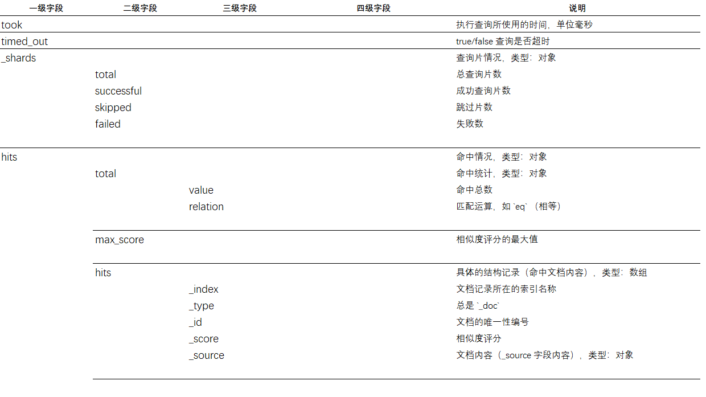

 + `took`：所用时间
 + `timed_out`：操作是否超时
 + `hits`：查询结构文档内容

   - `total.value`：结果总文档记录数
   - `hits`：记录集

 + 下面是一个返回示例：

```json
{
    "took": 27,
    "timed_out": false,
    "_shards": {
        "total": 1,
        "successful": 1,
        "skipped": 0,
        "failed": 0
    },
    "hits": {
        "total": {
            "value": 2,
            "relation": "eq"
        },
        "max_score": 1.0,
        "hits": [
            {
                "_index": "bank",
                "_type": "_doc",
                "_id": "1",
                "_score": 1.0,
                "_source": {
                    "account_number": 1,
                    "balance": 39225,
                    "firstname": "Amber",
                    "lastname": "Duke",
                    "age": 32
                }
            },
            {
                "_index": "bank",
                "_type": "_doc",
                "_id": "523",
                "_score": 1.0,
                "_source": {
                    "account_number": 523,
                    "balance": 28729,
                    "firstname": "Amalia",
                    "lastname": "Benjamin",
                    "age": 40
                }
            }
        ]
    }
}
```

<br>

## 2.3 常用查询语句 ##

　　`ES`提供的查询语句非常丰富，主要分成以下几大类：（`搜索` 与 `查询` 两个术语其含义相同）

 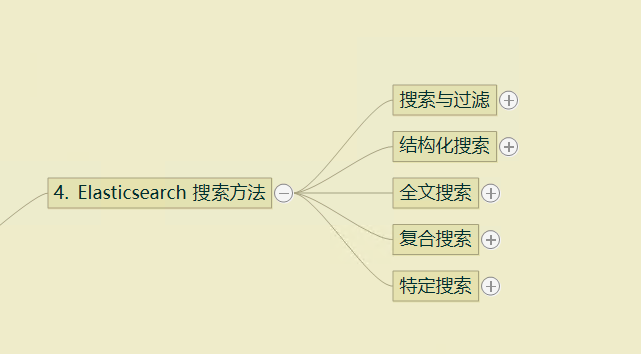

 + `搜索与过滤`：两者使用相同的语句，但在 `Request Body` （请求体中），`filter`（过滤）语句，必须包含在 `query` 这个字段内。

 + `结构化搜索`（结构化查询），用于 `精确` 查询。类似于传统 sql 语言中的查询

 + `全文搜索`，用于非 `精确` 查询，即涉及到 `评分` 与 `分词` 体系的查询

 + `复合搜索`，也就是上面所述的 `组合查询`

 + `特定搜索`，就针对某些特定类型的查询，例如 地理位置查询等

### 2.3.1 结构化查询搜索 ###

　　`结构化查询搜索`的查询语句如下：

 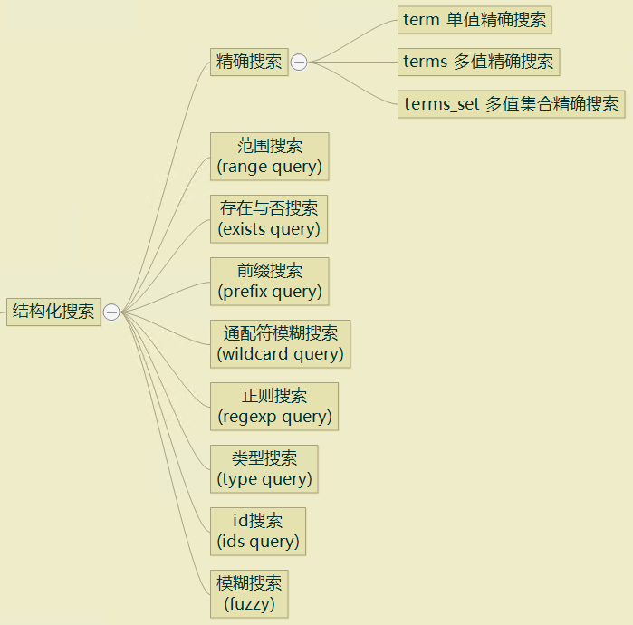

<br>

#### 2.3.1.1 结构化查询速查 ####

　　下面是查询请求结构的快速浏览：（查询语句一览）

 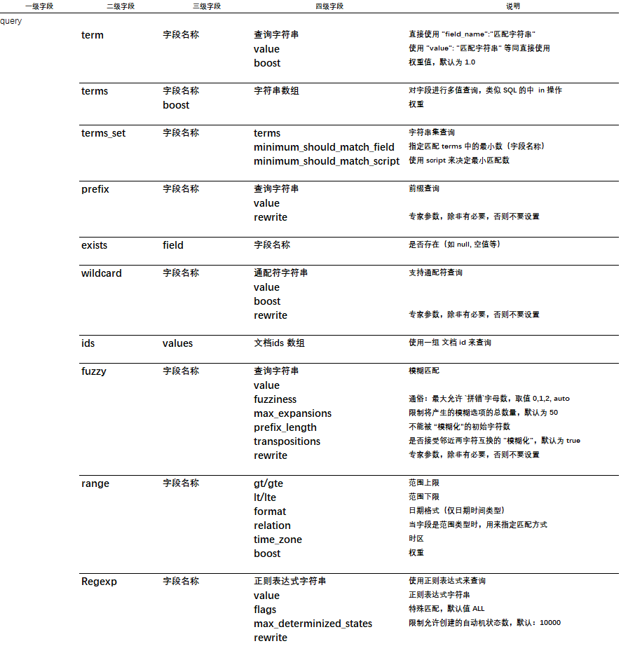

<br>

#### 2.3.1.2 term 精确匹配查询 ####

　　我们可以使用 `term` 查询来实现 `精确匹配`查询，所谓 `精确匹配` 就是不进行 `分词` 和 `相似度` 计算（或者说`相似度` 为 100%）的查询搜索，与传统的 SQL 查询的认知一致。

　　在使用时，我们要注意的事项：

 + 对于字符串类型，不建议在 `text` 类型上使用（说白了，只适用于 `keyword` 字符串类型）。因为 `text` 会进行分词，也就意味着字段的内容会被修改，进行无法进行 `精确匹配`。

   - 常用于如 `电话号码`、`姓名`、`产品ID` 等等，作为整体（不需要分词）匹配的查询

 + 对于非字符串类型，如数值、布尔等

 + 如果要查询的字段，本身是一个字符串数组时，`term` 查询是 `包含` 的意思，也就是字符串数组如果 `包含` 了要查询的字符串时，也会在结果中返回。

　　下面是查询的请求体结构范式：

 + 最简形式

    ```json
    {
        "query":{
            "term": {
                "field_name": "要匹配的字符串"
            }
        }
    }
    ```
    下面是示例：

    ```json
    {
        "query":{
            "term": {
                "username": "David"
            }
        }
    }   
    ``` 
    查询用户名称为 `David` 的所有记录。

 + 完整体

    ```json
    {
        "query":{
            "term": {
                "field_name": {
                    "value": "要匹配的字符串",
                    "boost": "权重数值"
                }
            }
        }
    }
    ```
    下面是示例：

    ```json
    {
        "query":{
            "term": {
                "color": {
                    "value": "blue",
                    boost: 2.0
                }
            }
        }
    }   
    ```    

#### 2.3.1.3 terms 多值匹配查询 ####

　　上面的 `term` 只能针对单个字符串值进行查询，但如果想进行多个值，包括：

 + 字段不是数组时，同一字段多个值（涉及多个文档记录）
 + 字段为数组时，同一字段多个值

　　使用 `term` 就会显得啰嗦（使用组合查询机制），而 `terms` 就是为了简化这种查询场景而存在。

　　`terms` 与上面的 `term` 使用要件与场景一样。

　　下面是查询的请求体结构范式：

 + 标准结构：

    ```json
     {
         "query":{
             "terms":{
                 "field_name": ["value1", "value2"],
                 "boost": "权重值"
             }
         }
     }
    ``` 
    其中 `boost` 权重值默认为 `1.0`（大于0小于1，会降低权重，大于 1 会升高权重），可以省略，下面是使用示例：

    ```json
     {
         "query":{
             "terms":{
                 "color": ["blue", "red"]
             }
         }
     }
    ``` 
    ```json
     {
         "query":{
             "terms":{
                 "user": ["kimchy", "elasticsearch"],
                 "boost": 2.0
             }
         }
     }
    ```

 + 变体：通过某字段预定义的内容来搜索，结构如下

    ```json
     {
         "query":{
             "terms":{
                 "field_name":{
                    "index": "索引名称，即引用字段所在的索引",
                    "id": "所在文档 id 值",
                    "path": "路径：字段名称，或嵌套字段名称"
                 }
             }
         }
     }
    ```
    - `field_name`：匹配的字段名
    - `index`：这是索引的名称，也可以是自身
    - `id`：文档的 `_id` 字段（即唯一编号）
    - `path`：指示的字段，`terms`将使用此字段的值来作为查询条件
    - 示例：

    ```json
     {
         "query":{
             "terms":{
                 "firstname.keyword":{
                    "index": "bank",
                    "id": "1",
                    "path": "firstname.keyword"
                 }
             }
         }
     }
    ```
    拿 `id=1` 这个文档的字段 `firstname.keyword` 的值作为 `查询条件`，然后搜索索引。

#### 2.3.1.4 terms_set 可定制匹配数量的查询 ####

　　`terms_set` 是新添加语句，类似于 `terms`（内嵌这个语句），给出一个匹配字符串数组，然后给出一个 `至少匹配这个数组中多少个字符串` 阀值进行搜索。

　　下面是查询的请求体结构范式：

 + 标准结构：

    ```json
     {
         "query":{
             "terms_set":{
                 "字段名称":{
                     "terms": ["value1", "value2", "valueN"],
                     "minimum_should_match_field": "至少匹配数量字段，值通常不能大于 terms 中的元素个数",
                     "minimum_should_match_script": "使用 script 方式过滤"
                 }
             }
         }
     }
    ```
    - `terms`：要匹配的字符串数组，这是必须项，表示要匹配的多个字符串
    - `minimum_should_match_field`：这是索引的 `字段` 名称，这个字段已经包含了至少匹配个数
    - `minimum_should_match_script`：与上面的 `minimum_should_match_field` 两者选一，使用 `script` 来操作
    - 示例：（索引 my_index 中定义了一个叫 `required_matches` 字段，这个字段的值指示必须的匹配数量）

    ```json
    {
        "name": "Jane Smith",
        "programming_languages": ["c++", "java"],
        "required_matches": 2
    }
    ``` 
    这是一条文档记录，其中 `required_matches` 必须至少匹配 2 个，下面是查询内容：

    ```json
     {
         "query":{
             "terms_set":{
                 "programming_languages":{
                     "terms": ["java", "php", "c++"],
                     "minimum_should_match_field": "required_matches"
                 }
             }
         }
     }   
    ```   

#### 2.3.1.5 prefix 前缀查询 ####     

　　`prefix`（前缀）专用于匹配前缀的查询。这个查询搜索比较简单，下面是结构范式：

 + 标准结构：

    ```json
     {
         "query":{
             "prefix":{
                 "字段名称": "前缀字符串"
             }
         }
     }
    ```
    下面是示例：

    ```json
     {
        "query":{
            "prefix":{
                "firstname.keyword": "Am"
            }
        }
     } 
    ```
    查询字段 `firstname.keyword` 以 `Am`为前缀的所有记录

#### 2.3.1.6 exists 非空查询 ####  

　　`exists` 非空查询其重点在于处理 `null` 值的问题，常见的 `null` 值情形：

 + `mappings` 中定义了字段，但由于没有值（或空值），其他字段没有出现在 `_source` 当中

 + 字段值为 `null` 或数组值为 `[]`

 + 字段类型参数中设置了 `index=false` （此时字段将不会被索引，对索引而言此字段视作 `null`）

 + 字段类型参数设置了长度上限 （`ignore_above`），而实际中字段长度因超过这个上限被 `忽略` （也会看作是 `null`）

 + 字段类型参数设置了 `ignore_malformed`（忽略类型不匹配），而实际中字段类型不匹配而被 `抛弃` （看作是 `null`）
 + 
　　上述的情况，都可以看作 `not exists`，而使用 `exists` 查询将不会找到上述的文档记录。

　　要注意，也有不属于 `null` 的情况，下面的情况不属于 `null`：

 + 空串，如 `""` 或 `"-"`
 + 数组类型字段中，包含了 `null` 值，如 `[null, "foo"]`
 + 字段类型参见中，使用参数 `null_value` 字义了空值（转换）

　　下面是使用：

 + 标准结构：

    ```json
     {
         "query":{
             "exists":{
                 "field": "字段名称"
             }
         }
     }
    ```

 + 这个操作相当于 `sql` 中的：`SELECT * FROM table WHERE field IS NOT NULL` （非空查询操作）

 + 查询使用比较简单，下面是一个示例：

    ```json
     {
         "query":{
             "exists":{
                 "field": "user"
             }
         }
     }
    ```
    `user` 字段非空查询 

　　反过来，如果我们想对 `空` 进行查询又如何？此时需要用到组合查询的内容（组合查询参见相关章节），下面给出操作范式：

 ```json
  {
      "query":{
          "bool":{
              "must_not":{
                  "exists":{
                      "field": "user"
                  }
              }
          }
      }
  }
 ```
  `bool` ：使用 `bool 组合查询`中的 `must_not` 条件（即 `否` 逻辑运算），用于实现 `非非空`（即空）操作。上面的示例中，`user` 字段不存在等空值时，会被查询出来

#### 2.3.1.7 wildcard 通配符匹配查询 ####  

　　`wildcard` 通配符查询，是指支持查询条件中使用 `通配符`，以更有效方式来查询文档记录。通配符查询支持以下的通配符：

 + **`?`** ：所在位置匹配任意 `1个` 字符。（单个字符占位符）

 + **`*`** ：所在位置匹配任意 `0个或多个` 字符。（多字符占位符）

　　不过要注意：**`尽量避免将通配符用于开头部分`**，如 `?Hello` 或 `*kity`，因此这样的模式会产生 `大量` 的不必要匹配，从而造成查询性能较低。

　　下面是使用：

 + 简化结构：

    ```json
     {
         "query":{
             "wildcard":{
                 "字段名称": "带通配符查询条件"
             }
         }
     }
    ```
    
    下面是个示例：

    ```json
     {
         "query":{
             "wildcard":{
                 "user": "k*ti"
             }
         }
     }
    ```

 + 标准结构：（即完整格式）

    ```json
    {
        "query": {
            "wildcard": {
                "字段名称": {
                    "value": "带通配符查询条件",
                    "boost": "权重值",
                    "rewrite": "专家模式参数"
                }
            }
        }
    }    
    ```

#### 2.3.1.8 Regexp 正则表达式匹配查询 ####  

　　`Regexp` 查询是使用正则表达式来匹配查询，关于 `ES` 所支持的正则表达式的内容，参见 `1.4 正则表达式`。

　　下面是使用：

 + 简化结构：

    ```json
     {
         "query":{
             "regexp":{
                 "字段名称": "正则表达式"
             }
         }
     }
    ```
    
    下面是个示例：

    ```json
     {
         "query":{
             "regexp":{
                 "user": "k.*y"
             }
         }
     }
    ```
    `k.*y`：表示 `k` 与 `y` 中间匹配 `零或多个字符`

 + 标准结构：（即完整格式）

    ```json
    {
        "query": {
            "regexp": {
                "字段名称": {
                    "value": "正则表达式",
                    "flags": "ALL|COMPLEMENT|INTERVAL|INTERSECTION|ANYSTRING",
                    "max_determinized_states": "自动机状态个数上限",
                    "rewrite": "专家模式参数"
                }
            }
        }
    }    
    ```

    - `flags`：表示开通的可选操作符，参见 `1.4 正则表达式`，默认为 `ALL`
    - `max_determinized_states`：为了避免正则表达式过于复杂，对其进行限制，默认为 `10000`。

#### 2.3.1.9 ids 匹配查询 ####  

　　`IDS`查询，就是使用一组记录的 `ids` 来进行查询的操作。这个查询操作比较简单，也就相当于：

  **`SELECT * FROM table WHERE id IN (...)`**

 + 标准结构：

    ```json
    {
        "query": {
            "ids": {
                "values": ["id1", "id2", "ids 数组"]
            }
        }
    }    
    ```

#### 2.3.1.10 Fuzzy 模糊匹配查询 #### 

&emsp;&emsp;`Fuzzy` 模糊匹配的 `精髓` 在于 `拼写错误` 搜索。在文本世界上，`拼写错误`是件很常见的事情，并且很多场合下，我们是无法改正这些错误，因此允许这种错误的搜索方式就能派上用场。

&emsp;&emsp;另一方面，如何规定`拼写错误`或定义什么才算是`拼写错误`，就是 `Fuzzy` 提供一些参数或操作的原意。下面是一些 `拼写错误` 模式：

 + **`拼错字符`**：如 `box` 拼成 `fox`，`java` 拼成 `kava` 等
 + **`拼少字符`**：如 `black` 变成 `lack` （也叫 `删除字符`）
 + **`拼多字符`**：如 `sic` 变成 `sick` （也叫 `插入字符`）
 + **`相邻字符反转`**：如 `act` 变成 `cat`

&emsp;&emsp;上面所说的错误模式，是针对单个字符而言，并且都是邻近字符情况。如果推广到多字符，非邻近的场景时，就会触及到 `拼写错误次数` 要素。这个 `拼写错误次数`，专业术语叫 `编辑距离` (Levenshtein Edit Distance)。

&emsp;&emsp;由一个错误的单词，每 `编辑一次`（错误字符），则 `距离`正确单词（接近一次）的意思。

　　下面是使用：

 + 简化结构：

    ```json
     {
         "query":{
             "fuzzy":{
                 "字段名称": "字符串"
             }
         }
     }
    ```

    下面是示例：
    ```json
    {
        "query": {
            "fuzzy":{
                "firstname.keyword": "Amber"
            }
        }
    }
    ```    

 + 完整的结构：

    ```json
    {
        "query": {
            "fuzzy": {
                "字段名称": {
                    "value": "要查询的字符串",
                    "fuzziness": "拼写错误次数，默认为 AUTO",
                    "max_expansions": "模糊化选项上限，默认为50",
                    "prefix_length": "固定前缀字符个数，默认为0",
                    "transpositions": "是否支持相邻字符反转错误，默认为 true",
                    "rewrite": "专家参数 "
                }
            }
        }
    }
    ```    

    - `fuzziness`：允许`拼写错误纠错次数`，取 `0`、`1,2` 或 `AUTO`
    - `max_expansions`：此值越大，越容易造成性能低下

#### 2.3.1.11 Range 范围匹配查询 #### 

　　`Range` 范围查询，就是搜索文档是否落在给定的范围内，常见的就是针对数值与日期时间的范围查询。例如，查询价格字段的值是否落在某个价格范围；又或者 `筛选` 某个时间段内的日志等等。

 + 简化格式：

    ```json
     {
         "query": {
             "range":{
                 "字段名称":{
                     "gt/gte": "下限值，可选",
                     "lt/lte": "上限值，可选"
                 }
             }
         }
     }
    ```
    - `gt`：大于
    - `gte`：大于或等于
    - `lt`：小于
    - `lte`：小于或等于

    - 下面是示例：搜索年龄在 10 岁（包含）到 16 岁（不包含）的文档

    ```json
     {
         "query": {
             "range":{
                 "age":{
                     "gte": 10,
                     "lt": 16
                 }
             }
         }
     }
    ```
    `价格` 大于 20 （包含）的文档，没有上限
    ```json
     {
         "query": {
             "range":{
                 "price":{
                     "gte": 20
                 }
             }
         }
     }
    ```
    
    查找日期时间范围
    ```json
     {
         "query": {
             "range":{
                 "timestamp":{
                     "gt" : "2014-01-01 00:00:00",
                     "lt" : "2014-01-07 00:00:00"
                 }
             }
         }
     }
    ```

    最近一个小时内
    ```json
     {
        "query":{
            "range" : {
                "timestamp" : {
                    "gt" : "now-1h"
                }
            }
        }
     }

 + 完整格式：（主要是针对日期时间）

    ```json
    {
        "query":{
            "range":{
                "字段名称":{
                    "gt/gte": "大于或等于",
                    "lt/lte": "小于或等于",
                    "format": "日期时间格式",
                    "relation": "字段类型为范围类型时，如何匹配",
                    "time_zone": "指定时区",
                    "boost": "权重值"
                }
            }
        }
    }
    ```
    - `relation`：主要是针对 `范围类型` 的匹配方式，可选值如下：
      + `INTERSECTS`：字段值集与查询范围存在交集（字段范围与查询范围交集非空），即可选中，这是默认值。
      + `CONTAINS`：字段范围包含查询范围，即选中
      + `WITHIN`：查询范围包含字段范围（字段范围是查询范围的子集），即选中

    - 下面是一个示例：

        ```json
        {
            "query": {
                "range" : {
                    "timestamp" : {
                        "gte": "2015-01-01 00:00:00", 
                        "lte": "now",
                        "time_zone": "+01:00", 
                        "format": "yyyy-MM-dd hh:mm:ss"
                    }
                }
            }
        }
        ```

### 2.3.2 全文搜索 ###

　　`全文搜索`是涉及到 `分词` 与 `相似度` 的 `非精确` 查询，`精确匹配` 固定很有价值，但在数量数据中，如何搜索到 `我最想要的内容`，同样也有着非常重要的意义。

　　`全文搜索`的分词包含两层意思：

 + 文档内容的分词并建索引
 + 查询字符串的分词，并以词为查询单位来进行搜索

　　因此，在实际的搜索过程中，如果 `撇开` 相似度计算不谈，那么 `全文搜索` 可以看作是 `结构化匹配` 的组合查询，下面使用一个简单的示例来说明这种 `理解`。

    例如，我们要搜索 `Elasticsearch Java` （查询条件）：
    
  - `ES` 会使用分词器（如默认分词方法），将前面的搜索条件拆分成两个单词 `Elasticsearch` 和 `Java`
  - 根据不同的查询语句，使用这两个词进行不同的匹配，例如：
  
    + `match` 相当于：

        ```json
          {
              "query":{
                  "bool":{
                      "should": [
                          {"term": {"message": "Elasticsearch"}},
                          {"term": {"message": "Java"}}
                      ]
                  }
              }
          }
        ```
        `should` -- 是或的意思，表示包含 `Elasticsearch` 或 `Java` 

    + `match_boolean_prefix` 相当于：

        ```json
          {
              "query":{
                  "bool":{
                      "should": [
                          {"term": {"message": "Elasticsearch"}},
                          {"prefix": {"message": "Java"}}
                      ]
                  }
              }
          }
        ```

　　将上面的理解整理一下，就得到 `ES` 的大致处理流程：

 + 查询字段类型。（通常对 `text` 类型字段有效，因为这种类型使用分词器处理的全文字段类型）

 + 对查询字符串进行分析与分词

 + 使用分词后的单词表，查找匹配文档

 + 为每个匹配文档进行评分  （`_score`）

<br>

　　`全文搜索`的查询语句如下：

 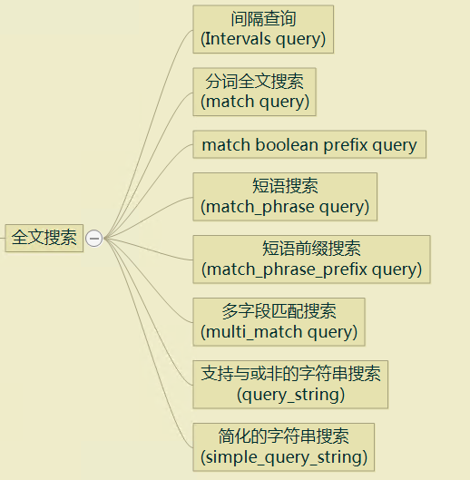

<br>

#### 2.3.2.1 全文搜索速查 ####

　　下面是查询请求结构的快速浏览：（查询语句一览）

 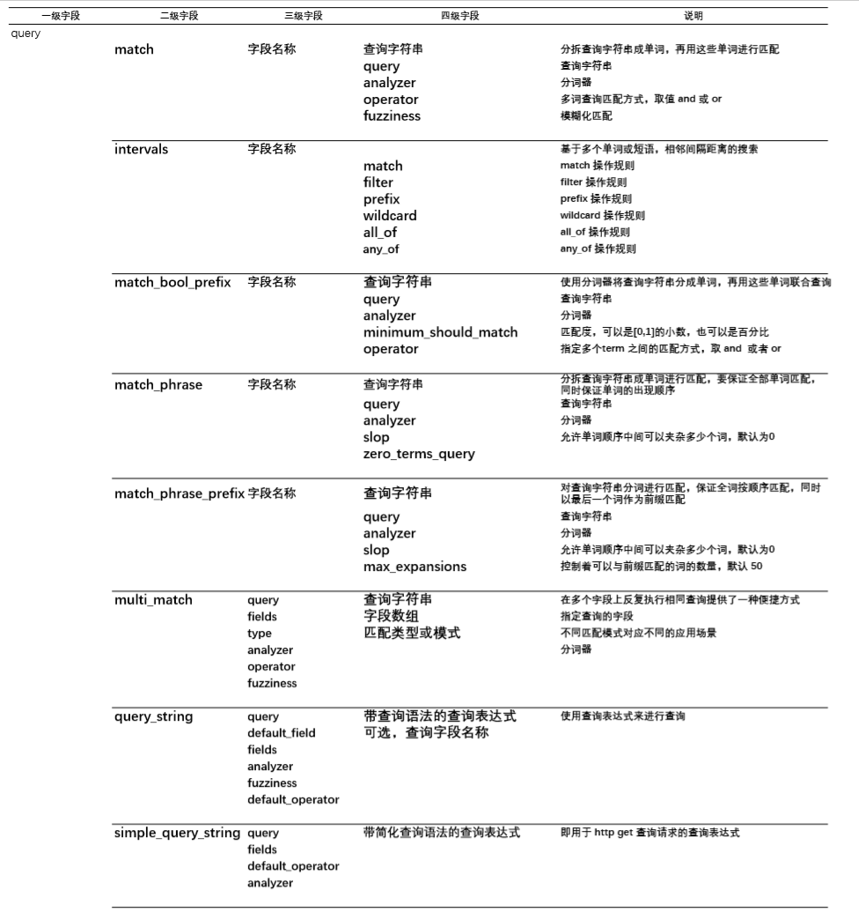

<br>

　　下面是这几个查询的更简化描述（主要是说明查询功能及之间的区别）：

 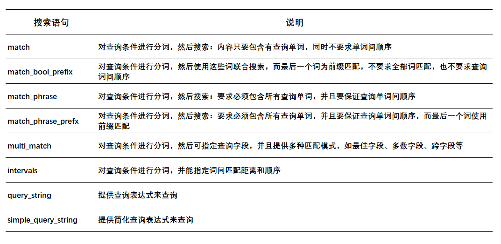

<br>

#### 2.3.2.2 match 多单词匹配查询 ####

　　`match` 查询可以用在不同的字段类型，例如数值、日期、文本类型等，不过用于数值之类的非文本类型时，其查询效果基本上等效于 `结构化查询` 的 `term` 查询，所以本节的重点在于用 `match` 来搜索 `text` 类型的情况。

　　在之前的章节了解到， `text` 类型的文本，在索引之前会用 `分词器` 来处理，`match` 的使用与此密切相关。

　　下面是查询的一些范式与应用：

 + 简化结构范式：

    ```json
     {
        "query":{
            "match":{
                "字段名称": "查询字符串"
            }
        } 
     }
    ``` 
    开始执行查询时，会对 `查询字符串` 进行 `分词`，得到一个 `查询词表`，然后再用此 `查询词表` 来对字段进行匹配：

     - 只要包含词表中的一个或多个单词，即被选中
     - 对选中结果计算相似度（如同一单词匹配多次；同时匹配多个等）
     - 根据相似度评分由大到小排序并返回
     - 下面是个示例：

        ```json
        {
            "query":{
                "match":{
                    "title": "BROWN DOG"
                }
            }
        }
        ```
        + 示例中，查询字段串拆成两个词：`BROWN` 与 `DOG`
        + 下面是返回结果

        ```json
        {
            "hits": [
                {
                    "_id":      "4",
                    "_score":   0.73185337, 
                    "_source": {
                    "title": "Brown fox brown dog"
                    }
                },
                {
                    "_id":      "3",
                    "_score":   0.47486103, 
                    "_source": {
                    "title": "The quick brown fox jumps over the quick dog"
                    }
                },
                {
                    "_id":      "1",
                    "_score":   0.11914785, 
                    "_source": {
                    "title": "The quick brown fox"
                    }
                }
            ]
        }
        ```
        - `id=4` 的文档中，`brown` 匹配两次，`dog` 匹配一次（再加上内容比较短，查询单词占内容比例最高），所以评分也就最高
        - `id=3` 的文档中，`brown` 与 `dog` 各匹配一次，字段内容较长，所以评分一般（相对排前的文档）
        - `id=1` 的文档中，仅出现 `brown` 一次，勉强 `匹配`，所以分数也最低

 + 完整格式：

    ```json
     {
        "query":{
            "match":{
                "字段名称": {
                    "query": "查询字符串",
                    "analyzer": "查询字符串的分词器",
                    "auto_generate_synonyms_phrase_query": "为同义词生成短语查询，默认为 true",
                    "fuzziness": "模糊化查询",
                    "max_expansions": "默认为 50",
                    "prefix_length": "前缀长度，默认为 0",
                    "transpositions": "邻近字符互换，默认为 true",
                    "fuzzy_rewrite": "专用参数",
                    "lenient": "是否忽略查询格式失败（如从数值字段中查文本），默认为 false",
                    "operator": "多单词联合匹配的逻辑运算，可选 AND 与 OR，默认为 OR",
                    "minimum_should_match": "多词匹配时，控制匹配多少词才算匹配，默认为1",
                    "zero_terms_query": "某些文档的内容被分词器移除所有内容时，如何查询，默认 none 不查"
                }
            }
        } 
     }
    ```

#### 2.3.2.3 intervals 灵活定义单词间匹配距离与顺序的查询 ####

　　`Intervals` 通过自定义单词匹配距离与顺序来搜索。`Intervals Query` 提供了一套规则集，通过规则集的灵活组合来实现复杂的查询。 

 + 通用语句范式：

    ```json
    {
        "query":{
            "intervals":{
                "字段名称":{
                    "match": {},
                    "prefix": {},
                    "wildcard":{},
                    "all_of":{},
                    "any_of":{},
                    "filter":{}
                }
            }
        }
    }
    ```
    `match`、`prefix`....`filter` 等，都是规则集，可以有一个或多个内嵌组成复杂查询

 + `match` 规则集

    - query：查询字符串
    - max_gaps：每个词之间的最大间距，默认值为 `-1`，即不限制，设置为 `0` 表示查询的词与词之间必须相连（中间不能有其他词）
    - ordered：是否考虑先后顺序，默认为 false，表示不考虑先后顺序
    - analyzer：分词器
    - filter：过滤规则集（即可以内嵌 `filter` 规则集）
    - use_field：另外指定一个字段用于匹配，提供跨字段的匹配功能

 + `prefix` 规则集

    - prefix
    - analyzer
    - use_field

 + `wildcard` 规则集

    - pattern
    - analyzer
    - use_field

 + `all_of` 规则集（ `AND` 操作）

    - intervals：数组类型，所定义的内嵌规则子集，进行 `AND` 操作 （多条规则的 `与` 操作）
    - max_gaps
    - ordered
    - filter

 + `any_of` 规则集（ `OR` 操作）
  
    - intervals：数组类型，多条规则 `OR` 操作
    - filter

 + `filter` 规则集（ 规则运算 ）

    - after：
    - before：
    - contained_by：
    - containing：
    - not_contained_by：
    - not_containing：
    - not_overlapping：
    - overlapping：
    - script：


#### 2.3.2.4 match_bool_prefix 提供多字段即输即可见查询 ####

　　`match` 搜索本身是基于单词完全匹配来进行，但在一些希望能 `一边输入，一边显示结果` 的场景中，基于单词的匹配不太符合我们的需求，而 `match_bool_prefix` 搜索就是为 `即输即显示` 设计。这个查询分成两大部分：

 + 对输入的字符串进行分词

 + 对最后一个单词使用 `前缀匹配` （因为，最后一个单词在实时输入时，往往不完整，用全词匹配不符合我们的意图）

　　例如，我们在查询输入：`Elasticsearch Ja` 时，分词器将拆分成 `Elasticsearch` 和 `Ja` ，其中 `Ja` 显然不是一个完整的单词，而是一部分，对这部分进行前缀匹配，在即输即查的场景中，明显比全词匹配好得多。

 + 简化范式：

    ```json
    {
        "query":{
            "match_bool_prefix":{
                "字段名称": "查询字符串"
            }
        }
    }
    ```

    下面是示例：

    ```json
    {
        "query": {
            "match_bool_prefix" : {
                "message" : "quick brown fo"
            }
        }
    }
    ```

 + 标准结构：

    ```json
    {
        "query": {
            "match_bool_prefix" : {
                "字段名称": {
                    "query": "查询字符串",
                    "analyzer": "查询分词器",
                    "operator": "单词的匹配逻辑，取 and 或 or，默认是 and",
                    "minimum_should_match": "当 operator 是 or 时，用来指定匹配多少单词才算选中",
                    "fuzziness": "",
                    "prefix_length": "", 
                    "max_expansions":"", 
                    "fuzzy_transpositions":"", 
                    "fuzzy_rewrite":""
                }
            }
        }
    }
    ```
    - `fuzziness` 以及后面那堆参数都是 `模糊化`参数。

 + 下面是示例：

    ```json
    {
        "query": {
            "match_bool_prefix" : {
                "message": {
                    "query": "quick brown fo",
                    "analyzer": "keyword",
                    "operator": "or"
                }
            }
        }
    }
    ```
    - `operator`：表示或者有 `quick` 或者有 `brown` 或者有 `fo`（前缀匹配），只要有一个成立，就算选中


#### 2.3.2.5 match_phrase 保证单词完整且按顺序匹配查询 ####

　　`match_phrase` 与 `match` 一样都是分词匹配，区别在于 `match_phrase` 有以下两个匹配要求：

 + 必须匹配所有单词。即查询字符串中每个单词都必须要有。
 + 要保证按顺序进行匹配。即查询字符串中的单词先后顺序，在匹配字段中匹配的单词先后顺序要一致。

　　下面是查询的内容：

 + 简化范式：

    ```json
    {
        "query":{
            "match_phrase":{
                "字段名称": "查询字符串"
            }
        }
    }
    ```
    下面是示例：

    ```json
    {
        "query":{
            "match_phrase":{
                "字段名称": "查询字符串"
            }
        }
    }    
    ```

 + 标准结构范式：

    ```json
    {
        "query":{
            "match_phrase":{
                "字段名称":{
                    "query": "查询字符串",
                    "analyzer": "分词器",
                    "slop": "相邻两词之间允许的距离，默认为0，即两词间不允许有其他词",
                    "zero_terms_query": "字段内容被分词器删除时，是否用于匹配， 默认为 noe 即不匹配"
                }
            }
        }
    }
    ```

    - `slop`：相邻两词之间的距离。如 `query:"Elasticsearch Java API"`，被分成三个词 `Elasticsearch` 、`Java`、`API`，其中 `Elasticsearch` 与 `Java` 是相邻的词，而 `Elasticsearch` 与 `API` 并不相邻。那么在查询时，所匹配的字段的值：
      
      + `Elasticsearch Java 开发指南`：明显 `Elasticsearch` 与 `Java` 之间相邻，此时 `slop=0`
      + `Elasticsearch client Java 编程`：此时 `Elasticsearch` 与 `Java` 之间有一个单词 `client`，此时 `slop=1` 。。。依此类推


#### 2.3.2.6 match_phrase_prefix 保证单词完整按顺序即输即可见查询 ####

　　`match_phrase` 搜索本身是基于单词完全匹配来进行，但在一些希望能 `一边输入，一边显示结果` 的场景中，基于单词的匹配不太符合我们的需求，而 `match_phrase_prefix` 搜索就是为 `即输即显示` 设计。这个查询分成两大部分：

 + 对输入的字符串进行分词

 + 对最后一个单词使用 `前缀匹配` （因为，最后一个单词在实时输入时，往往不完整，用全词匹配不符合我们的意图）

　　下面是语句的内容：

 + 简化范式：

    ```json
    {
        "query":{
            "match_phrase_prefix":{
                "字段名称": "查询字符串"
            }
        }
    }
    ```

 + 完整的结构：

    ```json
    {
        "query":{
            "match_phrase_prefix":{
                "字段名称": {
                    "query": "查询字符串",
                    "analyzer": "分词器",
                    "max_expansions": "可简单理解为最多单词匹配，默认为 50",
                    "slop": "查询单词之间的间隔值，默认为 0",
                    "zero_terms_query": ""
                }
            }
        }
    }
    ```
    - **`slop`**：虽然要求保持单词之间的顺序，但允许单词之间有其他单词，本参数控制允许单词的数量。默认值为 `0`，表示相邻单词 `紧挨着` 不能有其他单词，而取值 `1` 表示可以相邻 `1` 个单词。


#### 2.3.2.7 multi_match 指定多字段不同模式的匹配查询 ####

　　`multi_match` 提供多字段匹配，上面 `match` 等，通常是单个字段的内容进行匹配，而 `multi_match` 可以实现多个字段的内容 `联合` 匹配。

　　`multi_match` 的意图在于：`对多个字段，提供相同的查询`。由于是涉及到多字段，不同字段的重要性与评分，其查询的结果必然不同，因此 `multi_match` 提供了多种匹配方法：

 + **`best_fields`**（最佳字段匹配）:这是默认匹配模式，即在匹配过程中，每个字段匹配结果都会有一个评分，取最好评分的字段作为最终文档评分（类似 `dis_max 查询`）
 + **`most_fields`**（多数字段匹配）：越多字段匹配，整个文档的评分就越高
 + **`cross_fields`**（跨字段匹配）：将所有要查询的 `字段虚拟成一个大字段`，然后再进行匹配评分。（对于查询内容分散在多字段场景中使用，如地址分成不同字段）  
 + **`phrase`**（保证查询词顺序匹配）：此方式类似 `match_phrase` （事实上，相当于 `match_phrase` 与 `dis_max` 的在每个字段上的联合查询）
 + **`phrase_prefix`**（保证查询词顺序匹配，同时最后词用 prefix 匹配）：相当于 `match_phrase_prefix` 与 `dis_max` 在每个字段上的联合查询
 + **`bool_prefix`**（多数字段匹配，同时最后词用 prefix 匹配）：相当于 `match_bool_prefix` 与 `dis_max` 在每个字段上的联合查询

　　我们可以根据不同的应用场景来使用不同的匹配策略，下面是语法内容：

 + 标准结构范式：（核心参数，同时 `type` 所选的不同匹配方法，可以用此方法的参数） 

    ```json
    {
        "query":{
            "multi_match":{
                "query": "查询字符串",
                "fields": ["field1", "field2", "fieldN", "查询字段数组，名称支持通配符"],
                "type": "上面的匹配类型，默认是 best_fields",
                "operator": "多查询条件间的逻辑运算，取 and 或 or 值，默认为 or",
                "analyzer": "查询字符串分词器",
                "tie_breaker": "评分调节因子，取 (0, 1) 间小数值"
            }
        }
    }
    ```
    - **`type`**：提供不同的匹配方法

        + `best_fields`：相当于用 `match` 匹配每个字段，然后用 `dis_max` 联合得到最终结果，可以使用 `match` 搜索和 `dis_max` 的参数来调节结果
        + `most_fields`：相当于用 `match` 匹配每个字段，然后用 `bool should`联合得到最终结果，可以用 `match` 搜索参数和 `bool-should` 参数调节
        + `cross_fields`：将所有字段合并 `虚拟成一个字段`，然后用 `match` 进行匹配，可以使用 `match` 搜索和 `tie_breaker` 参数来进行调节
        + `phrase`：相当于用 `match_phrase` 和 `dis_max` 联合查询得到最终结果，可以使用两者的参数来进行调节
        + `phrase_prefix`：相当于用 `match_phrase_prefix` 和 `dis_max` 联合查询得到最终结果，可以使用两者的参数来进行调节
        + `bool_prefix`：相当于用 `match_bool_prefix` 和 `dis_max` 联合查询得到最终结果，可以使用两者的参数来进行调节

 + 下面是示例：

    - 使用默认值进行查询：（默认 `best_fields` 匹配方法）

        ```json
        {
            "query": {
                "multi_match": {
                    "query": "chinese food",
                    "fields": ["subject", "message"]
                }
            }
        } 
        ```

    - 示例二

        ```json
        {
            "query": {
                "multi_match": {
                    "query": "multimatch",
                    "fields": ["subject", "message"],
                    "type": "most_fields",
                    "tie_breaker": 0.3
                }
            }
        } 
        ```

    - 示例三：（查询字段使用通配符，如表示 first_name 与 last_name 字段等）

        ```json
        {
            "query": {
                "multi_match" : {
                    "query":      "Will Smith",
                    "type":       "cross_fields",
                    "fields":     [ "*_name", "first.edge" ],
                    "operator":   "and"
                }
            }
        }  
        ```      

#### 2.3.2.8 query_string 使用查询表达式的查询 ####

　　`query_string` 表示使用一个基于特定查询语法的查询表达式来查询，下面是 `特定查询语法` 的基本介绍：

 + `字段名 + 查询内容结构`：表达式中如何表示字段及其查询内容

    - 标准结构：**`字段名：查询内容`**，即 `字段名` 与 `查询内容`，通过冒号连成一个整体，下面是示例：
      - `status:active`：字段名为 `status` 而要查询的内容是 `active`
      - `username:(Admin OR User)`：字段名为 `username`，查询的内容有两项 `Admin` 与 `User`，然后用逻辑运算符 `OR` 表示两者选其一，注意使用小括号括起内容
      - `author:"John Smith"`：使用双引号来要求 `精确匹配` 内容
      - `_exists_:title`：`_exists` 是 `非空查询`，而 `title` 是字段名，也就是字段 `title` 的 `非空查询`
      - `book.\*:(quick OR brown)`：这里使用了 `\` 转义符，并且用 `.` 与 `*` 来表示多个字段，如 `book.title`、`book.content` 等多个字段
      - `fist\ name:David`：使用 `\` 转义符来表示 `空格` 也是字段名的一部分
      - `content:(new year city)`：使用括号来定义 `查询字符串`（会分词）

    - 可以忽略 `字段名` 部分，此时表示用查询语句中指定的字段来 `查询内容` （除了在表达式中可以指定字段，也可以在语句中指定字段）

 + `通配符`：可以在表达式或查询内容中使用 `?` 和 `*` 通配符

    - `domain:*.macroview.com`：查询内容中使用了通配符
    - `author:(Bo? OR Sm*)`：使用通配符

 + `布尔运算符`：可以使用 `AND`、`OR`、`NOT` 运算符来定义查询

    - `domain:*.macroview.com AND interface:app`：两个字段查询用 `AND` 联合
    - `NOT interface:app`：`NOT` 非运算符的使用
    - `quick OR brown`：不带字段，表示用查询语句中的字段来查询，两个单词用 `OR` 来联合查询

 + `范围表示`：使用 `[A TO B]` 与 `{A TO B}` 来表示 `[A,B]` 或 `(A, B)`等

    - `[0 TO 10]`：表示 `[0, 10]`（即大于或等于0，小于或等于10）
    - `[50 TO *]`：表示 `[50, ∞)`（即大于等于 50）
    - `date:{2019-01-01 TO 2019-12-31}`：添加字段的内容，表示的范围为从 `2019-01-01`（但不包含`2019-01-01`）到 `2019-12-31`（但不包含 `2019-12-31`）
    - `{* TO 2019-12-31]`：从之前一直到 `2019-12-31`（包含`2019-12-31`）
    - `count:[1 TO 5}`：表示 `[1, 5)` （整数区间）
    - `age:>10`：当指定字段时，也可以使用 `>`、`>=`、`<`、`<=` 来定义范围。。。。等等

 + `正则表达式`：使用 `/正则表达式/` 来定义正则表达式内容

    - `name:/joh?n(ath[oa]n)/`：`name` 为字段，而 `/joh?n(ath[oa]n)/` 就是正则表达式

 + `模糊化搜索`：使用 `内容~` 来定义 `模糊化查询`

    - `message:(quikc~ OR foks~)`：`message`为字段，而 `quikc` 后而带 `~` 表示此单词进行 `模糊化` 查询

 + ..... 还有很多，看官方文档

　　使用上述的查询语法构造成查询表达式，提交后由 `ES` 的表达式分析器将内容变成语句，再进行查询，下面是本语句的通用结构：

 + 结构内容：（仅给出部分，全部参数官网）

    ```json
    {
        "query": {
            "query_string" : {
                "query" : "查询表达式",
                "default_field" : "外部指定的查询字段",
                "fields": ["field1", "field2", "字段数组，也支持多字段查询"],
                "analyzer": "分词器",
                "default_operator": "指定逻辑运算，值 and 或 or，默认为 or",
                "boost": "权重值",
                "allow_leading_wildcard": "是否允许通配符作为查询表达式的首字符，默认为 true",
                "fuzziness": "模糊化查询",
                "minimum_should_match": "最小匹配条件数，默认为 1"
            }
        }
    }
    ```

 + 下面是一些例子：

    ```json
    {
        "query": {
            "query_string" : {
                "query" : "(new york city) OR (big apple)",
                "default_field" : "content"
            }
        }
    }
    ```

    ```json
    {
        "query": {
            "query_string": {
                "query": "(content:this OR name:this) AND (content:that OR name:that)"
            }
        }
    }    
    ```

#### 2.3.2.9 simple_query_string 简化版查询表达式的查询 ####

　　`simple_query_string` 是 `query_string` 的一个简化版，使用 `符号` 来定义语法，从而方便在 `GET` 请求参数中使用的查询表达式，由于是简化版，其可读性比 `query_string` 为差。

　　下面是一些语法符号的含义：

 + **`+`**：表示 AND
 + **`-`**：表示 NOT
 + **`|`**：表示 OR
 + **`*`**：如果放在词尾，表示 `前缀查询`
 + **`()`**：表示优先匹配
 + **`~N`**：放在词尾，表示 `模糊化` 查询，而 `N` 表示编辑距离（即转换次数）
 + **`~N`**：放在短语后，表示两词间距

　　查询语句的结构与 `query_string` 基本一致：

 + 结构内容：（仅给出部分，全部参数官网）

    ```json
    {
        "query": {
            "simple_query_string" : {
                "query" : "查询表达式",
                "fields": ["field1", "field2", "字段数组，也支持多字段查询"],
                "analyzer": "分词器",
                "default_operator": "指定逻辑运算，值 and 或 or，默认为 or",
                "boost": "权重值",
                "flags": "使用一些特定的符号",
                "fuzziness": "模糊化查询",
                "minimum_should_match": "最小匹配条件数，默认为 1"
            }
        }
    }
    ```

 + 下面是一些例子：

    ```json
    {
        "query": {
            "simple_query_string" : {
                "query" : "foo | bar + baz*"
            }
        }
    }
    ```

    ```json
    {
        "query": {
            "simple_query_string" : {
                "query": "\"fried eggs\" +(eggplant | potato) -frittata",
                "fields": ["title^5", "body"],
                "default_operator": "and"
            }
        }
    }
    ```
    - `\`：这是转义符


#### 2.3.2.10 match_all 查询所有记录 ####

　　`match_all` 查询语句唯一的工作就是查询所有记录，就如 `SQL`：

  **`SELECT * FROM table`**

 + 结构范式：

    ```json
    {
        "query":{
            "match_all":{}
        }
    }
    ```


<br>

### 2.3.3 组合搜索 ###

　　无论是 `结构化搜索` 还是 `全文搜索` 等，都可以看作是一个原子操作 （或函数），其操作最终结果不是 `匹配` 就是 `不匹配`，`组合搜索` 就是利用这种 `特质`，将这些 `原子操作` 作为规则组合/结合起来。

　　不同的 `组合搜索` 就是提供这些 `原子操作` 的不同组合规则，充分利用这些组合规则，就可以构建复杂的搜索，满足不同的搜索需求。

 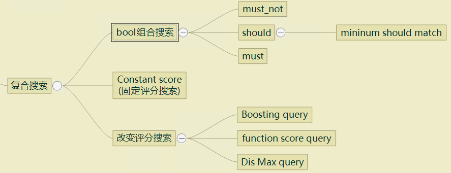

#### 2.3.3.1 boolean 布尔联合搜索 ####

　　`boolean query`是非常重要，也是经常使用的 `组合查询`。其核心就是使用 `逻辑运算符` 来组合一个或以上的查询语句，从而实现复杂的查询的语句。

　　换句话，`boolean query` 就是对 `原子操作` 进行 `与`、`或`、`非`、`过滤` 的组织操作。

　　`boolean query` 提供下面几个布尔运算：

 + **`must`**：对象类型，`与`（条件必须成立）
 + **`must_not`**：对象类型，`否`（条件不能成立）
 + **`should`**：数组类型，`或` （一组条件，可以满足零到多条）
 + **`filter`**：对象类型，过滤器

　　每个运算符包含查询语句，也包含 `bool query` 本身，这样通过不同组合，可以构造非常复杂的搜索。

　　下面是语句的内容：

 + 标准结构范式：

    ```json
    {
        "query":{
            "bool":{
                "must":{
                    "查询语句": {}
                },
                "must_not":{
                    "查询语句":{}
                },
                "should":[
                    {"查询语句1":{}},
                    {"查询语句2":{}},
                    {"查询语句N":{}}
                ],
                "filter":{
                    "查询语句":{}
                },
                "minimum_should_match": "should 最小语句匹配值",
                "boost": "权重值"
            }
        }
    }
    ```

    - **`must`**：必须要匹配的条件，并参与评分计算，这是 `与` 操作
    - **`must_not`**：必须 `不` 匹配的条件，也就是说不能满足 `must_not` 内的条件，这是 `否` 操作。
    - **`should`**：必须满足 `should` 内的零或多个查询条件。
    
      - 这是一个多条件组成的数组，条件间的关系是 `或` 的关系，而满足条件的数量由 `minimum_should_match` 指定
      - 默认情况下，如果 `bool` 只有 `should` 运算情况下，只需要匹配其中一个条件，即为 `选中`
      - 默认情况下，如果只有 `filter` 和 `should` 情景下，`should` 会被忽略，此时可以使用 `minimum_should_match` 设置（如 `1` 或大于 `1` 的值）来强制匹配 `should` 中的一个或多个语句条件
    
    - **`filter`**：必须要匹配的条件，但不会参与评分计算
    - **`minimum_should_match`**：`should` 的配套设置，用来指定 `should` 数组中，要匹配的条件数量。
    
    上面所列的 `查询语句` 就是指 `ES` 的所有查询语句。

 + 仅使用过滤器

    ```json
    {
        "query":{
            "bool":{
                "filter":{
                    "term": {
                        "firstname.keyword": "Amber"
                    }
                }
            }
        }
    }
    ```
    - 上面使用了 `term` 单字段精确匹配语句
    - 表面虽然没有 `must`、`must_not`、`should` 逻辑运算，但隐藏了以下的 `must`:（相当于）

        ```json
        {
            "query":{
                "bool":{
                    "must":{
                        "match_all":{}
                    },
                    "filter":{
                        "term":{
                            "firstname.keyword":"Amber"
                        }
                    }
                }
            }
        }
        ```

 + 使用 `minimum_should_match` 情形

    ```json
    {
        "query":{
            "bool":{
                "filter":{
                    "match_bool_prefix":{ "firstname": "Am"}
                },
                "should":[
                    {
                        "range":{
                            "age": {
                                "gte": 18
                            }
                        }
                    },
                    {
                        "prefix":{
                            "address":"880"
                        }
                    }
                ],
                "minimum_should_match": 1    
            }
        }
    }
    ```

#### 2.3.3.2 constant_score 固定得分搜索 ####

　　我们知道，很多查询都是基于评分进行 （如使用 `TF/IDF` 算法计算相似度），而有一些场景，我们并不关心这些分数（又或者只关心某个分数值的群体），而是关心所查询的内容是否存在/出现过（即忽略 `TF/IDF`）。

　　 `constant_score` 固定得分搜索，就是为这样的应用场景而设计。`constant_score 搜索` 比较简单，下面是其结构范式：

 + 结构范式：

    ```json
    {
        "query":{
            "constant_score": {
                "filter": {},
                "boost": "可指定得分值，默认为 1，即只要出现就选中"
            }
        }
    }
    ```

    - `filter`：这是一个过滤器查询，也会进行评分计算，然后分值与 `boost` 比较来选中
    - 下面是一个示例：

    ```json
    {
        "query": {
            "constant_score" : {
                "filter" : {
                    "term" : { "user" : "kimchy"}
                },
                "boost" : 1.2
            }
        }
    }    
    ```

 + `constant_score` 自己是个独立语句，同时也可以复合到其他语句中，下面是示例：

    ```json
    {
        "query": {
            "bool": {
                "should": [
                    { 
                        "constant_score": {
                            "query": { "match": { "description": "wifi" }}
                        }
                    },
                    { "constant_score": {
                    "query": { "match": { "description": "garden" }}
                    }},
                    { 
                        "constant_score": {
                            "boost":   2,
                            "query": { "match": { "description": "pool" }}
                        }
                    }
                ]
            }
        }
    }    
    ```
    本示例中，`constant_score` 被放到一个 `bool 布尔复合查询` 当中。

#### 2.3.3.3 boosting query 搜索 ####

　　`boosting 搜索` 提供 `positive` 和 `negative` 两个子查询，每个子查询都可以包含具体的 `查询语句`。两个子查询都能返回结果，其中 `positive` 子查询返回正常的结果，而 `negative` 则是将结果的评分值，乘上语句中参数 `negative_boost` 的值（降低评分），再返回。（即 `negative` 主要的目的是降低评分）

　　在一些场景当中，某些匹配条件因评分问题，可能会产生一些 `干扰项`，但这些 `干扰项` 又不确定排除，此时可以通过 `negative` 来降低 `干扰项` 评分来得到期望结果。

 + 下面是结构范式：

    ```json
    {
        "query": {
            "boosting" : {
                "positive" : {},
                "negative" : {},
                "negative_boost" : "为 (0, 1) 间的小数值"
            }
        }
    }
    ```

    - **`positive`**：这是正常的评分查询部分。
    - **`negative`**：将查询的结果评分 `乘` `negative_boost` 得到最终的评分，如果文档满足 `positive` 查询条件时，则：
      + 直接使用 `positive` 中计算出来的评分结果
      + 再乘 `negative_boost` 得到最终的评分
    - **`negative_boost**：用来降低 `negative` 子句的评分的数值，取值为 `(0, 1)` 区间的小数
    - 下面是使用示例：

        ```json
        {
            "query": {
                "boosting" : {
                    "positive" : {
                        "term" : {
                            "text" : "apple"
                        }
                    },
                    "negative" : {
                        "term" : {
                            "text" : "pie tart fruit crumble tree"
                        }
                    },
                    "negative_boost" : 0.5
                }
            }
        }
        ```

#### 2.3.3.4 dis_max 最佳字段搜索 ####

　　基于评分的搜索语句中，文档的最终得分往往是多个计分项的组合，例如平均分（即在同文档内，多个评分相加求平均分作为文档的最终评分），这在很多场合下是合理的，但在某些特定的场合中，不是通过平均分来确定最终评分，而是通过 `最大值` 来确定评分，这个 `最大值` 就是 `dis_max 最佳字段匹配搜索` 的来由。

　　我们使用一个示例来理解，下面是一个查询句子：（bool 组合查询）

    ```json
    {
        "query": {
            "bool": {
                "should": [
                    { "match": { "title": "Brown fox" }},
                    { "match": { "body":  "Brown fox" }}
                ]
            }
        }
    }
    ```
    这是一个 `should` 的组合查询，计算评分值后，返回下面的两个记录：

    ```json
    {
        "hits": [
            {
                "_id":      "1",
                "_score":   0.14809652,
                "_source": {
                "title": "Quick brown rabbits",
                "body":  "Brown rabbits are commonly seen."
                }
            },
            {
                "_id":      "2",
                "_score":   0.09256032,
                "_source": {
                "title": "Keeping pets healthy",
                "body":  "My quick brown fox eats rabbits on a regular basis."
                }
            }
        ]
    }  
    ```
    第一个结果中，`brown` 同时在 `title` 与 `body` 中有匹配，而第二个结果中，只有 `body` 有分值，因此最终的计算结果，`_id=1` 的分值就比 `_id=2`的高。但在实际的感观中，`_id=2` 的 `body` 能完整匹配 `Brown fox` 显然更有 `价值`，此时 `dis_max` 查询有就用武之地

 + 结构范式：

    ```json
    {
        "query": {
            "dis_max" : {
                "queries" : [],
                "tie_breaker" : "一个合理的折中值"
            }
        }
    }
    ```
    
    - **`queries`**：查询语句集（数组）
    - **`tie_breaker`**：调节因子，用法：除了最大值评分外，其他评分乘这个值，然后包含最大值在内的评分求和。这个值是一个在 `(0, 1)` 区间的小数（通常建议在 `(0.0, 0.4)` 之间，避免 `最大值` 失去意义）
    - 下面是用于实现上面例子意图的示例：

        ```json
        {
            "query": {
                "dis_max": {
                    "queries": [
                        { "match": { "title": "Brown fox" }},
                        { "match": { "body":  "Brown fox" }}
                    ]
                }
            }
        }
        ```

    - 下面是另一个添加 `协调因子` 的示例：

    ```json
    {
        "query": {
            "dis_max": {
                "queries": [
                    { "match": { "title": "Quick pets" }},
                    { "match": { "body":  "Quick pets" }}
                ],
                "tie_breaker": 0.3
            }
        }
    }
    ```

#### 2.3.3.5 Function score 自定义评分搜索 ####

　　无论最终评分是通过各项评分求平均值，还是最大值，都无法覆盖全部应用场景，因此提供了 `Function Score 自定义评分` ，来让我们有机会用自己的评分计算公式来计算评分。（这个搜索比较复杂，内容较多）

 + 结构范式：

    ```json
    {
        "query": {
            "function_score": {
                "query": { "match_all": {} },
                "boost": "5", 
                "functions": [],
                "max_boost": 42,
                "score_mode": "max",
                "boost_mode": "multiply",
                "min_score" : 42,
                "script_score": {},
                "weight": "数值",
                "random_score":{},
                "field_value_factor":{},
                "linear":{},
                "exp":{},
                "gauss":{}
            }
        }
    }
    ```

### 2.3.4 Joining Query 连接搜索 ###

　　由于 `ES` 无论是索引，还是数据存储方式，都跟传统的 `SQL` 有很大的区别，因此象传统 `SQL` 那样简单轻松的 `join`（连接）操作，在 `ES` 中很难实现又或者代价比较大，因此不太建议或审慎使用类似的操作。但另一方面，这样的操作又有其使用场景，提供类似的操作是非常有必要的，`ES` 操作了以下的一些类似 `连接` 的查询操作：

 + `Nested`查询：嵌套查询，要注意：`Nested` 类型中，各子对象会被独立索引，因此查询时要留意。

 + `Has child`查询：通过子文档来查询父文档

 + `Has parent`查询：通过父文档来查子文档 

 + `Parent ID`查询：通过 `parent id` 来得到子文档

#### 2.3.4.1 Nested Query 嵌套搜索 ####

　　`Nested` 类型也就是对象数组类型，里面存放着一组对象，因此要对此字段类型的查询，使用 `Nested` 查询可以简化查询操作。

 + 结构范式：

    ```json
    {
        "query":  {
            "nested" : {
                "path" : "要查询的嵌套对象数组（字段名称）",
                "query" : {},
                "score_mode" : "score 计算方法",
                "ignore_unmapped": "是否忽略 path 的错误"
            }
        }
    }
    ```
    - **`query`**：这是子查询语句，可以使用之前的所有查询语句。可以理解将对象数组也理解为一个小型索引，因此可以对此小型索引使用查询语句。
    - **`score_mode`**：评分计算方法

        + `avg`：平均值为评分，即数组内每个对象计算结果再平均。
        + `max`：最大值为评分
        + `min`：最小值为评分
        + `none`：关闭评分机制（用评分方式来查询），此时分数将默认为 `0`
        + `sum`：求和为评分

 + 查询示例：

    - 使用 `bool` 查询

        ```json
        {
            "query":  {
                "nested" : {
                    "path" : "obj1",
                    "query" : {
                        "bool" : {
                            "must" : [
                            { "match" : {"obj1.name" : "blue"} },
                            { "range" : {"obj1.count" : {"gt" : 5}} }
                            ]
                        }
                    },
                    "score_mode" : "avg"
                }
            }
        }
        ```    

    - 嵌套查询示例
    
        ```json
        {
            "query" : {
                "nested" : {
                    "path" : "driver",
                    "query" : {
                        "nested" : {
                            "path" :  "driver.vehicle",
                            "query" :  {
                                "bool" : {
                                    "must" : [
                                        { "match" : { "driver.vehicle.make" : "Powell Motors" } },
                                        { "match" : { "driver.vehicle.model" : "Canyonero" } }
                                    ]
                                }
                            }
                        }
                    }
                }
            }
        }
        ```    

#### 2.3.4.2 Has child 用子来查父搜索 ####

 + 结构范式：
 
    ```json
    {
        "query": {
            "has_child" : {
                "type" : "join 类型的关联名称",
                "query" : {},
                "max_children": "大于此值将不返回父文档",
                "min_children": "小于此值将不返回父文档",
                "score_mode" : "评分计算方式"
            }
        }
    }
    ```

 + 下面是一个示例：

    - 定义了父子类型的一个索引

        ```json
        {
            "mappings": {
                "properties" : {
                    "my-join-field" : {
                        "type" : "join",
                        "relations": {
                            "parent": "child"
                        }
                    }
                }
            }
        }
        ```       
        - `my-join-field`：`join` 类型的字段

    - 查询示例

        ```json
        {
            "query": {
                "has_child" : {
                    "type" : "child",
                    "query" : {
                        "match_all" : {}
                    },
                    "max_children": 10,
                    "min_children": 2,
                    "score_mode" : "min"
                }
            }
        }
        ```

#### 2.3.4.3 Has parent 用父来查子搜索 ####

 + 结构范式：
 
    ```json
    {
        "query": {
            "has_parent" : {
                "parent_type" : "join 类型的关联名称",
                "query" : {},
                "score_mode" : "评分计算方式",
                "ignore_unmapped": ""
            }
        }
    }
    ```

 + 下面是一个示例：

    - 定义了父子类型的一个索引

        ```json
        {
            "mappings": {
                "properties" : {
                    "my-join-field" : {
                        "type" : "join",
                        "relations": {
                            "parent": "child"
                        }
                    },
                    "tag" : {
                        "type" : "keyword"
                    }
                }
            }
        }
        ```       
        - `my-join-field`：`join` 类型的字段

    - 查询示例

        ```json
        {
            "query": {
                "has_parent" : {
                    "parent_type" : "parent",
                    "query" : {
                        "term" : {
                            "tag" : {
                                "value" : "Elasticsearch"
                            }
                        }
                    }
                }
            }
        }
        ```


#### 2.3.4.4 Parent ID 用父 ID 查子搜索 ####

 + 结构范式：
 
    ```json
    {
        "query": {
            "has_parent" : {
                "type" : "join 类型的关联名称",
                "id" : "parent id",
                "ignore_unmapped": ""
            }
        }
    }
    ```

