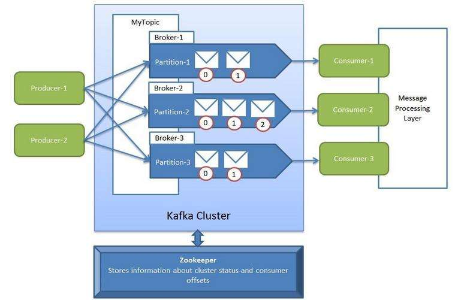

@[toc](目录)


## 1. 说明

###  1.1 关于本文档

　　本文档为 `Kafka` 的开发提供一个参考材料，不是强制性或约束性的内容。

###  1.2 版本：1.0

## 2. 内容

###  2.1 Kafka 简介

　　`Kafka`是 LinkedIn （领英）公司使用 `Scala`语言开发的，用于解决 LinkedIn 公司内部海量日志传输问题的系统，应用领域：

  + 日志类型数据传输：数据一致性并非核心功能与实现。

  + 分布式数据流：多节点，高容错

　　后来，`Kafka`被 LinkedIn `送给` `Apache 基金会`，现时成为 `Apache` 的顶级项目。`Kafka` 因为高性能（高吞吐、低延迟）而倍受用户欢迎，业而成为最受欢迎的终端与数据存储、数据存储与数据存储之间的传输与处理桥梁系统之一。 

　　从功能上看，`Kafka` 是一个：

 + 生产者/消费者系统

 + 消息队列

###  2.2 Kafka 体系结构

　　为应用与数据存储之间提供高性能（实时）数据传输：

#### 2.2.1 宏观


<br>

#### 2.2.2 体系　　



<br>

###  2.3 Kafka 概念原理

　　作为一个系统型的平台，本身包含了一些概念定义，理解这些概念才能更好使用这个系统。

 + 下面是较为细化外部关系图：


<br>

    从开发角度来看，从图中可以看出一些工作角色（即编程组件）：

    - Kafka Producer：数据生产者（往 `Kafka`中扔数据）
    - Kafka Connect Source：一些已经实现，针对某些特定应用的“Producer”
    - Kafka REST Proxy：这是 Kafka REST API 的代理服务
    - Kafka Consumer：数据消费者（从 `Kafka`中取数据的应用）
    - Kafka Connect Sink：一些已经实现，针对特定应用的 "Consumer"


 + 内部的数据（生产与消费）关联图：


　　从上述的图示中，我们可以看到一些概念：

 + **Broker**：指 `Kafka`服务器节点（部署了`Kafka`）

     可以有一个或多个节点（`Kafka`实例），通常单个节点用于测试（并且单个节点比较容易出错和丢数据）。而生产环境则通常由三个或以上（一般为单数）`Broker`节点组成集群提供服务。（节点间通过数据多份存放与复制来保证数据的高可用性）

 + **Zookeeper**：这是 `Kafka`节点的通讯基础，也是外围应用与`Kafka`交互的基础。`Zookeeper`是一个分布式应用协调服务系统，是整个 `Kafka`集群的基础与协调器。同样，`Zookeeper`也可以有一个或多个节点组成。

 + **Topic**：信息数据主题（名称）

     通俗来说，就是某类数据（由生产者生产出）名称标识，也是对数据的一种分类（名称），消费者是通过名称来得到所要消费的数据。

 + **Partition**：`Topic`数据分区（队列），是对同一 `Topic`下的数据进行划分。

     `Partition`不仅仅是逻辑数据划分，同时在 `kafka`存储中也是实实在在存储分区，不同分区数据的存储位置不同（同一分区存在同一位置）。
     `Partition`可以形象地理解为队列，按先后次序排在一起的队列，如下图所示：

     

     <br>
     很明显：

      - 一个 `Partition` 是一个有序队列，最先到达的数据排在队列头部，消费者也最先得到。
      - 而`Partition` 间并不存在次序问题，也就是说，处于不同 `Partition`的数据之间，没有先后的概念定义。
      - 因为`Partition`间没有顺序关系，所以能够进行并发消费（这是高性能的基础之一）

 + **Offset**：就是 `Partition` 队列中数据的位置编号（即位置指针）

     消费者可以自动或手动控制 `Offset`（位置），读取此位置的数据：

      - 自动情况下，系统会根据消费者数据读取“量”来计算和移动 `Offset`
      - 手动，即在程序中直接指定要读取的位置(`Offset`)。这种方式可以才消费者灵活地消费数据（例如跳过某些数据等）

 + **Producer**：数据生产者，这是向 `kafka`发送数据的外部应用。

      数据生产者可以有一个或多个，这个不受 `Broker` 和 `Topic`的影响。

 + **Consumer**：数据消费者，也就是从 `kafka` 获取数据的应用。

     消费者与生产者不需要对等（即一对一），对于任何一个 `Topic` 都可以有一个或多个消费者进行消费。

 + **Consumer Group**：消费者组，由多个消费者组成的组。

     多个消费者可以组成一组，叫消费组。每个消费组可以使用一个标签来标识。下面是一些常识性内容：

      - 消费组中的消费者，可以在同一进程内，也可以在不同进程内，甚至是不同的服务器内。
      - 同一组中的消费者，可以消费不同 `Topic`数据，同一个消费者，可以消费不同的`Topic`或`Partition`
      - 在同一消费组中，每个 `Partition` 只能对应一个消费者。换言之，同一消费组不能有多个消费者消费同一个 `Topic` 中的同一 `Partition`。
      - 使用多分区 + 多消费者方式可以极大提高数据处理速度

      下面是一个示意图：

      

 + **Record**：这是从编程角度的消费记录结构，向 `Kafka`发送一次数据，就相当于一个 `Record`。

      每个 `Record` 通常由 `key`、`value`和 `timestamp` 组成。

 + **Streams**：数据流，由一个 `Topic` 输出到另一个 `Topic`

      这是 `Kafka`内部的数据流转概念，下面是一个示意图：

      


### 2.4 Kafka 开发入门

　　`Kafka`提供了多种形式的开发接口，包括专为语言提供的开发库，如`Java`、`Python`等，另外，也有成熟的`REST Proxy`提供 `REST API`来接入 `Kafka`。

 + `Java`开发库，由`Kafka`本身提供。

 + `REST API`，基本上任何语言都可以使用

#### 2.4.1 Java 开发库开发

 + 引入开发库依赖

```xml
<dependency>
    <groupId>org.apache.kafka</groupId>
    <artifactId>kafka-clients</artifactId>
    <version>2.1.0</version>
</dependency>
```

　　开发包括：

 + 生产者的开发

 + 消费者的开发

　　下面是官方的开发示例代码：

 + **生产者**

   - 示例代码

    ```java
        Properties props = new Properties();
        //指定单个的 Kafka 节点
        props.put("bootstrap.servers", "localhost:9092");
        
        //如果是集群的话，可以如下设置 kafka 节点
        //props.put("metadata.broker.list", "localhost:9092,localhost:9093");

        //所有 kafka 节点响应才认为消息提交成功（类似事务）
        props.put("acks", "all");
        props.put("delivery.timeout.ms", 30000);
        //批量数据发送（即达到此值时，才会真正发送）
        props.put("batch.size", 16384);
        //延迟或等待发送时间（要发送时，延迟一个时间才发送）
        props.put("linger.ms", 1);
        //数据缓存大小
        props.put("buffer.memory", 33554432);
        props.put("key.serializer", "org.apache.kafka.common.serialization.StringSerializer");
        props.put("value.serializer", "org.apache.kafka.common.serialization.StringSerializer");

        Producer<String, String> producer = new KafkaProducer<>(props);
        for (int i = 0; i < 100; i++){
            //"my-topic" 这是 Topic 名称
            //在不指定 Partition 的情况下，会取默认值，通常是 0
            producer.send(new ProducerRecord<String, String>("my-topic", Integer.toString(i), Integer.toString(i)));
        }

        producer.close();
    ```     

 + **消费者**

   - 示例代码

    ```java
     Properties props = new Properties();
     //定义消费数据的节点
     props.put("bootstrap.servers", "localhost:9092");

     //定义一个消费组名
     props.put("group.id", "test");

     //如果读取成功，自动提交（计算）Offset
     props.put("enable.auto.commit", "true");

     //offset 提交的频率（每秒提交一次）
     props.put("auto.commit.interval.ms", "1000");
     props.put("key.deserializer", "org.apache.kafka.common.serialization.StringDeserializer");
     props.put("value.deserializer", "org.apache.kafka.common.serialization.StringDeserializer");

     KafkaConsumer<String, String> consumer = new KafkaConsumer<>(props);

     //订阅消费主题（这里订阅了两个主题）
     consumer.subscribe(Arrays.asList("foo-topic", "bar-topic"));

     //用一个无限循环来消费数据
     while (true) {
         //取数据
         ConsumerRecords<String, String> records = consumer.poll(100);

         //显示数据
         for (ConsumerRecord<String, String> record : records){
             System.out.printf("offset = %d, key = %s, value = %s%n", record.offset(), record.key(), record.value());
         }
     }
    ```

#### 2.4.2 REST API 形式开发

　　要使用`REST Api`需要安装一个额外的 `REST Proxy`应用。通常我们使用 `Confluent Kafka-rest proxy` 来作为`REST Proxy`，因此下面所描述的开发，就是针对此REST Proxy的开发。

　　参数说明参考：[API Doc](https://docs.confluent.io/1.0/kafka-rest/docs/api.html)

　　在使用 `REST Proxy`时，需要注意两点：

 + 所发送的数据使用 `utf-8` 作为统一编码

 + 所发送的数据必须使用`Base64`进行预处理

　　有了上述两点共识后，下面是介绍使用 REST API 的开发形式（比用开发类库容易）：

 + **生产者**（其实就是数据发送者）

   - **`Post /topics/{topic_name}`** 发送指定 topic 数据

     * 请求头要求：

       + content-type: application/vnd.kafka.json.v2+json
       + Accept: application/vnd.kafka.v2+json, application/vnd.kafka+json, application/json

     * Post 发送数据对象格式

       + 要求：JSON 格式
       + 数据：Records 列表
       + 示例：

        ```json
            { 
                "records":[
                {
                key: "message key or null",
                value: "Base64 message value",
                partition: n
                },
                {
                key: "...",
                value: "...",
                partition: n
                }
            ]
            }
        ```
        其中 `key`可以为 `null`值；`value`必须使用 `Base64`进行编码处理；`partition`也是可选项，默认为`0`值，下面是一个最简单的数据示例：

        ```json
        {
            "records":[
                {value: "Y29uZmx1ZW50"},
                {value: "a2Fma2E="}
            ]
        }
        ```

     * 响应内容（发送后的响应）：以状态码形式返回结果

       + 200 OK：表示发送成功
       + 404 Not Found
         - 40401 Topic not found
         - 40402 Partition not found
       + 422 表示无效的数据（Unprocessable Entity）
         - 42201 Request includes keys and uses a format that requires schemas,but does not include the `key_schema` Or `key_schema_id` fields
         - 42202 Request includes values and uses a format that requires schemas,but does not include the `value_schema` Or `value_schema_id` fields
       + 500 Internal Server Error
         - 50001 Zookeeper error
         - 50002 Kafka error

   - **`POST /topics/{topic_name}/partitions/{partition_id}`** 向指定 topic 的指定 partition 发送数据

     * 请求头的要求同上
     * Post 发送数据对象的格式同上，唯一不同的是不需要在数据中带 `parition`字段来指定发送的`partition` 
     * 响应同上

   - **`GET /topics`** 返回 topic 列表

     * 响应的数据格式示例： /topics

     ```json
     [
        {"name":"test", "num_partitions": 3},
        {"name":"test2", "num_partitions": 1}
     ]
     ```
   - **`GET /topics/{topic_name}`** 返回具体的 topic 信息

     * 示例：/topics/test
     ```json
        {"name":"test", "num_partitions": 3}
     ```   

 + **消费者**

   - **`POST /consumers/{group_name}`** 创建一个消费者

     * 请求数据格式：

     ```json
     {
         "id": "消费组中唯一性 id，如果不提供的话会自动生成一个",
         "format": "消费数据的格式，有两种：binary|avro。默认为:binary",
         "auto.offset.reset": "消费者的 auto.offset.reset 设置",
         "auto.commit.enable": "auto.commit.enable 设置：true|false"
     }
     ```
         下面是一个示例：Post /consumers/testgroup
     ```json
      {
          "id": "my_consumer",
          "format": "binary",
          "auto.offset.reset": "smallest",
          "auto.commit.enable": "false"
      }
     ```

     * 返回结果格式：

     ```json
     {
         "instance_id": "消费者名称，实例名",
         "base_uri": "消费者用来得到数据的 url，通常的结构为：http://host:port/consumers/{consumer_group}/instances/{instance_id}"
     }
     ```
         下面是一个示例：
     ```json
      {
          "instance_id": "my_consumer",
          "base_uri": "http://proxy-instance/consumers/testgroup/instances/my_consumer"
      }
     ```

   - **`DELETE /consumers/{group-name}/instances/{instance_id}`** 删除一个消费者

     * 返回 2xx 表示删除成功

   - **`POST /consumers/{group-name}/instances/{instance_id}/offsets`**

     * 请求数据：无
     * 返回：list of the partitions with the committd offsets.

   - **`GET /consumers/{group-name}/instances/{instance_id}/topics/{topic-name}`** 读取 Topic 消息

     * 这是创建一个消费者后，返回的 `Base_uri`的内容，通过这个 uri 就可以消费数据
     * 查询参数：可以带一个 `max_bytes` 的查询参数，用来指示最大读取数据值
     * 返回结果：(示例)

     ```json
     [
         {
             "key": "a2v5",
             "value": "Y29uZmx1ZW50",
             "partition": 1,
             "offset": 100
         },
         {
             "key": "a2v5",
             "value": "a2Fma2E=",
             "partition": 2,
             "offset": 101
         }
     ]
     ```

