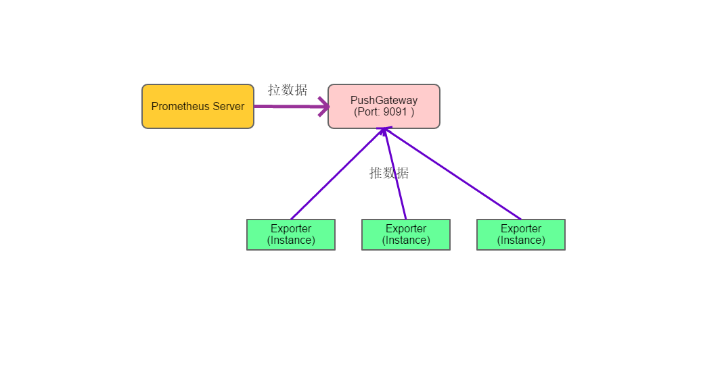

@[toc](目录)


## 1. 说明

###  1.1 关于本文档

　　本文档为 `Prometheus` 的开发提供一个参考材料，不是强制性或约束性的内容。

###  1.2 版本：1.0

## 2. 内容

###  2.1 Prometheus 简介

　　`Prometheus` 是由 `SoundCloud` 开源的一个时间序列数据库和告警系统。在 2016 年 Linux 基金会成立 CNCF(原生云基金会)时，就将 `Prometheus`纳入旗下作为第二个开源项目（第一个就是 K8s），最初也是用来收集`K8s`集群的性能数据，并进行分析与显示（再加上告警）。
　　随着时间的推移，越来越多公司使用这个系统来存储与分析数据，同样也越来越多人参与社区（开发），目前，`Prometheus`的开发社区变得非常活跃。

　　`Prometheus`首先是一个时间序列数据库系统（跟 `Kafka` 作为一个中间传输与处理管道不同），是以时间作为基准序列来存储数据，具有如下特点：(TSDB)

 + 大部分时间都是写入操作

 + 写入操作几乎是顺序添加;大多数时候数据到达后都以时间排序.

 + 写操作很少写入很久之前的数据,也很少更新数据.大多数情况在数据被采集到数秒或者数分钟后就会被写入数据库.

 + 删除操作一般为区块删除,选定开始的历史时间并指定后续的区块.很少单独删除某个时间或者分开的随机时间的数据.

 + 数据一般远远超过内存大小,所以缓存基本无用.系统一般是 IO 密集型

 + 读操作是十分典型的升序或者降序的顺序读,

 + 高并发的读操作十分常见.

　　`Prometheus`作为 `TSDB`具有上述特点之外，还有自己的特色：

 + 多维度数据模型（基于时间序列的 k/v 键值对）

 + 灵活的查询及聚合语句（PromQL）

 + 不依赖分布式存储，单个服务器节点是自治的

 + 通过基于HTTP的pull方式采集时序数据

 + 可以通过中间网关pushgateway（prometheus的可选中间件）进行时序列数据推送

 + 可以使用动态服务发现或静态配置采集的目标机器

 + 支持多种多样的图表和界面展示，比如Grafana等

　　从上述的官方特点描述中，我们可以知道以下几点信息：

 + `Prometheus` 是一个数据库系统，本身就用来存储数据

 + `Prometheus` 有两种数据采集方式（获取数据方式）

   - HTTP Pull （拉方法）：定时从采集点中拉取数据（主动）

   - HTTP Push （推方法）：将数据主动推送到 `PushGateway`，然后再由 `Prometheus`使用 `Pull`方法获取数据

　　任何系统都有适用场景与不适用场景，`Prometheus`适用于下述场景：

 + 在记录存储数值时间序列方面表现非常好，这个特点使得 `Prometheus`适用于以服务器为中心的监控和高动态的面向服务架构的监控。（时间上可追溯性）

 + 强调高可靠性，即使出现故障或很恶劣的环境下，`Prometheus`除了能迅速定位故障之外，还能获得和查询数据的统计信息。

　　`Prometheus` 不适合场景：

 + `Prometheus`强调高可靠性，但弱一致性，也就是牺牲一些数据（准确率）来保证可用。所以不适合强调一致性（完整性）的场合，如计费，交易等。

 + 对时间要求不高，频繁的增，删，改等场合

###  2.2 Prometheus 架构

　　下面是 `Prometheus` 的系统架构图：


　　通过架构图，我们可以知道系统的组成部分：

 + **`Prometheus Server`**：这是 `Prometheus` 服务器核心，提供服务发现，数据采集和数据存储（提供查询）等核心功能。

 + **`Pushgateway`**：这是数据推送网关，第三方可以将数据推送到 `Pushgateway`，再由 `Prometheus Server`适时采集。但要留意，如果在 `server` 采集间隔，`Pushgateway`上的数据没有变化时，数据仍然会被采集到服务器上，并打上时间标签（即仅时间不同）。

 + **`Alertmanager`**：这是告警插件，支持发送告警邮件，HipChat等。

 + **`Prometheus targets`**：数据采集点（exporter 探针）或接口，为 `Prometheus`提供数据。（这是我们主要的开发入口）同时，`Prometheus`也内置了一些特定的 `exporter`

 + **`Service discovery`**：支持根据配置file_sd监控本地配置文件的方式实现服务发现（需配合其他工具修改本地配置文件），同时支持配置监听Kubernetes的API来动态发现服务

 + **`PromQL`**：这是 `Prometheus`的数据查询语言，为其他（第三方）应用提供数据查询服务

 + **`Prometheus WebUI`**：`Prometheus` 本身提供一个数据图形化查询与显示系统，不过有些简陋。

　　综合所述，我们的开发要点如下：

 + 编写一个（或编写成）`exporter`（`Prometheus targets`），实现相关接口

 + 作为一个 `Service`，通过配置或服务注册等方式，让 `Prometheus` 用 `Service Discovery`发现自己

###  2.3 Prometheus 数据记录格式

　　Prometheus 的数据记录格式与传统的 DB 不同，每条记录都由下面三大部分组成：

  + 度量指标（metric）

  + 时间戳（timestamp）：精确到毫秒的时间戳

  + 样本值（value）：一个float64的浮点类型数据

　　其中，`时间戳`由 Prometheus 自己生成和管理，而 `度量指标`与`样本值`构成数据记录的主体内容（由 client 提供）。

　　下面对这个主体记录格式进行说明：

#### 2.3.1 数据记录格式

 + **数据主体记录格式**

       <度量名称>{<Label Name>=<Label Value>,<Label Name>=<Label Value>,....} <样本值>

   - **度量名称基本规则**：`应用名称开头_监测对像_数值类型_单位_统计方法`。其中“数值类型”、“单位”、“统计方法”为可选

      >示例：  
      >http_request_duration_microseconds_count{handler="prometheus"} 14756
      >http_request_duration_microseconds{handler="prometheus",quantile="0.5"} 15098.492  
      >node_cpu{cpu="cpu0",mode="softirq"} 1715.9

   - 对于 **Counter** 类型，名称总是以 `_total`结尾
   - 对于 **Histogram**类型，名称总是以 `_bucket`结尾

   - 大括号的内容可选，并且是对数据的一个描述（包括来源，分类等等）

      大括号内的信息是 `key=value` 形式的结构，可以看作是写成一行的 `JSON`数据。每个 `k/v`项，在 Prometheus 中被称为 `Label_Name=Label_value`：

       - LabelName：标签名称，也可以看作是字段名/变量名。这个名称是固定，同时要求符合 `Java 关键字`命名规则（即由字母和数字组成）
       - LabelValue：标签具体内容，也可以看作是值（变量的值），这个值只要是字符串即可（任何字符）

   - **样本值**：就是指具体的数据，这个数据就是图表显示值。

 + 更多的一些示例

```
node_memory_SUnreclaim 9.27744e+07

api_http_requests_total{method="POST", handler="/messages"} 10

http_request_duration_microseconds_sum{handler="prometheus"} 2.049781774490001e+08

node_disk_writes_merged{device="sda"} 416792

node_filesystem_avail{device="/dev/mapper/cl-root",fstype="xfs",mountpoint="/run/secrets"} 3.9754420224e+10

node_filesystem_avail{device="cgroup",fstype="cgroup",mountpoint="/host/sys/fs/cgroup/blkio"} 0
```

　　所以，当我们构建并向 `Prometheus` 提供数据时，需要按照上述的格式来组织数据。

 + `Histogram`和 `Summary` 类型的额外记录

     对于 `Histogram` 和 `Summary` 类型，除了上面的记录格式之外，还会额外添加两个统计记录，这两种额外的记录由类库自动生成，原则上不需要我们去处理

   - `sum` 记录（求和），在<度量名称>的后面添加 `_sum` 后缀来标识
   - `count`记录，在<度量名称>后面添加 `_count` 后缀来标识


###  2.4 Prometheus exporter 开发

　　`Prometheus`为开发语言提供了开发库，目前官方提供有以下几种：（其他语言由第三方提供）

 + Go （Prometheus 本身就是使用 Go 来开发）

 + Java

 + Python

 + Ruby

　　下面所介绍的内容，就是以 `Java`开发为主。

#### 2.4.1 度量（Metrics）概念

　　但凡涉及到数据监控，都会遇到数据的量度，`Prometheus`也不例外，下面是一些主要概念：

 + **Counter**：递增计数器。这种类型的特点就是只增不减。

   - 专用于只增不减的指标类型，如请求总量（数），方法调用次数CPU 使用时间等

   - **Counter** 类型只有一个方法，就是 `inc()`（加1计数器）

   - 命名，通常以 `_total`结尾（方便阅读和理解），如 http_requests_total

 + **Gauge**：可增可减的仪表盘（想象到左右摆动的仪表）

   - 用于可增可减的指标类型，通常用于反应当前状态（动态过程），例如内存使用率，CPU 使用率，CPU温度，磁盘空间等

   - 对于 **Gauge** 指标对象，包含两个主要方法 `inc()`、`dec()`

 + **Histogram**：自带buckets区间用于统计分布统计图

   - 主要用于在指定分布范围内(Buckets)记录大小或者事件发生的次数

   - 命名通常以 `_bucket` 结尾

   - `buckets` 区间，我们可以理解为分类，同一类（同一区间）数量可以进行计算，例如平均值，求和，中位数等

 + **Summary**：客户端定义的数据分布统计图

   - **Summary** 和 **Histogram** 都能实现同样的功能

   - **Summary** 和 **Histogram** 区别在于 **Summary** 一些计算统计放在客户端来完成，所以 **Summary** 由于预先计算好，于是有较好的性能。**Histogram** 则会消耗更多的资源，但从客户端角度来看，刚好相反。

#### 2.4.2 Java 开发库

　　`Prometheus` 官方提供了方便的开发库，主要：

 + **simpleclient 与 simpleclient_commons**：这两个是核心库

 + **simpleclient_pushgateway**：一个预先定义好的 `Pushgateway`，可以用来创建自己的 `Pushgateway`

 + **simpleclient_log4j**：将自己定义为一个 root Appender，获取 log4j 日志

 + **simpleclient_hotspot**：收集 JVM 的性能指标数据

 + **simpleclient_hibernate**：收集 `Hibernate` 的性能指标数据

 + **simpleclient_servlet**：提供一个过滤器，收集 servlet 请求指示数据
 

　　还提供了一些 `exporter`，方便我们进行定制化开发，例如：

 + **simpleclient_servlet**：中提供一个 `MetricsServlet`，作为 `exporter`响应 `Prometheus` 的数据采集请求

 + **simpleclient_spring_web**：用于 `SpringMVC` 的开发

 + **simpleclient_spring_boot**：用于 `SpringBoot` 的开发

#### 2.4.3 Java 开发依赖

　　有了上面简单的认知之后，我们就可以根据需要来添加依赖，不过，最核心和基本依赖还是要的：

```xml
<dependency>
  <groupId>io.prometheus</groupId>
  <artifactId>simpleclient</artifactId>
  <version>0.6.0</version>
</dependency>
```

　　所有的基本结构已经包含在这个类库中。

 + 如果需要 JVM 的标准度量数据，可以引入下面的依赖

```xml
  <!-- Hotspot JVM metrics-->
  <dependency>
      <groupId>io.prometheus</groupId>
      <artifactId>simpleclient_hotspot</artifactId>
      <version>0.6.0</version>
  </dependency>
```

 + 如果需要一个 Pushgateway，可以引入下面的依赖

 ```xml
  <!-- Pushgateway exposition-->
  <dependency>
      <groupId>io.prometheus</groupId>
      <artifactId>simpleclient_pushgateway</artifactId>
      <version>0.6.0</version>
  </dependency>
 ```

 + `simpleclient_commons` 库提供一个将数据输出到流的类（方法）

 ```xml
  <!-- Pushgateway exposition-->
  <dependency>
      <groupId>io.prometheus</groupId>
      <artifactId>simpleclient_commons</artifactId>
      <version>0.6.0</version>
  </dependency>
 ```

#### 2.4.4 Java 开发流程

　　如果从原始或底层来看，所谓 `exporter` 就是一个 `Http` 应用：

 + 编写一个以 `Prometheus` 记录格式输出（返回）的请求，通常默认为 `/metric`

 + 部署应用（例如部署到 tomcat 中）

 + 将 `http` 访问地址（如 `http://localhost:8080/agent/metric`）注册上 `Prometheus Server`

 + `Prometheus Server`就会定时发出这个请求，获取记录数据（保存起来）

　　过程并不复杂，如何编写 `/metric` 和如何注册，将在下面的章节中说明

### 2.5 使用 Java simpleclient 类库开发 exporter

　　依照上面的依赖引入到项目，我们就可以根据数据类型来进行开发（实质就是构建记录格式）

#### 2.5.1 类型属性

　　从上面的记录格式定义可以知道，每个类型都必须包含的基本属性如下：

 + name：记录名称，这是必须项。名称的格式定义上面已经给出

 + labelName：标签名称，这是可选项。相当于记录的属性名（可理解为表的字段名）

 + label：标签值，这是可选项。但如果有 `labelName`则必须要有 `label`，并且是一一对应。（可理解为表的字段的值）

 + help：这是记录说明，这是必选项。每一类记录通常都需要一个说明

　　上述的属性为基本属性，对于特定的类型，也会存在特定属性，这在具体的类型中说明

#### 2.5.2 Counter 类型

 + 对应类：**Counter**

　　对应 `Counter`类型，开发库提供一个叫 `Counter`的类，下面是使用示例：

```java
 //1. 创建类型对象（相当于建立表结构）
  private final Counter allocatedCounter = Counter.build()
          .name("jvm_memory_pool_allocated_bytes_total")    //定义度量名称（理解为表名）：name 属性
          .help("Total bytes allocated in a given JVM memory pool.") //帮助说明：help 属性
          .labelNames("pool")  //表字段：labelName 属性
          .register();         //注册：将类型放入到一个列表，记录数据生成类用来生成具体的记录

 //2. 在某个位置设置值（相当于记录值），通常是做两件事
  counter.labels(memoryPool)   // 1. 设置 标签值：label 属性
         .inc(increase);       // 2. 设置 度量值，这才是核心的数值
```

　　上述的代码，最终会生成类似下面的记录示例：

```
  jvm_memory_pool_allocated_bytes_total{pool="sc"} 89128300
  jvm_memory_pool_allocated_bytes_total{pool="lc"} 2938100
```

 + **Counter** 类的常用方法

   - **build()**：构建方法，用来构建 Counter 对象  
     方法返回一个 `Counter.Builder` 对象，这个对象提供了用来创建和设置 `Counter` 的方法：  
      + **name(n)**：设置变量名称
      + **help(h)**：设置说明
      + **labelNames(..)**：设置一个或多个标签名称（字段名）
      + **labels(..)**：给一个或多个标签赋值（顺序与数量要匹配）
      + **register()**：注册到默认的 `CollectorRegister`（用来生成数据记录）
      + **register(collector)**：注册到指定的`CollectorRegister`
      + **create()**：仅创建 `Counter`对象，不注册 

   - **build(name,help)**：构建方法
   
   - **inc()**：加 1 操作，即将值加 1

   - **inc(double)**：增加一个指定值

   - **get()**：得到当前值

 + **CounterMetricFamily**：自定义 `Counter`类，可以用来自定义 `Counter`的内容

     `CounterMetricFamily` 能够提供更加丰富的自定义功能，例如，通常`Counter`只能定义一条 `Counter`类型记录，而 `CounterMetricFamily`可以定义一组同类型记录（仅标签值不同），不过这需要与 `Collector`类一起使用，具体参考自定义章节

    - 一组（或多行）记录示例：

    ```
    node_xfs_extent_allocation_blocks_freed_total{device="dm-0"} 2.96e+07
    node_xfs_extent_allocation_blocks_freed_total{device="dm-2"} 0
    node_xfs_extent_allocation_blocks_freed_total{device="sda1"} 0
    ```
   
    - `CounterMetricFamyly`的一个使用示例：（具体在自定义章节说明）   

    ```java
      List<String> labelNames = ListUtils.newSingleValueList("device");
      CounterMetricFamily cm  = new CounterMetricFamily(
                                       "test_counter_metric_total", 
                                       "用来测试 CounterMetricFamily",
                                       labelNames);
      //添加一条记录     
      cm.addMetric(Arrays.asList("HD"), 1024);
      //添加第二条记录（标签值不同）
      cm.addMetric(Arrays.asList("CD"), 2048);

      //将结构注册到 CollectorRegister     
      this.registry.register(new Collector(){

        @Override
        public List<MetricFamilySamples> collect() {

            return ListUtils.newSingleValueList(cm);
        }
               
      });
    ```

    - `CounterMetricFamyly`的核心方法：

       + **addMetric(labels, value)**：其中 `labels` 的顺序与数量必须与 `labelNames` 相同

#### 2.5.3 Gauge 类型

　　`Gauge`类型跟`Counter`非常相似，很多方法是一样的。

　　`Gauge`与`Counter`最大的不同在于：内置了一个计时器，可以用来获取时间数据。（以时间作为计量值）

 + 对应类：**Gauge**

　　对应 `Gauge`类型，开发库提供一个叫 `Gauge`的类，下面是使用示例：

```java
 //1. 创建类型对象（相当于建立表结构）
  private final Gauge demoGauge = Gauge.build()
          .name("gauge_demo")    //定义度量名称（理解为表名）：name 属性
          .help("Gauge 使用测试.") //帮助说明：help 属性
          .labelNames("path")  //表字段：labelName 属性
          .register();         //注册：将类型放入到一个列表，记录数据生成类用来生成具体的记录

 //2. 在某个位置设置值（相当于记录值），通常是做两件事
  demoGauge.labels("/metric")   // 1. 设置 标签值：label 属性
           .set("10");       // 2. 设置 度量值，这才是核心的数值
```

 + **Gauge** 类的常用方法

   - **build()**：构建方法，用来构建 Gauge 对象  
     方法返回一个 `Gauge.Builder` 对象，这个对象提供了用来创建和设置 `Gauge` 的方法：  
      + **name(n)**：设置变量名称
      + **help(h)**：设置说明
      + **labelNames(..)**：设置一个或多个标签名称（字段名）
      + **labels(..)**：给一个或多个标签赋值（顺序与数量要匹配）
      + **register()**：注册到默认的 `CollectorRegister`（用来生成数据记录）
      + **register(collector)**：注册到指定的`CollectorRegister`
      + **create()**：仅创建 `Gauge`对象，不注册 

   - **build(name,help)**：构建方法
   
   - **inc()**：加 1 操作，即将值加 1

   - **inc(double)**：增加一个指定值

   - **get()**：得到当前值

   - **dec()**：减1操作

   - **dec(double)**：减去一个指定值

   - **set(double)**：直接设置一个值

   - **setToCurrentTime()**：设置当前时间

   - **startTimer()**：开始计时，并返回一个计时器

      + 返回 `Gauge.Timer` 类，调用方法 `setDuration()`结束计时，并得到一个精确到纳秒的双精度值

   - **setToTime(Runnable)**：用来启动一个 `Runnable`，并最终得到任务结束的时间值（双精度值）

   - **setToTime(Callable)**：执行一个 `Callable`（带返回值）任务，最终得到任务结束的时间值，并返回这个任务的值

 + **使用 `Gauge` 计时器**

    `Gauge` 为了方便计算时间（以时间为计量值），本身就提供了一个精确到纳秒的（双精度）计时器，我们可以用这个计时器来计算时间，例如：

    - 方法的执行时间
    - 请求的处理时间
    - 任务的执行时间
    - ...

    下面是一个收集执行时间的示例：

```java
  Gauge gaugeDemo = Gauge.build()
                         .name("gauge_timer")
                         .help("Gauge Timer Test")
                         .register();

  //开始计时
  Gauge.Timer timer = gaugeDemo.startTimer();

    //do something
  
  timer.setDuration(); //结束计时，得到时间
```

 + `GaugeMetricFamily` 定义一组度量值

    例如，当我们需要同时采集四个CPU的温度时，就可以使用这个类来创建记录。

```java
  List<String> labelNames = ListUtils.newSingleValueList("cpu");
  GaugeMetricFamily gm  = new GaugeMetricFamily(
                                       "cpu_temp", 
                                       "收集主机CPU温度",
                                       labelNames);
  //添加一条记录     
  gm.addMetric(Arrays.asList("cpu0"), 67);
  //添加第二条记录（标签值不同）
  gm.addMetric(Arrays.asList("cpu1"), 58);
  gm.addMetric(Arrays.asList("cpu2"), 54);
  gm.addMetric(Arrays.asList("cpu3"), 52);

      //将结构注册到 CollectorRegister     
  this.registry.register(new Collector(){

      @Override
      public List<MetricFamilySamples> collect() {

          return ListUtils.newSingleValueList(gm);
      }
               
  });
```

    这段代码得到的记录结果如下：

```
 # HELP cpu_temp 收集主机 CPU 温度
 # TYPE cput_temp gauge
 cpu_temp{cpu="cpu0"} 67
 cpu_temp{cpu="cpu1"} 58
 cpu_temp{cpu="cpu2"} 54
 cpu_temp{cpu="cpu3"} 52
```

#### 2.5.4 Histogram 类型

　　`Histogram`又称为直方图类型，用于对观察结果进行采样，这个观察者，通常为：

 + 在一个持续时间内。（时间点为 x 轴，值为 y 值）

 + 一个持续变化的值。（区间值为 x 轴，区间统计值为 y 轴）

 + ...

　　`Histogram`的类型也可以理解为分组统计，所以本类型总是要求提供一个统计区间（这个区间可看作是 x 轴上的值），在默认的情况下（即主动提供），区间值如下：

```
{.005, .01, .025, .05, .075, .1, .25, .5, .75, 1, 2.5, 5, 7.5, 10}
```

    下面是一次采样的记录示例：

```
# HELP histogramDemo Histogram 实例
# TYPE histogramDemo histogram
histogramDemo_bucket{label1="1",label2="2",label3="3",label4="4",label5="5",le="100.0",} 0.0
histogramDemo_bucket{label1="1",label2="2",label3="3",label4="4",label5="5",le="200.0",} 1.0
histogramDemo_bucket{label1="1",label2="2",label3="3",label4="4",label5="5",le="300.0",} 1.0
histogramDemo_bucket{label1="1",label2="2",label3="3",label4="4",label5="5",le="+Inf",} 1.0
histogramDemo_count{label1="1",label2="2",label3="3",label4="4",label5="5",} 1.0
histogramDemo_sum{label1="1",label2="2",label3="3",label4="4",label5="5",} 150.0
```

    在使用 `Histogram`时，注意的是：

 + 通常以 `_bucket` 作为名称结束。`bucket`表示为桶的概念，不同区间相当于不同的桶
 + 区间值的默认标签名称为 `le`，标签的值为区间值，如 `le=0.01`

   - 就是一个 `小于等于`(le)的区间，le=0.01 相当于 value <= 0.01 ，value 就会在 0.01 这个区间

 + 除了用户构建的常规数据记录之外，还会自动生成3条指标记录

   - 落在桶的统计数记录，这条记录在标签上以 `le="+Inf"`标识

      + 如: `demo_bucket(request="/", method="get", le="+Inf") 2.0`

   - 生成一条 `sum`记录（采样值总和），记录后缀以 `_sum` 结尾
   - 生成一条 `count`记录（采样总数），记录后缀以 `_count`结尾

    下面是 `Histogram` 类的信息

 + 对应类：**Histogram**，常用方法

   - **build()**：构建方法，用来构建 Histogram 对象  
     方法返回一个 `Histogram.Builder` 对象，这个对象提供了用来创建和设置 `Histogram` 的方法：  
      + **name(n)**：设置变量名称
      + **help(h)**：设置说明
      + **labelNames(..)**：设置一个或多个标签名称（字段名）
      + **labels(..)**：给一个或多个标签赋值（顺序与数量要匹配）
      + **register()**：注册到默认的 `CollectorRegister`（用来生成数据记录）
      + **register(collector)**：注册到指定的`CollectorRegister`
      + **create()**：仅创建 `Histogram`对象，不注册 

      + **buckets(double..)**：设置区间值（桶）
      + **linearBuckets(start, step, count)**：以单调递增方式设置区间

        - linearBuckets(10, 2, 4)：得到一个区间序列 {10, 12, 14, 16}，共4个数，相邻数相差2

      + **exponentialBuckets(start, factor, count)**：以指数形式单调递增，其中 factor 为底，而 count 取值(0...count-1)为指数，再乘 start ，共生成 count 个区间值 

   - **build(name,help)**：构建方法

   - **observe(double)**：设置数据值（会自动匹配对应区间）

   - **startTimer()**：创建一个计时器，并返回。下面是 `Histogram.Timer` 计时器方法：

     + **observeDuration()**：获得从开始到当前的纳秒数，并通过 observe(time) 设置给 Histogram

     + **close()**：直接调用 `observeDuration()`

   - **time(Runnable)**：为一个任务计时（自动创建计时器，任务结束时获取计时结果）

   - **time(Callable)**：为一个带返回值的任务计时

 + 下面是一个使用示例：（使得 Filter 来收集请求的执行时间）

```java
  private Histogram histogram = null;

  public void init(FilterConfig filterConfig) throws ServletException{
      Histogram.Builder builder = Histogram.build()
                                           .labelNames("path", "method");    

      //这里使用默认的 bucket 来收集时间
      histogram = builder
                .help("观察请求时间")
                .name("http_request")
                .register();

  }

  public void doFilter(
          ServletRequest servletRequest, 
          ServletResponse servletResponse, 
          FilterChain filterChain) throws IOException, ServletException { 
          
      HttpServletRequest request = (HttpServletRequest) servletRequest;
      String path = request.getRequestURI();

      //启动请求的计时器
      Histogram.Timer timer = histogram
                                .labels(path, request.getMethod())
                                .startTimer();

      try { //让请求继续执行
          filterChain.doFilter(servletRequest, servletResponse);
      } finally {
          timer.observeDuration(); //结束计时
      }
  }
```

    除了使用默认的桶之外，我们还可以指定桶：

```java
  Histogram requestLatency = Histogram.build()
            .name("requests_latency_seconds")
            .help("Request latency in seconds.")
            .buckets(0.1, 0.2, 0.4, 0.8)  //指定桶 <= 0.1, <= 0.2, <= 0.4, <= 0.8
            .register();

  requestLatency.observe(0.3);  //设置一个 0.3 的值          
```

    这个例子生成的记录如下：

```
 # HELP requests_latency_seconds Request latency in seconds.
 # TYPE requests_latency_seconds histogram
 requests_latency_seconds{le="0.1"} 0
 requests_latency_seconds{le="0.2"} 0
 requests_latency_seconds{le="0.4"} 1.0
 requests_latency_seconds{le="0.8"} 1.0
 requests_latency_seconds{le="+Inf"} 1.0
 requests_latency_seconds_count 1.0
 requests_latency_seconds_sum 0.3
``` 

#### 2.5.5 Summary 类型

    `Summary`类型类似 `Histogram`类型，不过其着重于 `摘要计算`，会自动统计 `Quantile`（分位数）。而 `Histogram`类型要统计分位数时，在服务器端查询时才会进行计算，换言之，涉及到分位数的统计时，`Summary`类型的性能会更好。

 + Summary 类型示例

```
 # HELP http_response_size_bytes The HTTP response sizes in bytes.
 # TYPE http_response_size_bytes summary
 http_response_size_bytes{handler="prometheus",quantile="0.5"} 16671
 http_response_size_bytes{handler="prometheus",quantile="0.9"} 16704
 http_response_size_bytes{handler="prometheus",quantile="0.99"} 16704
 http_response_size_bytes_sum{handler="prometheus"} 4.63600767e+08
 http_response_size_bytes_count{handler="prometheus"} 27887
```

   请求返回字节数的 `Summary` 统计，其中记录中的 `quantile="0.5"` 表示，有 `5%` 的请求的返回字节数是小于等于 `16671`。

    从上面的示例可以看出，`Summary` 的要点如下：

 + 也有桶的概念，不过这个桶的值是 `quantile` 值（分位数），因此必须是在 (0, 1) 之间

 + 除了用户构建的常规数据记录之外，还会自动生成2条指标记录

   - 生成一条 `sum`记录（采样值总和），记录后缀以 `_sum` 结尾
   - 生成一条 `count`记录（采样总数），记录后缀以 `_count`结尾

 + **Summary 类的常用方法**

   - **build()**：构建方法，用来构建 Histogram 对象  
     方法返回一个 `Summary.Builder` 对象，这个对象提供了用来创建和设置 `Summary` 的方法：  
      + **name(n)**：设置变量名称
      + **help(h)**：设置说明
      + **labelNames(..)**：设置一个或多个标签名称（字段名）
      + **labels(..)**：给一个或多个标签赋值（顺序与数量要匹配）
      + **register()**：注册到默认的 `CollectorRegister`（用来生成数据记录）
      + **register(collector)**：注册到指定的`CollectorRegister`
      + **create()**：仅创建 `Summary`对象，不注册 

      + **quantile(double, double)**：设置分位数，第一个参数是分位数，第二个参数是可承受的误差（也是分位数）

      + **maxAgeSeconds(age)**：观察窗口时间，即从收集数据开始计时，数据最大保留时间（超过时间会重置），默认为 10 分钟

      + **ageBuckets(age)**：观察窗口的桶数，这个数与 `maxAgeSeconds`密切相关，默认值为 5。即切换桶的时间为 (`maxAgeSeconds / ageBuckets`)，如 `10/5=2`，此时`每 2 分钟切换一次桶`。
 
   - **build(name,help)**：构建方法

   - **observe(double)**：设置数据值（会自动匹配对应区间）

   - **startTimer()**：创建一个计时器，并返回。下面是 `Summary.Timer` 计时器的方法

     + **observeDuration()**：获得从开始到当前的纳秒数，并通过 observe(time) 设置给 Summary

     + **close()**：直接调用 `observeDuration()`

   - **time(Runnable)**：为一个任务计时（自动创建计时器，任务结束时获取计时结果）

   - **time(Callable)**：为一个带返回值的任务计时

 + **Summary 类使用示例**

```java
  //不使用 quantile 的情况（此时只会有 count 和 sum 记录）
  //这个示例简单统计请求时延
  static final Summary requestLatency = Summary.build()
          .name("requests_latency_seconds")
          .help("Request latency in seconds.")
          .register();

  //在请求方法执行前创建计时器
  Summary.Timer requestTimer = requestLatency.startTimer();

  //请求方法执行 
  //do something
  //请求方法执行结束后，停止计时器，并获取执行时间
  requestTimer.observeDuration();
```

    下面是一个执行结果示例：（一次请求）
```
 # HELP requests_latency_seconds Request latency in seconds.
 # TYPE requests_latency_seconds summary
 requests_latency_seconds_count 1.0
 requests_latency_seconds_sum 3.0033296
```

    下面是添加了分位数的示例：

```java
  //设置 quantile 示例
  final static Summary responseSizeSummary = Summary.build()
            .name("http_response_size_bytes")
            .labelNames("handler")
            .quantile(0.5, 0.05)         //0.5 是中位数，允许误差为 5%
            .quantile(0.9, 0.01)         //90%，误差 1%
            .quantile(0.99, 0.001)       //99%，误差 0.1%
            .help("The HTTP response sizes in bytes.")
            .register();

  //在某个位置获取响应返回（如拦截器等），并设置到 Summary
  responseSizeSummary.labels("midas").observe(getResponseSize());
```

   下面是结果记录示例：

```
 # HELP http_response_size_bytes The HTTP response sizes in bytes.
 # TYPE http_response_size_bytes summary
 http_response_size_bytes{handler="midas",quantile="0.5"} 16671
 http_response_size_bytes{handler="midas",quantile="0.9"} 16704
 http_response_size_bytes{handler="midas",quantile="0.99"} 16704
 http_response_size_bytes_sum{handler="midas"} 4.63600767e+08
 http_response_size_bytes_count{handler="midas"} 27887
```

    `quantile="0.5"`、`16671` 含义：`50%` 的请求返回小于等于 `16671`字节  
    `quantile="0.9"`、`16704` 含义：`90%` 的请求返回小于等于 `16704`字节
    
 + **SummaryMetricFamily 类用来生成一组记录**，下面是核心方法

   - addMetric(labels, count, sum)，添加标签值，count 记录数，sum 和

   - addMetric(labels, count, sum, quantiles)，quantiles 为数据

```java
    class SummayCustomCollector extends Collector {

      public List<MetricFamilySamples> collect() {

        List<MetricFamilySamples> mfs = new ArrayList<MetricFamilySamples>();
        
        // With no labels.
        mfs.add(new SummaryMetricFamily("my_summary", "help", 1, 42));
        
        // With labels. Record 95th percentile as 3, and 99th percentile as 5.
        SummaryMetricFamily labeledSummary = new SummaryMetricFamily("my_other_summary", "help", 
            Arrays.asList("labelname"), Arrays.asList(.95, .99));
        
        labeledSummary.addMetric(Arrays.asList("foo"), 2, 10, Arrays.asList(3.0, 5.0));
        
        mfs.add(labeledSummary);
        
        return mfs;
      }
    }
```

### 2.6 使用 Macroview-Prometheus-Client 类库开发 exporter

　　`macroview-prometheus-client`（当前为 1.0）是对 `simpleclient` 的一个简单封装，目前暂时支持 `Counter`、`Gauge`、`Histogram`、`Summary`类型。

    `macroview-prometheus-clinet` 的目的是简化上面所述的 `Java` 类库的使用，提供以注解为核心的使用方式，建立 `Java 数据类` 与 `Prometheus 数据记录` 间的映射，然后通过映射来自动生成记录的实现工作。

　　下面先给出个示例：

```java
@Prometheus
public class JvmThreadMetric {

	@PtGauge(name="jvm_threads_current", help="Current thread count of a JVM")
	private int threadsCurrent;
	
	@PtGauge(name="jvm_threads_daemon", help="Daemon thread count of a JVM")
	private int threadsDaemon;
	
	@PtGauge(name="jvm_threads_peak", help="Peak thread count of a JVM")
	private int threadsPeak;
	
	@PtCounter(name="jvm_threads_started", help="Started thread count of a JVM")
	private long threadsStarted;
	
	@PtGauge(name="jvm_threads_deadlocked", help="Cycles of JVM-threads that are in deadlock waiting to acquire object monitors or ownable synchronizers")
	private double threadsDeadlocked;
	
	@PtGauge(name="jvm_threads_deadlocked_monitor", help="Cycles of JVM-threads that are in deadlock waiting to acquire object monitors")
	private double threadsDeadlockedMonitor;

	//<labels, value> 的映射表
	@PtGauge(name="jvm_threads_state", 
			labelNames="state",
			help="Current count of threads by state")
	private Map<String, Integer> threadStateCounts;

  //下面 set/get 方法。。略。。
}
```

　　注解的核心，即就将对象映射成 `Prometheus` 的数据内容。

 + **Maven 依赖**

```xml
    <dependency>
        <groupId>com.macroview.libs</groupId>
        <artifactId>macroview-prometheus-client</artifactId>
        <version>1.0.0</version>
    </dependency>
```


#### 2.6.1 Prometheus 注解

　　`Prometheus`注解分成类注解与字段注解两大类。

 + **`@Prometheus`**：类注解，定义此数据类为 `Prometheus`数据类

     分析处理类只处理带 `@Prometheus`注解的类，这个注解有以下属性（全局）：

     - **name**：度量名称（或记录名称），所有没有给出名称的字段注解，都会用此字段作为名称，默认为空。

     ```java
        //示例
        @Prometheus(name="macroview_test")
        public class DemoData{

          @PtCounter(help="这是测试")
          private double counter;
          //....
        }
     ``` 
      此时，生成的记录内容如下：(counter=1)
      ```
        # HELP macroview_test_total 这是测试
        # TYPE macroview_test_total counter
        macroview_test_total 1.0
      ```  
     - **help**：全局帮助内容，同 `name`一样，如果字段注解不定义自己的帮助，则使用这个帮助内容替代，默认为空。

     - **labelNames**：全局的标签名（变量），同 `name`一样，如果字段注解不定义自己的标签名，则使用这个作为字段的标签名，默认为空。

     - **nameStrategy**：记录名称的命名策略，目前支持下面两种：
       
       + Normal：完全由 `name` 来定义名称，这是默认值。
       + PrefixStrategy：前缀策略。下面所有字段的名称，将使用 `Prometheus.name_metricname` 来定义记录名称，其中 `metricname` 为各字段自己的名称

       ```java
         @Prometheus(name="jvm")
         public class JvmMetric{
            @PtCounter(name="threads_count", help="Test")
            private int threadsCounter; //线程数

            @PtGauge(name="live_threads_count", help="test")
            private int liveThreadsCounter;

            //...
         }
       ```
        得到的数据记录结果是：
        ```
          jvm_threads_count_total 120.0
          jvm_live_threads_count 12.0
        ``` 

 + **`@PtCounter`**：Counter 类型字段注解，用来定义 `Counter`类型

    - **name**：度量名称（或记录名称）。名称定义的规则如下：
   
      + 首先要明确：**`数据记录名称为必需项`**

      + 优先使用这个属性作为名称（最高优先权）

      + 当 `name`为空时，使用 `@Prometheus` 中的 `name` 作为名称

      + 当 `name` 和 `@Prometheus.name` 同时为空时，使用字段名称(`Field.name`)命名

    - **help**：帮助内容，同 `name`一样为必需项，如果在这里不提供，则必须在 `@Prometheus`这个级别上提供

    - **labelNames**：标签变量（可选），如果没有，就会检查 `@Prometheus`，如果连这个也没有，就表示此记录没有标签。

    - **labels**：标签值（可选），如果没有，就没有。在使用标签时要注意：

      + 如果定义了 `labelNames`，则必须要定义 `labels`，并且需要在`顺序`和`数量`上一致。

      + 对于动态标签（即不是固定的标签值），可以通过下述方法来实现：

        - 使用类字段来定义标签值。即将类的某个字段的值作为标签，此时这个字段需要使用 `@PtLabel`来注解，同时在本字段以 `$`方式引用（如 `$ip`）   
        ```java
          @Prometheus
          public class ServerletMetric {

             @PtCounter(name="http_request", 
                  help="请求次数统计",
                  labelNames={"ip", "path"},
                  labels={"$ip", "$path"})
             private int requestTotals;

             @PtLabel
             private String ip; //请求方 ip

             @PtLabel
             private String path; //请求路径

             //...
          }
        ```
         此时，`requestTotals`就会通过 `$ip` 引用 `ip`这个类数据成员的值，作为标签`ip`的值。具体后面会有示例。

        - 第二种动态标签定义方法，直接将计数字段，定义为一个 `Map<String|String[], Number>` 类型，`Map.key`就是标签(label)的值，而`Map.value`对应计数字段的数据值。具体在后面会有详细说明。

 + **`@PtGauge`**：Gauge 类型字段注解，用来定义 `Gauge`类型

    - **name**：度量名称（或记录名称）。名称定义的规则如下：
   
      + 首先要明确：**`数据记录名称为必需项`**

      + 优先使用这个属性作为名称（最高优先权）

      + 当 `name`为空时，使用 `@Prometheus` 中的 `name` 作为名称

      + 当 `name` 和 `@Prometheus.name` 同时为空时，使用字段名称(`Field.name`)命名

    - **help**：帮助内容，同 `name`一样为必需项，如果在这里不提供，则必须在 `@Prometheus`这个级别上提供

    - **labelNames**：标签变量（可选），如果没有，就会检查 `@Prometheus`，如果连这个也没有，就表示此记录没有标签。

    - **labels**：标签值（可选），如果没有，就没有。在使用标签时要注意：

      + 如果定义了 `labelNames`，则必须要定义 `labels`，并且需要在`顺序`和`数量`上一致。

      + 对于动态标签（即不是固定的标签值），可以通过下述方法来实现：

        - 使用类字段来定义标签值。即将类的某个字段的值作为标签，此时这个字段需要使用 `@PtLabel`来注解，同时在本字段以 `$`方式引用（如 `$ip`）   
        ```java
          @Prometheus
          public class ServerletMetric {

             @PtGauge(name="http_request", 
                  help="请求次数统计",
                  labelNames={"ip", "path"},
                  labels={"$ip", "$path"})
             private int requestTotals;

             @PtLabel
             private String ip; //请求方 ip

             @PtLabel
             private String path; //请求路径

             //...
          }
        ```
         此时，`requestTotals`就会通过 `$ip` 引用 `ip`这个类数据成员的值，作为标签`ip`的值。具体后面会有示例。

        - 第二种动态标签定义方法，直接将计数字段，定义为一个 `Map<String|String[], Number>` 类型，`Map.key`就是标签(label)的值，而`Map.value`对应计数字段的数据值。具体在后面会有详细说明。

 + **`@PtHistogram`**：Histogram 类型字段注解，用来定义 `Histogram`类型

    - **name**：度量名称（或记录名称）。名称定义的规则如下：
   
      + 首先要明确：**`数据记录名称为必需项`**

      + 优先使用这个属性作为名称（最高优先权）

      + 当 `name`为空时，使用 `@Prometheus` 中的 `name` 作为名称

      + 当 `name` 和 `@Prometheus.name` 同时为空时，使用字段名称(`Field.name`)命名

    - **help**：帮助内容，同 `name`一样为必需项，如果在这里不提供，则必须在 `@Prometheus`这个级别上提供

    - **labelNames**：标签变量（可选），如果没有，就会检查 `@Prometheus`，如果连这个也没有，就表示此记录没有标签。

    - **labels**：标签值（可选），如果没有，就没有。在使用标签时要注意：

      + 如果定义了 `labelNames`，则必须要定义 `labels`，并且需要在`顺序`和`数量`上一致。

      + 对于动态标签（即不是固定的标签值），可以通过下述方法来实现：

        - 使用类字段来定义标签值。即将类的某个字段的值作为标签，此时这个字段需要使用 `@PtLabel`来注解，同时在本字段以 `$`方式引用（如 `$ip`）   

        - 第二种动态标签定义方法，直接将计数字段，定义为一个 `Map<String|String[]|List<String>, Double|Double[]|List<Double>>` 类型，`Map.key`就是标签(label)的值，而`Map.value`对应计数字段的数据值。具体在后面会有详细说明。

    - **buckets**：桶（可选），这是一个 double 数组，用来表示一组桶。如果不设置本属性的话，会使用系统默认的桶

       [.005, .01, .025, .05, .075, .1, .25, .5, .75, 1, 2.5, 5, 7.5, 10]

 + **`@PtSummary`**：Summary 类型字段注解，用来定义 `Summary`类型（比较复杂）

    - **name**：度量名称（或记录名称）。名称定义的规则如下：
   
      + 首先要明确：**`数据记录名称为必需项`**

      + 优先使用这个属性作为名称（最高优先权）

      + 当 `name`为空时，使用 `@Prometheus` 中的 `name` 作为名称

      + 当 `name` 和 `@Prometheus.name` 同时为空时，使用字段名称(`Field.name`)命名

    - **help**：帮助内容，同 `name`一样为必需项，如果在这里不提供，则必须在 `@Prometheus`这个级别上提供

    - **labelNames**：标签变量（可选），如果没有，就会检查 `@Prometheus`，如果连这个也没有，就表示此记录没有标签。

    - **labels**：标签值（可选），如果没有，就没有。在使用标签时要注意：

      + 如果定义了 `labelNames`，则必须要定义 `labels`，并且需要在`顺序`和`数量`上一致。

      + 对于动态标签（即不是固定的标签值），可以通过下述方法来实现：

        - 使用类字段来定义标签值。即将类的某个字段的值作为标签，此时这个字段需要使用 `@PtLabel`来注解，同时在本字段以 `$`方式引用（如 `$ip`）   

        - 第二种动态标签定义方法，直接将计数字段，定义为一个 `Map<String|String[]|List<String>, SummaryTotal|SummaryData|SummaryDatas>` 类型，`Map.key`就是标签(label)的值，而`Map.value`对应计数字段的数据值。具体在后面会有详细说明。

    - **maxAgeSeconds**：观察窗口时间，即从收集数据开始计时，数据最大保留时间（超过时间会重置），默认为 10 分钟

    - **ageBuckets**：观察窗口的桶数，这个数与 `maxAgeSeconds`密切相关，默认值为 5。即切换桶的时间为 (`maxAgeSeconds / ageBuckets`)，如 `10/5=2`，此时`每 2 分钟切换一次桶`
      
    - **value**：分位数定义（可选），定义 `Summary`的分位数，分位数包括两个值（分位数与误差），这两个数都是介于 0 到 1 之间的小数。定义时，可以使用两种方法进行：（都涉及到另一个注解 `@PtSummaryQuantile`）

      ```java
        //第一种，在@PtSummary 中使用子注解
        @PtSummary(
          value={@PtSummaryQuantile(quantile=0.5, error=0.1), @PtSummaryQuantile(quantile=0.9, error=0.01)}
        )
        private double summaryData;

        //第二种，用 Java8 新特性，重复注解 （推荐这种）
        @PtSummary
        @PtSummaryQuantile(quantile=0.5, error=0.1)
        @PtSummaryQuantile(quantile=0.9, error=0.01)
        private double summaryData2;
      ```

 + **`@PtLabel`**：定义字段的值，为其他字段引用。通常用于 `PtCounter`和`PtGauge`中

   - **name**：这是一个名称（可选），用于通过 `$` 来引用，如果没有就使用字段名。

   - **labelName**：标签（可选），如果没有就用字段名。

#### 2.6.2 定义标签值

　　如果以通常用数据库概念来理解，标签可以理解为字段，而标签值就是字段的值。在定义了标签的情况下，每个数据记录就是：一组标签值 + 采样数据。

　　所以很多情景下，标签值都会动态变化（例如请求方法，请求路径，返回的状态值等），因此没法固定在注解中（即源代码层面上的值），此时我们就需要因应不同的场景来定义记录。

 + **标签值来自另一个字段的值**

    我们可以在同一个数据对象中，定义一个字段来为另一个字段提供标签值，下面是示例：

```java
  @Prometheus(name="http_request")
  public class RequestTotals {

    @PtCounter(labelNames={"ip", "path"}, labels={"$ip", "$path"}, help="请求 IP 和路径统计")
    private int request;
    
    @PtLabel(name="ip")
    private String ip;
    
    @PtLabel(name="path")
    private String path;

    //...get/set...
  }

  //使用
    RequestTotals r = new RequestTotals();

    r.ip("172.22.127.11").path("/users").request(1);
    r.ip("172.22.127.12").path("/users").request(1);
```

 + **将标签值与数值放到一个Map**

　　我们也可以将标签值与采样值配置成一个 `Map`来存放，于是提供一个完成的数据记录，当前版本（1.0），因应不同的类型，提供不同的解决方案：

 + Counter 与 Gauge 类型，支持下述 Map 结构：

   - `Map<String, Double>`：map.key 是一个标签值，map.value 为一个采样值

   - `Map<String[], Double>`：map.key 为一组标签值，map.value 为一个采样值

   - `Map<List<String>, Double>`：map.key 为一组标签值，map.value 为一个采样值

 + Histogram 类型，支持下述 Map 结构：

   - `Map<String, Double>`：map.key 是一个标签值，map.value 为一个采样值

   - `Map<String[], Double>`：map.key 为一组标签值，map.value 为一个采样值

   - `Map<List<String>, Double>`：map.key 为一组标签值，map.value 为一个采样值

   - `Map<String, Double[]>`：map.key 是一个标签值，map.value 为一组采样值

   - `Map<String[], Double[]>`：map.key 为一组标签值，map.value 为一组采样值

   - `Map<List<String>, Double[]>`：map.key 为一组标签值，map.value 为一组采样值

   - `Map<String, List<Double>>`：map.key 是一个标签值，map.value 为一组采样值

   - `Map<String[], List<Double>>`：map.key 为一组标签值，map.value 为一组采样值

   - `Map<List<String>, List<Double>>`：map.key 为一组标签值，map.value 为一组采样值

 + Summary 类型，支持的 Map 结构：

   - `Map<String, SummaryTotal>`：map.key 为一个标签值，map.value 为对象 `SummaryTotal`，而 `SummaryTotal`对象的数据成员包括：（仅提供记录总数及总和）

     + count：记录总数（要自己统计一个数）
     + sum：记录求和（自己统计）

   - `Map<String, SummaryData>`：map.key 为一个标签值，map.value 为对象 `SummaryData`，而 `SummaryData`对象的数据成员包括：（SummaryData 是 SummaryTotal 的子类）

     + count：记录总数（要自己统计一个数）
     + sum：记录求和（自己统计）
     + value：一个采样值

   - `Map<String, SummaryDatas>`：map.key 为一个标签值，map.value 为对象 `SummaryDatas`，而 `SummaryDatas`对象的数据成员包括：（SummaryDatas 是 SummaryTotal 的子类）

     + count：记录总数（要自己统计一个数）
     + sum：记录求和（自己统计）
     + values：一组采样值（ `List<Double>` 类型）

   - `Map<String[], SummaryTotal>`：map.key 为一组标签值，map.value 为对象 `SummaryTotal`
   - `Map<String[], SummaryData>`：map.key 为一组标签值，map.value 为对象 `SummaryData`
   - `Map<String[], SummaryDatas>`：map.key 为一组标签值，map.value 为对象 `SummaryDatas`
   - `Map<List<String>, SummaryTotal>`：map.key 为一组标签值，map.value 为对象 `SummaryTotal`
   - `Map<List<String>, SummaryData>`：map.key 为一组标签值，map.value 为对象 `SummaryData`
   - `Map<List<String>, SummaryDatas>`：map.key 为一组标签值，map.value 为对象 `SummaryDatas`

#### 2.6.3 完整的使用示例

　　下面提供一个完整的使用示例。

 + 第一个例子，采集 JVM 内存池数据

    定义 `Prometheus` 数据类

```java
  //定义 Prometheus 数据类
@Prometheus
public class JvmMemoryPools {
	
	private final static MemoryMXBean memoryBean = ManagementFactory.getMemoryMXBean();
	
	private final static List<MemoryPoolMXBean> poolBeans = ManagementFactory.getMemoryPoolMXBeans();

  //Gauge 类型，表示已经用的内存字节数
	@PtGauge(
			name="jvm_memory_bytes_used",
			labelNames="area",
			help="Used bytes of a given JVM memory area."
			)
	private Map<String, Long> memoryBytesUsed;
	
	@PtGauge(
				name="jvm_memory_bytes_committed",
				labelNames="area",
				help="Committed (bytes) of a given JVM memory area."
			)
	private Map<String, Long> memoryBytesCommitted;
	
	@PtGauge(
				name="jvm_memory_bytes_max",
				labelNames="area",
				help="Max (bytes) of a given JVM memory area."
			)
	private Map<String, Long> memoryBytesMax;
	
	/**
   * 定义一个静态方法，用来采集数据，并生成数据对象
   * （在真正开发中，复杂的话建议写到 Service 类中去）
   */
	public static JvmMemoryPools collect(){
		MemoryUsage heapUsage = memoryBean.getHeapMemoryUsage();
		MemoryUsage nonHeapUsage = memoryBean.getNonHeapMemoryUsage();
		
		JvmMemoryPools memoryPools = new JvmMemoryPools();
		
    //采集数据放在一个 Map<标签值，采样值>中 
    // {<heap, 111323>, <nonheap, 3299239>}
		memoryPools.memoryBytesUsed = MapWrapper.$("heap", heapUsage.getUsed())
												.put("nonheap", nonHeapUsage.getUsed())
												.toMap();
		
		memoryPools.memoryBytesCommitted = MapWrapper.$("heap", heapUsage.getCommitted())
												.put("nonheap", nonHeapUsage.getCommitted())
												.toMap();

		memoryPools.memoryBytesMax = MapWrapper.$("heap", heapUsage.getMax())
											  .put("nonheap", nonHeapUsage.getMax())
											  .toMap();
		
		return memoryPools;
	}
	
	/**
	 * @return the memoryBytesUsed
	 */
	public Map<String, Long> getMemoryBytesUsed() {
		return memoryBytesUsed;
	}

	/**
	 * @param memoryBytesUsed the memoryBytesUsed to set
	 */
	public void setMemoryBytesUsed(Map<String, Long> memoryBytesUsed) {
		this.memoryBytesUsed = memoryBytesUsed;
	}

	/**
	 * @return the memoryBytesCommitted
	 */
	public Map<String, Long> getMemoryBytesCommitted() {
		return memoryBytesCommitted;
	}

	/**
	 * @param memoryBytesCommitted the memoryBytesCommitted to set
	 */
	public void setMemoryBytesCommitted(Map<String, Long> memoryBytesCommitted) {
		this.memoryBytesCommitted = memoryBytesCommitted;
	}

	/**
	 * @return the memoryBytesMax
	 */
	public Map<String, Long> getMemoryBytesMax() {
		return memoryBytesMax;
	}

	/**
	 * @param memoryBytesMax the memoryBytesMax to set
	 */
	public void setMemoryBytesMax(Map<String, Long> memoryBytesMax) {
		this.memoryBytesMax = memoryBytesMax;
	}
}
```

    生成 `Prometheus` 格式数据记录，并输出（通常提供 HTTP 请求输出）

```java
@Controller(path="/prometheus")
public class PrometheusAction {
	
  /**
   *  定义数据记录构建对象
   */
	private PrometheusMetricFamilyBuilder familyBuilder = new PrometheusMetricFamilyBuilder(new CollectorRegistry());

  /**
   * 将数据直接写到 Response 中去
   */
	@Get("/memory-pools-metric")
	public void memoryPoolsMetric(Writer writer) throws IOException, Exception{

      familyBuilder.reset() //放弃旧数据，每次都用最新数据
            .addMetricData(JvmMemoryPools.collect())
            .buildTo(writer);
	}
}
```    

   启动 web 服务之后，在浏览器中输入请求："xxx/promtheus/memory-pools-metric" 就会显示下面的结果：

```
  # HELP jvm_memory_bytes_used Used bytes of a given JVM memory area.
  # TYPE jvm_memory_bytes_used gauge
  jvm_memory_bytes_used{area="heap} 1.85883416E8
  jvm_memory_bytes_used{area="nonheap} 5.5465608E7
  # HELP jvm_memory_bytes_committed Committed (bytes) of a given JVM memory area.
  # TYPE jvm_memory_bytes_committed gauge
  jvm_memory_bytes_committed{area="heap} 1.350565888E9
  jvm_memory_bytes_committed{area="nonheap} 5.79584E7
  # HELP jvm_memory_bytes_max Max (bytes) of a given JVM memory area.
  # TYPE jvm_memory_bytes_max gauge
  jvm_memory_bytes_max{area="heap} 3.784310784E9
  jvm_memory_bytes_max{area="nonheap} -1.0
```

 + 第二个例子，添加 `Summary` 类型（收集 GC 的内容）

```java
@Prometheus
public class JvmGarbageCollector {

	private final List<GarbageCollectorMXBean> garbageCollectors;
	
	@PtSummary(
				name="jvm_gc_collection_seconds",
				labelNames="gc",
				help="Time spent in a given JVM garbage collector in seconds."
			)
	private Map<String, SummaryTotal> gcCollectionSeconds;
	
	public JvmGarbageCollector(){
		this.garbageCollectors = ManagementFactory.getGarbageCollectorMXBeans();
	}
	
  /**
   * 同样，在类里定义一个静态的数据采集方法（在真正开发中，复杂的话建议写到 Service 类中去）
   */
	public static JvmGarbageCollector collect(){
		JvmGarbageCollector result = new JvmGarbageCollector();
		
    //用 Map<标签, 数据> 来存放采样
		Map<String, SummaryTotal> datas = MapUtils.newLinkedHashMap();
	    for (final GarbageCollectorMXBean gc : result.garbageCollectors) {
	    	
	    	datas.put(
	    			gc.getName(), 
	    			SummaryTotal.createBy(
	    						gc.getCollectionCount(),
	    						gc.getCollectionTime() / Collector.MILLISECONDS_PER_SECOND
	    					));

	    }
	    
	    result.setGcCollectionSeconds(datas);
		
	    return result;
	}

	/**
	 * @return the gcCollectionSeconds
	 */
	public Map<String, SummaryTotal> getGcCollectionSeconds() {
		return gcCollectionSeconds;
	}

	/**
	 * @param gcCollectionSeconds the gcCollectionSeconds to set
	 */
	public void setGcCollectionSeconds(Map<String, SummaryTotal> gcCollectionSeconds) {
		this.gcCollectionSeconds = gcCollectionSeconds;
	}
}
```

    下面是数据记录的创建与输出：

```java
@Controller(path="/prometheus")
public class PrometheusAction {
	
  /**
   *  定义数据记录构建对象
   */
	private PrometheusMetricFamilyBuilder familyBuilder = new PrometheusMetricFamilyBuilder(new CollectorRegistry());

  /**
   * 将数据直接写到 Response 中去
   */
	@Get("/metric")
	public void memoryPoolsMetric(Writer writer) throws IOException, Exception{

      familyBuilder.reset() //放弃旧数据，每次都用最新数据
            .addMetricData(JvmMemoryPools.collect())
            .addMetricData(JvmGarbageCollector.collect())
            .buildTo(writer);
	}
}
```  

    运行 `web`应用，在浏览器上输入请求：xxx/prometheus/metric，就得到以下的数据记录：

```
  # HELP jvm_gc_collection_seconds Time spent in a given JVM garbage collector in seconds.
  # TYPE jvm_gc_collection_seconds summary
  jvm_gc_collection_seconds_count{gc="PS Scavenge} 12.0
  jvm_gc_collection_seconds_sum{gc="PS Scavenge} 0.407
  jvm_gc_collection_seconds_count{gc="PS MarkSweep} 2.0
  jvm_gc_collection_seconds_sum{gc="PS MarkSweep} 0.293
  # HELP jvm_memory_bytes_used Used bytes of a given JVM memory area.
  # TYPE jvm_memory_bytes_used gauge
  jvm_memory_bytes_used{area="heap} 1.85883416E8
  jvm_memory_bytes_used{area="nonheap} 5.5465608E7
  # HELP jvm_memory_bytes_committed Committed (bytes) of a given JVM memory area.
  # TYPE jvm_memory_bytes_committed gauge
  jvm_memory_bytes_committed{area="heap} 1.350565888E9
  jvm_memory_bytes_committed{area="nonheap} 5.79584E7
  # HELP jvm_memory_bytes_max Max (bytes) of a given JVM memory area.
  # TYPE jvm_memory_bytes_max gauge
  jvm_memory_bytes_max{area="heap} 3.784310784E9
  jvm_memory_bytes_max{area="nonheap} -1.0
```

#### 2.6.4 `1.5.0` 版本的新内容

 + **引入新的数据对象**

   - **MetricDouble**：用来替代 `Map<List<String>, Double>`和`Map<String[], Double>`，较这两种类型，此类提供了一些方便的操作方法

      + $(value)：没有 label
      + $(label, value)：单个 label 和值
      + $$(List, value)：一组 label 和值
      + $$(value, String...)：灵活给出 label 和值
      + value()：返回值
      + value(value)：设置值
      + labels()：返回 label 列表
      + labels(string...)：灵活添加 label
      + labelArray()：返回 label 数组

   - **MetricDoubles**：则是 `MetricDouble` 列表（一组 `MetricDouble` ）

      + create()：创建一个空对象
      + add(...)：添加 `MetricDouble`，这是一个多态方法，提供不同参数方便添加
      + each(...)：提供一个遍历 `MetricDouble` 的方法

 + **PrometheusMetricBuilder 类添加方法**

   - PrometheusMetricBuilder 类是用来构建同类型（同一个类）下，多数据对象的构建类

   - **builds(List, writer)**：将一组同类数据对象转为 prometheus 记录并输出到输出流

   - **String buildToString(List)**：一组同类对象转 prometheus 记录并作为字符串返回

  下面是一个使用示例：

```java
/**
 * CPU 的数据收集： Prometheus 对象
 *
 * @author jai_lin
 * @since: v1.0
 */
@Prometheus(name="wmi_cpu", nameStrategy = MetricNameStrategyType.PrefixStrategy)
public class Win32CPUCollector implements Win32Collector{

	@PtCounter(
			name="cstate_seconds",
			help="Time spent in low-power idle state",
			labelNames={"core", "state"}
		)
	private MetricDoubles CStateSecondsTotal;  // core 确定下， state 会变化所以用 MetricDoubles
	
	@PtCounter(
			name= "time",
			help="Time that processor spent in different modes (idle, user, system, ...)",
			labelNames={"core", "mode"})
	private MetricDoubles TimeTotal;
	
	@PtCounter( 
			name="interrupts_total",
			help="Total number of received and serviced hardware interrupts",
			labelNames={"core"})	
	private MetricDouble InterruptsTotal;  // core -- c1,c2,c3...

  //.... 下略
}
```

　　下面是上述对象的数据采集与转换示例：

```java
	/**
	 * 计算得到数值记录
	 *
	 * @param p
	 */
	private Win32CPUCollector collectPrometheusMetric(Win32PerfCountersProcessor p) {
		Win32CPUCollector collector = new Win32CPUCollector();

		collector.setProcessorFrequency(
			MetricDouble.$(p.getName(), p.getProcessorFrequency()));

		collector.setCStateSecondsTotal(
			MetricDoubles.create()
						 .add(p.getPercentC1Time() * Win32Constants.ticksToSecondsScaleFactor, p.getName(), "c1")
						 .add(p.getPercentC2Time() * Win32Constants.ticksToSecondsScaleFactor, p.getName(), "c2")
						 .add(p.getPercentC3Time() * Win32Constants.ticksToSecondsScaleFactor, p.getName(), "c3")
						 
		);	

		collector.setTimeTotal(
			MetricDoubles.create()
						 .add(p.getPercentIdleTime() * Win32Constants.ticksToSecondsScaleFactor, p.getName(), "idle")
						 .add(p.getPercentInterruptTime() * Win32Constants.ticksToSecondsScaleFactor, p.getName(), "interrupt")
						 .add(p.getPercentDPCTime() * Win32Constants.ticksToSecondsScaleFactor, p.getName(), "dpc")
						 .add(p.getPercentPrivilegedTime() * Win32Constants.ticksToSecondsScaleFactor, p.getName(), "privileged")
						 .add(p.getPercentUserTime() * Win32Constants.ticksToSecondsScaleFactor, p.getName(), "user")
		);

		collector.setInterruptsTotal(MetricDouble.$(p.getName(), p.getInterruptsPersec() ));
		collector.setDPCsTotal(MetricDouble.$(p.getName(), p.getDPCsQueuedPersec() ));

		return collector;
	}
```  

下面是输出的结果示例：（只取几个典型值）

```
# HELP wmi_cpu_time_total Time that processor spent in different modes (idle, user, system, ...)
# TYPE wmi_cpu_time_total counter
wmi_cpu_time_total{core="0,3",mode="idle"} 225833.265625
wmi_cpu_time_total{core="0,3",mode="interrupt"} 150.53125
wmi_cpu_time_total{core="0,3",mode="dpc"} 523.140625
wmi_cpu_time_total{core="0,3",mode="privileged"} 14873.75
wmi_cpu_time_total{core="0,3",mode="user"} 17989.765625
wmi_cpu_time_total{core="0,2",mode="idle"} 220714.140625
wmi_cpu_time_total{core="0,2",mode="interrupt"} 288.484375
wmi_cpu_time_total{core="0,2",mode="dpc"} 1802.296875
wmi_cpu_time_total{core="0,2",mode="privileged"} 19474.546875
wmi_cpu_time_total{core="0,2",mode="user"} 18508.09375
wmi_cpu_time_total{core="0,1",mode="idle"} 228467.5
wmi_cpu_time_total{core="0,1",mode="interrupt"} 143.46875
wmi_cpu_time_total{core="0,1",mode="dpc"} 515.765625
wmi_cpu_time_total{core="0,1",mode="privileged"} 14422.578125
wmi_cpu_time_total{core="0,1",mode="user"} 15806.703125
wmi_cpu_time_total{core="0,0",mode="idle"} 221670.46875
wmi_cpu_time_total{core="0,0",mode="interrupt"} 2417.265625
wmi_cpu_time_total{core="0,0",mode="dpc"} 3108.375
wmi_cpu_time_total{core="0,0",mode="privileged"} 21699.875
wmi_cpu_time_total{core="0,0",mode="user"} 15326.984375
# HELP wmi_cpu_interrupts_total Total number of received and serviced hardware interrupts
# TYPE wmi_cpu_interrupts_total counter
wmi_cpu_interrupts_total{core="0,3"} 2.98678171E8
wmi_cpu_interrupts_total{core="0,2"} 4.71317357E8
wmi_cpu_interrupts_total{core="0,1"} 3.05640884E8
wmi_cpu_interrupts_total{core="0,0"} 5.21609007E8
# HELP wmi_cpu_dpcs_total Total number of received and serviced deferred procedure calls (DPCs)
# TYPE wmi_cpu_dpcs_total counter
wmi_cpu_dpcs_total{core="0,3"} 2.0143214E7
wmi_cpu_dpcs_total{core="0,2"} 4.2927973E7
wmi_cpu_dpcs_total{core="0,1"} 1.7009847E7
wmi_cpu_dpcs_total{core="0,0"} 8.4844191E7
```

　　从示例看出，`wmi_cpu_time_total`（MetricDoubles）类型的使用，就是因为标签 `core`与`mode`的组合有多个，而 `wmi_cpu_dpcs_total`(MetridDouble) 没有这样的组合。

下面是新方法的使用示例：

```java
	public final static void main(String[] args) throws Exception {
		
		Win32CpuMetricCollect collect = new Win32CpuMetricCollect();
		
		List<Win32Collector> cs = collect.collect();
		
    //使用 PrometheusMetricBuilder 来构建同类型，一组数据
		PrometheusMetricBuilder builder = new PrometheusMetricBuilder(); 
		
		System.out.println( builder.buildToString(cs) );		
	}
```


#### 2.6.5 当前版本的类库无法完成的内容

　　原始的官方开发库，提供了`时间`数据采集的方法，每个类型类（除了 `Counter`类，如`Gauge`类，`Summary`类等），都可以通过类型内置的 `Timer` 子类来采集时间（如请求处理时间）：

```java
  Gauge gauge = .....;//创建类

  Gauge.Timer timer = gauge.startTimer();

  //.. do something
  timer.setDuration(); //结束计时，将前后时间差值作为计量数据
```


### 2.7 将 exporter 注册到 Prometheus

　　完成了 `exporter` 后，我们需要将 `exporter` 注册到 `Prometheus Server`，`Prometheus` 才会定时从 `exporter`中 `pull`数据。

    `exporter`的注册方法，一般来说有以下三种：

 + 在 `Prometheus server` 中配置 (缺点：都必须登录到服务器修改文件)

     我们可以将 `exporter` 配置到 `Prometheus Server`的配置文件中，而配置文件又分成两种：

     - 固定配置：直接写到 `prometheus.yml` 配置，然后启动 `prometheus server`来读取配置

     - 动态配置：使用 `prometheus` 的动态监控服务。首先需要在 `prometheus.yml`配置开启 `file_sd_configs`服务，由 `file_sd_configs`配置指定的动态检查文件（如 target.json），然后 `Prometheus`会每隔几秒（如5秒，可配）读一次这个文件来加载 `exporter`，当需要添加新的 `exporter`时，加到这个文件（如 target.json）即可 

 + 使用 `Ansible` 来配置 （缺点：要写 Ansible Playbook）

     在上面可以知道，我们可以修改 `target.json` 来实现动态加入，但由于需要登录服务器来修改，这比较麻烦。不过，我们可以通过创建 `Ansible Playbook`，实现不需要登录服务器就可以修改的目的，当然理想的流程应该如下：

      - `Ansible Playbook`代码项目存放在 `Git 服务器` 上

      - 使用者将 `Playbook` Checkout 到本地，然后在配置文件中添加 `exporter`

      - 将配置提交上 Git，触发 `Ansible Playbook` 运行器

      - `Ansible` 执行 `Playbook` 在 `Prometheus` 中生成 `target.json`

      - 结束

 + 使用 `Consul` 注册 `exporter` （缺点：需要添加注册到 Consul 的代码）

      `Consul` 是一个非常流行的服务注册服务器，我们可以在 `Consul`上注册各种服务，`Consul`同时提供集群、服务可用性、区域划分、服务发现等等功能。而 `Prometheus`提供了从 `Consul`发现服务的功能，所以当我们将 `exporter`作为服务注册上 `Consul`后，`Prometheus`会自动寻找并识别出来。

      `Consul`服务发现方法，同样也需要在 `Prometheus` 配置文件中开启 (`consul_sd` 任务)

 + 通过 k8s 注册 `exporter` （缺点：不在同一个 k8s 上跑时，就无法被发现，例如运行在 windows 上的 exporter）

      `Prometheus` 最初是用来监控 `K8s`的性能，所以 `Prometheus`能够通过 `k8s`来发现 `exporter`

### 2.8 Job 和 Instance 概念

　　`Prometheus` 使用 `Job` 和 `Instance` 来区分采集点，每个采集点（endpoint）被称为 `Instance`（可以理解为进程），而相同的 `Instance` 集合，则称之为 `Job`。
　　例如一个 `MySQL` 集群，每台服务器一个 `Instance`，而整个集群，可以归结为一个 `Job`。

　　又如，某间公司的所有 `VM` （每个 `VM` 为一个 `Instance`），同样也可以归结为一个 `Job`。

　　而对于 `Job`的定义，就体现在 `Prometheus`对 `exporter`的注册定义上（参见 2.7 节），在 `prometheus.xml`中配置 `exporter`时，需要提供一个 `job_name`，这个 `job_name` 就定义为一个 `job`。

　　另一方面，当我们使用 `PushGateway`来进行推送数据时，同样可以提供一个 `Job` 名来命名一个 `job`。

　　`Job`和`Instance`，将会作为标签（标签值），自动添加到每条数据记录上，下面是在 `Prometheus Server` 查询到的数据示例：

　　采集点提供的数据：

```
  # HELP etcd_object_counts ARP entries by device
  # TYPE etcd_object_counts gauge
  etcd_object_counts{resource="apiservices.apiregistration.k8s.io"}	30
```

　　在 `prometheus` 自动添加 `job`和`instance`标签，结果为：
```
  etcd_object_counts{instance="172.22.251.87:6443",job="kubernetes-apiservers",resource="apiservices.apiregistration.k8s.io"}	30
```

　　看上面记录，其中标签 `instance` 和 `job` 就是 `prometheus` 自动添加的标签，这些个标签不需要我们来干预。

　　通过这样的标签记录，我们就知道这些数据来自那里（ip 和 进程）

### 2.9 PushGateway 编程

　　在默认的情况下 `Prometheus Server` 总是以 `拉` 方式，从监控点（`exporter`）采集数据，但在某些场景下，例如安全原因，用防火墙将 `Prometheus`与 `exporter` 隔离，或两者间不方便互通的情况下，直接`拉`数据显然比较难于实现，此时 `Prometheus` 提供了一个叫 `PushGateway` 的第三方组件，通过 `推` 方式来采集数据。

　　下面是一个简化示图：

 

 <br>

　　要注意：`Prometheus PushGateway` 是一个独立于 `Prometheus Server` 的一个应用，当然可以在同一台服务器，也可以在不同的地方。

#### 2.9.1 PushGateway 编程接口

　　`Pushgateway` 提供的编程接口，就是 HTTP 请求(REST-like)，下面是具体的内容：

 + **默认端口：9091**

 + 数据发送上 `pushgateway` 后，相当于放到队列中去，默认的情况下队列并不持久化，如果需要持久化到磁盘，则要在启动 `pushgateway`时，通过配置进行

 + **API URL 的结构**

    **`/metrics/job/<JOB_NAME>{/<label_name>/<label_value>}`**

    - job_name 通常为必须

    - 后面的 `label_name`与`label_value`为可选（每一对 `name/value` 称为一个 `grouping key`）

    - 特别 label: `instance`。通常建议加上，作为同类的实例（进程）标识，下面是一个示例：

       http://localhost:9091/metrics/job/win-monitor/instance/172.22.251.121

       + job_name 就是 `win-monitor`
       + instance 作为 label，其值是 `172.22.251.121` 表示数据提交者所在的服务器
 
    - 要注意，在 label_name 或 label_value 中，无法使用 `/` 符号，但可以用 `%2F` 转码

 + **HTTP 请求方法**，支持多种的请求方法

    - PUT 方法：替换那些 `grouping key` 相同的记录

       + 成功则返回 `202` 状态码 （ 200, 202 都没错）

       + 如果发送空记录时，则相当于删除这条记录（`grouping key`相同的记录）

    - POST 方法：提交新数据

       + 成功则返回 `202` 状态码 （ 200, 202 都没错）

       + 象 PUT 方法那样，也能产生替换行为，但会替换相同 `grouping key` 记录中的，度量名相同的数据

       + 发送空记录时，只会产生一个空记录数据 （不作删除或替换动作）

    - DELETE 方法：删除数据 

       + 删除 `grouping key` 相同的那组数据记录

       + 不能提交任何内容（不包含内容）

       + 通常总是返回 `202` 状态码 （ 200, 202 都没错）

       + 请求动作将放到一个队列中，所以删除操作并不能保证实时处理，不过，会保证请求的次序。

          - 例如，发送一个 `DELETE` 后，接着再发送一个 `PUT`请求，会保证先执行 `DELETE`请求。


