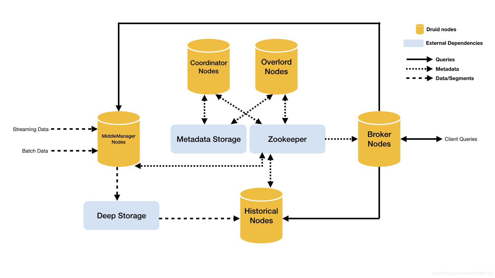
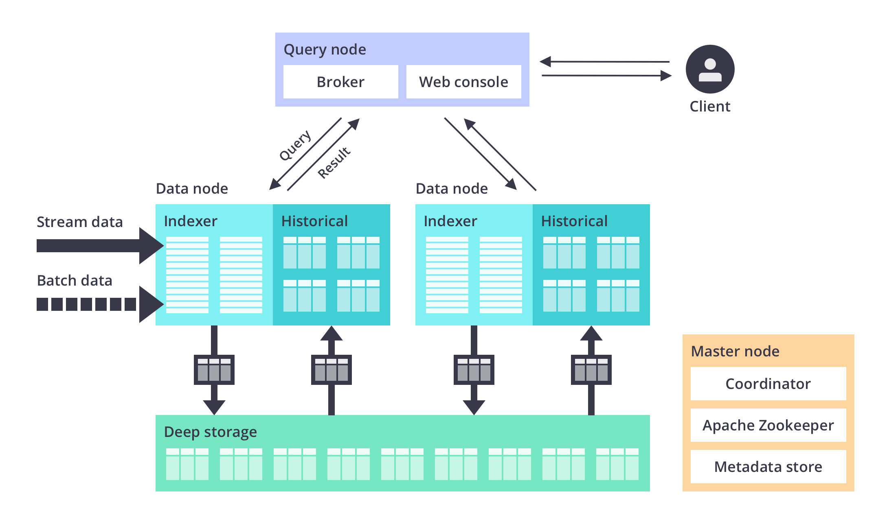
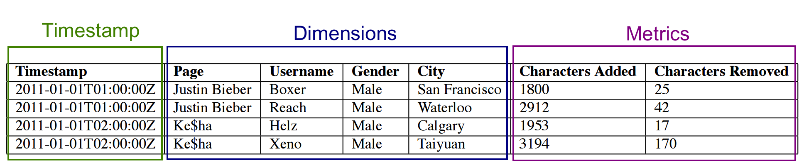
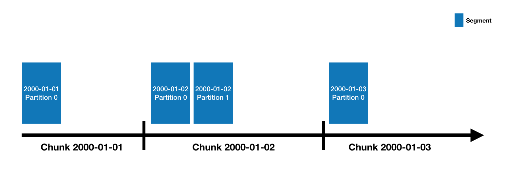
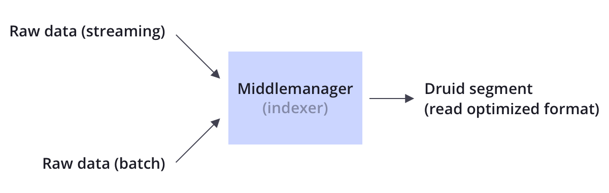
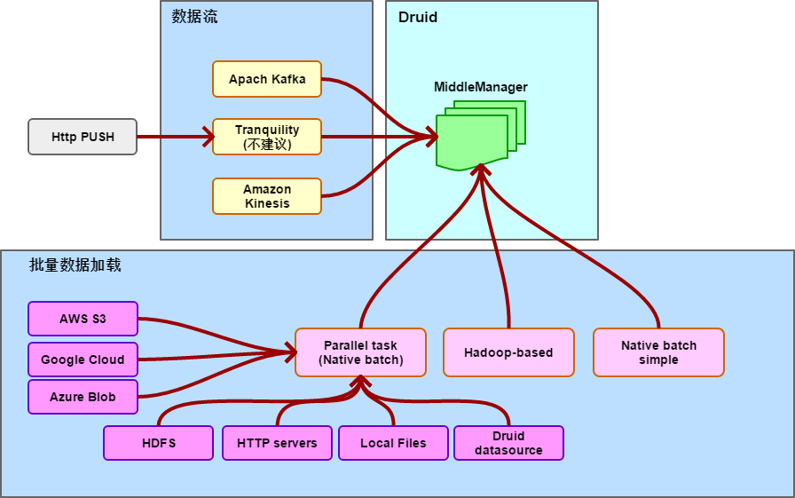

## 说明 ##

　　`Apache Druid` 的学习内容。

## 概要与基础 ##


### 概要 ###

　　`Apache Druid` 由美国广告公司 `MetaMarkets` 创建并开源给 `Apache`。

　　`Druid` 是一个分布式的、支持实时多维 OLAP 分析的数据处理系统。它既支持高速的数据实时摄入处理，也支持实时且灵活的多维数据分析查询。因此 Druid 最常用的场景就是大数据背景下、灵活快速的多维 OLAP 分析。 

　　`Druid` 常用的领域包括：

 + 点击流分析（Web、Mobile 等，追踪各按钮、链接的点击分析）

 + 网络流数据分析（如用于网络性能监控等）
 
 + 服务量度指标存储（支持时序数据）
 
 + 应用程序性能度量
 
 + 数字营销/广告分析
 
 + 商业智能/联机分析处理

　　`Druid` 的核心架构可以说组合了下面三类数据存储：

 + 数据仓库
 
 + 时间序列数据库

 + 日志搜索系统

　　因此 `Druid` 有以下的一些主要特点：

 + **列式存储格式**：面向列的存储，所以能够提供多维度的快速查询与聚合。特别是实施针对列的优化手段，所以当我们对少数列进行聚合查询时，速度非常快（亚秒级）

 + **可扩展的分布式系统**：`Druid` 通常部署在数十到数百台服务器的集群中，可以提供数百万条记录/秒的摄取率，保留数万亿条记录，以及亚秒级到几秒钟的查询延迟。

 + **大规模并行处理**：`Druid` 可以在整个集群中并行处理查询。

 + **实时或批量采集**：`Druid` 可以实时流式采集数据（采集的数据可立即用于查询）或批量采集。

 + **自愈，自平衡，易于操作**：作为运营商，要将群集扩展或缩小，只需添加或删除服务器，群集将在后台自动重新平衡，无需任何停机时间。如果任何Druid服务器发生故障，系统将自动绕过损坏路由，直到可以更换这些服务器。Druid旨在全天候运行，无需任何原因计划停机，包括配置更改和软件更新。

 + **云本机，容错架构，不会丢失数据**：一旦 `Druid` 采集了您的数据，副本就会安全地存储在深层存储（通常是云存储，HDFS或共享文件系统）中。即使每个Druid服务器都出现故障，您的数据也可以从深层存储中恢复。对于仅影响少数Druid服务器的更有限的故障，复制可确保在系统恢复时仍可进行查询。

 + **用于快速过滤的索引**：`Druid` 使用CONCISE或 Roaring压缩bitmap索引来创建索引，这些索引可以跨多个列进行快速过滤和搜索。

 + **基于时间的分区**：`Druid` 首先按时间划分数据，并且可以基于其他字段进行额外划分。这意味着基于时间的查询将仅访问与查询的时间范围匹配的分区。这导致基于时间的数据的显着性能改进。

 + **近似算法**：`Druid` 包括用于近似count-distinct的算法，近似排序以及近似直方图和分位数的计算的算法。这些算法提供有限的内存使用，并且通常比精确计算快得多。对于精度比速度更重要的情况，Druid还提供精确的count-distinct以及精确的排序。

 + **在采集时自动汇总**：`Druid` 可选择在采集时支持数据汇总。提前预聚合数据，可以节省大量存储成本并提高性能。

#### 感言或提点 ####

    不一定准确

 + 关注时间性的数据，以时间为重点及核心，包括数据查询

 + 无论导入的 `JSON` 数据有多么复杂，在 `Druid` 中都会被 `拍扁`，变是列。换言之，`Druid` 是以 `列` 为中心，无论是什么字段内容，只要进入 `Druid` 都会作为 `列` 存在。

 + 一个 `Datasource`（表）可能包含数十个，甚至上百个列

 + 对硬件有一定的要求，作为集群存在时，涉及到较多的设施，维护有较高的要求

 + `Druid` 支持流数据与批量导入数据，而对于 `流` 数据，官方推荐通过 `Apache Kafka` 接入流。（当然也可以自行开发扩展）

 + `Druid` 有粒度的概念，即：虽然 `Druid` 支持到毫秒级的时间记录，但认为在大数据场景下，不必要太过关注 `太细` 的数据。

    - `粒度` 通常是指时间上的范围，是 `分秒必需` 的实时数据，还是可以粗放到某个时间范围。例如以 `1分钟` 为粒度，就意味着 `1分钟`内的数据会被合并成一个记录（ `Metric` 数据会被预计算，其他字段内容会有选择性丢弃），此时间内的细节会丢失

    - `粒度` 的设置与控制，对查询的性能有明显的影响，粒度超大，则查询的速度与性能就越高，另一方面就意味着能查到的细节就越少。

 + 可以追加新数据到已经存在的 `Datasource`，但不支持基于 `Primary key`（主关键字）的单条记录更新

 + 无论是现在数据更新，还是删除，只能通过 `Task` 来批量处理

    - 在定义 `粒度` 的情况下，现有数据的更新、删除与传统的 `RDBMS` 有所区别。因此，通常的建议是尽量不要进行不必要的更新与删除

        + 在 `粒度` 下，某种意义上已经删除了一些原始数据记录

    - 如果是大批量的更新或删除，比较可行的建议是 `重新导入` 数据。

#### 使用场景 ####

　　任何系统都有其合适与不合适的场景。

　　`Apache Druid` 适合的场景：

 + 大数据量的插入与查询，而甚少或基本上不更新或删除

 + 大多数查询都是聚合和报告性质（“Group By”查询），以及搜索和扫描式查询。

 + 查询延迟要求为100毫秒到几秒

 + 基于时间的数据查询（Druid 为时间提供相关优化与设计）

 + 有多个表，但每次查询只能访问一个大的分布式表，以及相关联的 `lookup` 表

    - 旧不能进行大表 `join` 操作，这是 `Druid` 的局限性
    
    - 但可以从一个大表中，以列为基准产生多个维度的关联表（虚表）

    - `0.18.0` 引入了更多 `Join` 操作，为多表 `Join` 提供支持，不过依然需要关注性能问题

 + 有高基数数据列（例如URL，用户ID），需要对它们进行快速计数和排名。
 
 + 能够从 `Kafka`，`HDFS`，文件或对象存储（如Amazon S3）等中加载数据

    - 即支持多种数据存储后端

　　下面是 `Druid` 不适合的场景：

 + 频繁的低延迟更新（或删除）。`Druid` 支持流式插入，但不支持流式更新（可通过后台任务进行批量更新）

 + 两个或以上的大表进行 `Join` 操作。（其实可以做，但时间花费上不值得）

    - `0.18.0` 引入了更多 `Join` 操作，为多表 `Join` 提供支持，不过依然需要关注性能问题

 + 精确的大数量过滤或去重

 + 全文搜索（即 `Elasticsearch` 的专精领域）

### 使用指南 ###

　　如何使用 `Druid`？下面提供一个流程指南：

 + 学习与理解 `Druid` 的应用场景及内容

 + 部署一个学习环境（如果要测试或应用，则要部署一个测试环境）

 + 具体使用

    - 准备数据源

        + 流数据的话，需要确定流数据的接入方法

            - Apache Kafka ：某种程度上这是唯一的选择
            - Amazon Kinesis ：如果在 AWS 上的话，可以选这个方案
            - Tranquility：已经停止更新，不推荐使用（但就当前最新版本 Druid 而言，仍然可用）

        + 批量数据 （也就是一次性加载的数据）

            - 通过本地文件。（对于集群，不建议使用；单服务器版可以用）
            - Http Server。（即由一个 Http Server 来提供数据）
            - HDFS。（数据来自 Hadoop ）
            - Druid。（来自于 Druid 本身的表，即 datasource）

    - 根据数据定义数据的导入规范 (Ingestion Schema)

        + 导入规范通常包括下述三大部分

            - 数据列字段定义（即表的名称、字段名称与类型）
                + 列字段名称，通常与原始数据的字段名称相同
                + 如果不同，则需要编写映射规则
            - 数据源的配置（即上面所准备的数据源的设置，不同数据源的配置项不尽相同）
            - 数据转换方法配置（如果某些数据需要转换，例如日期格式，JSON 嵌套对象的扁平化等）

    - 数据导入。有了上面所准备的 Schema 后，就可以导入数据

        + 通过 Druid 界面提供的 UI 向导导入。（手工导入推荐使用，用起来也不复杂）
        + 通过 Druid 提供的 REST API 导入 （通常是定制化程度中使用）
            - 在学习或测试阶段，也可以使用诸如 `curl` 命令行工具来导入

    - 数据查询分析。完成了数据接入后，我们就可以

        + 通过 Druid 界面，使用 `Druid SQL` 来查询与分析数据
        + 通过 Druid 提供的 REST API 来查询分析数据
        + 通过 Apache Avatica JDBC Driver 来查询分析数据
            - 好处是，通过传统的 JDBC 应用就可以查询数据

 + 后话
    - 不同的系统，都会自己的概念、定义和规范，熟悉这些概念与规范，是能否掌握使用系统的关键

<br>

### 架构 ###

　　`Druid` 是一个分布式系统，下面是官方提供的架构图：

 

　　从图中可以看到，整合个系统由下面几大部分组成：

 + **`Master Servers`** 管理服务器

    - Coordinator 节点：属于管理节点，负责负载与节点管理。
    - Overlord 节点：负责接受任务、协调任务的分配、创建任务锁以及收集、返回任务运行状态给客户端
 
 + **`Query Servers`** 查询管理器
 
    - Router 节点：可选节点，在 Broker 集群之上的 API 网关，有了 Router 节点 Broker 不再是单点服务了，提高了并发查询的能力
    - Broker 节点：负责从客户端接收查询请求，并将查询请求转发给 Historical 节点和 MiddleManager 节点。Broker 节点需要感知 Segment 信息在集群上的分布
 
 + **`Data Servers`** 数据服务器

    - MiddleManager 节点：主要是负责数据索引，生成索引文件，并把索引文件先发布到一个共享的存储系统里
    - Historical 节点：主要负责加载索引文件，同时提供历史数据的查询服务

 + **外部节点**：外部节点不是 `Druid` 部件，而是外部依赖

    - **`Zookeeper`** 底层通讯服务节点：分布式协调服务，用于节点管理和事件监控。
    - **`Metastore Storage`** 元数据存储节点：用于存储 Druid 的各种元数据信息，属于 Druid 的外部依赖组件，生产环境中可用 MySQL
    - **`Deep Storage`**：用于存储 Segment 文件供 Historical 节点下载。Deep Storage 不属于 Druid 内部组件，用户可根据系统规模来自定义配置。单节点可用本地磁盘，分布式可用 HDFS

　　下面从数据流及外部交互角度来看 `Druid`：

 + **节点**

    

    - 标识各节点间交互

 + **数据流**

    

    无论是流数据还是批量导入数据，所有数据都会首先放在 `MiddleManager`（服务器），在此进行分析处理，并按 `Druid` 存储格式进行组织存储。然后在满足一定条件后（如完全导入后），后作为 `历史数据` 由后台 `搬运工` 搬到 `Historical`（Deep Storage）。（查询将包括实时查询与历史查询）

### 数据存储 ###

　　`Druid` 本身是：`数据仓库`、`时序数据`、`指标数据` 三者结合体，因此在存储上也体现出这一种，下面是标准的存储结构：

  

 + **`时间（TimeStamp）`**：表明每行数据的时间值，默认使用 UTC 时间格式且精确到毫秒级别。这个列是数据聚合与范围查询的重要维度。

 + **`数据仓库（Dimension）`**：也是多维度数据，也称为列存储（列为维）。（相对于传统数据库如 MySQL 是行存储形式）　　

 + **`指标（Metric）`**：用于聚合计算的列，这些指标列通常是一些数字，主要操作包括 Count、Sum 和 Mean 等

　　下面是一组数据示例：

```
timestamp             publisher          advertiser  gender  country  click  price
2011-01-01T01:01:35Z  bieberfever.com    google.com  Male    USA      0      0.65
2011-01-01T01:03:63Z  bieberfever.com    google.com  Male    USA      0      0.62
2011-01-01T01:04:51Z  bieberfever.com    google.com  Male    USA      1      0.45
2011-01-01T01:00:00Z  ultratrimfast.com  google.com  Female  UK       0      0.87
2011-01-01T02:00:00Z  ultratrimfast.com  google.com  Female  UK       0      0.99
2011-01-01T02:00:00Z  ultratrimfast.com  google.com  Female  UK       1      1.53
```

　　对于这组数据，以 `Druid` 的眼光来看，分别属于三类数据：

 + **时间数据**：数据中的 `timestamp` 字段，就是时间字段，并且通常是按时间顺序进行排列，当涉及到时间方面的查询时，此字段必然就是查询中心字段。

 + **维度数据**：或称为 `列` 数据（维度：Dimension），如上面的 `publisher`、`advertiser`、`gender` 等，这些数据通常涉及到：

    - 过滤或筛选
    - 分组（GroupBy）
    - ....不同的过滤或分组，意思着以不同维度观察数据

 + **指标数据**：Metric 数据，通常是数值数据，涉及到统计求和等计算，如上面的 `click`、`price`。

　　由于 `Druid` 着眼于数据分析，因此任何数据记录，在 `Druid` 的眼中不外乎上述三种类型（如果存在其他类型，则 `Druid` 的处理变弱）

#### 存储设计 ####

　　`Druid` 的数据存储在 `Datasources` 中（这是逻辑结构），类似于 `RDBMS` 中的 `表` 的概念。

　　每个 `Datasources` 都按时间进行分区（时间的重要性），并且可以选择按其他属性进一步分区，但 `时间分区`为核心。每个时间范围都称为 `chunk`（例如，如数据按天划分，则为一天）。在一个 `chunk` 内，数据再次被划分为一个或多个 `segments`。每个 `segments` 都是单个文件，并且通常包含多达几百万行的数据。

　　由于 `segments` 是按时间块组织的，因此通过时间线来观察 `segments` 会更加清楚：

 

    一个Datasources 可能具有从几个段到数十万甚至数百万个segments。

#### Segment 文件 ####

　　`Druid` 将数据存储在一种称为 `Segment` 文件中，`Segment` 文件按时间分区。在基本配置中，将为每一个时间间隔创建一个 `Segment` 文件，其中时间间隔可以通过 `granularitySpec` 的 `SegmentGranularity` 参数配置。

　　为了使 `Druid` 在繁重的查询负载下正常运行，`Segment` 的文件大小应该在建议的 `300mb-700mb` 范围内。如果你的 `Segment` 文件大于这个范围，那么可以考虑修改时间间隔粒度或是对数据分区，并调整 `partitionSpec` 的 `targetPartitonSize` 参数(这个参数的默认值是 `500` 万行)。


### 数据导入规范 ###

　　在 `Druid` 中，数据导入又称为 `数据摄取`。

　　`Druid` 提供灵活的数据加载方法（数据输入源），而每一个输入源都必须符合一定的规范，这就是 **`Ingestion Spec`** 。下面详细说明这个规范。

　　`Druid` 摄取规范，也可以称为 `Schema`（可以理解为数据表定义方法），本身是一个 `JSON` 对象，并由下面三个部分组成：

 + **`dataSchema`**：定义数据格式。即如何解析输入的数据。（理解为每条记录的结构，当输入一组记录时，如何分析成字段）

    - 数据源名称
    - 主时间戳列(timestamp)
    - 维度(dimensions)
    - 指标(Metric)
    - 转换与过滤

 + **`ioConfig`**：指定数据的来源和去向。（即数据来自何方，如 `Kafka`，`HDFS`等）
 
 + **`tuningConfig`**：摄取参数配置

　　将上面三部分写成 `JSON` 就是如下所示：

 ```json
 {
   "dataSchema" : {...},
   "ioConfig" : {...},
   "tuningConfig" : {...}    
 }
 ```

#### dataSchema ####

　　`Druid` 定义数据格式（可以理解为 `ES` 的索引映射）。作为 `JSON` 对象，对其每个字段属性，下面进行详细说明：

 + **`dataSource`**：数据源名称，也可以理解为 `数据表` 名称（或 ES 的索引名称）

    ```json
    {
        "dataSchema":{
            "dataSource": "midas_authen_records"
        }
    }
    ```

 + **`parser`**：数据格式映射（解释器），即提交的数据格式映射成字段。

    ```json
    {
        "dataSchema":{
            "dataSource": "midas_authen_records",
            "parser":{
                            // 解释器内容
            }
        }
    }
    ```

    - **`type`** - `Druid` 支持下面两种数据类型：
    
        + `string`：字符串（即明文），通常推荐使用字符串
        + 二进制数据
        + 字段名为：**`type`**

        ```json
        {
            "dataSchema":{
                "dataSource": "midas_authen_records",
                "parser":{
                    "type": "string"        # 明文
                }
            }
        }
        ```

    - **`format`** - `Druid` 支持三种数据格式。（即提交的真实数据，不是 schema）

        + `JSON`：json 格式
        + `CSV`：不带字段头部，使用逗号分隔的 `CSV` 格式
        + `TSV`：不带字段头部，使用 `Tab` 分隔的格式
        + 自定义：使用正则表达式或 `Javascript` 分析来自定义格式，不过推荐使用标准格式。
        + 默认为 `TSV` 格式，下面以 `JSON` 格式为例：（**`后续的定义也是以 JSON 格式进行`**）

        ```json
        {
            "dataSchema":{
                "dataSource": "midas_authen_records",
                "parser":{
                    "type": "string",        # 明文
                    "parseSpec":{            # 格式与字段定义
                        "format": "json"
                    }
                }
            }
        }
        ```

 + **`JSON 格式的字段映射定义`**

    - **`字段定义`**：在上面的 `数据存储`节，我们知道，`Druid`每个数据记录由三大部分组成，因此在定义时，同样需要明确定义此三大部分的映射。

        + **`timestampSpec`** -- 时间列的定义，即时序字段

            - `format`：格式，目前支持 `iso`、`auto`、`posix`、`millis`、`micro`、`nano`、`Joda time`
            - `column`：列名（即字段名，也就是对应 JSON 数据中的时间戳属性名）

            ```json
            {
                "dataSchema":{
                    "dataSource": "midas_authen_records",
                    "parser":{
                        "type": "string",        # 明文
                        "parseSpec":{            # 格式与字段定义
                            "format": "json",
                            "timestampSpec":{
                                "column": "timestamp",
                                "format": "iso"             # 默认为 auto
                            }
                        }
                    }
                }
            }
            ```
        + **`dimensionsSpec`** --  维度或列的定义，主要又包括三部分：

            - `dimensions`：列，JSON 数组，或字段定义，对应于 `JSON` 的属性
            
                + 每个字段的定义格式
            
                    - `name`：名称，这是必须项，即字段名称。如果只有名称时 `name` 可省略。
                    - `type`：字段类型，为可选。默认为 `string`，支持的类型包括
                        + long
                        + float
                        + double
                        + string

                    - `createBitmapIndex`：true | false，是否创建索引，默认为 true
            
                + 下面是示例：
            
                    ```json
                    {
                        "dataSchema":{
                            "dataSource": "midas_authen_records",
                            "parser":{
                                "type": "string",        # 明文
                                "parseSpec":{            # 格式与字段定义
                                    "format": "json",
                                    "timestampSpec":{
                                        "column": "timestamp",
                                        "format": "iso"             # 默认为 auto
                                    },
                                    "dimensionsSpec":{
                                        "dimensions":[              # 定义字段
                                            "user",                 # 字符串类型，使用默认，因此只写字段名
                                            {
                                                "name": "countryNum",   # 因为是其他类型，所以提供完整的设置
                                                "type": "long"
                                            },
                                            {
                                                "name": "comment",
                                                "type": "string",
                                                "createBitmapIndex": false   # 不为内容创建索引
                                            }    
                                        ]
                                    }
                                }
                            }
                        }
                    }
                    ```            
            
            - `dimensionExclusions`：排除列，字符串数组。即忽略 `JSON` 的属性
            
                + 如果没有可以不写或空数组： `dimensionExclusions: []`
            
            - `spatialDimensions`： GEO 相关的列

                + 如果没有可以不写或空数组： `spatialDimensions: []`

        + **`metricsSpec`** -- 指标字段，又称 `聚合器` 字段列表，当 `Druid` 摄取数据时，会根据粒度预先统计聚合这些字段的值。下面是字段定义格式

            - `type`：就是聚合函数名称，`Druid` 支持非常多的聚合函数，下面是一些示例：
                + count: 计数，相当于 `select count(*)` 的统计个数
                + longSum：长整数求和
                + doubleSum：又精度求和
                + longMax：长整数最大值
                + longMin：长整数最小值
                + ....

            - `name`：`Druid` 字段名称，即为本指示聚合提供一个名称，可以与所聚合的数据字段名相同
            - `fieldName`：所聚合的数据字段名称，也即是原始数据属性名
            - 示例：

                ```json
                {
                    "dataSchema":{
                        "dataSource": "midas_authen_records",
                        "parser":{
                            "type": "string",        # 明文
                            "parseSpec":{            # 格式与字段定义
                                "format": "json",
                                "timestampSpec":{
                                    "column": "timestamp",
                                    "format": "iso"             # 默认为 auto
                                },
                                "dimensionsSpec":{
                                    "dimensions":[              # 定义字段
                                        "user",                 # 字符串类型，使用默认，因此只写字段名
                                        {
                                            "name": "countryNum",   # 因为是其他类型，所以提供完整的设置
                                            "type": "long"
                                        },
                                        {
                                            "name": "comment",
                                            "type": "string",
                                            "createBitmapIndex": false   # 不为内容创建索引
                                        }    
                                    ]
                                },
                                "metricsSpec":[             # 指标数组
                                    {
                                        "type": "count",        # count 类型指标
                                        "name": "count"         # 没有对应的数据字段，记录计数
                                    },
                                    {
                                        "type": "doubleSum",        # 求和
                                        "name": "bytes_added_sum",  # 字段的名称，加个 sum 后缀表示求和
                                        "fieldName": "bytes_added"  # 这是数据字段（即提交 JSON 数据中的字段）
                                    }
                                ]
                            }
                        }
                    }
                }
                ```            

        + **`flattenSpec`**：针对 JSON 类型的数据。当 JSON 数据带有嵌套对象时，可以用本配置来展平化。也就是将嵌套的数据变成根字段，本设置包含以下两部分。（注意：从 `0.17.0` 开始，此配置放到了 `ioConfig.inputFormat` 这个配置属性下，但仍然兼容旧模式）
            - 要注意，通常本配置会优先使用，因此在其他的字段配置（如 `timestampSpec`）中，可以使用本配置映射的字段    
            - **`useFieldDiscovery`**：true|false，是否将所有根字段都为 `timestampSpec`、`transformSpec`、`dimensionsSpec`、`metricsSpec` 所用。默认为 true
            - **`fields`**：这是字段映射数组，用来将数据字段（包括嵌套的字段）映射成根字段，每个字段定义又包括：

                + `type`：映射方法（或操作），支持以下几种操作：
                    - `root`：表示引用根级字段，此操作在 `useFieldDiscovery=false` 才有用
                    - `path`：表示后面字段 `expr` 的内容为一个 `JsonPath` 表达式
                    - `jq`：表示后面字段 `expr` 的内容为一个 `jackson-jq` 表达式，此配置仅对 `JSON` 格式数据有效

                + `name`：字段名称，即将数据字段映射成 `Druid` 字段名称
                + `expr`：实际的表达式，目前仅支持 `path` 与 `jq` 两种类型，其他类型时此值会被忽略
                            
            - 示例：
                ```json
                {  //一个简单的示例数
                    name: "JWT",
                    clientID: "wuojxiqlwj",
                    user: {
                        id: 1,
                        name: "David",
                    },
                    checkIP: true,
                    timestamp: 298928372837
                }
                ```
                ```json
                "parser": {
                    "type": "string",
                    "parseSpec": {
                        "format": "json",
                        "flattenSpec": {
                            "useFieldDiscovery": true,
                            "fields": [  # 在这里，将 user.id 映射成根字段 userId
                                { "type": "path", "name": "userId", "expr": "$.user.id" }
                            ]
                        },
                        "timestampSpec": {
                            "column": "timestamp",
                            "format": "auto"
                        },
                        "dimensionsSpec": {
                            "dimensions": [
                                { "type": "string", "name" },
                                { "type": "string", "clientID" },
                                { "type": "long", "name": "userId" } # 将所映射的字段定义为维度字段
                            ]
                        }
                    }
                }
                ```
                在示例数据当中，存在一个嵌套 `JSON` 对象 `user`，为了能使用此数据于是将此数据映射到根字段，如 `userId`

            - 使用时注意：
                + 不允许映射名称重名，即字段名称要唯一
                + 如果 `useFieldDiscovery` 打开时，根字段与 `fields` 中定义的字段同名时，只会是第一个名称有效，其他同名者被忽略
                + 如果 `useFieldDiscovery` 打开时，会自动检测根字段类型（`Druid` 支持的字符串，数值，或两者的列表类型），不支持的类型需要显式定义

    + **`配置内容`** -- 除了字段之外，还有一些数据提取与处理过程所使用的配置内容

        - **`granularitySpec`**：处理粒度。所谓处理粒度，是因为很多数据的分析，往往是以时间作为统计依据（或范围），但对于大数据而言，并非所有时间数据都有意义，因此可以通过将某个固定间隔的数据进行合并，以合并结果来替代此间隔内数据。这样做的意义在于，一方面不影响数据的汇总与统计，另一方面可以大幅减少数据量，提高数据处理的速度（性能）。粒度以时间间隔为单位进行设置，有以下两种：

            + **`uniform`** -- Uniform Granularity Spec，生成具有均匀间隔的段

                - `segmentGranularity`：`Segment` 文件的粒度，换言之，以多长时间间隔为一个 `Segment` 文件，这个配置取值如下：（视数据量，过小粒度，会生成大量的小文件，而粒度过大，又会影响性能）。默认值为 `day`
                    + all
                    + none
                    + second
                    + minute
                    + fifteen_minute：15 分钟
                    + thirty_minute：30 分钟
                    + hour
                    + day
                    + week
                    + month
                    + quarter
                    + year
                
                - `queryGranularity`：查询粒度，即查询的最小时间间隔。在这个时间内的数据会进行聚合汇总，例如计数或求和最终有可能合并成一个记录数，其取值同 `segmentGranularity` 。默认值为 `none' （即不分间隔）
                - `intervals`：定义所摄取的原始数据时间间隔，在此间隔外数据将被忽略，此举目的减少数据量，加快导入速度。仅对 `批量数据摄取` 有效，不影响实时摄取。本字段是个数组，可以由多个时间间隔组成。默认值为 `null`
                - `roolup`：true | false。是否汇总，默认为 true。如果设置为 false，则 `metricsSpec` 字段就变得无意义，`Druid` 会将其与 `dimensionsSpec` 等同对待。
                - 示例： 

                    ```json
                    {
                        "dataSchema":{
                            "dataSource": "midas_authen_records",
                            "parser":{
                                "type": "string",        # 明文
                                "parseSpec":{            # 格式与字段定义
                                    "format": "json",
                                    "timestampSpec":{...},
                                    "dimensionsSpec":{...},
                                    "metricsSpec":[...],
                                    "granularitySpec":{
                                        "type": "uniform",              # 使用 uniform 类型
                                        "segmentGranularity": "day",     # 每天一个 segment
                                        "queryGranularity": "minute",     # 以分钟为间隔
                                        "intervals":[
                                            "2019-01-17/2019-01-18"       # 时间内  
                                        ],
                                        "rollup": true                    # 默认为 true，所以可以不设置
                                    }
                                }
                            }
                        }
                    }
                    ```  
            + **`arbitrary`**：不固定间隔，本设置仅用于批量导入数据的场景，不是常用配置。

                - `queryGranularity`：查询粒度，即查询的最小时间间隔。在这个时间内的数据会进行聚合汇总，例如计数或求和最终有可能合并成一个记录数，其取值同 `segmentGranularity` 。默认值为 `none' （即不分间隔）
                - `intervals`：定义所摄取的原始数据时间间隔，在此间隔外数据将被忽略，此举目的减少数据量，加快导入速度。仅对 `批量数据摄取` 有效，不影响实时摄取。本字段是个数组，可以由多个时间间隔组成。默认值为 `null`
                - `roolup`：true | false。是否汇总，默认为 true。如果设置为 false，则 `metricsSpec` 字段就变得无意义，`Druid` 会将其与 `dimensionsSpec` 等同对待。

        - **`transformSpec`**：数据转换配置，用来做数据转换，主要包括 `转换` 与 `过滤` 两种

            + **`transforms`**：转换，使用表达式来对所摄取的数据进行转换的操作

                - 转换的限制
                    + 只能对实际输入的数据进行转换，不能引用其他转换
                    + 不能删除字段，但可以添加字段
                    + 可以使用空值来 '模拟' 删除字段效果（清空字段内容） 

                - 转换的定义：

                    + `type`：取值 `expression`
                    + `name`：作为输出字段的名称
                    + `expression`：表达式内容（使用 `Druid` 所支持的表达式

                - 示例：
                    ```json
                    {
                        "dataSchema":{
                            "dataSource": "midas_authen_records",
                            "parser":{
                                "type": "string",        # 明文
                                "parseSpec":{            # 格式与字段定义
                                    "format": "json",
                                    "timestampSpec":{...},
                                    "dimensionsSpec":{
                                        "dimensions":[...]
                                    },
                                    "metricsSpec":[...],
                                    "granularitySpec":{...},
                                    "transformSpec":{
                                        "transforms":{              # 这是一个将 `country` 字段内容转大写的转换
                                            "type": "expression",
                                            "name": "countryUpper",
                                            "expression": "upper(country)"
                                        }
                                    }
                                }
                            }
                        }
                    }
                    ``` 

            + **`filter`**：过滤器，用来过滤数据，支持所有的查询过滤器。

                - 注意：
                    + 在配置中，过滤器配置 `filter` 通常在 `transforms` 的后面，因此过滤器也可以引用转换所定义的字段

                - 具体的定义参见查询过滤器章节。不同的过滤器的内容属性不同
                - 示例：
                    ```json
                    {
                        "dataSchema":{
                            "dataSource": "midas_authen_records",
                            "parser":{
                                "type": "string",        # 明文
                                "parseSpec":{            # 格式与字段定义
                                    "format": "json",
                                    "timestampSpec":{...},
                                    "dimensionsSpec":{
                                        "dimensions":[...]
                                    },
                                    "metricsSpec":[...],
                                    "granularitySpec":{...},
                                    "transformSpec":{
                                        "transforms":{              # 这是一个将 `country` 字段内容转大写的转换
                                            "type": "expression",
                                            "name": "countryUpper",
                                            "expression": "upper(country)"
                                        },
                                        "filter":{
                                            "type": "selector",         # 这是一个 selector 过滤器
                                            "dimension": "country",     # 维度
                                            "value": "CHINA"            # 相当于 where country = 'CHINA'
                                        }
                                    }
                                }
                            }
                        }
                    }
                    ``` 

 + **`ioConfig`**：导入数据源的配置，指示导入的数据源，不同的数据源此配置也不同

    - **`inputFormat`**：这是新版本支持的，用来定义数据源格式的配置，主要包括：
        + **`type`**: 数据源的格式，目前支持：
            - `json`：json 格式
            - `csv`
            - `tsv`
            - `orc`：一个二进制格式，并需要 `druid-orc-extensions` 扩展支持
            - `parquet`：一个二进制格式，并需要 `druid-parquet-extensions` 扩展支持

        + 后续配置跟 `type` 所定义的格式相关，不同格式有不同的配置

            - `json` 格式的配置：

                + `flattenSpec`：定义嵌套对象的映射方法，具体参见上面的 `flattenSpec` 内容
                + `featureSpec`：`Jackson library` 的 JSON 解释规则

 + **`tuningConfig`**：额外配置，因应不同的数据源，其配置也不尽相同，总的来说有下面常用的一些配置

    - **`type`**：不同的摄取方法有不同的 `type`，常用的包括：`index`、`hadoop`、`kafka`、`kinesis`等
    - **`maxRowsInMemory`**：摄取数据入内存的最大记录数，默认为 `1000000`，超过此数则持久化到磁盘。由于数据会进行合并，所以内存记录数与实际的摄取数并不一定相同。
    - **`maxBytesInMemory`**：用于摄取数据的最大内存数（用 JVM heap 内存），超过此数由持久化到磁盘。由于数据会进行合并，因此内存占用与实际的摄取数大小并不一定相同。下面是一些特定取值：

        + **-1**：表示关闭本选项，由 `maxRowsInMemory` 来控制记录多少
        + **0**：这是默认值，表示使用 `JVM Heap Size 的六分之一` 内存
        + 当同时使用 `maxRowsInMemory` 与 `maxBytesInMemory` 时，最先到达阀值为持久化触发条件。
        + 但同时，此值通常为被优先满足（即通常会首先触发，因此记录数不那么容易达到），特别是包含了比较多的过滤或聚合计算时。如果因为触发过于频繁，结果造成频繁持久化到磁盘（IO 比较高），可以将本设置项设置为 `-1` 来关闭本设置项。

    - **`indexSpec`** 索引的一些配置项，这是一个配置类，具体配置属性如下： 

        + **bitmap**：位图索引压缩格式（索引的一种）。对于 `JSON` 对象可以取值：

            - `roaring`：对于本类型，可以使用 `compressrunnonserialization` （取 true|false，默认为 true）来控制，自动根据需要而进行压缩。（即未压缩比压缩还要节省时，不对数据进行压缩）
            - `concise`：这是默认值

        + **dimensionCompression**：维度数据的压缩算法，取下面值：

            - `lz4`：默认值
            - `lzf`
            - `uncompressed`

        + **metricCompression**：指标数据的压缩算法，取值：
            - `lz4`：默认值
            - `lzf`
            - `uncompressed`
            - `none`：新版本引入，提供比 `uncompressed` 更好的选择

        + **`longEncoding`**：对 `long` 型数据字段进行编码，取值：
            - `longs`：默认值
            - `auto`

#### Schema 设计提示 ####

　　对于 `Druid` 的数据结构模型，有以下的认识：

 + 数据存储在名为 `datasources` 中，类似于关系数据库中的 `表` 概念。
 + 在导入（添加）数据到 `Druid` datasources 时，可以进行 `预聚合` (`rollup`) 操作。当 `rollup` 打开时，会边导入数据边进行聚合统计操作，这样做的好处在于大幅减少存储空间与数据记录，并在最终是查询时提供高性能。当关闭 `rollup` 时，不会进行聚合操作，所有数据会保存
 + Druid 中，每行数据都必须要有一个 `timestamp`（时间字段），数据会按时间进行分区，每个查询通常都会有个时间过滤，并且查询结果还可以按时间段（如分钟、小时、天等）进行细分。
 + 除了 `timestamp` 之外，无论是 `维度` 还是 `指标`字段，都应该遵循 `OLAP` 的标准约定来命名
 + 通常的数据源有 `几十` 到 `几百` 例
 + 维度列按原样存储，因此可以在查询时对其进行筛选、分组或按时间聚合。它们总是单个字符串、字符串数组、单个long、单个double或单个float。
 + Metric 列是预聚合存储的，因此它们只能在查询时聚合（不能按筛选或分组）。它们通常存储为数字（整数或浮点数），但也可以存储为复杂对象，如 `HyperLogLog sketches or approximate quantile sketches`。即使禁用了 'rollup'，也可以在接收时配置度量，但在启用汇总时最有用。


## 数据源与摄取方法 ##

　　`数据摄取方法` 包含两大部分：

 + 数据输入源（Data input source）：不同的输入源，有不同的 Druid 服务组件，有不同的配置
 + Druid 端的配置与导入方法（即启动与数据源的连接）

　　`Druid` 关于数据输入的问题，要留意：

 + Druid 不是传统的数据库或 ES ，而是一个数据分析平台，因此强制的是 **“数据加载”（数据摄入）**，即从数据源中获取数据。


　　`Druid` 提供流量数据的读取功能，下面是一个简单直观的概要：

 

　　
　　有了概要，我们就可以理解更为详细的数据摄入图：

 

　　关于数据导入有以下的提点：

 + 数据流：是指持续性质的数据，通常也是指采集到的数据
 
 + 批量数据：通常是指一次性的数据加载。（即不具持续性）

 + 使用 `HTTP Push` 方式，推送数据到 `Tranquility`，然后流入 `Druid` 的方案，在新版本已经不推荐

    - `Tranquility` 已经不再更新，虽然仍然能用于新版本 `Druid`，但无法使用 `Druid` 新特性。
    
    - `Tranquility` 不是 `Druid` 所带的组件，需要进行额外的手动安装

 + 在数据流摄取方面，官方推荐使用 `Apache Kafka`，并且对应 `Druid` 端，`Kafka indexing service` 是 `Druid` 的内置服务，通常不需要额外的安装。

 + 可以自定义扩展的方式来开发 `数据流注入` 方案。

### 数据源定义 ###

　　不同的数据源的定义不同

#### Apache Kafka 摄取示例 ####

（待续）


## Apache Druid 的安装部署 ##

　　`Druid` 提供单服务器方式部署与集群部署。

### 单服务器部署 ###

#### 硬件与软件需求 ####

　　官方在单服务器部署上，提供了 `六种` 部署方案，下面仅列出中间三种方案：（其他方案意义不大）

 + Micro-Quickstart：入门浅尝级

    - **CPU: 4**
    - **内存：16G**

 + Small：入门可用级

    - **CPU: 8**
    - **内存：64G**

 + Medium：中级

    - **CPU: 16**
    - **内存：128G**


#### 安装部署 ####

（待续）

### 集群部署 ###

#### 硬件与软件需求 ####

　　这里的需求仅为 `Druid` 本身节点需求，不包括外部支持系统（例如 MySQL）。另外，这里的硬件需求也可看作是生产环境的需求，如果仅是测试环境，在 `Docker` 部署条件下，`10 G` 的单机就可以跑集群。

　　`Druid` 本身的核心节点有三大部分：

 + Master Server：主要包含 `Coordinator` 和 `Overlord` 节点。（下面的配置是单台服务器的需求）

    - **CPU: 8**
    - **内存：32G**

 + Data Server：主要包括 `Historicals ` 和 `MiddleManagers` 节点（下面的配置是单台服务器的需求）

    - **CPU: 16**
    - **内存：122G**
    - **存储：2 * 1.9TB**

 + Query Server：主要是 `Brokers` （用于查询与缓存）（下面的配置是单台服务器的需求）

    - **CPU：8**
    - **内存：32G**

#### 安装部署 ####

（待续）

## 附录 ##

### 提示 ###

 + 每个插槽都对应一个middle manager进程，意味着插槽数量配置多了，会非常影响服务器性能。我在一个CPU总核数2、运行内存4G的服务器上开了7个插槽，在啥也没干的情况下都卡爆了。

    - 配置文件：`middleManager/runtime.properties`
    - 配置项：`druid.worker.capacity`，默认为 `2`
    - 插槽 即为 摄取任务数？

